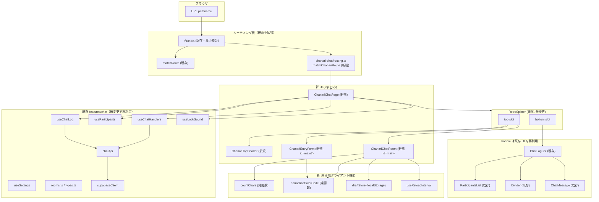
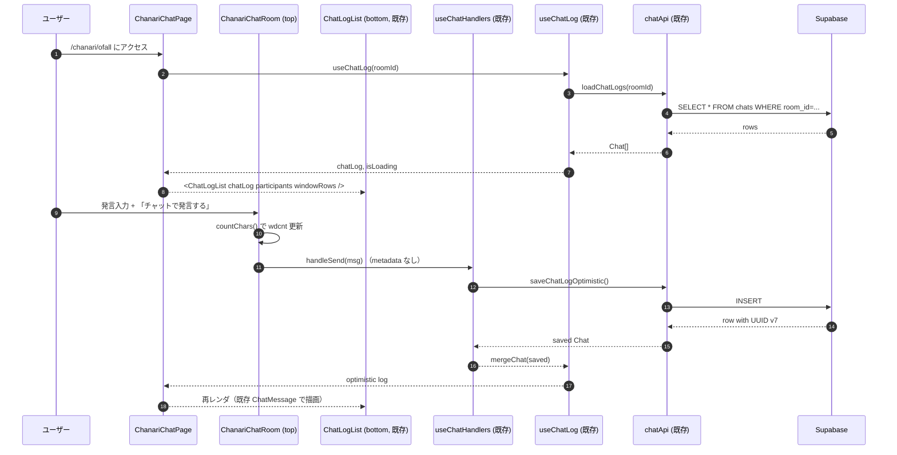

# 技術設計ドキュメント: chanari-retro-chat-ui

## 概要

本仕様は、既存の `src/features/chat/` チャット UI とは独立した「もう 1 つの UI」を新規に追加し、chanari.com 2012 年版なりきりチャットのルック & フィールを**チャット画面の「上部」だけ**再現することを目的とする。バックエンド（Supabase 連携、Realtime、各種フック、`chatApi`、`rooms.ts`、`types.ts`）および共有コンポーネント（`Button`, `Input`, `Divider`, `ParticipantsList`, `ChatMessage`, `ChatLogList`, `RetroSplitter` など）は `features/chat` の既存実装を**無改変で再利用**する。

### 上下分割の再設計（本改訂の中心方針）

既存 `src/App.tsx` の `ChatPage` は、`RetroSplitter` で画面を縦に分割し、

- **top**: 入室前フォーム (`EntryForm`) / 入室後フォーム (`ChatRoom`)
- **bottom**: `Suspense` + `lazy(() => import('ChatLogList'))` によるチャットログ（`ParticipantsList` + `Divider` + `ChatMessage` を内包）

という構造をとっている。本仕様はこの構造を踏襲し、`ChanariChatPage` でも同じ `RetroSplitter` を使って、

- **top**: `ChanariTopHeader` と `{entered ? ChanariChatRoom : ChanariEntryForm}` だけを chanari 専用 UI に差し替える
- **bottom**: 既存 `ChatLogList` を `Suspense` + `lazy` 経由で**そのまま**流し込む

という構成にする。結果として、2012 年再現は「ヘッダー + フォーム領域」＝画面上半分に閉じ、ログ描画・参加者一覧・区切り線は**既存 Tailwind ベースの UI がそのまま表示される**。

これに伴い、旧版設計にあった `ChanariChatLog` コンポーネント（2012 年風のログ表示）は**廃止**する。既存 `ChatLogList` / `ChatMessage` / `Divider` / `ParticipantsList` の Props 追加・編集も行わない。

### エフェクト / 文字サイズ / AT フィールドの扱い

本改訂では「ログ側」に描画に関与できないため、以下の UI 要素は**UI 飾りとして残すが実際の描画には適用しない**。

- エフェクト `<select>`（27 種）
- 文字サイズ `<select>`（21 種）
- 「エフェクト無効」チェックボックス
- 「AT フィールド」トグルボタン

これらは `ChanariChatRoom` のローカル state としてのみ保持され、どの描画パスにも副作用を及ぼさない。理由:

1. **制約との素直な整合性**: 「既存 `ChatLogList` / `ChatMessage` を無編集で使う」というハード制約と最もきれいに嚙み合う。
2. **`<input type="text">` への適用は副作用が大きい**: `filter: blur`・`transform: scaleX(-1)`・`animation: ...` を入力欄に適用すると IME / caret / a11y が壊れやすい。
3. **スキーマ不変**: `Chat.metadata` に effect / fontSize / atField を**書き込まない**という既存仕様を維持できる。

これに伴い、エフェクト / 文字サイズの select → CSS マッピング純関数（`effectToStyle` / `fontSizeToStyle`）は **本 spec では実装しない**。select の `<option>` 描画に使う定数 `EFFECT_OPTIONS`（27 種）/ `FONT_SIZE_OPTIONS`（21 種）のみ `utils/` に置き、実装が必要になった時点で関数を追加する。AT フィールドも専用フックを切らず、`ChanariChatRoom` 内のローカル `useState` で保持するだけに留める。

### リロード秒数とルーティング

- `reloadSeconds` select は `handleReload` を `setInterval` で定期実行するだけなので、既存 `useChatHandlers` の戻り値 `handleReload` に素直に結線できる（**機能として有効**）。
- ルーティングは新規に `/chanari/:roomId` を追加し、既存 `/chat/:roomId` は無変更で維持する。`App.tsx` には `matchChanariRoute` ブランチを 1 箇所だけ追加する。

### 設計方針（まとめ）

- **上部のみ差し替え**: `ChanariChatPage` は `RetroSplitter` の top だけを chanari UI に差し替え、bottom は既存 `ChatLogList` を無編集で使う。
- **ChanariChatLog の廃止**: 旧版設計にあった `ChanariChatLog` は削除する。ログ描画は完全に `features/chat` に委ねる。
- **ロジックは既存共有**: `useChatLog`, `useParticipants`, `useChatHandlers`, `useLookSound`, `useSettings`, `chatApi`, `rooms.ts`, `types.ts`, `supabaseClient` をそのまま import する。
- **純粋クライアント機能は最小限**: 文字数カウンタ（`countChars`）、発言復元（`draftStore` の `saveDraft` / `loadDraft`）、色コード正規化（`normalizeColorCode`）、リロード秒数インターバル（`useReloadInterval`）のみを純関数 / フックとして切り出す。エフェクト / 文字サイズ / AT フィールドは専用関数・フックを持たない。
- **スタイル戦略**: `.chanari-scope` は `RetroSplitter` の **top 領域のみ**をラップする（ログ側には波及しない）。背景色 `#FFD`（原典と同じクリーム色）も top 領域内だけに適用し、bottom 側は既存 Tailwind（`bg-yui-green` 等）に任せる。
- **PBT 対象の純関数**: `countChars` / `normalizeColorCode` / `matchChanariRoute` / `draftStore` の round-trip 性質を `fast-check` で検証する。
- **既存 `features/chat` は一切編集しない**: コンポーネント・フック・型・ルーティング・API すべて無変更。`App.tsx` のみ最小差分を加える。

## アーキテクチャ

### 全体構成と既存機能との共有範囲



### レイヤー別変更点サマリ

| レイヤー                 | 変更内容                                                                  | 新規 / 変更ファイル                                                                                                                                                             |
| ------------------------ | ------------------------------------------------------------------------- | ------------------------------------------------------------------------------------------------------------------------------------------------------------------------------- |
| ルーティング             | `/chanari/:roomId` を新規追加                                             | `src/features/chanari-chat/routing.ts`（新規）、`src/App.tsx`（最小差分の追加のみ）                                                                                             |
| ページ                   | 新 UI のページコンポーネント（上下分割、下は既存 `ChatLogList` を再利用） | `src/features/chanari-chat/ChanariChatPage.tsx`（新規）                                                                                                                         |
| コンポーネント（top）    | 2012 年版 HTML のヘッダー・フォーム再現                                   | `ChanariTopHeader/`、`ChanariEntryForm/`（f4 / `id="main2"`）、`ChanariChatRoom/`（f1 / `id="main"`）、`ChanariColorPicker/`、`ChanariCharCounter/`                             |
| コンポーネント（bottom） | 既存 `ChatLogList` を無編集で流用                                         | 新規ファイル無し。`App.tsx` と同じ `lazy` + `Suspense` パターンで `ChanariChatPage` から直接 import                                                                             |
| 純関数ユーティリティ     | 文字数カウンタ / 発言復元 / 色正規化 / select 用定数                      | `src/features/chanari-chat/utils/countChars.ts`、`draftStore.ts`、`colorCode.ts`、`effectOptions.ts`（`EFFECT_OPTIONS` のみ）、`fontSizeOptions.ts`（`FONT_SIZE_OPTIONS` のみ） |
| フック                   | リロード秒数 / 設定                                                       | `src/features/chanari-chat/hooks/useReloadInterval.ts`、`useChanariSettings.ts`（新規）                                                                                         |
| スタイル                 | 2012 年版のスコープ付き CSS（top 領域のみ）                               | `src/features/chanari-chat/styles/chanari.css`（新規）、`public/chanari/rainbow.png` 配置                                                                                       |

### ルーティングの拡張方針

既存 `src/features/chat/routing.ts` には手を入れず、新規に `src/features/chanari-chat/routing.ts` を作って `matchChanariRoute(pathname)` を追加する。`App.tsx` のルーターは段階的に分岐を追加するだけ。

- 既存 `/` → `TopPage` は維持
- 既存 `/chat/:roomId` → `ChatPage` は維持（既存 UI）
- 新規 `/chanari` → `buildChanariRoomPath(DEFAULT_ROOM_ID)` へ redirect
- 新規 `/chanari/:roomId` → `ChanariChatPage`（新 UI、上部のみ 2012 年風）
- その他 → `NotFoundPage`（既存）

`rooms.ts` の `isEnabledRoomId` を再利用するため、ルーム ID のホワイトリスト検証は既存実装に完全に委譲する。

### データフローと共有フックの流用



ポイント:

- `handleSend(msg, metadata?)` の `metadata` 引数は**常に未指定（`undefined`）**で呼ぶ（エフェクト / サイズは Supabase に保存しないため）。
- `handleReload` は「更新」ボタン + `useReloadInterval` に直結。`handleExit` は「チャットから退室する」ボタンに直結。
- `useParticipants(chatLog)` は既存 `ChatPage` と**同じ用法**で呼び出し、その戻り値を `ChatLogList` の `participants` prop にそのまま渡す。

### スタイル戦略

- **Tailwind で書ける部分は Tailwind**: 色・余白・タイポはユーティリティクラスで。
- **`.chanari-scope` の責務は top 領域のみ**: `ChanariChatPage` は `RetroSplitter` の `top` slot として渡す JSX を `<div className="chanari-scope">...</div>` で包む。`bottom` slot（`ChatLogList`）は**包まない**。これにより chanari.css の ID セレクタルール（`#chat-topheader`, `#header`, `#main`, `#main2`, `#wdcnt`, `#wderr` 等）はログ側に波及しない。
- **当時の ID セレクタ再現**: `chanari.css` に限定的に記述。必ず `.chanari-scope` 直下に閉じて global リークを防ぐ:

  ```css
  .chanari-scope #chat-topheader { ... }
  .chanari-scope #chat-topheader-left a { ... }
  .chanari-scope #header h1#ctitle { ... }
  .chanari-scope #wdcnt { ... }
  .chanari-scope { background: #FFD; }  /* top 領域のみクリーム色 */
  ```

- **bottom 側スタイル**: 既存 `ChatLogList` のラッパー（`features/chat/components/ChatLogList/index.tsx`）が持つ既存 Tailwind クラス（`bg-yui-green` 等は `App.tsx` の `<main>` レベル、ログ自体は `px-[var(--page-gap)]` 等）をそのまま表示する。本機能では bottom 側の DOM / CSS を一切触らない。
- **`public/chanari/rainbow.png`**: カラーピッカー用虹アイコン。`` で参照。
- **レスポンシブ**: 当時の固定幅レイアウトを尊重し、基本は `min-width: 640px` のデスクトップ前提。モバイルでは横スクロール許容（要件では最低限の配慮のみ）。

## コンポーネントとインターフェース

### ディレクトリ構成（新規）

```
src/features/chanari-chat/
├── ChanariChatPage.tsx                  // 新 UI のページコンポーネント (RetroSplitter 結線)
├── routing.ts                           // matchChanariRoute / buildChanariRoomPath
├── styles/
│   └── chanari.css                      // .chanari-scope 配下のみの scoped CSS
├── components/
│   ├── ChanariTopHeader/index.tsx       // #chat-topheader + #header
│   ├── ChanariEntryForm/index.tsx       // f4 / id="main2" 入室前フォーム
│   ├── ChanariChatRoom/index.tsx        // f1 / id="main" 入室後フォーム
│   ├── ChanariColorPicker/index.tsx     // rainbow.png アイコン + <input type="color">
│   └── ChanariCharCounter/index.tsx     // #wdcnt / #wderr のカウンタ表示
├── hooks/
│   ├── useReloadInterval.ts             // リロード秒数セレクトに連動
│   └── useChanariSettings.ts            // localStorage 連携（発言復元 / 色設定）
└── utils/
    ├── countChars.ts                    // 文字数カウンタ
    ├── effectOptions.ts                 // EFFECT_OPTIONS / EffectId（select 用の定数のみ）
    ├── fontSizeOptions.ts               // FONT_SIZE_OPTIONS / LegacyFontSize（select 用の定数のみ）
    ├── draftStore.ts                    // 発言復元（localStorage 往復）
    └── colorCode.ts                     // 色コード正規化
```

AT フィールドの state は `ChanariChatRoom` 内のローカル `useState<boolean>` として保持し、専用フックは作らない。`effectToStyle` / `fontSizeToStyle` のような select → CSS 変換関数も本 spec では作らない（どこからも呼ばれないため）。既存 `ChanariChatLog` コンポーネントは存在しない（旧版設計で提案されていたが本改訂で廃止）。ログ描画は既存 `src/features/chat/components/ChatLogList/` に完全に委ねる。

### コンポーネント 1: ChanariChatPage

**役割**: 新 UI のページ全体のコンテナ。`RetroSplitter` で画面を上下に分割し、上を chanari 専用 UI、下を既存 `ChatLogList` にする。

**インターフェース**:

```typescript
// src/features/chanari-chat/ChanariChatPage.tsx
import type { RoomId } from '@features/chat/rooms';

export type ChanariChatPageProps = {
  roomId: RoomId;
};

export default function ChanariChatPage(props: ChanariChatPageProps): JSX.Element;
```

**責務**:

- `useChatLog(roomId)` で chatLog をロード（既存フックをそのまま使う）
- `useParticipants(chatLog)` を既存 `ChatPage` と**同じ用法**で呼び出し、戻り値を既存 `ChatLogList` の `participants` prop にそのまま渡す
- `useChatHandlers({ ... })` で `handleEnter` / `handleExit` / `handleSend` / `handleReload` を取得
- `useLookSound(channelRef, roomId)` をそのまま呼ぶ
- `entered` state を持ち、false なら `ChanariEntryForm`、true なら `ChanariChatRoom` を **top slot** に配置
- **bottom slot** には `lazy(() => import('@features/chat/components/ChatLogList'))` + `Suspense` で既存 `ChatLogList` を流す
- top slot の JSX を `<div className="chanari-scope">...</div>` で包み、`./styles/chanari.css` を import
- `useChanariSettings()` で入室前フォームの name / color 初期値を復元
- `useReloadInterval(reloadSeconds, handleReload, entered)` を呼び、入室中はリロード秒数 select の値に従って `handleReload` を定期実行
- `ChatRanking` は使用しない（2012 年原典に無く、要件 23）

### コンポーネント 2: ChanariTopHeader

**役割**: 原典 HTML の `#chat-topheader` と `#header` を再現する純粋表示コンポーネント。

**インターフェース**:

```typescript
// src/features/chanari-chat/components/ChanariTopHeader/index.tsx
export type ChanariTopHeaderProps = {
  backHref: string; // 「なりりきりチャにもどる」のリンク先
  helpHref: string; // 「ヘルプ」のリンク先
  title: string; // 例: "なりきりチャット"
  description: string; // 例: "全国の「オリキャラ」好きが集まる..."
  sloganLabel?: string; // "ヽ(。д。)ﾉ常連さん募集中～！"（省略可）
};

export default function ChanariTopHeader(props: ChanariTopHeaderProps): JSX.Element;
```

**レンダリング（要点）**:

```tsx
<>
  <div id="chat-topheader" className="clearfix">
    <div id="chat-topheader-left">
      <a href={backHref}>なりりきりチャにもどる</a>
      {sloganLabel}
    </div>
    <div id="chat-topheader-right">
      <a href={helpHref} target="_blank" rel="noreferrer noopener">
        ヘルプ
      </a>
    </div>
  </div>
  <div id="header" className="clearfix">
    <h1 id="ctitle">{title}</h1>
    <p id="desc">{description}</p>
  </div>
</>
```

### コンポーネント 3: ChanariEntryForm (f4 / id="main2")

**役割**: 入室前フォーム。おなまえ・名前色・発言色・参加ボタン。

**インターフェース**:

```typescript
export type ChanariEntryFormProps = {
  name: string;
  setName: (v: string) => void;
  nameColor: string;
  setNameColor: (v: string) => void;
  speechColor: string;
  setSpeechColor: (v: string) => void;
  sid: string; // 隠し input 用（任意、空でも可）
  onEnter: (args: { name: string; nameColor: string; speechColor: string }) => void | Promise<void>;
  isPending?: boolean;
  error?: string;
};

export default function ChanariEntryForm(props: ChanariEntryFormProps): JSX.Element;
```

**レンダリング（要点）**:

- `<form name="f4" id="main2">` を `chanari-scope` 内に配置
- `<input type="hidden" name="sid" value={sid} />`
- おなまえ: `<input type="text" size={10} maxLength={20} />`
- 名前色: `<input type="text" name="nameColor" />` + `<ChanariColorPicker />`
- 発言色: 同上 (speechColor)
- 「チャットに参加する」ボタン: `<input type="submit" value="チャットに参加する" />`
- submit 時に `onEnter()` を呼ぶ → 上位 (`ChanariChatPage`) で既存 `handleEnter({ name, color: nameColor, email: '', silent: false })` を呼ぶ

### コンポーネント 4: ChanariChatRoom (f1 / id="main")

**役割**: 入室後フォーム。原典 HTML の全要素を見た目として再現する。サーバーに影響するのは「発言」ボタン・「更新」ボタン・「チャットから退室する」ボタン・ログ消去ボタンのみ。**エフェクト / 文字サイズ / エフェクト無効 / AT フィールドは UI として残すが、本実装ではどこの描画にも適用されない**。これらは自身のローカル state としてのみ保持する（親コンポーネントに引き上げない）。文字数カウンタ・発言復元・リロード秒数は有効。

**インターフェース**:

```typescript
import type { EffectId } from '../utils/effectOptions';
import type { LegacyFontSize } from '../utils/fontSizeOptions';

export type ChanariChatRoomProps = {
  // 発言入力
  message: string;
  setMessage: (v: string) => void;
  onSend: (msg: string) => void | Promise<void>; // 上位で handleSend(msg) を metadata なしで呼ぶ
  onReload: () => void; // 既存 handleReload
  onExit: () => void; // 既存 handleExit
  onClearMyLogs: () => void; // 「ログ消去」→ 上位で handleSend('clear')
  // 色
  nameColor: string;
  setNameColor: (v: string) => void;
  speechColor: string;
  setSpeechColor: (v: string) => void;
  // リロード秒数（有効）
  reloadSeconds: number;
  setReloadSeconds: (v: number) => void;
  // 発言復元
  onRestoreDraft: () => void; // 「発言復元」ボタン
  isPending?: boolean;
  error?: string;
  sid: string;
};

export default function ChanariChatRoom(props: ChanariChatRoomProps): JSX.Element;
```

エフェクト / 文字サイズ / エフェクト無効 / AT フィールドの state は **このコンポーネント内の `useState` で保持する**。親に露出させない理由:

- 描画には一切接続しないため、親 (`ChanariChatPage`) や兄弟 (`ChanariChatLog` 相当、既存 `ChatLogList`) から参照する必要がない
- Props に混ぜると未結線であることが不明瞭になり、将来の実装者に「どこかで効いているはず」と誤読される

```tsx
// ChanariChatRoom 内部
const [effect, setEffect] = useState<EffectId>('none');
const [disableEffect, setDisableEffect] = useState(false);
const [fontSize, setFontSize] = useState<LegacyFontSize>('default');
const [atField, setAtField] = useState(false);
```

**レンダリング（要点、原典 HTML に沿う順序で）**:

1. `<form name="f1" id="main">`
2. `<input type="hidden" name="sid" value={sid} />`
3. リロード秒数 `<select>`（options: 2, 3, 4, 5, 6, 7, 8, 9, 10, 20, 30, 45, 60, 95, 120。デフォルト 7）
4. 名前色 `<input type="text">` + `<ChanariColorPicker />`
5. 発言色 `<input type="text">` + `<ChanariColorPicker />`
6. エフェクト `<select>`（後述 `EFFECT_OPTIONS`、UI 飾りのみ・`effect` ローカル state と双方向バインド）
7. 文字サイズ `<select>`（後述 `FONT_SIZE_OPTIONS`、UI 飾りのみ・`fontSize` ローカル state と双方向バインド）
8. エフェクト無効 `<input type="checkbox">`（UI 飾りのみ・`disableEffect` ローカル state と双方向バインド）
9. 発言 `<input type="text" size={60}>` + `<ChanariCharCounter />`
10. ボタン群: 「チャットで発言する」 / 「更新」 / 「発言復元」 / 「ログ消去」 / 「AT フィールド」 / 「チャットから退室する」
11. submit 時は `onSend(message)` を呼ぶ（`metadata` は渡さない = 純粋クライアント装飾に留める）
12. **入力欄 `<input type="text" size={60}>` には `effect` / `fontSize` 由来の inline style を適用しない**（caret / IME を壊さないため）。`effect` / `fontSize` / `disableEffect` / `atField` は select / checkbox / button の value や checked 属性にのみ反映される。

### コンポーネント 5: ChanariColorPicker

**役割**: rainbow.png 画像を押すと `<input type="color">` が開くカラーピッカー。

**インターフェース**:

```typescript
export type ChanariColorPickerProps = {
  value: string; // 現在の色 (#rrggbb or 名前)
  onChange: (next: string) => void; // 正規化後の #rrggbb を返す
  iconSrc?: string; // default: `${BASE_URL}chanari/rainbow.png`
  ariaLabel?: string;
};

export default function ChanariColorPicker(props: ChanariColorPickerProps): JSX.Element;
```

**実装方針**:

- 表示は `<label><input type="color" className="sr-only"/></label>`
- onChange で `normalizeColorCode()` を通した値を返す

### コンポーネント 6: ChanariCharCounter

**役割**: `<span id="wdcnt">{count}</span>文字 <span id="wderr">{errorMsg}</span>` を再現。

**インターフェース**:

```typescript
export type ChanariCharCounterProps = {
  value: string;
  maxLength?: number; // default 120
};

export default function ChanariCharCounter(props: ChanariCharCounterProps): JSX.Element;
```

**実装方針**:

- 内部で `countChars(value)` を呼んで表示
- `maxLength` を超えたら `wderr` に「文字数オーバー」を表示

## データモデル

本機能では Supabase スキーマに変更を加えない。既存 `Chat` 型 / `ChatMetadata` 型をそのまま使う。新規に導入するのは**クライアント側のみに閉じた型**である。

### エフェクト ID（`<option>` 描画用の定数のみ）

```typescript
// src/features/chanari-chat/utils/effectOptions.ts

export const EFFECT_OPTIONS = [
  { id: 'none', label: 'エフェクトの選択' },
  { id: 'bg-black', label: '黒背景' },
  { id: 'bg-white', label: '白背景' },
  { id: 'bg-orange', label: '橙背景' },
  { id: 'bg-yellow', label: '黄背景' },
  { id: 'bg-green', label: '緑背景' },
  { id: 'bg-aqua', label: '水背景' },
  { id: 'bg-blue', label: '青背景' },
  { id: 'bg-purple', label: '紫背景' },
  { id: 'bg-pink', label: '桃背景' },
  { id: 'grad-white-pink', label: 'グラデ白〜桃' },
  { id: 'shadow-gray-1', label: '影1(灰)' },
  { id: 'shadow-gray-2', label: '影2(灰)' },
  { id: 'flip-h', label: '左右反転' },
  { id: 'flip-v', label: '上下反転' },
  { id: 'wave-slow', label: 'WAVE(緩)' },
  { id: 'wave-mid', label: 'WAVE(中)' },
  { id: 'wave-fast', label: 'WAVE(激)' },
  { id: 'wave-dirty', label: 'WAVE(汚)' },
  { id: 'blur-soft', label: 'BLUR(陰影)' },
  { id: 'blur-haze', label: 'BLUR(霞)' },
  { id: 'x-ray', label: 'X-線(謎)' },
  { id: 'mask', label: 'マスク' },
  { id: 'invert', label: '色反転' },
  { id: 'mosaic', label: 'モザイク' },
  { id: 'emboss', label: '凸' },
  { id: 'intaglio', label: '凹' },
] as const;

export type EffectId = (typeof EFFECT_OPTIONS)[number]['id'];
```

本 spec では `<select>` の `<option>` を描画するための定数と型だけを提供する。`effectToStyle(effect, disabled)` のような CSS 変換関数は作らない（呼ばれる場所が無いため）。将来 `ChatMessage` 側に結線する時点で追加する。

### 文字サイズ（`<option>` 描画用の定数のみ）

```typescript
// src/features/chanari-chat/utils/fontSizeOptions.ts

export const FONT_SIZE_OPTIONS = [
  { id: 'default', label: '文字サイズ' },
  // 絶対サイズ（px）
  { id: 'px-6', label: '6px', px: 6 },
  { id: 'px-7', label: '7px', px: 7 },
  { id: 'px-8', label: '8px', px: 8 },
  { id: 'px-9', label: '9px', px: 9 },
  { id: 'px-10', label: '10px', px: 10 },
  { id: 'px-11', label: '11px', px: 11 },
  { id: 'px-12', label: '12px', px: 12 },
  { id: 'px-13', label: '13px', px: 13 },
  { id: 'px-14', label: '14px', px: 14 },
  { id: 'px-15', label: '15px', px: 15 },
  // 相対倍率
  { id: 'x0_6', label: 'x0.6', scale: 0.6 },
  { id: 'x0_7', label: 'x0.7', scale: 0.7 },
  { id: 'x0_8', label: 'x0.8', scale: 0.8 },
  { id: 'x0_9', label: 'x0.9', scale: 0.9 },
  { id: 'x1_0', label: 'x1.0', scale: 1.0 },
  { id: 'x1_1', label: 'x1.1', scale: 1.1 },
  { id: 'x1_2', label: 'x1.2', scale: 1.2 },
  { id: 'x1_3', label: 'x1.3', scale: 1.3 },
  { id: 'x1_4', label: 'x1.4', scale: 1.4 },
  { id: 'x1_5', label: 'x1.5', scale: 1.5 },
] as const;

export type LegacyFontSize = (typeof FONT_SIZE_OPTIONS)[number]['id'];
```

`fontSizeToStyle(size, baseFontSizePx)` も本 spec では作らない。定数と型のみ提供する。

### Draft（発言復元）

```typescript
// src/features/chanari-chat/utils/draftStore.ts

export type ChanariDraft = {
  version: 1;
  roomId: string; // RoomId の文字列表現（将来の拡張のため string で保存）
  name?: string;
  nameColor?: string;
  speechColor?: string;
  lastMessage?: string;
  updatedAt: number;
};

const STORAGE_KEY = 'chanari-retro-chat-ui:draft:v1';
```

**バリデーションルール**:

- `version === 1` 以外は破棄（前方互換性確保）
- `updatedAt` が `Date.now()` より未来、または 1 年以上前なら破棄
- `lastMessage` は `maxLength = 1000` を超えたら破棄
- 形式不正（JSON.parse 失敗）時は `null` を返す

### リロード秒数

```typescript
export const RELOAD_SECONDS_OPTIONS = [
  2, 3, 4, 5, 6, 7, 8, 9, 10, 20, 30, 45, 60, 95, 120,
] as const;
export type ReloadSeconds = (typeof RELOAD_SECONDS_OPTIONS)[number];
export const DEFAULT_RELOAD_SECONDS: ReloadSeconds = 7;
```

### 色コードの正規化

```typescript
// src/features/chanari-chat/utils/colorCode.ts

export type ColorString = string;
```

**バリデーションルール**:

- `#rgb` / `#rrggbb` は `#rrggbb` に統一
- 既知の CSS 名前付き色（`red`, `hotpink` など）は `#rrggbb` に変換
- 不正値（空文字、未知の名前）はデフォルト色 `#000000`（発言色） / `#ff69b4`（名前色）にフォールバック
- 大文字小文字を正規化（小文字に統一）

## アルゴリズム疑似コード

以下は Code-First に倣い、TypeScript 風の擬似コードで主要な純関数を記述する。実装時はこの通りに書く。`effectToStyle` / `fontSizeToStyle` は本改訂では未結線だが、ユーティリティ層の契約としてここに残す。

### 関数 1: countChars（文字数カウンタ）

```typescript
export function countChars(input: string): number;
```

**Preconditions:**

- `input` は string（null / undefined ではない）

**Postconditions:**

- 戻り値は `>= 0` の整数
- `input === ''` ⟹ 戻り値 `0`
- `countChars(a + b) === countChars(a) + countChars(b)`（連結に関して加法的）
- サロゲートペア（例: 絵文字）は 1 文字としてカウント
- 副作用なし

**擬似コード:**

```pascal
ALGORITHM countChars(input)
INPUT: input : string
OUTPUT: count : integer

BEGIN
  ASSERT typeof(input) = 'string'

  IF input = '' THEN RETURN 0

  IF typeof(Intl.Segmenter) = 'function' THEN
    segmenter ← new Intl.Segmenter(undefined, { granularity: 'grapheme' })
    count ← 0
    FOR each segment IN segmenter.segment(input) DO
      count ← count + 1
    END FOR
    RETURN count
  END IF

  RETURN Array.from(input).length
END
```

### 関数 2: normalizeColorCode（色コード正規化）

```typescript
export function normalizeColorCode(input: string, fallback: `#${string}` = '#000000'): string;
```

**Postconditions:**

- 戻り値は必ず `#rrggbb` 形式（7 文字、全て小文字）
- `#rgb` / `#rrggbb` / 既知の名前付き色 ⟹ 変換して返す
- 不正値 ⟹ `fallback`
- 冪等性: `normalizeColorCode(normalizeColorCode(x)) === normalizeColorCode(x)`
- 大小文字非依存: `normalizeColorCode(s.toUpperCase()) === normalizeColorCode(s.toLowerCase())`

### 関数 3: saveDraft / loadDraft（発言復元）

```typescript
export function saveDraft(draft: Omit<ChanariDraft, 'version' | 'updatedAt'>): void;
export function loadDraft(roomId: string): ChanariDraft | null;
```

**契約:**

- `saveDraft(d); loadDraft(d.roomId)` は `roomId` / `lastMessage` / `name` / `nameColor` / `speechColor` が入力に等しい `ChanariDraft` を返す
- `version !== 1` / 未来 or 1 年以上過去の `updatedAt` / `lastMessage.length > 1000` / JSON.parse 失敗 ⟹ `null`
- `localStorage` 利用不能時は `saveDraft` が no-op、`loadDraft` が `null` を返し、例外を投げない
- 同一 `STORAGE_KEY` 配下で異なる roomId のドラフトを共存させ、他 roomId の draft を壊さない

本 spec では `clearDraft` は公開しない（呼び出し箇所が無いため）。将来「退室時に draft をクリアする」要件が出た時点で追加する。

### 関数 4: matchChanariRoute / buildChanariRoomPath（ルーティング）

```typescript
export type ChanariRouteMatch =
  | { type: 'chanari-room'; roomId: RoomId }
  | { type: 'redirect'; to: string }
  | null;

export function matchChanariRoute(pathname: string): ChanariRouteMatch;
export function buildChanariRoomPath(roomId: RoomId): string;
```

**契約:**

- `/chanari` ⟹ `{ type: 'redirect', to: buildChanariRoomPath(DEFAULT_ROOM_ID) }`
- `/chanari/<有効 roomId>` ⟹ `{ type: 'chanari-room', roomId }`
- それ以外 ⟹ `null`（App 側で既存 `matchRoute` に委譲）
- BASE_URL 考慮（既存 `features/chat/routing.ts` と同じ `stripBasePath` 方針）
- 既存 `isEnabledRoomId` / `DEFAULT_ROOM_ID` を再利用し、ホワイトリストを複製しない

### 関数 5: useReloadInterval（リロード秒数フック）

```typescript
export function useReloadInterval(
  seconds: ReloadSeconds,
  onTick: () => void,
  enabled: boolean
): void;
```

**契約:**

- `enabled === true` の間、`seconds * 1000` ms ごとに `onTick` を呼ぶ（setInterval 1 つのみ）
- `enabled === false` / unmount / `seconds` 変化時に必ず `clearInterval`
- 同時に複数 timer を保持しない

## 主要関数と形式仕様（まとめ）

| 関数                   | 場所                          | 分類       | 結線先                           | 副作用         |
| ---------------------- | ----------------------------- | ---------- | -------------------------------- | -------------- |
| `countChars`           | `utils/countChars.ts`         | 純関数     | `ChanariCharCounter` で使用      | 無し           |
| `normalizeColorCode`   | `utils/colorCode.ts`          | 純関数     | `ChanariColorPicker` で使用      | 無し           |
| `saveDraft`            | `utils/draftStore.ts`         | 副作用あり | `useChanariSettings` で使用      | localStorage   |
| `loadDraft`            | `utils/draftStore.ts`         | 副作用あり | `useChanariSettings` で使用      | localStorage R |
| `matchChanariRoute`    | `routing.ts`                  | 純関数     | `App.tsx` で使用                 | 無し           |
| `buildChanariRoomPath` | `routing.ts`                  | 純関数     | `App.tsx` / 内部 redirect で使用 | 無し           |
| `useReloadInterval`    | `hooks/useReloadInterval.ts`  | React hook | `ChanariChatPage` で使用         | setInterval    |
| `useChanariSettings`   | `hooks/useChanariSettings.ts` | React hook | `ChanariChatPage` で使用         | localStorage   |

`effectToStyle` / `fontSizeToStyle` / `useAtField` / `clearDraft` は本 spec では実装しない（呼び出し箇所が無いため）。必要になった時点で追加する。

## 例示コード（Example Usage）

### App.tsx へのルーティング追加差分（最小）

```tsx
// src/App.tsx （抜粋、既存コードの該当箇所のみ示す）
import { matchRoute } from '@features/chat/routing';
import { matchChanariRoute } from '@features/chanari-chat/routing';

const ChanariChatPage = lazy(() => import('@features/chanari-chat/ChanariChatPage'));

function resolveRoute(pathname: string) {
  const chanari = matchChanariRoute(pathname);
  if (chanari !== null) return chanari;
  return matchRoute(pathname);
}

export default function App() {
  const [route, setRoute] = useState(() => resolveRoute(window.location.pathname));

  // 既存 popstate ハンドラは resolveRoute を使うように差し替え。他の JSX / import は無変更。

  if (route.type === 'chanari-room') {
    return (
      <Suspense fallback={null}>
        <ChanariChatPage roomId={route.roomId} />
      </Suspense>
    );
  }
  if (route.type === 'not-found') return <NotFoundPage />;
  if (route.type === 'redirect') return null;
  if (route.type === 'top') return <TopPage />;
  return <ChatPage roomId={route.roomId} />;
}
```

### ChanariChatPage の結線例（RetroSplitter で上下分割、bottom は既存 ChatLogList を再利用）

```tsx
// src/features/chanari-chat/ChanariChatPage.tsx
import { useId, useRef, useState, lazy, Suspense } from 'react';
import type { RealtimeChannel } from '@supabase/supabase-js';
import type { RoomId } from '@features/chat/rooms';
import { getRoomMeta } from '@features/chat/rooms';
import { useChatLog } from '@features/chat/hooks/useChatLog';
import { useParticipants } from '@features/chat/hooks/useParticipants';
import { useChatHandlers } from '@features/chat/hooks/useChatHandlers';
import { useLookSound } from '@features/chat/hooks/useLookSound';
import RetroSplitter from '@features/chat/components/RetroSplitter';
import ChanariTopHeader from './components/ChanariTopHeader';
import ChanariEntryForm from './components/ChanariEntryForm';
import ChanariChatRoom from './components/ChanariChatRoom';
import { useAtField } from './hooks/useAtField';
import { useReloadInterval } from './hooks/useReloadInterval';
import { useChanariSettings } from './hooks/useChanariSettings';
import { DEFAULT_RELOAD_SECONDS } from './utils/draftStore';
import type { EffectId } from './utils/effectStyles';
import type { LegacyFontSize } from './utils/fontSizeStyles';
import './styles/chanari.css';

// bottom 側は既存 ChatLogList を lazy で再利用（既存 App.tsx と同パターン）
const ChatLogList = lazy(() => import('@features/chat/components/ChatLogList'));

export default function ChanariChatPage({ roomId }: { roomId: RoomId }) {
  const room = getRoomMeta(roomId);
  const myId = useId();

  const { chatLog, isLoading, setChatLog, addOptimistic, mergeChat } = useChatLog(roomId);
  const participants = useParticipants(chatLog);
  const channelRef = useRef<RealtimeChannel | null>(null);
  useLookSound(channelRef, roomId);

  const { settings, updateSettings } = useChanariSettings(roomId);
  const [entered, setEntered] = useState(false);
  const [name, setName] = useState(settings.name ?? '');
  const [nameColor, setNameColor] = useState(settings.nameColor ?? '#ff69b4');
  const [speechColor, setSpeechColor] = useState(settings.speechColor ?? '#000000');
  const [message, setMessage] = useState(settings.lastMessage ?? '');
  const [windowRows] = useState(30);

  // UI 飾り state（描画には接続しない = 案 A）
  // リロード秒数のみ page に置く（useReloadInterval に渡すため）
  const [reloadSeconds, setReloadSeconds] = useState<number>(DEFAULT_RELOAD_SECONDS);

  // effect / fontSize / disableEffect / atField は ChanariChatRoom 内のローカル state に閉じる

  const { handleEnter, handleExit, handleSend, handleReload } = useChatHandlers({
    roomId,
    name,
    color: nameColor,
    email: '',
    myId,
    entered,
    setEntered,
    setChatLog,
    setShowRanking: () => {},
    setName,
    setMessage,
    addOptimistic,
    mergeChat,
  });

  useReloadInterval(reloadSeconds as never, handleReload, entered);

  return (
    <main className="flex min-h-dvh h-dvh flex-col overflow-hidden bg-yui-green" role="main">
      <header className="sr-only">
        <h1>{room.title}</h1>
        <p>{room.description}</p>
      </header>
      <RetroSplitter
        minTop={100}
        minBottom={100}
        top={
          <div className="chanari-scope">
            <ChanariTopHeader
              backHref="https://chanari.com/"
              helpHref="https://chanari.com/help/"
              title={room.title}
              description={`全国の「オリキャラ」好きが集まる、オリキャラなりきりチャット。`}
              sloganLabel="ヽ(。д。)ﾉ常連さん募集中～！"
            />
            {entered ? (
              <ChanariChatRoom
                message={message}
                setMessage={setMessage}
                onSend={(msg) => handleSend(msg)} // metadata は渡さない
                onReload={handleReload}
                onExit={handleExit}
                onClearMyLogs={() => handleSend('clear')}
                nameColor={nameColor}
                setNameColor={setNameColor}
                speechColor={speechColor}
                setSpeechColor={setSpeechColor}
                reloadSeconds={reloadSeconds}
                setReloadSeconds={setReloadSeconds}
                onRestoreDraft={() => setMessage(settings.lastMessage ?? '')}
                sid=""
              />
            ) : (
              <ChanariEntryForm
                name={name}
                setName={setName}
                nameColor={nameColor}
                setNameColor={setNameColor}
                speechColor={speechColor}
                setSpeechColor={setSpeechColor}
                sid=""
                onEnter={async ({ name: n, nameColor: nc }) => {
                  updateSettings({ name: n, nameColor: nc, speechColor });
                  await handleEnter({ name: n, color: nc, email: '', silent: false });
                }}
              />
            )}
          </div>
        }
        bottom={
          <Suspense
            fallback={
              <div className="mt-8 animate-pulse text-gray-400">チャットログを読み込み中...</div>
            }
          >
            <ChatLogList
              chatLog={chatLog}
              isLoading={isLoading}
              windowRows={windowRows}
              participants={participants}
            />
          </Suspense>
        }
      />
    </main>
  );
}
```

### エフェクト / 文字サイズ / AT フィールドは描画に接続しない

旧版設計では `ChanariChatLog` で本文スパンに `style={{ ...effectToStyle(...), ...fontSizeToStyle(...) }}` を適用していた。本改訂ではログ描画を既存 `ChatLogList` / `ChatMessage` に委ね、これらを**無編集**で使うため、エフェクト / 文字サイズ / AT フィールドは**どこにも適用しない**。select / チェックボックス / トグルボタンは UI 上には残り、`ChanariChatRoom` 内のローカル state として保持されるのみ。`effectToStyle` / `fontSizeToStyle` のような CSS 変換関数は本 spec では作らない。

## Correctness Properties（PBT 候補）

以下は `fast-check` で property として検証する候補。対象は本 spec で実装する純関数・ユーティリティに限定する。

### P-1: countChars の加法性

`∀ a, b: string. countChars(a + b) === countChars(a) + countChars(b)`

- ZWJ 合成絵文字を除外したドメインで検証

### P-2: countChars の非負性と空文字ゼロ性

`∀ s: string. countChars(s) >= 0` / `countChars('') === 0`

### P-3: normalizeColorCode の冪等性

`∀ s: string. normalizeColorCode(normalizeColorCode(s)) === normalizeColorCode(s)`

### P-4: normalizeColorCode の大小文字非依存性

`∀ s: string. normalizeColorCode(s.toUpperCase()) === normalizeColorCode(s.toLowerCase())`

### P-5: normalizeColorCode の出力形式

`∀ s: string. /^#[0-9a-f]{6}$/.test(normalizeColorCode(s))`

### P-6: draftStore の round-trip 保存

`saveDraft(d); loadDraft(d.roomId).lastMessage === d.lastMessage`（複数 roomId を混在しても相互破壊しない）

### P-7: matchChanariRoute の整合性

`∀ roomId: enabled. matchChanariRoute(buildChanariRoomPath(roomId)).type === 'chanari-room'`

### P-8: matchChanariRoute の未知ルート拒否

`∀ s ∉ whitelist. matchChanariRoute('/chanari/' + s) === null`、`/chanari` プレフィックスを含まないパスでは `null`

## エラーハンドリング

### シナリオ 1: 発言が空 / 全角スペースのみ

**条件**: 発言 input の value が trim で空
**応答**: submit しても `onSend` を呼ばない
**回復**: 入力欄にフォーカスを戻す

### シナリオ 2: 文字数オーバー（maxLength 超過）

**条件**: `countChars(message) > 120`
**応答**: `#wderr` に「文字数オーバー」を表示、送信ボタンを disabled
**回復**: 文字を減らすと自動復帰

### シナリオ 3: localStorage 利用不能

**条件**: SSR / Private Mode / QuotaExceeded 等で `localStorage.setItem` が例外
**応答**: `saveDraft` / `loadDraft` は catch して no-op / null。アプリはクラッシュしない
**回復**: 発言復元が効かないだけ

### シナリオ 4: Supabase オフライン

**条件**: 既存 `chatApi.loadChatLogs` がオフラインモックを返す
**応答**: 既存 `ChatLogList` がモックログを描画（既存挙動どおり）
**回復**: オンライン復帰で次回リロードから反映

### シナリオ 5: 不正な roomId でのアクセス

**条件**: `/chanari/<invalid>` にアクセス
**応答**: `matchChanariRoute` が `null` → 既存 `matchRoute` に委譲 → `NotFoundPage`
**回復**: TopPage リンクから戻れる

## テスト戦略

### ユニットテスト

- `utils/countChars.test.ts`: ASCII / 日本語 / サロゲートペア / 改行
- `utils/colorCode.test.ts`: `#fff` / `#ffffff` / `hotpink` / `HOTPINK` / 不正値の各ケース
- `utils/draftStore.test.ts`: 保存 → 読込、localStorage 不在環境の no-op、`version` mismatch、未来日 / 1 年以上古い `updatedAt`、JSON.parse 失敗
- `EFFECT_OPTIONS` / `FONT_SIZE_OPTIONS` は定数のみなので個別テストは不要（`ChanariChatRoom` のコンポーネントテストで options 数を検証する）

### プロパティベーステスト（PBT）

- `fast-check` 既存導入済み、`numRuns: 200`、seed 固定
- 対象: P-1 〜 P-8（`countChars` / `normalizeColorCode` / `draftStore` / `matchChanariRoute`）のみ
- `fc.constantFrom(...CHAT_ROOM_IDS)` で roomId を絞り込み

### コンポーネントテスト

- `ChanariEntryForm.test.tsx`: 空 name で submit → `onEnter` 未呼出、通常 submit で引数 3 つで呼出、`isPending` で disabled、`error` 表示
- `ChanariChatRoom.test.tsx`:
  - `ChanariCharCounter` に文字数が反映
  - 「発言」ボタン submit で `onSend(msg)` が 1 引数のみで呼ばれる（metadata なし）
  - 120 文字超 / 空で送信 disabled
  - 「更新」/「発言復元」/「ログ消去」/「AT フィールド」/「退室」各ボタンが対応ハンドラを呼ぶ
  - reload select の options 15 種、エフェクト select 27 種、文字サイズ select 21 種
  - 発言 input に `effect` / `fontSize` 由来の inline style が適用されていないこと（未結線の確認）
  - エフェクト / 文字サイズ / エフェクト無効 / AT フィールドを切り替えても親コンポーネント (`ChanariChatPage`) の props に値が伝播しないこと（ローカル state に閉じていることの確認）
- `ChanariTopHeader.test.tsx`: `backHref` / `helpHref` / `target="_blank"` / `rel="noreferrer noopener"` の属性検証
- `ChanariColorPicker.test.tsx`: rainbow.png の src、`onChange` で `#rrggbb` が返る
- `ChanariCharCounter.test.tsx`: `#wdcnt` の値、`maxLength` 超で `#wderr` に「文字数オーバー」

### 統合テスト

- `App.chanari-routing.test.tsx`: `/chanari/superbeginner` で `chanari-scope` が描画される / `/chanari/<invalid>` で `NotFoundPage`
- `App.chat-regression.test.tsx`（既存 `/chat/:roomId` のリグレッション）:
  - `/chat/superbeginner` で既存 `EntryForm` が表示され、`chanari-scope` が存在しないこと
  - `<main>` に `bg-yui-green` クラスが維持されていること
  - 既存コンポーネント構造が本機能導入前と一致すること
- `ChanariChatPage.test.tsx`: 上下分割で `ChatLogList` がそのまま描画されること、top 側に `chanari-scope` が付いていること、`ChanariChatLog` のような新規ログ要素が存在しないこと

### カバレッジ目標

- プロジェクト全体 70% を維持
- `features/chanari-chat/utils/**` は 90% 以上（純関数のため PBT で網羅）

## パフォーマンス考慮

- `useReloadInterval` は `enabled === false` のとき setInterval を張らず CPU idle を維持
- bottom 側は既存 `ChatLogList` を**無編集**で使うため、既存 `useChatLog` のキャッシュ / Supabase Realtime 購読がそのまま効く（追加の最適化は不要）
- エフェクト / 文字サイズ / AT フィールドは `ChanariChatRoom` のローカル state に閉じており、変化時に `ChanariChatPage` や bottom の `ChatLogList` を再レンダしない
- `useChanariSettings` の `updateSettings` は 1 回につき `JSON.stringify` 1 回のみ

## セキュリティ考慮

- メッセージ本文の描画は既存 `ChatMessage` に委ねるため、既存の XSS 対策（`dangerouslySetInnerHTML` 不使用、`parseMessageSegments` による URL の安全な切り出し）をそのまま享受
- 新 UI の top 側でも `<input>` / `<select>` / `<span>` を使い innerHTML は使わない
- 発言 draft は `localStorage` のみに保存し、URL / 外部サービスには送出しない
- 外部リンク（「なりりきりチャにもどる」「ヘルプ」）に `target="_blank" rel="noreferrer noopener"` を付与
- カラーピッカー値は `normalizeColorCode` を通してから state に入れる
- AT フィールドは state フラグのみで BGM 再生 / 通知抑制など外部副作用を持たない
- 既存 `chatApi` のバリデーションを迂回する新しい書き込み経路を作らない

## 依存関係

### 内部依存

- `@features/chat/types`（`Chat`, `ChatMetadata` など）
- `@features/chat/rooms`（`RoomId`, `CHAT_ROOM_IDS`, `getRoomMeta`, `isEnabledRoomId`, `DEFAULT_ROOM_ID`）
- `@features/chat/hooks/useChatLog`
- `@features/chat/hooks/useParticipants`
- `@features/chat/hooks/useChatHandlers`
- `@features/chat/hooks/useLookSound`
- `@features/chat/components/ChatLogList`（lazy import、本改訂で新たに再利用）
- `@features/chat/components/RetroSplitter`（本改訂で新たに再利用）
- `@shared/supabaseClient`
- `@shared/components/Button`, `@shared/components/Input`（必要に応じて）

### 外部依存（既存 devDependencies）

- `react` ^19, `react-dom` ^19
- `fast-check` ^4（PBT）
- `vitest` ^3（テスト）
- `@testing-library/react` ^16（コンポーネントテスト）

### アセット

- `public/chanari/rainbow.png`（新規、カラーピッカー用虹アイコン）

## 旧版設計との差分（変更ログ）

1. **`ChanariChatLog` を廃止**: ログ表示は既存 `ChatLogList` を `RetroSplitter` の bottom で無編集再利用する。
2. **`.chanari-scope` を top 領域のみに限定**: 背景 `#FFD` も top 内だけ。bottom は既存 `bg-yui-green` などそのまま。
3. **エフェクト / 文字サイズ / エフェクト無効 / AT フィールドは UI 飾りのみ**: 結線先が無いため、変換関数 (`effectToStyle` / `fontSizeToStyle`) と専用フック (`useAtField`) は本 spec で実装しない。`EFFECT_OPTIONS` / `FONT_SIZE_OPTIONS` 定数のみ提供し、state は `ChanariChatRoom` のローカル `useState` に閉じる。
4. **`useParticipants` は既存 `ChatPage` と同じ用法で呼び、結果をそのまま `ChatLogList` に渡す**: 旧版で「最小限」としていた方針を撤回。
5. **`App.tsx` で `ChanariChatPage` を `lazy + Suspense` 化**: 既存 `ChatLogList` と同じパターン。
6. **上下レイアウトは `<main>` 直下の `RetroSplitter` で統一**: 既存 `ChatPage` と同じ構造を踏襲し、見た目の分断を top 内に閉じる。
7. **`clearDraft` は公開しない**: 呼び出し箇所が無いため未実装。将来の要件に応じて追加する。
