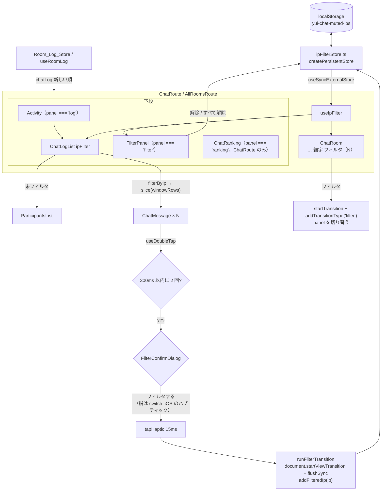

# Design Document: chat-ip-mute

## 概要

`ip_masked` が一致する発言を、閲覧者のブラウザの中だけで非表示にする（フィルタ）。起点は発言の行のダブルタップ
（ダブルクリック）で、成立したら自前の確認の窓（Confirm_Dialog）でフィルタするかを確かめ、「フィルタする」を押した瞬間に
端末を震わせる。iOS は「フィルタする」に重ねた透明な `<input type="checkbox" switch>`、それ以外は `navigator.vibrate` で
震わせる。タップの間のアニメーションは出さない。フィルタした IP は ChatRoom の「細字」の右の「フィルタ」リンクから、下段に出す Filter_Panel で
確かめて解除する。サーバーと DB には手を入れない。

## 設計方針

1. **絞り込みは描画の直前で行う。** Room_Log_Store と `useRoomLog` は変えない。`ChatLogList` が受け取ったログから
   フィルタ中の発言を除き、それから `windowRows` ぶんを切り出す（R5.1）。Realtime で届いた発言も同じ経路を通る
2. **フィルタの一覧は外部ストアに置く。** 既存の `createPersistentStore`（localStorage、別タブは `storage` イベント、
   SSG では既定値）を使い、`useSyncExternalStore` で読む。React の state にコピーしない
3. **起点はダブルタップ。文字の上でも反応する。** 当初は長押しにしていたが、長押しは文字の選択やリンクのメニューと
   取り合うため、文字の上を避けて空白部分だけで判定する必要があった。ダブルタップならその取り合いがなく、行のどこを
   押しても反応できる（2026-10-05 の決定）。リンク・ボタンの上だけは数えない
4. **タップでは再レンダーしない。** タップの時刻と位置は ref に持つ。成立したときだけコールバックを呼ぶ
5. **View Transition は狭く使う。** 名前を付けるのは、見えている範囲の行と区切り線（終わったら外す）と Filter_Link だけ。行ごとに `<ViewTransition>` で
   包むと、React が全行の位置を計測するため 1000 行で重くなる（R7.3）
6. **下段の切り替えはランキングと同じ形にする。** ChatRoute は `showRanking: boolean` を `panel: 'log' | 'ranking' | 'filter'`
   に置き換え、ログを `<Activity>` で残す。AllRoomsRoute には `showFilter` を足す
7. **安定版の API だけ。** `ViewTransition` / `Activity` / `addTransitionType` / `startTransition` は React 19.3.0 の
   安定版にある（`ChatRoute.tsx` で使用中）。Canary にしかない `onAnimationCancel` は使わない

## アーキテクチャ



## コンポーネントとインターフェース

### `utils/ipFilterStore.ts`（新規）

```ts
export const FILTER_LIST_LIMIT = 50;
/** フィルタの起点にできる値か（空文字と `*` は IP が分からない発言なので除く） */
export function isFilterableIp(ip: string | undefined): ip is string;
export function addFilteredIp(ip: string): void; // 重複は無視、末尾に追加、50 件を超えたら先頭を捨てる
export function removeFilteredIp(ip: string): void;
export function clearFilteredIps(): void;
export const subscribe, getSnapshot, getServerSnapshot; // createPersistentStore のもの。server は []
```

- `parse` は配列でなければ `[]`。要素は `isFilterableIp` を通る文字列だけを残し、重複を除き、末尾 50 件にする（R6.3, R6.4）
- 返す配列は Persistent_Store のキャッシュにより、生の文字列が同じ間は同じ参照（`useSyncExternalStore` の要件）

### `hooks/useIpFilter.ts`（新規）

`useSyncExternalStore` で Filter_List を読み、`{ ips: readonly string[]; set: ReadonlySet<string> }` を返す。Set の生成は
Compiler に任せる（手でメモ化しない）。ルートで 1 回呼び、`ChatRoom`（件数）・`ChatLogList`・`FilterPanel` に渡す。

### `utils/ipFilter.ts`（新規、純粋関数）

```ts
/** フィルタ中の発言を除く。順序は保つ。隠した件数を Masked_IP ごとに数える */
export function filterByIp(
  chatLog: readonly Chat[],
  filtered: ReadonlySet<string>
): { visible: readonly Chat[]; hiddenCounts: ReadonlyMap<string, number>; hiddenTotal: number };
```

- `filtered.size === 0` のときは `chatLog` をそのまま返す（コピーしない。Success Metrics の「空のとき同じ」）
- 管理人・巫女（system）の行も Masked_IP が一致すれば隠す（R5.4）

### `hooks/useDoubleTap.ts`（新規）

```ts
export const DOUBLE_TAP_MS = 300;
export const DOUBLE_TAP_DISTANCE_PX = 24;
export const TAP_MOVE_TOLERANCE_PX = 10;

export function useDoubleTap(options: {
  enabled: boolean;
  onDoubleTap: (row: HTMLElement) => void;
}): { onPointerDown; onPointerUp; onPointerCancel; onMouseDown };
```

- `dblclick` イベントは使わず、Pointer Events で数える。モバイルの `dblclick` はブラウザやページの拡大の設定によって
  出たり出なかったりするため。マウスでもタッチでも同じ規則になる
- `pointerdown`（`isPrimary` で主ボタンのとき）で位置を ref に置く。押した位置がリンク・ボタン・フォーム部品の中なら
  数えず、数えていた 1 回目も捨てる（R1.4）
- `pointerup` で、押した位置から 10px を超えて動いていたら数え直す（スクロール。R1.5）。前のタップから 300ms 以内で
  24px 以内なら成立して `onDoubleTap(event.currentTarget)` を呼ぶ。そうでなければ 1 回目として覚える（R1.6）
- `pointercancel` で数え直す
- `onMouseDown` で `event.detail >= 2`（2 回目のクリック）の既定の動作を止め、ダブルクリックで単語が選択されないようにする（R1.10）
- 時刻は `Date.now()`。テストでは Fake Timers で進める

### `utils/haptics.ts`（新規）

```ts
/** 対応していれば短く振動させる。未対応・失敗は無視する（R3） */
export function tapHaptic(ms = 15): void;
```

`typeof navigator !== 'undefined' && typeof navigator.vibrate === 'function'` を確かめ、`try` で呼ぶ。Chrome は一度も
操作していないページ（sticky activation がない）では無視するが、ダブルタップ自体が操作なので問題にならない。iOS Safari には
`navigator.vibrate` がないので、iOS は Haptic_Switch に任せる（R3.1）。

### `FilterConfirmDialog`（新規、`components/FilterConfirmDialog/`）

```tsx
type Props = { ip: string; onConfirm: () => void; onCancel: () => void };
```

- 旧来風の小さな窓（`Button` の outset の枠）を、画面全体を覆う半透明の背景の中央に出す（`position: fixed`）
- `role="alertdialog"`・`aria-modal="true"`。見出し（IP）を `aria-labelledby`、説明を `aria-describedby` に結ぶ。開いたときは
  「やめる」に `autoFocus`（R2.2）。Esc（窓の上の keydown）と背景のクリックで `onCancel`（R2.4）
- 「フィルタする」は `Button` を `relative` の枠に入れ、その上に透明な `<input type="checkbox" switch>`（Haptic_Switch）を
  `absolute inset-0 opacity-0` で重ねる。指で押すと switch が切り替わり、iOS Safari 18 以降がハプティックを鳴らす。
  `onChange` で `onConfirm` を呼ぶ（R3.1）。スクリプトからの `click()` では鳴らないので、重ねて直接押させる必要がある
- Haptic_Switch は `tabIndex={-1}`・`aria-hidden`。キーボードと支援技術は下の `Button`（`onClick={onConfirm}`）を使う（R2.5）
- React の型は `switch` 属性を知らないので、`{ switch: '' }` をスプレッドで渡す
- `switch` を知らないブラウザでは普通の checkbox になり、押せばそのまま確定する（振動は `navigator.vibrate` に任せる）
- 振動の強さやパターンは指定できない（switch の切り替えに付く OS の挙動を借りているだけ）

### `ChatMessage`（変更）

- props に `onFilterIp?: (ip: string, row: HTMLElement) => void` を足す。`ChatLogList` が Mutable_Row（R1.7）の行にだけ渡す。
  関数は全行で同じなので `memo()` の比較は崩れない（R8.2）
- `onFilterIp` があるときだけ外枠の `div` に `useDoubleTap` の handlers とクラス `chat-row-filterable` を付ける（R1.8）
- 行の外枠の属性（クラスと handlers）を `ChatMessage` で作り、`AdminMessage` にも渡す。管理人の入退室メッセージも
  ダブルタップでフィルタできる（R1.7）

### `ChatLogList`（変更）

```tsx
type Props = { /* 既存 */ ipFilter?: { set: ReadonlySet<string> } };
// ipFilter がないとき（ちゃなり）は今までどおり（R5.8）
const { visible, hiddenTotal } = ipFilter
  ? filterByIp(chatLog, ipFilter.set)
  : { visible: chatLog, hiddenTotal: 0 };
const chats = visible.slice(0, windowRows);
```

- `ParticipantsList` には今までどおり `chatLog`（未フィルタ）を渡す（R5.5）
- 0 件のとき、`hiddenTotal > 0` なら「表示できる発言はありません（N 件をフィルタ中）。」（R5.6）
- Mutable_Row は `!chat.optimistic && isFilterableIp(chat.ip_masked)`。管理人・巫女の行も含む（R1.7）
- `onFilterIp(ip)` は確認の窓を開くだけ。IP を state（`pendingIp`）に持つ
- 「フィルタする」（R2.3, R3.2, R4.11, R7.1）

  ```ts
  () => {
    tapHaptic(); // Android など。iOS は Haptic_Switch が鳴らす
    announce(ip);
    runFilterTransition(
      () => {
        setPendingIp(null); // 窓を閉じるのも同じ更新に入れる
        addFilteredIp(ip);
      },
      () => nameRowsInView(listRef.current) // 見えている行に名前を付ける。終わったら外す
    );
  };
  ```

- 視覚的に隠した `role="status"` の領域を常に置き、`announce` で文言を差し替える（R4.11）

### `ChatRoom`（変更）

- props に `filterCount?: number` と `onToggleFilter?: () => void` を足す。`onToggleFilter` があるときだけ、4 行目の
  「細字」の `label` の後ろに Filter_Link を出す（R4.1, R4.2）
- Filter_Link は `<button type="button">` を旧来のリンクの見た目（`text-green-700 underline`）で描く。文言は
  `filterCount ? \`フィルタ(${filterCount})\` : 'フィルタ'`
- Filter_Link にはクラス `filter-link` を付け、CSS で `view-transition-name: filter-link` を常に付ける（ChatRoom はページに
  1 つなので名前は重ならない）
- 「更新」と発言の送信は今の `onBackToChat` / `handleSend` の経路で Filter_Panel も閉じる（R4.10）

### `FilterPanel`（新規、`components/FilterPanel/`）

```tsx
type Props = {
  ips: readonly string[];
  hiddenCounts: ReadonlyMap<string, number>; // filterByIp の結果
  onBack?: () => void;
};
```

- ランキングと同じ旧来風の見た目。見出し「フィルタ」（押すとログに戻るリンク、R4.5）
- 表: Masked_IP / 隠れている発言（件）/ [解除]。2 件以上で [すべて解除]（R4.5〜R4.7）
- 空のときの案内文（R4.8）。下に「IP は一部を伏せた値で比べるため、別の人の発言も一緒に隠れることがあります」の注記
- 解除は `removeFilteredIp` / `clearFilteredIps` を直接呼ぶ（Transition にしない。パネルの中で行が消えるだけ）

`hiddenCounts` はルートで `filterByIp(chatLog, set)` を呼んで渡す。`ChatLogList` は lazy なので、ルートでも同じ純粋関数を
呼ぶ（1000 行で 1ms 未満なので 2 回呼んでもよい）。

### ルート（変更）

- ChatRoute: `showRanking` を `panel: 'log' | 'ranking' | 'filter'` に置き換える。`<Activity mode={panel === 'log' ? 'visible' : 'hidden'}>`。
  ランキングを開くと `panel = 'ranking'` なので Filter_Panel は自然に閉じる（R4.12）。`RANKING_ONLY` を
  `PANEL_ONLY = { ranking: 'auto', filter: 'auto', default: 'none' }` に広げる（R7.2, R7.4）
- AllRoomsRoute: `showFilter` を足し、下段を ChatRoute と同じく `<Activity>` + `<ViewTransition default={FILTER_ONLY}>` にする
- どちらも `useIpFilter()` を 1 回呼び、`ChatRoom` に `filterCount` / `onToggleFilter`、`ChatLogList` に `ipFilter`、
  `FilterPanel` に `ips` / `hiddenCounts` を渡す

### フィルタを足すときの View Transition（`utils/filterTransition.ts`）

当初は `startTransition` + `addTransitionType('mute')` で React に View Transition を始めさせる設計だった。しかし
React は `useSyncExternalStore` のストアが Transition の中で変わっても同期の更新として扱い、`<ViewTransition>` は
Transition（と Suspense・`useDeferredValue`）の更新でしか動かない。このためストアの更新では演出が始まらない。
フィルタの一覧を React の state に写すと、外部ストアにした理由（別タブとの同期、SSG）が崩れる。そこで、この演出だけは
`runFilterTransition` で `document.startViewTransition` を直接呼び、`flushSync` で反映する。

- 型（`types`）は Chrome 125 / Safari 18.2 からで、それより前の対応ブラウザにオブジェクトを渡すと例外になるため、
  コールバックの形で呼び、CSS は `<html data-filter-transition>` で絞る
- 動きを減らす設定と非対応のブラウザでは、そのまま更新する
- 省かれたとき（名前の重なりなど）も更新そのものは行われる。`ready` の reject は握りつぶす
- パネルの開閉（`filter` / `ranking`）はこれまでどおり React の `startTransition` + `addTransitionType`。こちらは
  React の state（`panel`）の更新なので動く

### 同じ IP の行がフェードアウトし、下の行が上へ詰まる動き（`nameRowsInView`、同じファイル）

ブラウザの View Transition は、名前を付けた要素のうち新しい状態にないものをその場でフェードアウトし、両方にあるものを
古い位置から新しい位置へ動かす（既定の動き）。名前のない要素はページ全体（root）の画像に含まれ、一気に詰まる。そこで
「フィルタする」を押した直前に、見えている行に一意の名前を付ける（2026-10-05 の要望）。

- 行の外枠には `data-chat-uuid`（`ROW_UUID_ATTR`）を付けておく（`ChatMessage`）
- `nameRowsInView(container)` は、一覧の中の行を上から見て、画面内とその下 1 画面ぶんの行に `filter-row-<uuid>`、
  そのすぐ下の区切り線（`<hr>`）に `filter-hr-<uuid>` を付け、外す関数を返す。行は新しい順に上から並ぶので、範囲より
  下に出たところで打ち切る。uuid の識別子に使えない文字は `_` にする
- `runFilterTransition(update, prepare)` は、古い状態を撮る前に `prepare`（`nameRowsInView`）を呼び、Transition が
  終わったら返した関数で名前を外す。非対応のブラウザと動きを減らす設定では `prepare` を呼ばない
- 同じ IP の行はすべて名前を持ったまま新しい状態から消えるので、そろってフェードアウトする。残る行は下から上へ動く。
  確認の窓を閉じる更新も同じ `flushSync` に入れる（窓は名前がないので root と一緒に消える）
- 全行に名前を付けると 1000 行で重いので、見えている範囲だけにする（R7.3）。範囲の外から上がってくる行は、詰まった
  位置に最初から出る
- 当初は Web Animations で 1 行だけ高さを縮めていたが（`collapseRowThen`）、同じ IP のほかの行は縮み終わってから一気に
  消えていた。View Transition にまとめ、すべての該当行を同時にフェードアウトさせる形にした

Chrome（ヘッドレス、`Animation.setPlaybackRate` で 1/10 に遅らせて撮影）で確かめた結果（Task 4.3、2026-10-05）:
入室前のログ 10 行のうち同じ IP の 6 行（管理人の入退室を含む）が半透明に薄れ、下の 2 行が下から上へ詰まり、終わった後は
名前と `<html>` の属性がすべて外れていた。入室後の「フィルタ(N)」の脈打ちと、発言の到着や Suspense の解決で動かないことは、本番の DB に入室メッセージを書かない
ように入室しなかったため、まだ確かめていない。

### CSS（`App.css` に追加）

```css
/* ダブルタップでの拡大を止める（ピンチでの拡大は残る）。R1.10 */
.chat-row-filterable {
  touch-action: manipulation;
}
.filter-link {
  view-transition-name: filter-link;
}
:root[data-filter-transition]::view-transition-old(root),
:root[data-filter-transition]::view-transition-new(root) {
  animation: none;
} /* ページ全体は動かさない */
:root[data-filter-transition]::view-transition-new(filter-link) {
  animation: filter-link-pulse 320ms ease-out;
}
```

## データフロー

1. 行を 1 回タップ → `useDoubleTap` が時刻と位置を ref に覚える（再レンダーなし）
2. 300ms 以内にもう一度タップ → Confirm_Dialog を開く（「やめる」・Esc・背景で閉じて終わり）
3. 指で「フィルタする」（Haptic_Switch。iOS はここでハプティック）→ `tapHaptic()` → 支援技術への通知 →
   `runFilterTransition` → 見えている行と区切り線に名前を付ける（`nameRowsInView`）→ `document.startViewTransition` が
   古い状態を撮り、コールバックの中の `flushSync` で窓を閉じて `addFilteredIp(ip)` を反映する
4. `filterByIp` で同じ IP の行が消える。名前の付いた該当行はそろってフェードアウトし、残る行は下から上へ詰まる。
   Filter_Link は「フィルタ(N)」になって軽く脈打つ。root は動かさない。終わったら名前を外す
5. Filter_Link → `addTransitionType('filter')` → `panel = 'filter'` → ランキングと同じアニメーションで Filter_Panel へ
6. 「解除」→ `removeFilteredIp(ip)` → パネルの行が消える。ログに戻ると（Activity の中ですでに再計算済み）発言が見える

入室前は ChatRoom がないので Filter_Link はなく、行がフェードアウトして詰まる動きだけになる。

## 決定事項

| Q   | 内容                                         | 決定（2026-10-05）                                                                                                                                                |
| --- | -------------------------------------------- | ----------------------------------------------------------------------------------------------------------------------------------------------------------------- |
| Q1  | 起点の操作と、文字の選択との両立             | ダブルタップ（ダブルクリック）にする。行のどこでも反応し、リンク・ボタンの上だけ数えない。長押し案は取りやめた                                                    |
| Q2  | 自分の IP をフィルタすると自分の発言も消える | 防がない。フィルタした IP は「細字」の右の「フィルタ」リンクから確認・解除する                                                                                    |
| Q3  | 押したときの演出                             | タップの間のアニメーションは出さない。成立したら Confirm_Dialog で確かめ、「フィルタする」を押した瞬間に振動させる                                                |
| Q4  | iOS の振動                                   | Confirm_Dialog を自前にし、「フィルタする」ボタンに透明な `<input type="checkbox" switch>` を重ねる。行に重ねると文字の選択やリンクと取り合うので、行には重ねない |

## テスト戦略

| 対象                             | 種類                | 確かめること                                                                                                                                                                                                                                                                                                                                                         |
| -------------------------------- | ------------------- | -------------------------------------------------------------------------------------------------------------------------------------------------------------------------------------------------------------------------------------------------------------------------------------------------------------------------------------------------------------------- |
| `ipFilterStore`                  | 単体                | 追加・重複無視・50 件で古いものを捨てる・壊れた保存値・空文字と `*` を捨てる・解除・すべて解除・別タブの `storage` イベント                                                                                                                                                                                                                                          |
| `filterByIp`                     | 単体 + fast-check   | 順序を保つ、隠した件数の合計 = 元の件数 − 残った件数、空集合なら同じ参照                                                                                                                                                                                                                                                                                             |
| `useDoubleTap`                   | Hook（Fake Timers） | 300ms 以内で成立（文字の上でも）、間が空くと不成立、位置が離れると不成立、タップの途中で動くと数え直し、`pointercancel`、リンクの上は数えない、2 本目の指・右ボタン・`enabled` でない、2 回目の mousedown を止める                                                                                                                                                   |
| `tapHaptic`                      | 単体                | `vibrate` なし・例外・`false` で投げない                                                                                                                                                                                                                                                                                                                             |
| `FilterConfirmDialog`            | コンポーネント      | 見出しと説明、`alertdialog`、「やめる」にフォーカス、switch が `type=checkbox`・`switch` 属性・`tabindex=-1`・`aria-hidden` でボタンに重なる、switch とボタンで確定、やめる・Esc・背景でやめる                                                                                                                                                                       |
| `runFilterTransition`            | 単体                | 非対応なら即更新、対応なら Transition の中で更新し終わるまで属性、動きを減らす設定、省かれても未処理の reject を出さない                                                                                                                                                                                                                                             |
| `nameRowsInView`                 | 単体                | 見えている行とその下 1 画面ぶんの行・区切り線にだけ一意の名前、範囲の外で打ち切り、外す関数、識別子に使えない文字、外枠なし                                                                                                                                                                                                                                          |
| `runFilterTransition` の prepare | 単体                | 古い状態を撮る前に呼び、終わったら外す。非対応なら呼ばない                                                                                                                                                                                                                                                                                                           |
| `ChatLogList`                    | コンポーネント      | ダブルタップで確認の窓、「やめる」なら何もしない、「フィルタする」で同じ Masked_IP の行が消え振動する（ダブルタップの時点では振動しない）、管理人の入退室と巫女の行は呼び出した人の IP でフィルタできる、IP が空の行（受付返信など）・`*` の行・楽観的な行は反応しない、`windowRows` はフィルタ後、参加者一覧は変わらない、0 件の文言、`ipFilter` なしなら従来どおり |
| `ChatRoom`                       | コンポーネント      | 「細字」の右に Filter_Link、件数の表示、`onToggleFilter` がなければ出ない                                                                                                                                                                                                                                                                                            |
| `FilterPanel`                    | コンポーネント      | 件数、解除、すべて解除（2 件以上のときだけ）、空の案内、`aria-label`                                                                                                                                                                                                                                                                                                 |
| ChatRoute / AllRoomsRoute        | 結合                | Filter_Link で開閉、ランキングを開くと閉じる、更新と送信で閉じる、ログのスクロール位置が戻る                                                                                                                                                                                                                                                                         |
| Compiler_Check                   | 既存                | 新しいファイルが `CompileError` を出さない                                                                                                                                                                                                                                                                                                                           |
| Storybook                        | 任意                | `FilterPanel` の 0 / 1 / 3 件                                                                                                                                                                                                                                                                                                                                        |

jsdom には `PointerEvent` も `document.startViewTransition` もないので、テストの中で用意するかスタブする。見た目と実機の
挙動は Task 5.3 で手で確かめる。

## 移行戦略

- サーバーと DB は変えないので、デプロイの順序はない
- localStorage のキー `yui-chat-muted-ips` を新しく使う。既存のキー（`yui-chat-settings`）には入れない（形を変えずに済む）
- 戻すときは機能のコードを取り除くだけ。残った localStorage の値は読まれなくなるだけで害はない

## パフォーマンス目標

- タップでは再レンダーしない（状態は ref だけ）
- `filterByIp` は 1000 行で 1ms 未満（O(n)、Set 引き）。ルートと ChatLogList で 2 回呼んでも問題にならない
- 1000 行でフィルタを追加しても Long Task（50ms 超）を出さない（Chrome の Performance パネルで確認）
