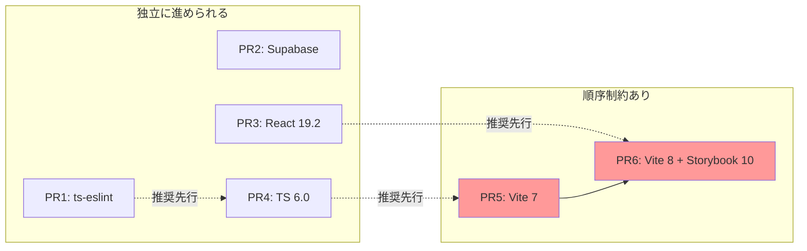
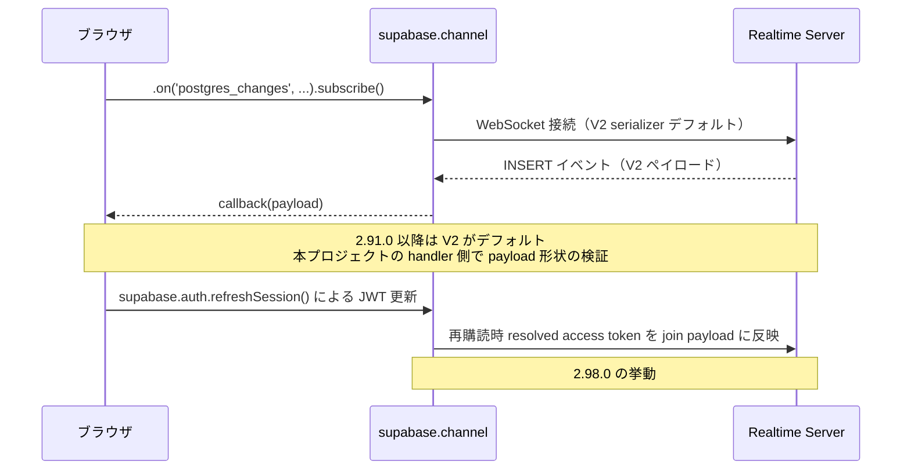
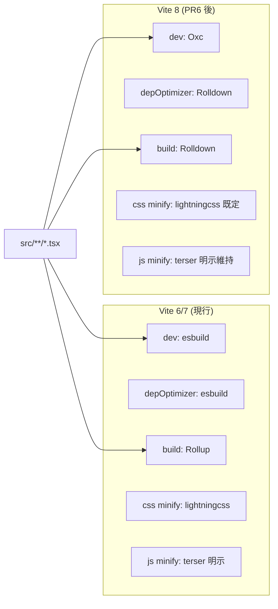

# 技術設計ドキュメント: deps-modernization-vite8

## 概要

ゆいちゃっとTS の Tooling_Stack を 2026 年 5 月時点の最新安定版に揃える。スコープは以下 6 領域：

1. **TS_Eslint_Stack 整合**: `@typescript-eslint/*` (8.44.1) と `typescript-eslint` メタパッケージ (8.33.1) のバージョンずれを解消。
2. **Supabase JS 2.105 系**: Realtime_V2_Serializer / 型推論強化 / Auth / Storage / Functions の安定化パッチ。
3. **React 19.2**: ランタイム更新のみ。新 API の採用は別 spec。
4. **TypeScript 6.0**: コンパイラと型解決の更新。
5. **Vite 7 中継**: Vite 6 → 8 の段差を縮めるための中継 PR。`@vitejs/plugin-react` / Vitest を Vite 7 対応版に。
6. **Vite 8 + Storybook 10**: Vite8_Build_Pipeline（Rolldown / Oxc / Lightning CSS）への移行と Storybook 10 同時更新。

既存の React 19 + Vite + Supabase + Tailwind CSS 4 構成を維持し、runtime コード（`src/**`）の機能追加は行わない。

## 設計方針

- **Risk-ordered, smallest-first**: 各 PR を独立にレビュー可能・切り戻し可能な粒度に保ち、低リスク → 高リスクの順で進める。
- **Bisect-friendly**: 1 PR = 1 メジャー更新（Supabase / React / TS / Vite / Storybook）を原則とし、`git bisect` で障害原因を 1 PR まで特定できるようにする。
- **No new runtime APIs**: ツールチェーン更新と機能採用を混ぜない。新 API の採用は別 spec のスコープ。
- **Compat layer first, native API later**: Vite 8 の `build.rollupOptions` 互換層を当面利用し、`build.rolldownOptions` への全面移行は本 spec の対象外。
- **Explicit declarations over implicit defaults**: `engines.node` / `lightningcss` devDep / `build.minify: 'terser'` 等、デフォルトに依存しない宣言を増やすことで将来の挙動変化に強くする。
- **Stage Vite via 7**: Vite 6 → 8 を 1 PR で行わず、Vite 7 を中継して `Modern_Browser_Baseline` / Node 要件 / deprecated API の整理を先行で済ませる。
- **Bundle Storybook with Vite 8**: Storybook 9.1.8 は Vite 8 未対応のため、Vite 8 PR と Storybook 10 PR を同一 PR に束ねる（PR 数を減らすメリットより、Storybook が起動できない状態が main に残らないことを優先）。
- **Verify with `preview`, not only with `build`**: 本番ビルドの minify 差分（Oxc vs terser）と CJS 互換性の差は `pnpm preview` でしか出ないバグがあるため、各 PR で `preview` まで実施する。

## アーキテクチャ

### Upgrade_PR_Sequence 全体像

```mermaid
graph TB
    Start[現状<br/>vite@6.3.5 / react@19.1 / ts@5.8 / supabase@2.50<br/>storybook@9.1.8 / ts-eslint 混在]

    PR1[PR1: TS_Eslint_Stack 整合<br/>typescript-eslint 8.33.1 → 8.44.x]
    PR2[PR2: Supabase JS 2.50 → 2.105<br/>Realtime_Smoke_Test]
    PR3[PR3: React 19.1 → 19.2<br/>@types/react 追従]
    PR4[PR4: TypeScript 5.8 → 6.0<br/>typecheck 緑保証]
    PR5[PR5: Vite 6 → 7 中継<br/>+ @vitejs/plugin-react + Vitest]
    PR6[PR6: Vite 7 → 8 + Storybook 9 → 10<br/>+ lightningcss devDep 明示<br/>+ manualChunks 戦略決定]

    End[完了<br/>vite@8 / react@19.2 / ts@6.0 / supabase@2.105<br/>storybook@10.3 / ts-eslint 整合]

    Start --> PR1 --> PR2 --> PR3 --> PR4 --> PR5 --> PR6 --> End
```

### 依存関係と前後制約



- **強い順序制約**: PR5 (Vite 7) → PR6 (Vite 8 + Storybook 10)。Vite 7 を中継せずに 6 → 8 を一気に行うと、`Modern_Browser_Baseline` の影響と Rolldown 由来の不具合が混ざって切り分け不能になる。
- **弱い順序制約**: PR1 → PR4（ts-eslint が 8.44 に揃っていないと TS 6.0 で lint が暴発する可能性がある）、PR3 → PR6（React 19.2 で Storybook 10 のプレビュー再描画挙動が安定するため）。
- **完全独立**: PR2 (Supabase) は他の PR と独立。並行作業可能。

## コンポーネントとインターフェース

本 spec は runtime コード（`src/**`）に新規コンポーネントを追加しない。変更対象は次の設定ファイル群のみ：

### 変更対象ファイル

| ファイル                        | 変更内容                                                                                                                                   | 主な変更を含む PR     |
| ------------------------------- | ------------------------------------------------------------------------------------------------------------------------------------------ | --------------------- |
| `package.json`                  | 依存バージョン宣言 / `engines.node` 追加 / `lightningcss` devDep 追加                                                                      | 全 PR                 |
| `pnpm-lock.yaml`                | `pnpm install` による自動更新（PR1 で pnpm v11 移行に伴う大規模 diff あり）                                                                | 全 PR                 |
| `pnpm-workspace.yaml`           | `allowBuilds` のブール値明示（pnpm v11 が追記するプレースホルダの整理）                                                                    | PR1                   |
| `vite.config.ts`                | `manualChunks` 戦略の確定（PR6 で決定）                                                                                                    | PR5 / PR6             |
| `.nvmrc` または `.node-version` | （存在する場合のみ）Node 22 LTS 明示                                                                                                       | PR1（または PR2）     |
| `tsconfig*.json`                | TS 6.0 で deprecate された設定の差し替え（必要時のみ）                                                                                     | PR4                   |
| `eslint.config.*`               | ルール内容は変更しない。例外: `ignores` に `storybook-static` 追加（`pnpm lint` ハング対処、Req 1.4）                                      | PR1                   |
| `src/**`                        | PR1 で react-hooks v7 新規ルール対応の refactor あり（Req 1.5。14 ファイル）。それ以外は型エラー解消のためのシグネチャ修正は例外として許容 | PR1 / PR2 / PR3 / PR4 |

### Manual Chunks 戦略（PR6 で決定する）

現状の `vite.config.ts` 18-50 行の `manualChunks(id)` は以下の振り分けを行っている：

- `@supabase/*` → `vendor-supabase`
- `react` / `react-dom` / `scheduler` → `vendor-react`
- その他 `node_modules/*` → `vendor-{baseName}`

Vite 8 で function 形式の `manualChunks` は deprecation 警告を出す。PR6 で次の 3 案から 1 つを選ぶ：

#### 案 A: 関数形式を維持（警告許容）

- **メリット**: 既存挙動完全維持。`vendor-supabase` が保持され、[[spec-spa-perf]] の Success Metric「chat 専用コードが initial bundle から外れる」を侵さない。
- **デメリット**: deprecation 警告が出続ける。将来の Vite 8.x マイナー更新で互換層が削除されるリスク。

#### 案 B: `manualChunks` を削除し Vite 標準に委ねる

- **メリット**: 警告ゼロ。設定がシンプル化。
- **デメリット**: `vendor-supabase` チャンクが消える可能性があり、TopPage の初期チャンクサイズと [[spec-spa-perf]] の Non-Goals 記述「`vendor-supabase` は TopPage の `useRoomCounts` 経由で initial bundle に残る」との整合性確認が必要。

#### 案 C: `build.rolldownOptions.output.advancedChunks` への移行

- **メリット**: Vite 8 ネイティブ API へ前向きに移行。
- **デメリット**: 本 spec の Non-Goals「`rolldownOptions` への全面移行」と矛盾。PR6 のスコープを超える可能性が高い。

**推奨**: PR6 では **案 B（`manualChunks` 削除、Vite 標準に委ねる）を第一候補** とする。Vite 8 の自動 vendor 分割は Rolldown ベースでも `node_modules` 由来コードを別チャンクへ振り分けるため、まず素の動作を確認する。

案 B を採択するには、`pnpm build` 後に以下 3 条件をすべて満たすこと：

1. **サイズ**: `dist` の gzip 後総 JS サイズが本 spec 開始時点比 ±5% 以内（Requirement 7.12）。
2. **TopPage の初期チャンク純度**: `dist/index.html` の `<link rel="modulepreload">` および TopPage の entry チャンクに、TopPage では使われない `chat` 機能の関数（`useChatLog` / `EntryForm` / `ChatRoom` 等）が新規に混入していない（`pnpm build && grep -lE 'useChatLog|EntryForm|ChatRoom' dist/assets/*.js` で TopPage entry に該当しないことを確認）。`vendor-supabase` 由来コードの TopPage 同梱は [[spec-spa-perf]] の Non-Goals で許容済みのため判定対象外。
3. **キャッシュ効率**: `vendor-react` / `vendor-supabase` の分離がなくなっても、再訪時 (`pnpm preview` + DevTools Network の disk cache 有効化) で初回 / 2 回目の HTTP request 数差が極端に縮まらない（許容範囲は「初回比 2 回目が 30% 以上を cache から提供」を目安とする）。

上記いずれかを満たさない場合のみ **案 A（関数形式維持、deprecation 警告許容）にフォールバック** する。案 C（`rolldownOptions.advancedChunks` 移行）は本 spec の Non-Goals に該当するため、第三候補としても採用しない。

PR6 で採択した案と理由（生成チャンク数、上記 3 条件の計測結果、TopPage の初期チャンクへの影響）を本セクションに 1 段落で追記する（Requirement 7.6 の文書化要件）。

#### PR6 採択結果（2026-05-17 計測）

**採択: 案 A（`manualChunks` 関数形式維持）** にフォールバック。

| 案          | gzip total JS         | チャンク構成                                                                                                  | 条件 (1) ±5% | 条件 (2) chat 専用コードの分離                                                 | 条件 (3) cache 効率                                      |
| ----------- | --------------------- | ------------------------------------------------------------------------------------------------------------- | ------------ | ------------------------------------------------------------------------------ | -------------------------------------------------------- |
| 案 B (削除) | 137,119 bytes (-1.4%) | entry + ChatLogList の 2 つ                                                                                   | ✅           | ❌ TopPage entry `index-CIHc1yd4.js` に `useChatLog/EntryForm/ChatRoom` が混入 | ❌ 1 entry チャンクのため変更時に全 136KB 再 download    |
| 案 A (維持) | 138,445 bytes (-0.5%) | `vendor-react` / `vendor-supabase` / `vendor-iceberg-js` / `rolldown-runtime` / entry / `ChatLogList` の 6 つ | ✅           | ✅ entry チャンクに chat コードは入らず分離維持                                | ✅ vendor 系が安定 hash で 2 回目訪問の cache hit に寄与 |

案 B は条件 (2) を満たさず、TopPage 訪問時に chat 機能の全コードを download することになるため [[spec-spa-perf]] の Success Metric「chat 専用コードが initial bundle から外れる」を侵す。よって案 A 維持。

Vite 8 の rolldown 互換層では `manualChunks(id)` 関数形式が deprecation 警告なく動作することを確認 (vite 8.0.13)。将来 rolldown 互換層が削除された段階で `rolldownOptions.advancedChunks` へ移行する別 spec を立てる方針。

### Vite 8 Baseline Target 判断（PR6 で記録する）

### Vite 8 Baseline Target 判断（PR6 で記録する）

Vite 8 では `build.target: 'baseline-widely-available'` の対象が `Modern_Browser_Baseline_V8` に更新され、Safari は **16.4 以上相当** に引き上がる。本プロジェクトは Safari 16.0〜16.3 をサポート対象外として扱う方針を継続する（旧 Safari 14 / 15 の対象外方針との整合）。Safari 16.0〜16.3 利用率が問題になる場合のみ `build.target: ['safari16', 'chrome107', 'firefox104']` を明示する。PR6 でこの判断結果（採択した default のまま / 明示 target を設定）を本セクションに 1 文で追記する（Requirement 7.13 の文書化要件）。

**PR6 採択結果 (2026-05-17)**: 本プロジェクトの `vite.config.ts` は `build.target: 'es2022'` を明示しており、Vite の `'baseline-widely-available'` デフォルト変更の影響を受けない。よって追加の `build.target` 設定や Safari 16.0〜16.3 向けの調整は不要。

## データフロー

本 spec は runtime のデータフローを変更しない。ただし PR2 (Supabase) と PR6 (Vite 8) では以下の挙動変化に注意する：

### PR2: Supabase Realtime のシリアライザ切替



### PR6: Vite 8 の build pipeline



`build.minify: 'terser'` の明示指定により JS minify は Vite 6/7/8 を通じて挙動不変。CSS minify も `cssMinify: 'lightningcss'` を既に明示しているため、Vite 8 で Lightning CSS が optional peer から通常依存に昇格しても挙動は維持される。

## テスト戦略

### 各 PR 共通の検収手順

```bash
pnpm install
pnpm typecheck
pnpm lint
pnpm test
pnpm build
pnpm preview   # 手動で / と /chat/<roomId> を目視確認
pnpm storybook # 起動確認（PR6 では build-storybook も）
```

`pnpm preview` の手動確認では、以下 3 点を最低限チェック：

1. TopPage の描画とリンク表示。
2. チャットページの入室 → メッセージ送信 → 別タブ受信。
3. ブラウザ DevTools の Console に新規エラー / 警告が増えていないこと（既存の許容警告は除く）。

### PR 別の追加検収

| PR                   | 追加検収                                                                                                        |
| -------------------- | --------------------------------------------------------------------------------------------------------------- |
| PR1 (ts-eslint)      | `pnpm lint` の warning / error 件数が PR 前と一致することを diff で確認                                         |
| PR2 (Supabase)       | Realtime_Smoke_Test の 4 シナリオ（INSERT 受信 / トークン更新 / タブ復帰 / 二重購読防止）を手動実施             |
| PR3 (React 19.2)     | `pnpm test` のカバレッジしきい値（50%）を満たすことを確認                                                       |
| PR4 (TS 6.0)         | `pnpm typecheck` の出力にエラー 0 件 / 新規 `expect-error` 0 件を確認                                           |
| PR5 (Vite 7)         | Storybook が Vite 7 + Storybook 9.1.8 で起動することを確認（不可なら本 PR を Vite 7 + Storybook 10 に振り替え） |
| PR6 (Vite 8 + SB 10) | `pnpm build-storybook` 緑、`pnpm chromatic:dryrun` 緑、`du -sh dist` の gzip 後総 JS サイズが ±5% 以内          |

### 自動テストの境界

- 本 spec はユニット / 統合テストの新規追加を行わない。既存 Vitest スイートが緑であることが回帰検出の主要手段。
- Realtime_Smoke_Test は手動シナリオ。自動化は別 spec のスコープ。

## 移行戦略

### 切り戻し方針

各 PR は **完全に独立に revert 可能** であることが原則。具体的には：

- **PR1 (ts-eslint)**: `package.json` / lockfile の revert のみで戻る。
- **PR2 (Supabase)**: 同上。Realtime の API シグネチャが変わっていない限り runtime コードの revert は不要。
- **PR3 (React 19.2)**: 同上。19.2 で型が厳しくなったために修正したシグネチャはそのまま残しても 19.1 で動作する想定。
- **PR4 (TS 6.0)**: 同上。新規追加した型注釈は TS 5.8 でも有効。
- **PR5 (Vite 7)**: `package.json` / lockfile の revert のみで戻る。
- **PR6 (Vite 8 + SB 10)**: `package.json` / `vite.config.ts` の `manualChunks` 戦略 / `lightningcss` devDep の revert が必要。**最も切り戻しコストが高い**ため、merge 後 7 日間は監視期間とし、その間に本番 / Storybook の不具合報告があれば即座に revert する。

### 段階的な dependency 更新

各 PR で `pnpm up <パッケージ>` を使い、関連パッケージを一括で更新する：

```bash
# PR1 前提: pnpm 自体を v11.x 以上へ更新（Requirement 2.5）
pnpm add -g pnpm@latest
CI=true pnpm install   # node_modules を v11 store へ張り直し
# pnpm-workspace.yaml の `allowBuilds` プレースホルダを true/false で埋める

# PR1
pnpm up typescript-eslint@^8.44 @typescript-eslint/eslint-plugin@^8.44 @typescript-eslint/parser@^8.44
# PR1 で eslint v10 系・react-hooks v7 系へも同梱更新（Requirement 1.5）
pnpm up eslint@^10 @eslint/js@^10 eslint-plugin-react-hooks@^7 eslint-plugin-react-refresh@^0.5
# react-hooks v7 の新規ルール (set-state-in-effect, refs) で出た違反は
# eslint-disable で抑制せず、React 公式の anti-pattern 解消パターンで refactor する

# PR2
pnpm up @supabase/supabase-js@latest

# PR3
pnpm up react@^19.2 react-dom@^19.2 @types/react@^19.2 @types/react-dom@^19.2

# PR4
pnpm up typescript@^6.0

# PR5
pnpm up vite@^7 @vitejs/plugin-react@latest vitest@latest @vitest/coverage-v8@latest @vitest/ui@latest

# PR6
pnpm dlx storybook@latest upgrade   # Storybook 公式の upgrade コマンド
pnpm up vite@^8 @vitejs/plugin-react@latest vitest@latest @vitest/coverage-v8@latest @vitest/ui@latest
pnpm add -D lightningcss@latest      # 明示宣言
```

### 衝突回避

[[spec-spa-perf]] の未完了 PR2-7 とは `vite.config.ts` で衝突する可能性が高い。衝突回避方針：

- 本 spec の PR5 / PR6 を [[spec-spa-perf]] の PR2 以降より **先行マージ** することを推奨。
- 万一 [[spec-spa-perf]] の PR が先行する場合、本 spec の PR6 で `manualChunks` 戦略を再検討し、[[spec-spa-perf]] の Success Metric「chat 専用コードが initial bundle から外れる」を侵さないことを確認する。

## パフォーマンス目標

本 spec は機能パフォーマンスの改善を直接目的としない。ただし、Vite 8 への更新により次の副次効果が期待される（観測対象、合否判定なし）：

| 指標                        | 計測方法                                                            | 期待値                           | 合否判定                             |
| --------------------------- | ------------------------------------------------------------------- | -------------------------------- | ------------------------------------ |
| `pnpm build` wall-clock     | `time pnpm build` を 3 回計測し中央値                               | Vite 6 比で短縮                  | なし（観測のみ）                     |
| `pnpm dev` 起動時間         | `time pnpm dev` を初回 cold start で計測                            | Vite 6 比で同等以上              | なし（観測のみ）                     |
| `dist` gzip 後総 JS サイズ  | `find dist/assets -name '*.js' -exec gzip -c {} \; \| wc -c` の合計 | 本 spec 開始時点比 ±5% 以内      | **合否判定あり（Requirement 7.12）** |
| node_modules install サイズ | `du -sh node_modules`                                               | Vite 8 で +15MB 程度の増加を許容 | なし（観測のみ）                     |
| CI install + build 時間     | CI ログ                                                             | 大きな悪化なし                   | なし（観測のみ）                     |

`dist` サイズが ±5% を超えて増加した場合のみ、Manual Chunks 戦略を再検討する（案 A → 案 B への切替を検討）。
