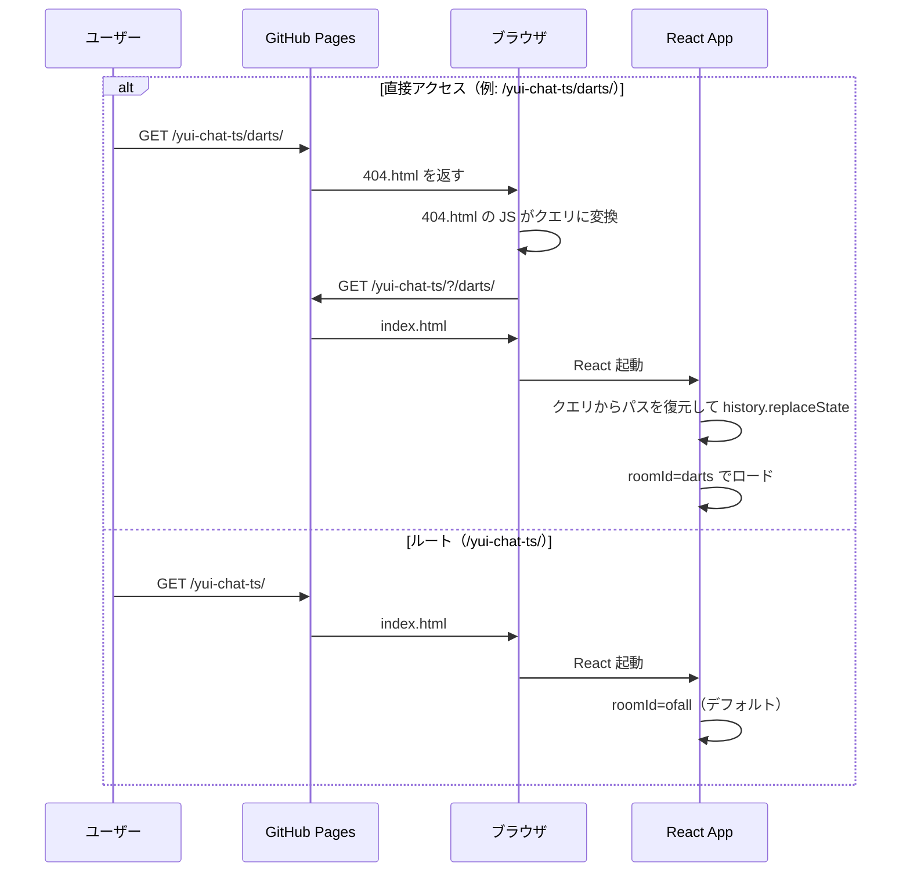
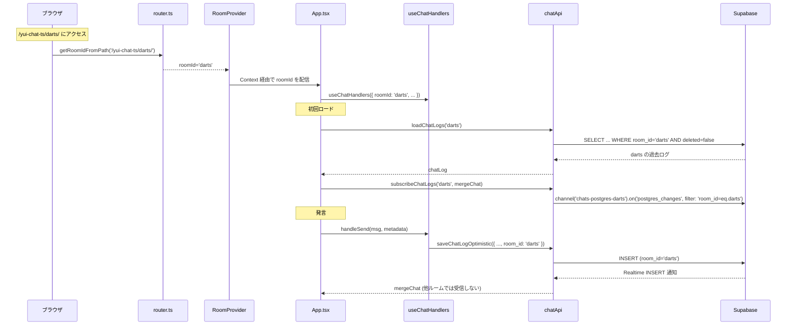

# 技術設計ドキュメント: multi-room-chat

## 概要

現在の yui-chat-ts は単一のチャット空間のみを提供している。本仕様では URL パス（例: `/ofall/`、`/superbeginner/`）ごとに**独立したチャットルーム**を表示できるようにする。各ルームは独立したメッセージログを持ち、Realtime 更新も部屋単位で分離する。

GitHub Pages 上の SPA として動作しつつ、直接 URL アクセス・リロード・共有リンクがすべてのルーム URL で機能することを目指す。

### 設計方針

- **クライアントサイドルーティングのみ**（サーバー側ルートなし）。GitHub Pages の制約下で動作させるため `404.html` リダイレクトトリックを利用
- **Supabase スキーマ変更を最小限に**: 既存 `chats` テーブルに `room_id TEXT` カラムを1つ追加するだけ
- **ルーム ID はホワイトリスト方式**: URL で任意の文字列を受け付けると自由ルーム作成になってしまうため、クライアントとサーバーの両方で既知のルーム ID のみを受理
- **既存チャット機能はすべて部屋単位で動作**: 設定永続化、アバター、フォントスタイル、look/unlook、おみくじ、論理削除すべて
- **段階的導入**: ルーム未指定時（`/yui-chat-ts/`）はデフォルトルーム（例: `ofall`）にフォールバックし、既存ユーザーへの破壊的変更を避ける
- **レガシーUI互換**: タイトル（「ダーツチャット」「中学生チャット」など）を各ルームで切り替え表示

## アーキテクチャ

### 全体構成の変更

```mermaid
graph TB
    subgraph "URLルーティング"
        Router[pathname パーサー<br/>/yui-chat-ts/{roomId}/]
        Guard[ルームID ホワイトリスト検証]
        Fallback[404.html → index.html リダイレクト]
    end
    subgraph "React 状態層"
        RoomCtx[RoomContext<br/>現在のroomId]
        useRoom[useRoom フック]
    end
    subgraph "API/データ層"
        CA[chatApi + room_id フィルタ]
        SB[(Supabase chats テーブル<br/>+ room_id カラム)]
        BC[Supabase Realtime Broadcast<br/>chats-broadcast-{roomId}]
        PG[Postgres Changes<br/>filter: room_id=eq.{id}]
    end
    subgraph "UI"
        App[App.tsx + RoomProvider]
        Title[ルーム別タイトル表示]
        EF[EntryForm]
        CR[ChatRoom]
    end

    Router --> Guard
    Guard --> RoomCtx
    Fallback --> Router
    RoomCtx --> useRoom
    useRoom --> CA
    useRoom --> Title
    CA --> SB
    CA --> BC
    CA --> PG
    App --> RoomCtx
```

### レイヤー構成の変更点

| レイヤー     | 変更内容                                                          | 新規/変更ファイル                                                                   |
| ------------ | ----------------------------------------------------------------- | ----------------------------------------------------------------------------------- |
| ルーティング | URL パースとルーム ID 検証、404 リダイレクト                      | `src/features/room/router.ts`（新規）、`public/404.html`（新規）                    |
| ルーム定義   | ホワイトリスト・メタデータ（タイトル・説明）                      | `src/features/room/rooms.ts`（新規）                                                |
| Context      | 現在のルーム情報を配信                                            | `src/features/room/RoomContext.tsx`（新規）、`src/features/room/useRoom.ts`（新規） |
| API 層       | 全クエリに `room_id` フィルタ追加、Broadcast チャネル名を部屋別に | `src/features/chat/api/chatApi.ts`（変更）                                          |
| 静的ページ   | GitHub Pages SPA ルーティング対応                                 | `public/404.html`（新規）、`index.html`（変更）                                     |
| UI           | ルーム名を表示、エントリフォーム・チャットルームタイトル切替      | `App.tsx`（変更）、`EntryForm`（変更）                                              |
| DDL          | `room_id` カラム追加・インデックス・RLS 更新                      | `docs/migrations/002_add_room_id_column.sql`（新規）                                |

## ルーム定義（ホワイトリスト）

任意の文字列を URL に含められると以下の問題が起きる：

- 検索エンジンのクローラーが無限に新しいルームを作成できる
- 誤タイプで空のルームに飛ばされる
- ルーム名スパムによる Supabase ストレージの圧迫

クライアントとサーバーの両方で有効なルーム ID を制限する。

```typescript
// src/features/room/rooms.ts

export type RoomId = 'ofall' | 'superbeginner' | 'darts' | 'juniorhighschool3';

export type RoomMeta = {
  id: RoomId;
  title: string; // 画面上部に表示（例: 「超初心者チャット」）
  description: string; // EntryForm 等のサブタイトル
  headerColor?: string; // ピンク背景バーの色（ルームごとのアクセントカラー）
};

export const ROOMS: Record<RoomId, RoomMeta> = {
  ofall: {
    id: 'ofall',
    title: 'ゆいちゃっと',
    description: 'みんなのチャット',
  },
  superbeginner: {
    id: 'superbeginner',
    title: '超初心者チャット',
    description: 'チャットが初めてのひとのためのチャット',
    headerColor: '#feb6c1',
  },
  darts: {
    id: 'darts',
    title: 'ダーツチャット',
    description: 'ダーツ好きが集まるチャット',
  },
  juniorhighschool3: {
    id: 'juniorhighschool3',
    title: '中学生チャット３',
    description: '中学生のためのチャット',
  },
};

export const ROOM_IDS = Object.keys(ROOMS) as RoomId[];
export const DEFAULT_ROOM_ID: RoomId = 'ofall';

export function isRoomId(value: unknown): value is RoomId {
  return typeof value === 'string' && (ROOM_IDS as string[]).includes(value);
}

export function getRoomMeta(id: RoomId): RoomMeta {
  return ROOMS[id];
}
```

**設計判断**:

- `RoomId` は literal union 型で閉じ、コンパイル時に不正値を検出
- 新しいルームを追加する場合は `ROOMS` に1エントリ追加するだけ
- Supabase 側には RLS で `room_id IN (...)` チェックを入れる余地を残す（将来の拡張）

## URL ルーティング（GitHub Pages SPA 対応）

GitHub Pages は静的ホスティングなので `/yui-chat-ts/ofall/` のような URL に直接アクセスすると 404 になる。これを回避するために spa-github-pages トリックを使う。

### ルーティングフロー



### 404.html の内容

`public/404.html` に spa-github-pages の汎用スクリプトを配置する。クエリ文字列にパス情報を埋め込んで `index.html` にリダイレクトする方式。

```html
<!DOCTYPE html>
<html>
  <head>
    <meta charset="utf-8" />
    <title>yui-chat-ts</title>
    <script>
      // spa-github-pages: 404 → index.html にリダイレクトしつつパスを保持
      // https://github.com/rafgraph/spa-github-pages (MIT)
      var segmentCount = 1; // /yui-chat-ts/ 部分をベースとして保持
      var l = window.location;
      l.replace(
        l.protocol +
          '//' +
          l.hostname +
          (l.port ? ':' + l.port : '') +
          l.pathname
            .split('/')
            .slice(0, 1 + segmentCount)
            .join('/') +
          '/?/' +
          l.pathname.slice(1).split('/').slice(segmentCount).join('/').replace(/&/g, '~and~') +
          (l.search ? '&' + l.search.slice(1).replace(/&/g, '~and~') : '') +
          l.hash
      );
    </script>
  </head>
  <body></body>
</html>
```

### index.html 側の復元スクリプト

`index.html` の `<head>` 先頭に、クエリ文字列をパスに戻すスクリプトを挿入する（React 起動前に実行）。

```html
<script>
  (function () {
    var l = window.location;
    if (l.search[1] === '/') {
      var decoded = l.search
        .slice(1)
        .split('&')
        .map(function (s) {
          return s.replace(/~and~/g, '&');
        })
        .join('?');
      window.history.replaceState(null, '', l.pathname.slice(0, -1) + decoded + l.hash);
    }
  })();
</script>
```

### router.ts: パスからルームIDを抽出

```typescript
// src/features/room/router.ts

import { ROOM_IDS, DEFAULT_ROOM_ID, isRoomId } from './rooms';
import type { RoomId } from './rooms';

/**
 * 現在の pathname から roomId を抽出する。
 * BASE_URL を剥がした残りの最初のセグメントが roomId。
 * 未指定または無効な ID の場合は DEFAULT_ROOM_ID にフォールバック。
 */
export function getRoomIdFromPath(pathname: string = window.location.pathname): RoomId {
  const base = import.meta.env.BASE_URL.replace(/\/$/, ''); // '/yui-chat-ts'
  const withoutBase = pathname.startsWith(base) ? pathname.slice(base.length) : pathname;
  const segments = withoutBase.split('/').filter(Boolean);
  const first = segments[0];
  if (first && isRoomId(first)) return first;
  return DEFAULT_ROOM_ID;
}

/** roomId を URL パスに変換（リンク生成用） */
export function buildRoomPath(roomId: RoomId): string {
  return `${import.meta.env.BASE_URL}${roomId}/`;
}
```

**設計判断**:

- `popstate` / `pushState` は使わない（ルーム間の遷移は通常のリンクで `<a href>` による全ページ遷移でも構わない。SPA 内遷移は将来拡張として追加可能）
- 不明なルームIDは **サイレントにデフォルトへフォールバック** する（404 を出さない）
- クエリパラメータは保持する

## RoomContext と useRoom フック

ルーム情報をコンポーネントツリー全体で共有する。Context API を使う理由は：

- `App.tsx` から `ChatLogList` / `EntryForm` / `ChatRoom` まで深くネストしているため props drilling を避けたい
- 将来的に「ルーム切替」を実装する際に Context 1箇所の更新で済む

```typescript
// src/features/room/RoomContext.tsx

import { createContext, useMemo, type ReactNode } from 'react';
import { getRoomIdFromPath } from './router';
import { getRoomMeta } from './rooms';
import type { RoomId, RoomMeta } from './rooms';

type RoomContextValue = {
  roomId: RoomId;
  meta: RoomMeta;
};

export const RoomContext = createContext<RoomContextValue | null>(null);

export function RoomProvider({ children }: { children: ReactNode }) {
  const value = useMemo<RoomContextValue>(() => {
    const roomId = getRoomIdFromPath();
    return { roomId, meta: getRoomMeta(roomId) };
  }, []);

  return <RoomContext.Provider value={value}>{children}</RoomContext.Provider>;
}
```

```typescript
// src/features/room/useRoom.ts

import { useContext } from 'react';
import { RoomContext } from './RoomContext';

export function useRoom() {
  const ctx = useContext(RoomContext);
  if (!ctx) throw new Error('useRoom must be used within RoomProvider');
  return ctx;
}
```

**設計判断**:

- マウント時に1回だけ pathname を読む（動的なルーム切替は v2 で対応）
- `useMemo` で value を固定し、不要な再レンダリングを防ぐ

## データモデルの変更

### Supabase テーブルスキーマ

```sql
ALTER TABLE chats ADD COLUMN IF NOT EXISTS room_id TEXT NOT NULL DEFAULT 'ofall';
CREATE INDEX IF NOT EXISTS idx_chats_room_time ON chats (room_id, time DESC);
CREATE INDEX IF NOT EXISTS idx_chats_room_uuid ON chats (room_id, uuid DESC);
```

- **`NOT NULL DEFAULT 'ofall'`**: 既存レコードは自動的に `ofall` ルームに割り当てられる
- **複合インデックス `(room_id, time DESC)`**: 「特定ルームの最新 N 件」クエリが高速化
- **複合インデックス `(room_id, uuid DESC)`**: UUID v7 時系列ソート（既存の `order by uuid` を踏襲）

### Chat 型の拡張

```typescript
// src/features/chat/types.ts（変更）

export type Chat = {
  uuid: string;
  name: string;
  color: string;
  message: string;
  time: number;
  client_time?: number;
  optimistic?: boolean;
  system?: boolean;
  email?: string;
  ip: string;
  ua: string;
  metadata?: ChatMetadata;
  room_id: RoomId; // ★追加（必須）
};
```

`room_id` は optional ではなく必須にする。API 層で書き込み時に強制セットし、読み込み時は `.eq('room_id', ...)` でフィルタするので undefined にはならない。

### RLS ポリシー変更

既存の SELECT / INSERT / UPDATE ポリシーは `room_id` を明示的に扱っていないが、以下のように制限を追加すると安全性が向上する：

```sql
-- INSERT 時に許可されたルーム ID のみ受け入れる
DROP POLICY IF EXISTS "public-insert" ON chats;
CREATE POLICY "public-insert" ON chats
  FOR INSERT
  WITH CHECK (room_id IN ('ofall', 'superbeginner', 'darts', 'juniorhighschool3'));
```

ただし、この制限を入れるとルーム追加時に DDL 更新が必要になる。初期実装ではクライアント側のホワイトリストのみで運用し、将来ルームが増減する場合に DDL も同期する。

## chatApi の変更

### 全てのクエリに `room_id` フィルタを追加

```typescript
// src/features/chat/api/chatApi.ts（抜粋）

export async function loadChatLogs(roomId: RoomId, useCache = true): Promise<Chat[]> {
  // ルーム単位でキャッシュを持つ
  const cacheKey = `chats:${roomId}`;
  if (useCache && cacheStore[cacheKey]) {
    /* ... */
  }

  const { data, error } = await supabase
    .from(TABLE)
    .select('uuid,name,color,message,time,system,email,ip,ua,metadata,room_id')
    .eq('room_id', roomId) // ★追加
    .eq('deleted', false)
    .order('uuid', { ascending: false })
    .limit(MAX_CHAT_LOG);
  // ...
}

export async function saveChatLogOptimistic(chat: Chat): Promise<Chat> {
  const sanitized = {
    name: chat.name,
    color: chat.color,
    message: chat.message,
    system: chat.system,
    email: chat.email,
    ip: chat.ip,
    ua: chat.ua,
    metadata: chat.metadata ?? null,
    room_id: chat.room_id, // ★追加
  };
  // ...
}

export async function clearChatLogsByName(roomId: RoomId, name: string): Promise<void> {
  const { error } = await supabase
    .from(TABLE)
    .update({ deleted: true })
    .eq('room_id', roomId) // ★追加
    .eq('name', name);
  // ...
}
```

### Realtime チャネルを部屋ごとに分離

```typescript
// subscribeChatLogs をルーム単位に変更
export function subscribeChatLogs(roomId: RoomId, callback: (chat: Chat) => void) {
  const channel = supabase
    .channel(`chats-postgres-${roomId}`)
    .on(
      'postgres_changes',
      {
        event: 'INSERT',
        schema: 'public',
        table: TABLE,
        filter: `room_id=eq.${roomId}`, // ★ルーム別フィルタ
      },
      (payload) => callback(normalizeChat(payload.new))
    )
    .subscribe();
  return channel;
}

// Broadcast チャネルもルーム別に
function getOrCreateBroadcastChannel(roomId: RoomId): RealtimeChannel {
  if (!broadcastChannels[roomId]) {
    broadcastChannels[roomId] = supabase.channel(`chats-broadcast-${roomId}`);
  }
  return broadcastChannels[roomId];
}

export function broadcastLookEvent(roomId: RoomId, messageId: string): void {
  const channel = getOrCreateBroadcastChannel(roomId);
  ensureBroadcastSubscribed(roomId);
  channel.send({
    type: 'broadcast',
    event: 'look',
    payload: { type: 'look', messageId } satisfies LookEvent,
  });
}
```

**設計判断**:

- Postgres Changes の `filter: 'room_id=eq.X'` で Supabase 側が部屋外のメッセージを自動的に除外する（クライアント側で捨てる必要なし）
- Broadcast のチャネル名を `chats-broadcast-${roomId}` で部屋ごとに分離し、別ルームの look 音声が鳴らないようにする

### キャッシュの分離

現在の `chatLogsCache` はグローバル変数だが、`Record<RoomId, CacheItem>` に変更してルームごとに保持する：

```typescript
const chatLogsCache: Partial<Record<RoomId, CacheItem>> = {};
```

ルームを切り替えるとキャッシュも切り替わる。同じルームに戻った場合は 5 分以内ならキャッシュから復元される。

## UI 変更

### App.tsx

```tsx
function AppContent() {
  const { meta } = useRoom();
  // ... 既存のロジック（handleEnter/handleSend に roomId を渡す）
}

export default function App() {
  return (
    <RoomProvider>
      <AppContent />
    </RoomProvider>
  );
}
```

### タイトル切替

EntryForm と SEO タイトルを `meta.title` に応じて切り替える：

```tsx
// EntryForm
const { meta } = useRoom();
return <header className="mb-1 text-2xl font-bold text-yui-pink font-yui">{meta.title}</header>;

// App.tsx の useSEO
const { meta } = useRoom();
useSEO({
  title: `${meta.title} - 無料お気楽チャット`,
  description: meta.description,
  canonical: `https://isrnao.github.io/yui-chat-ts/${meta.id === 'ofall' ? '' : meta.id + '/'}`,
});
```

### useChatHandlers への roomId 注入

```typescript
const { roomId } = useRoom();

const { handleEnter, ... } = useChatHandlers({
  name, color, email, myId,
  roomId,  // ★追加
  entered, setEntered, /* ... */
});
```

`useChatHandlers` 内部では `createOptimisticChat` で `room_id: roomId` を設定し、`saveChatLogOptimistic`・`clearChatLogsByName`・`broadcastLookEvent` 等にもすべて roomId を渡す。

## コンポーネント間のデータフロー



## 正当性プロパティ（Correctness Properties）

### Property 1: ルームIDの正規化

任意の pathname 入力に対して、`getRoomIdFromPath(pathname)` の戻り値は **必ず** ROOM_IDS に含まれるいずれかの値になる。不正値は DEFAULT_ROOM_ID にフォールバックされる。

**Validates: Requirements 1.1, 1.2**

### Property 2: メッセージの部屋境界

特定のルーム `A` で `loadChatLogs(A)` を呼んだ結果のすべてのメッセージは `msg.room_id === A` を満たす。

**Validates: Requirements 2.1**

### Property 3: Realtime 通知の部屋境界

ルーム `B` で発言された新規メッセージは、ルーム `A` で subscribe している `subscribeChatLogs(A, callback)` のコールバックに渡されない。

**Validates: Requirements 2.2, 2.3**

### Property 4: RoomProvider のラウンドトリップ

`RoomProvider` 内で `useRoom()` を呼ぶと、常に `getRoomIdFromPath()` と同じ roomId が返る。

**Validates: Requirements 1.3**

### Property 5: URL 生成・パースのラウンドトリップ

任意の `RoomId` に対して、`getRoomIdFromPath(buildRoomPath(id))` は `id` と等しい。

**Validates: Requirements 1.4**

## エラーハンドリング

| シナリオ                                            | 対応                                                                                                          |
| --------------------------------------------------- | ------------------------------------------------------------------------------------------------------------- |
| 不明なルームIDを含む URL にアクセス                 | DEFAULT_ROOM_ID（ofall）にサイレントフォールバック                                                            |
| 404.html のリダイレクトスクリプト実行前にリロード   | SPA ルートの `/yui-chat-ts/` に着地し、DEFAULT_ROOM_ID で起動                                                 |
| Supabase が旧スキーマ（room_id カラムなし）を返す   | `normalizeChat` で `room_id` が欠落している行は `DEFAULT_ROOM_ID` で補完                                      |
| ルーム間を URL バーから移動した直後の Realtime 購読 | 旧チャネルを `unsubscribe()` し、新しい roomId で再購読                                                       |
| localStorage 設定が別ルームで復元される             | 設定（名前・色・アバター）はルーム共通でOK。将来ルーム別にする場合は `yui-chat-settings:${roomId}` キーで分離 |

## テスト戦略

| テスト対象                 | テスト種別     | 備考                                                              |
| -------------------------- | -------------- | ----------------------------------------------------------------- |
| `rooms.ts` / `router.ts`   | ユニット + PBT | Property 1, 5（ラウンドトリップ）                                 |
| `chatApi` の部屋フィルタ   | ユニット       | モックで `.eq('room_id', ...)` が呼ばれることを検証               |
| `RoomProvider` / `useRoom` | コンポーネント | Property 4                                                        |
| `ChatLogList`              | コンポーネント | 異なる roomId を渡したとき、渡された chatLog がそのまま表示される |
| `404.html` リダイレクト    | 手動 E2E       | GitHub Pages 環境では実際のデプロイ後に確認                       |

## 互換性・マイグレーション

### 既存ユーザーへの影響

- `/yui-chat-ts/` への直接アクセスは、これまでと同じ動作（デフォルトルーム = `ofall`）
- 過去のメッセージは DDL により全て `room_id = 'ofall'` として扱われる
- 既存の localStorage 設定はそのまま利用可能（ルーム共通）

### ロールアウト手順

1. **Supabase マイグレーション適用**: `002_add_room_id_column.sql` を実行（既存レコードは `ofall` に割り当て）
2. **コードデプロイ**: 新コードがリリースされるまでは、旧コードが `ofall` にのみ書き込む状態でも整合する
3. **`404.html` の配置確認**: GitHub Pages 反映後、`/yui-chat-ts/darts/` に直接アクセスして動作確認
4. **ルーム名の告知**: README や特集ページから各ルームへのリンクを張る（任意）
