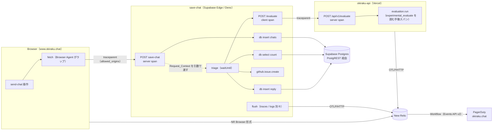

# 技術設計ドキュメント: observability-new-relic

## 概要

New Relic を yui-chat-ts（React / save-chat Edge Function）と okiraku-api（Vercel Functions）に導入し、送信操作 1 件をバックエンドの DB 保存・AI 呼び出しまで追えるようにする。
送信方式は、バックエンドを **OTLP**、ブラウザを **New Relic Browser エージェント**とし、両者を W3C Trace Context（`traceparent`）でつなぐ。

実装順は **事前検証 → 最小限のバックエンドトレース → Browser 接続 → 発報・復旧テスト → ログ → DB の追加監視**。最初のマイルストーンは「送信操作 1 件を最後まで追える」状態で、そこで効果と運用コストを判断してから後続に進む。

## レビュー指摘の検証結果（2026-09-22）

レビュー 7 項目を実コード・インストール済み SDK・公式資料と照合した。**7 項目すべて妥当**と判断し、本 spec に反映した。

| #   | 指摘                                        | 判定                 | 確認した根拠                                                                                                                                                                                                                                                                                                   | 反映先                           |
| --- | ------------------------------------------- | -------------------- | -------------------------------------------------------------------------------------------------------------------------------------------------------------------------------------------------------------------------------------------------------------------------------------------------------------- | -------------------------------- |
| 1   | AI SDK の自動計測は使えない                 | **妥当**             | `okiraku-api/src/providers/jev.ts` は `experimental_evaluate` を使用。`node_modules/ai@7.0.105` の `evaluate()` の引数は `model / state / questions / maxRetries / abortSignal / headers / providerOptions` のみで、`experimental_telemetry` はない。戻り値の `usage.inputTokens` などは `number \| undefined` | R2、設計「okiraku-api」          |
| 2   | `context.with()` だけでは継承が保証されない | **妥当（より重要）** | OTel JS は Context Manager（Node では AsyncLocalStorage）がないと `context.active()` が引き継がれない。さらに、Supabase Edge で `@opentelemetry` の npm パッケージが正しく動かなかったという報告があり（下記 Sources）、SDK 自体が動くかも Spike で確認が必要                                                  | R1.1〜1.2、R1.6、R3.2、R3.6〜3.9 |
| 3   | アラートの閉じ方が不足                      | **妥当**             | New Relic の NRQL 条件は、エラーだけを数えるクエリだと、エラーがない時間帯は 0 ではなく「データなし」になる。gap filling（固定値）と Loss of Signal の設定で挙動が変わる                                                                                                                                       | R7、「アラート設計」             |
| 4   | PII 方針とエラー収集の矛盾                  | **妥当**             | `triage.ts:69` が `JSON.stringify(body)`、`triage.ts:118` が `await res.text()` を例外文に埋め込む。`index.ts:133` は DB の `error.message` をクライアントへ返す                                                                                                                                               | R4                               |
| 5   | DB メトリクスは分離                         | **妥当**             | 毎分実行は 30 日で 43,200 回。`pg_stat_statements` は累積統計なので、差分を取らないと過去の遅い処理を現在の異常と誤認する                                                                                                                                                                                      | R10、Non-Goals                   |
| 6   | E2E の合格条件が弱い                        | **妥当**             | `uniqueCount(entity.name)=3` は親子関係・欠落スパン・混線を検出できない                                                                                                                                                                                                                                        | R8                               |
| 7   | pino・PagerDuty・無料枠の具体化             | **妥当**             | pino の送信には LoggerProvider が必要（ない場合は `disableLogSending` を推奨）。PagerDuty の Dynamic Notifications は `critical`/`error` を高緊急度、`warning`/`info` を低緊急度、**severity なしは高緊急度**に振り分ける                                                                                      | R6、R7.7〜7.8、R9                |

### レビューに加えて見つかった点

| 項目                           | 内容                                                                                                                                                                                                                | 反映先               |
| ------------------------------ | ------------------------------------------------------------------------------------------------------------------------------------------------------------------------------------------------------------------- | -------------------- |
| サンプリングの伝播             | サーバーを `ParentBased` にすると、Browser が「記録しない」と判断したトレースはサーバー側も記録されない。→ 2 回目のレビューを受けて、**バックエンドは初期版から全件記録に固定**した（下記「2 回目のレビュー」#1）   | 設計「サンプリング」 |
| pino の ESM 計測               | okiraku-api は ESM（`"type": "module"`）。`instrumentation-pino` は ESM ではローダーフック（import-in-the-middle）が必要で、Vercel では Node の起動フラグを渡せない可能性がある。手動ブリッジを代替案として用意する | R6.2                 |
| supabase-js の伝播機能         | `tracePropagation` は supabase-js 2.106.0 以降（現在は `^2.105.4`）。有効にすると trace ID が API Gateway と Edge Function のログに出る。PostgREST 呼び出しと DB ログを結びつける手段として Phase 5 で使う          | R10.2                |
| エラー応答                     | クライアントへ返す 500 の本文に DB エラー文が入っている。固定文言と trace ID を返す形に変える → **取りやめ**（2026-09-22、匿名チャットのため現行のまま）                                                            | R4.4                 |
| インシデントの時間上限         | New Relic のインシデントは時間上限で自動クローズされる。時間上限によるクローズは復旧ではないため、runbook で区別する                                                                                                | 「アラート設計」     |
| Dynamic Notifications のプラン | 公式資料は「一部の旧プランを除く全プラン」としているが、Free プランで使えるかは明記されていない。使えない場合は Warning を PagerDuty に送らず、New Relic のメール通知に留める                                       | R7.7、未決事項       |

### 2 回目のレビュー（2026-09-22）の検証結果

6 項目を spec の本文と関連コード（`chatApi.ts` の `retryApiCall`、`save-chat/index.ts`）に照らして確認した。**6 項目すべて妥当**で、無視できる指摘はない。すべて取り込んだ。

| #   | 重要度 | 指摘                                                 | 判定と確認内容                                                                                                                                                                                                                                                                                                                                                  | 反映先                               |
| --- | ------ | ---------------------------------------------------- | --------------------------------------------------------------------------------------------------------------------------------------------------------------------------------------------------------------------------------------------------------------------------------------------------------------------------------------------------------------- | ------------------------------------ |
| 1   | P1     | 保存失敗の通知が Browser のサンプリングに依存する    | **妥当**。`ParentBased` のままだと、`sampled=00` の要求で DB エラースパンが記録されず、C1 が数えられない。少数の障害ほど取りこぼす。また、全件記録にしても欠落した Browser スパンは戻らないので、「つながりは保たれる」は誤り。→ バックエンドを全件記録に固定し、サンプリングを変えるときは先に C1 をサンプリングに依存しない信号へ移す、というルールを追加した | R3.11、R7.11、R8.8、「サンプリング」 |
| 2   | P1     | C1 のクローズ条件と「最後のエラーから約 5 分」の矛盾 | **妥当**。「2 件未満」でクローズすると、窓内に 1 件残っていても閉じる。→ **しきい値を下回ったら自動クローズ**に統一し、Observed_Clear の定義を「しきい値を下回った」に直した。「失敗がゼロになった」ことは Verified_Recovery 側で確認する。集計方式などの設定値も固定した                                                                                       | R7.3、R7.10、「アラート設計」        |
| 3   | P1     | staging の成功で本番の復旧確認ができてしまう         | **妥当**。staging の成功は、本番の DB・Secrets・デプロイ済みの関数が直ったことを示さない。→ Verified_Recovery を「同じ環境・同じ保存経路」に限定した。確認できるまでは Recovery_Unverified を正式な状態として残す                                                                                                                                               | Glossary、R7.5、runbook              |
| 4   | P2     | 送信操作 1 件とリトライの対応が未定義                | **妥当**。`retryApiCall` は 400 を含むすべての失敗で最大 3 回試行する（`chatApi.ts:91-109`, `:185`）。Browser Agent は試行ごとに新しい `traceparent` を付けるので、**1 操作が最大 3 本の別トレースになる**。応答が消えた場合は、保存済みでも再試行される。→ Operation_Id と Attempt を追加し、C1 の単位を「失敗した操作の数」に定めた                           | R3.12、R5.8〜5.9、R7.2、R8.7         |
| 5   | P2     | triage 完了まで待つ flush では保存区間も失う         | **妥当**。triage が止まったり長引いたりすると、終了済みの保存スパンも未送信のまま実行が打ち切られる。`EdgeRuntime.waitUntil` は Edge Function の実行時間の上限を延長しない（Supabase の制約）。→ 応答時の 1 回目と triage 終了時の 2 回目の 2 段階で flush し、`span.end()` の位置と triage の期限を明記した                                                    | R3.7、R3.10、「save-chat」           |
| 6   | P2     | C7 のログが Phase 4 まで届かない                     | **妥当**。`triage.failed` のログ送信は Task 6 にあり、Phase 3 で作った C7 は信号がないまま正常に見えてしまう。→ C7 の作成と有効化を Task 6 の後へ移した                                                                                                                                                                                                         | R7.12、tasks 5.2 / 6.5               |

#### 既知の問題（本 spec の範囲外）

- `retryApiCall` は 400（入力エラー）も再試行する。再試行しても結果は変わらず、C2 / C3 の件数だけが増える。
- save-chat は冪等ではない。応答だけが消えた場合、再試行で同じ発言が重複して保存され得る。本 spec では、同じ `chat.operation.id` で成功した DB insert が 2 件以上ある状態を NRQL で検出できるようにするところまでを扱う。冪等化そのものは別に対応する。

## 設計方針

1. **明示的な Context 受け渡し**：save-chat は Context Manager に頼らない。Request_Context を関数引数で渡し、子スパンの作成とヘッダー注入に使う。Context Manager は Spike で検証するが、本番の正しさはそれに依存させない。
2. **計測はチャット処理を壊さない**：計測の初期化、送信、flush の失敗はすべて握りつぶして記録するだけにする。応答ステータスと保存結果は変えない。
3. **許可リスト方式のエラー情報**：送ってよいのは Error_Summary（コード・処理名・HTTP ステータス・固定文言。DB エラーは `error.message` も可）だけにする。「送ってはいけないものを消す」方式にはしない。
4. **段階導入**：各 Phase の完了時に「追えるか」「通知が閉じるか」「データ量と性能」を実測してから次へ進む。

## アーキテクチャ



### 追える区間・追えない区間

| 区間                     | つなぎ方                                    | 備考                                                                              |
| ------------------------ | ------------------------------------------- | --------------------------------------------------------------------------------- |
| Browser 操作 → save-chat | `traceparent`（Browser Agent）              | R1.3〜1.5 で検証する                                                              |
| save-chat → PostgREST    | DB スパン（クライアント側から見た処理時間） | DB 内部の内訳は見えない                                                           |
| save-chat → triage       | Request_Context の明示的な受け渡し          | 応答後に終わる子スパン                                                            |
| triage → okiraku-api     | `traceparent` の注入                        | サーバー間通信なので CORS は無関係                                                |
| okiraku-api → AI Gateway | 手動スパン（Evaluate_Span）                 | Gateway 内部は見えない                                                            |
| DB 内部                  | つながらない                                | Supabase ダッシュボードで確認。Phase 5 で `tracePropagation` によるログ相関を検討 |
| Realtime 配信            | つながらない                                | 任意機能 `realtime_echo_ms` で遅延だけ計測                                        |

## コンポーネントとインターフェース

### 共通の設定

| 項目                          | 値                                                                                                 |
| ----------------------------- | -------------------------------------------------------------------------------------------------- |
| `service.name`                | `okiraku-chat-web`（Browser アプリ名）/ `save-chat` / `okiraku-api`                                |
| `deployment.environment.name` | `production` / `staging` / `local`                                                                 |
| OTLP 送信先                   | `OTEL_EXPORTER_OTLP_ENDPOINT`（US または EU。未決事項）                                            |
| 認証                          | `api-key: <NEW_RELIC_LICENSE_KEY>`。Supabase Secrets / Vercel の環境変数だけに置き、コミットしない |
| Browser のキー                | `VITE_NEW_RELIC_BROWSER_KEY` / `VITE_NEW_RELIC_APP_ID`（取り込み専用で、公開される前提）           |

### save-chat（`supabase/functions/save-chat/`）

新しく作るファイル: `telemetry.ts`

```ts
// 形のイメージ。SDK が Edge で動かない場合は同じインターフェースを手書き OTLP で実装する（R1.6）
export interface RequestTrace {
  ctx: Context; // Request_Context（引数で受け渡す）
  span: Span; // POST save-chat
}
export function startRequestTrace(req: Request): RequestTrace;
export function startChildSpan(
  name: string,
  ctx: Context,
  attrs?: Attributes
): { span: Span; ctx: Context };
export function injectTraceHeaders(ctx: Context, headers: Record<string, string>): void;
export function recordError(span: Span, summary: ErrorSummary): void; // Error_Summary だけを受け取る
export function flushAll(): Promise<void>; // traces / logs を別々に flush。reject しない（allSettled + timeout）
export function runTriage(
  ctx: Context,
  task: (ctx: Context, signal: AbortSignal) => Promise<void>
): Promise<void>; // 期限・finally で span.end と 2 回目の flush
```

- **プロバイダーの初期化**：モジュールのトップレベルで 1 回だけ行い、ウォームスタートでは使い回す。初期化に失敗した場合は no-op の実装に切り替える。
- **ハンドラーの構成**：`Deno.serve` の本体を `handle(req, trace)` に分ける。外側の `try / finally` で、**すべての return 経路と例外で**次の順に処理する（R3.7）。
  1. サーバースパンを終了する。
  2. `waitUntil(flushAll())` を登録する（1 回目の flush。終了済みの保存スパンを triage と無関係に送る）。
  3. triage がある場合は、`waitUntil(runTriage(...))` を登録する。
- **2 回目の flush**：`runTriage` は次の形にする。triage が reject されても、期限で中断されても、triage スパンを閉じてから 2 回目の flush を行う（R3.7、R3.10）。

  ```ts
  try {
    await triageAdminChat(supabase, target, triageCtx, AbortSignal.timeout(45_000));
  } catch (e) {
    recordError(triageSpan, summarize(e));
  } finally {
    triageSpan.end();
    await flushAll();
  }
  ```

- **flush の中身**：`flushAll()` は `Promise.allSettled([timeout(tracerProvider.forceFlush(), 3000), timeout(loggerProvider.forceFlush(), 3000)])`。トレースとログは別々に送り、どちらかが失敗しても、もう片方には影響しない（R3.8）。同じ isolate で並行して呼ばれても、Batch プロセッサーはその時点のバッファを送るだけなので問題ない。
- **`span.end()` の位置**：

  | スパン                                                                           | 開始               | 終了（`finally` で必ず呼ぶ）                             |
  | -------------------------------------------------------------------------------- | ------------------ | -------------------------------------------------------- |
  | `POST save-chat`（server）                                                       | `handle` の入口    | 応答オブジェクトを作った直後、1 回目の flush の前        |
  | `db insert chats`                                                                | insert の直前      | `await` の直後（成功・`{ error }`・例外のすべて）        |
  | `triage`（`POST save-chat` の子）                                                | `runTriage` の入口 | `runTriage` の `finally`、2 回目の flush の前            |
  | `db select count` / `db insert reply` / `POST /evaluate` / `github.issue.create` | 各呼び出しの直前   | 各 `await` の直後。期限切れで中断した場合は ERROR で終了 |

  親の `POST save-chat` は triage より先に終わるが、子スパンが親より後に終わるのは OTel の仕様上問題ない。

- **triage のシグネチャ変更**：`triageAdminChat(supabase, target, ctx, signal)`。内部の `classifyMessage` / `isRateLimited` / `createGithubIssue` / `replyAsAdmin` にも `ctx` と `signal` を渡す。今の `AbortSignal.timeout(15_000)` は、`AbortSignal.any([signal, AbortSignal.timeout(15_000)])` に置き換える。
- **操作 ID**：`x-chat-operation-id` / `x-chat-attempt` を読み、サーバースパンと DB スパンに付ける。値は UUID の形式と 1〜9 の整数であることを検証し、形式が違う場合は捨ててサーバー側で生成する（R3.12）。
- **DB スパン**：supabase-js の呼び出しを `withDbSpan('insert', 'chats', ctx, () => supabase.from('chats').insert(...))` で囲む。`{ error }` が返された場合は `db.response.status_code`（PostgREST の `code`）と `error.message`（先頭 500 文字）を記録する。insert chats が失敗したときは、サーバースパンにも `error.code = 'db_insert_failed'` を付ける（アラート C2 で C1 との重複を除くため）。
- **エラー文の修正（R4.3〜4.4）**：取りやめ（2026-09-22、PR #120 はクローズ）。既存の例外文は変えない。代わりに、`recordError` が HTTP 送信の例外（JEV・GitHub）をスパンに記録するときは、ステータスコードと処理名だけにする（例外文をそのまま `setAttribute` しない）。

### okiraku-api

新しく作るファイル: `src/shared/telemetry.ts`（`api/v1/evaluate.ts` の最初の import にする）

- **プロバイダー**：`NodeTracerProvider` と `LoggerProvider` に OTLP/HTTP エクスポーターと Batch プロセッサーを付ける。Context Manager は `AsyncLocalStorageContextManager`（Node では公式にサポートされている）。
- **flush**：`@vercel/functions` の `waitUntil` で行う。
- **`handler.ts`**：Options に `tracer` を追加し、テストで差し替えられるようにする（既存の DI 方式に合わせる）。
- **サーバースパン**：受信した `traceparent` を `propagation.extract` で取り出して開始する。
- **Evaluate_Span（`evaluation.run`）**：`jev.ts` の `call(...)` を囲む。
  - 属性：`evaluation.preset`、`gen_ai.request.model = EVALUATION_MODEL`
  - `result.usage.*` が数値のときだけ `gen_ai.usage.input_tokens` / `output_tokens` を付ける（R2.3）。
  - そのため `Evaluator` の戻り値を `{ checks, usage? }` に拡張し、`schema.ts` の型と既存テストを更新する。
- **pino**：
  - `pino({ base: { service: 'okiraku-api' }, redact: [...] })` で stdout に出力し、transport は使わない。
  - 送信経路の第一候補は `@opentelemetry/instrumentation-pino`。ESM で patch が効かない場合は、`mixin` で trace フィールドを付け、`hooks.logMethod` で OTel Logs API へ `emit` する手動ブリッジにする。
  - 既存の `log` 関数を pino に置き換える。

### Browser（`src/`）

新しく作るファイル: `src/shared/observability/newRelic.ts`

- **読み込み**：`@newrelic/browser-agent` を `main.tsx` から動的 import する。描画後、`requestIdleCallback` で初期化する。
  - SSR、事前レンダリング、Vitest では `typeof window` と `import.meta.env` で判定し、初期化しない（R5.4）。
  - 読み込み前に起きた操作は記録されない。入室してから送信するまでの時間を考えると許容範囲だが、Spike で取りこぼし率を確認する。
- **使う機能**：Ajax、JSErrors、SoftNavigations（インタラクション）、GenericEvents。Session Replay は無効（R4.5）。Logging 機能は Phase 4 で判断する。
- **分散トレーシングの設定**：R5.1 のとおり。
- **送信操作の記録**：`useChatHandlers` の送信処理で `newrelic.interaction().setName('send-chat')` を呼ぶ。エージェントが未読込のときは何もしない（ラッパーは no-op）。
- **操作 ID とリトライ**：`saveChatLogOptimistic` / `saveChatLog` の中、`retryApiCall` の外側で `operationId = crypto.randomUUID()` を発行する。`retryApiCall` から試行番号を受け取れるようにし、`supabase.functions.invoke('save-chat', { body, headers: { 'x-chat-operation-id': operationId, 'x-chat-attempt': String(attempt) } })` で送る。
  - Browser Agent の AJAX 記録には、インタラクションのカスタム属性として `chatOperationId` を付ける。
  - 試行ごとに trace ID が変わるので、1 操作の全試行は `chat.operation.id` で検索する（R5.8〜5.9）。
  - 追加するヘッダーは、save-chat の CORS（`Access-Control-Request-Headers` をそのまま許可に反映）で許可される見込み。Spike で確認する。
- **supabase-js の fetch**：Browser Agent が後からラップした `window.fetch` を supabase-js が呼び出し時に参照するかを Spike で確認する（R1.5）。参照しない場合は、`createClient` の `global.fetch` に `(...a) => window.fetch(...a)` を渡す。
- **CORS**：`buildCorsHeaders` は `Access-Control-Request-Headers` をそのまま許可に反映するので、`traceparent` / `tracestate` も許可される見込み。Spike で事前確認（プリフライト）の実際の応答を確認する。

### サンプリング

- save-chat と okiraku-api は、初期版から **`AlwaysOnSampler`（全件記録）に固定**する。`ParentBased` は使わない。受信した `traceparent` の trace ID と親スパン ID は引き継ぐが、sampled フラグが `00` でも記録する（R3.11）。
- この設定で維持できるのは、**バックエンドの記録と trace ID による相関**まで。Browser が記録しなかったトレースでは Browser 側のスパンが欠けたまま戻らず、New Relic 上ではバックエンドのスパンが「親が見つからない」状態で表示される。Spike では Browser 側の sampled フラグの比率を記録し、Browser 区間がどのくらい欠けるかを把握する。
- Paging_Condition（C1）は、全件記録されるバックエンドのスパンだけを数える。Browser のデータには依存させない。
- 将来データ量の都合でバックエンドをサンプリングする場合は、**先に** C1 を、サンプリングに依存しない信号へ移す（R7.11）。例：save-chat が OTLP メトリクスのカウンター `chat.save.outcome{outcome=success|db_error|...}` を送り、それで数える。

## アラート設計

### 共通ルール

- **クローズの方式を統一する**：どの条件も「**値が発報しきい値を下回ったら自動クローズ**」とする。これが Observed_Clear。集計窓内に失敗が残っていても閉じることがあるため、「失敗がゼロになった」「復旧した」ことは Verified_Recovery で別に確認する。
- **アクセスがある時間帯**：エラーだけを抽出するクエリにはせず、対象のスパン全体を集計したうえで `filter()` でエラーを数える。アクセスがあってエラーがなければ、値は「データなし」ではなく 0 になる。
- **アクセスがない時間帯**：gap filling を固定値 0 にする。Loss of Signal は、**新しく発報しない**、かつ**開いているインシデントを閉じる**（Close all current open incidents）設定にする。期限は 15 分。アクセスがないままでもインシデントが開き続けないようにするため。
- **集計方式**：どの条件もデータがまばらなので、**Event timer**（timer 60 秒）を使う。Event flow は後続のデータが届くまで集計窓が閉じないので、アクセスが少ないと発報もクローズも遅れる。評価の遅延は使わない。
- **スライディングウィンドウの制約**：条件を作った直後は、集計窓 1 つ分のバッファがたまるまで発報しない。有効化の時刻と試験の開始時刻をずらす。
- **Resolve の送信**：クローズしたら、Workflow の「クローズ時にも通知」設定で PagerDuty へ Resolve を送る。
- **Verified_Recovery**：**障害と同じ環境・同じ保存経路**で確認する。
  1. 本番の障害なら、本番の save-chat で、最後の失敗より後に成功した `db insert chats` スパンを NRQL で確認する（利用者の実際の送信でよい）。
  2. アクセスがない場合は、運用者が本番のチャット画面から送信して確認する。staging・ローカル・別プロジェクトでの成功は根拠にしない。
  3. どちらもできないうちは、PagerDuty のインシデントに **Recovery_Unverified** と記録する。確認できたらその結果を追記する。Phase 5 で確認用プローブを作るまでは、この運用を続ける。
- **時間上限によるクローズ**：インシデントの時間上限（既定 24 時間）や Loss of Signal で閉じた場合も Observed_Clear 扱いとし、Recovery_Unverified を残す。

### 条件表

| ID  | 重大度 / 通知先                                | NRQL（概要）                                                                                                                                                                                                          | 集計窓 / 発報条件                                                                                          | データなしの扱い                                               | クローズ条件                                                 |
| --- | ---------------------------------------------- | --------------------------------------------------------------------------------------------------------------------------------------------------------------------------------------------------------------------- | ---------------------------------------------------------------------------------------------------------- | -------------------------------------------------------------- | ------------------------------------------------------------ |
| C1  | **Critical / PagerDuty（主条件）**             | `SELECT filter(uniqueCount(chat.operation.id), WHERE otel.status_code='ERROR') FROM Span WHERE service.name='save-chat' AND name='db insert chats'`（単位は**失敗した操作の数**。同じ操作の 3 回の失敗は 1 と数える） | Event timer 60 秒 / 集計窓 5 分・1 分刻みのスライディング / 値が 2 以上になった時点で発報（at least once） | 固定値 0、Loss of Signal 15 分で開いているインシデントを閉じる | 値が 2 未満になったら自動クローズ（Observed_Clear）→ Resolve |
| C2  | Warning / New Relic のみ                       | save-chat サーバースパンの ERROR のうち DB 保存失敗以外（`WHERE name='POST save-chat' AND otel.status_code='ERROR' AND error.code != 'db_insert_failed'`）                                                            | 10 分 / 3 件以上                                                                                           | 固定値 0                                                       | 3 件未満                                                     |
| C3  | Warning / New Relic のみ                       | `FROM AjaxRequest WHERE requestUrl LIKE '%/functions/v1/save-chat' AND (httpResponseCode >= 500 OR httpResponseCode = 0)`                                                                                             | 10 分 / 3 件以上                                                                                           | 固定値 0                                                       | 3 件未満                                                     |
| C4  | Warning / PagerDuty（低緊急度）                | okiraku-api サーバースパンの `http.response.status_code IN (502, 504)`                                                                                                                                                | 15 分 / 3 件以上                                                                                           | 固定値 0                                                       | 3 件未満                                                     |
| C5  | Warning / New Relic のみ                       | save-chat の p95: `if(count(*) >= 5, percentile(duration.ms, 95), 0)`                                                                                                                                                 | 15 分 / 2000ms 超が 10 分継続                                                                              | 固定値 0（評価しない）                                         | p95 が 2000ms 以下、または件数不足                           |
| C6  | Warning / New Relic のみ                       | Evaluate_Span の p95（C5 と同じく最低 5 件）                                                                                                                                                                          | 15 分 / 6000ms 超が 10 分継続                                                                              | 固定値 0                                                       | 同上                                                         |
| C7  | Warning / New Relic のみ（**Phase 4 で作成**） | `FROM Log WHERE event='triage.failed'` の件数                                                                                                                                                                         | 60 分 / 1 件以上                                                                                           | 固定値 0                                                       | 1 件未満になったら自動クローズ                               |

- **C1 のタイムラインの例（期待値。Phase 3 で実測して書き換える）**：
  - 0 分と 4 分に失敗した場合：4 分の時点で集計窓 [−1, 4] の値が 2 になり、発報する。
  - 5 分を過ぎて 0 分の失敗が集計窓から外れると値が 1 になり、自動クローズする。
  - このとき 4 分の失敗は集計窓内に残っているので、Recovery_Unverified のままにする。
- **共通の設定**：C2〜C7 の集計方式・スライディング・データなしの扱いは C1 と同じ（Event timer 60 秒、固定値 0、Loss of Signal では新しく発報せず、開いているインシデントを閉じる）。集計窓の長さだけが条件ごとに異なる。
- C5 / C6 の `if()` の中で集計関数を使えるかは Phase 3 で確認する。使えない場合は、件数条件と組み合わせた別の書き方にする。
- **C7 の導入時期**：C7 は `triage.failed` ログが New Relic に届くこと（Task 6）を確認してから作成・有効化する。Phase 3 では作らない（R7.12）。
- 重複を防ぐため、初期版で PagerDuty に送るのは C1（高緊急度）と C4（低緊急度）だけにする。C2 と C3 は同じ障害で同時に発報しやすいので、New Relic の画面での確認用に留める。
- save-chat 自体が起動できない（スパンが出ない）障害は、C1〜C3 では検出できない。初期版は HetrixTools の外形監視と利用者からの報告に頼る。確認用プローブは Phase 5 で検討する。

### PagerDuty

- サービス `okiraku.chat` に「New Relic」連携（Events API v2）を追加する。New Relic 側は Workflow の宛先として設定する。
- サービスの通知設定を **Dynamic notifications based on alert severity** に変更する。C1 は `critical`、C4 は `warning` で送る。
- HetrixTools から来るイベントの severity を確認する。値がない場合は高緊急度になるので、今の即時通知は変わらない見込み。R7.8 で実際に確認する。
- Dynamic Notifications が使えないプランの場合は、C4 を PagerDuty に送らない。

## データフロー

### 送信（com_sb）

1. 利用者が送信する。フロントエンドが `operationId` を発行し、Browser Agent が `send-chat` インタラクションを開始する。`functions/v1/save-chat` への fetch には `traceparent`、`x-chat-operation-id`、`x-chat-attempt: 1` が付く。
2. save-chat が `startRequestTrace` でリクエストのトレースを開始する（全件記録）。`db insert chats` の DB スパンを記録し、応答を作る。
3. サーバースパンを終了し、1 回目の flush を `waitUntil` に登録してから 200 を返す。
4. `runTriage(trace.ctx)` を `waitUntil` に登録する。triage は `/evaluate` へ `traceparent` 付きで送信する。okiraku-api はサーバースパンと Evaluate_Span を記録し、pino のログにも trace_id が付く。okiraku-api 側の flush も `waitUntil` で行う。
5. triage が終わるか、失敗するか、45 秒の期限が切れたら、`finally` で triage スパンを閉じ、2 回目の flush を行う。

### リトライ

- 1 回目の試行が失敗したら（通信エラー・5xx・応答の消失）、フロントエンドは同じ `operationId` と `x-chat-attempt: 2` で再送する。Browser Agent は新しい `traceparent` を付けるので、2 回目の試行は**別のトレース**になる。
- New Relic では `FROM Span WHERE chat.operation.id = '<id>'` で全試行をまとめて見る。C1 は操作の数を数えるので、同じ操作の失敗が 3 回あっても 1 件になる。
- 1 回目の保存は成功したのに応答だけが消えた場合は、同じ `operationId` で成功した DB insert が 2 件以上になる。これを NRQL で検出できる（既知の問題「冪等ではない」を参照）。

### 失敗時

- **DB 保存の失敗**：DB スパンが ERROR（PostgREST の `code` と `error.message` を記録）になり、クライアントへは現行どおりの 500 を返す。flush は登録される。C1 が評価対象になる。
- **OTLP 送信の失敗**：flush の Promise が reject されるが、`allSettled` とタイムアウトで吸収する。チャットの応答には影響しない。

## テスト戦略

### 自動テスト

| 対象                         | 内容                                                                                                                                                                                                                                                                                                                                                                                                                                                                                                                                                                                                                                                                                      |
| ---------------------------- | ----------------------------------------------------------------------------------------------------------------------------------------------------------------------------------------------------------------------------------------------------------------------------------------------------------------------------------------------------------------------------------------------------------------------------------------------------------------------------------------------------------------------------------------------------------------------------------------------------------------------------------------------------------------------------------------- |
| save-chat（`deno test`）     | `InMemorySpanExporter` を使う。① triage の全スパンが同じ trace ID を持ち、親をたどると `POST save-chat` に着く ② `/evaluate` への fetch に同じ trace ID の `traceparent` が付く ③ **2 件を `Promise.all` で同時に処理し、スパンが混ざらない** ④ 400 / 405 / 500 と例外の各経路で 1 回目の flush が登録される ⑤ エクスポーターが reject しても応答が変わらない ⑥ 記録された属性に PII と Error_Summary 以外の項目がない ⑦ triage が reject・期限切れ・永久に解決しない場合でも、1 回目の flush で保存スパンが送られ、reject と期限切れでは triage スパンが閉じて 2 回目の flush が行われる ⑧ `sampled=00` の `traceparent` でもスパンが記録される ⑨ 操作 ID ヘッダーの正常値・不正値・欠落 |
| okiraku-api（`node --test`） | ① `traceparent` 付きのリクエストで、サーバースパンの親が受信した値になる ② usage が `undefined` の場合にトークン属性が付かず、数値の場合は付く ③ 失敗時に `error.code` だけが記録される ④ pino のログに trace_id が付き、本文が含まれない                                                                                                                                                                                                                                                                                                                                                                                                                                                 |
| フロントエンド（Vitest）     | ① SSR と テスト環境で初期化されない ② エージェント未読込でも送信処理が動く（no-op） ③ リトライの全試行で `x-chat-operation-id` が同じで、`x-chat-attempt` が 1, 2, 3 と増える ④ 別の送信操作では `operationId` が変わる                                                                                                                                                                                                                                                                                                                                                                                                                                                                   |

### E2E（NerdGraph NRQL スクリプト `scripts/verify-trace.ts`）

- 入力は送信時の trace ID（Browser のコンソール、または save-chat の応答ヘッダーで取得）。
- R8.1〜8.5 を判定する。`FROM Span, AjaxRequest SELECT * WHERE trace.id = X` を取得し、`id` と `parent.id` から木を組み立て、期待する木と照合する。
- 失敗、タイムアウト、OTLP 無効化、同時 2 件の各シナリオを実行する。
- **リトライのシナリオ（R8.7）**：`operationId` を入力にして、Attempt 1 の ERROR と Attempt 2 の成功が別の trace ID で存在することを判定する。1 回目を失敗させる方法は、staging とローカルだけで有効な故障注入フラグ（`SAVE_CHAT_FAULT_INJECT=attempt1`）にする。`deployment.environment.name=production` のときは、フラグがあっても無視する。
- **`sampled=00` のシナリオ（R8.8）**：`traceparent` を手動で `...-00` にして送り、バックエンドのスパンが記録され、C1 のクエリで数えられることを確認する。

### アラートの確認（R7.9）

- staging で DB 保存を故意に失敗させる（例：故障注入フラグ、または CHECK 制約違反）。これは**アラートの仕組み**の試験であり、本番の Verified_Recovery の代わりにはしない。
- **アクセスあり**：失敗を 2 操作起こして発報させる。その後、成功する送信を続けながら、自動クローズと PagerDuty の Resolve の時刻を記録する。
- **アクセスなし**：失敗を 2 操作起こしてから送信を止め、gap filling と Loss of Signal でクローズされる時刻を記録する。
- 記録した実測のタイムラインで、条件表の「タイムラインの例」を書き換える。
- HetrixTools の通知に影響がないことも確認する。

## 移行戦略

- **導入順と切り戻し**：各 Phase は環境変数（`OTEL_EXPORTER_OTLP_ENDPOINT` / `VITE_NEW_RELIC_*`）がなければ no-op になる。キーを消せば止められる。
- **既存のログ**：okiraku-api の既存ログ項目は維持する。Vercel のログ画面での見え方も変えない。
- **README**：「監視・障害通知」の章に、New Relic、PagerDuty の新しい連携、runbook（Verified_Recovery の確認手順）を追記する。

## パフォーマンス目標（仮目標。Spike の実測で確定する）

| 指標                                     | 目標                                                     | 測定条件                                                                                                   |
| ---------------------------------------- | -------------------------------------------------------- | ---------------------------------------------------------------------------------------------------------- |
| save-chat のコールドスタート中央値の増加 | +50ms 未満                                               | 同じリージョン・同じペイロードで、計測なし／ありを各 30 回以上。関数を再デプロイしてから初回呼び出しを計測 |
| save-chat のウォーム時 p95 の増加        | +20ms 未満                                               | 連続 100 回                                                                                                |
| Browser のバンドル増分（gzip）           | Spike で実測して記録。初回表示を妨げないよう遅延読み込み | `analyze:bundle`                                                                                           |
| New Relic の月間データ量                 | 無料枠の 50% 未満                                        | Trial_Period の日次実測 × 30                                                                               |

## Spike 結果

### ローカル Spike（2026-09-22、Task 0.1 / 0.2 / 0.5 の一部）

- **環境**：`public.ecr.aws/supabase/edge-runtime:v1.68.0` を Docker で動かし、最小のメインサービスからユーザーワーカーを起動した。送信先は、OTLP/HTTP JSON を受け取って記録するだけのローカルサーバー。New Relic には送っていない。
- **コード**：[`spike/`](spike/)（`functions/otel-spike` が本体、`summarize.mjs` が木構造と混線の判定）。

| 確認項目                                                                                          | 結果                                                                                                                                                                                                      | 対応する要件     |
| ------------------------------------------------------------------------------------------------- | --------------------------------------------------------------------------------------------------------------------------------------------------------------------------------------------------------- | ---------------- |
| OTel SDK（`sdk-trace-base@2.11.0`、`exporter-trace-otlp-http@0.222.0`）の初期化・スパン作成・送信 | **動作した**（npm: 指定のまま）                                                                                                                                                                           | R1.1             |
| OTLP ログ（`sdk-logs@0.222.0`）                                                                   | **動作した**。ただし 0.222 ではコンストラクタが `new BatchLogRecordProcessor({ exporter })` の形に変わっており、古い書き方（引数に exporter を直接渡す）だと、エラーを出さずにログを捨てる                | R6               |
| 明示的な Context 受け渡し                                                                         | 10 件を同時に処理しても、全件で「1 トレース・親子関係が正しい・他のトレースと混ざらない」を満たした。`/evaluate` へ注入する `traceparent` も同じ trace ID になった。ログにも trace_id と span_id が付いた | R3.2、R3.5、R3.6 |
| 暗黙の `context.active()`（Context Manager なし）                                                 | **壊れる**。triage が別のトレースになる（レビュー指摘 #2 のとおり）                                                                                                                                       | R1.2             |
| 暗黙の `context.active()`（`AsyncLocalStorageContextManager` あり）                               | `await` と `waitUntil` をまたいで Context が保持され、同時 10 件でも混ざらなかった。ただし本番の正しさはこれに依存させない（設計方針 1）                                                                  | R1.2             |
| `sampled=00` の親と `AlwaysOnSampler`                                                             | 記録された。trace ID と親スパン ID は引き継がれた                                                                                                                                                         | R3.11            |
| 2 段階の flush                                                                                    | 1 回目（応答時）で保存区間、2 回目（triage の `finally`）で triage 区間が届いた。**triage が永久に終わらない場合でも、保存区間の 2 スパンは 1 回目で届いた**                                              | R3.7             |

**コールドスタート**（毎回新しいワーカーを作成、各 30 回、ローカル Docker）：

| 構成                                         | 中央値   | p95   | baseline との差（中央値） |
| -------------------------------------------- | -------- | ----- | ------------------------- |
| baseline（OTel なし）                        | 72〜77ms | 90ms  | —                         |
| `@opentelemetry/api` だけ                    | 92ms     | 113ms | +20ms                     |
| api + `sdk-trace-base`（エクスポーターなし） | 170ms    | 228ms | +95ms                     |
| トレース SDK + OTLP エクスポーター           | 245ms    | 313ms | +170ms                    |
| トレース + ログ（Spike の全部入り）          | 270ms    | 347ms | **+193ms**                |

**ウォーム時**：baseline は中央値 53ms・p95 66ms、全部入りは中央値 65ms・p95 85ms で、差は中央値 +12ms・p95 +19ms。

**判断**：

- ウォーム時は仮目標（p95 +20ms 未満）の範囲内。
- コールドスタートは仮目標（+50ms 未満）を**大きく超える**。コストの大半は SDK とエクスポーターの読み込み。
- ただし本番はデプロイ時に eszip へバンドルされるため、ローカルの npm 解決より速い可能性がある。**本番（またはデプロイ済みの Spike 関数）での再計測を待って**、次のどちらにするか決める。
  - (a) SDK のまま使う
  - (b) R1.6 の代替案：`@opentelemetry/api` の上に、必要な機能だけの小さなトレーサーと OTLP/HTTP JSON 送信を自前で書く（+20ms 程度になる見込み）
- 本番と同じバージョンの Edge Runtime で計測したかどうかは、まだ確認していない。

### New Relic への送信（2026-09-22）

- **経路**：ローカルの Edge Runtime（v1.68.0）から、`https://otlp.nr-data.net`（US、アカウント 8538417）へ OTLP/HTTP JSON で送った。認証は `api-key` ヘッダーに INGEST - LICENSE キー。
- **判定方法**：NerdGraph の NRQL（User キー）で取得し、`id` と `parent.id` から木を組み立てた。trace ID の一覧は [`spike/nr-traceids.txt`](spike/nr-traceids.txt)。

| ケース                              | 届いたスパン                                                        | 親子関係 | 他のトレースとの混線 | ログ                           |
| ----------------------------------- | ------------------------------------------------------------------- | -------- | -------------------- | ------------------------------ |
| A：通常（`sampled=01`）             | 4（`POST save-chat`、`db insert chats`、`triage`、`evaluate.call`） | 正しい   | なし                 | 1 件（trace_id 付き）          |
| B：`sampled=00` + `AlwaysOnSampler` | 4                                                                   | 正しい   | なし                 | 1 件                           |
| C：triage が終わらない              | 2（保存区間だけ。1 回目の flush で届いた）                          | 正しい   | なし                 | —（triage のログは出ない想定） |
| D：同時 2 件                        | 4 と 4                                                              | 正しい   | なし                 | 各 1 件                        |

- 5 本とも、`POST save-chat` の親は受信した `traceparent` の親 ID になった。New Relic の上でも、上流（Browser 側）とつながる形で記録された。
- **準備の段階でわかったこと**：最初に使ったライセンスキーは、OTLP と Event API の両方で 403 になった。New Relic の画面で「Generate License Key」から新しく発行したキーで解消した。403 の応答本文は `{}` だけで理由は書かれていないため、403 が出たらまずキーを発行し直すことを runbook に記載する。

### 本番 Spike（2026-09-22、プロジェクト okiraku-chat / 東京）

- **方法**：検証用の関数 `otel-spike`、`otel-spike-baseline`、`otel-spike-apionly` を `--no-verify-jwt` で本番にデプロイし、計測後に削除した。コードは [`spike/functions/*-prod`](spike/functions/)。
- **シークレット**：本番に `NEW_RELIC_LICENSE_KEY` を登録した。削除していないので、本実装でもそのまま使う。

| 確認項目                        | 結果                                                                                                                                                                                                                                                                                    | 対応する要件                 |
| ------------------------------- | --------------------------------------------------------------------------------------------------------------------------------------------------------------------------------------------------------------------------------------------------------------------------------------- | ---------------------------- |
| API Gateway の通過              | 送った `traceparent`、`tracestate`、`newrelic` ヘッダーが、**書き換えられずにそのまま**関数に届いた                                                                                                                                                                                     | R1.3                         |
| CORS の事前確認（プリフライト） | `Origin: https://www.okiraku.chat` から、`traceparent`、`tracestate`、`x-chat-operation-id`、`x-chat-attempt` を含むヘッダーを要求して 200。要求したヘッダーがすべて `access-control-allow-headers` に反映された（`Access-Control-Request-Headers` をそのまま許可に反映する方式が有効） | R1.3、R5.3                   |
| New Relic への送信              | 本番の 3 本のトレースが、いずれも 4 スパン・親子関係が正しい状態で届いた。応答後の `waitUntil` での flush も本番で機能した                                                                                                                                                              | R1.4（バックエンド側）、R3.7 |
| 事前に登録された OTel           | 本番の Edge Runtime に、事前に登録された TracerProvider はなかった（`ProxyTracerProvider` → `NoopTracerProvider`）。自前の登録は成功した                                                                                                                                                | R1.1                         |
| **ワーカーの再利用**            | **リクエストのたびに新しいワーカーが起動した**（OTel なし 15/15、20/20、OTel あり 20/20 がすべて新しいワーカー）。**すべてのリクエストでモジュールの読み込みのコストがかかる**                                                                                                          | R9.1                         |

**モジュールの読み込み時間**：ワーカーの時間原点からモジュールの評価が終わるまで（`performance.now()`）。各 20 回。

| 構成                                              | 中央値 | p95   | 差（中央値） |
| ------------------------------------------------- | ------ | ----- | ------------ |
| OTel なし                                         | 18ms   | 24ms  | —            |
| `@opentelemetry/api` だけ                         | 41ms   | 59ms  | +23ms        |
| OTel SDK 一式（トレース + ログ + エクスポーター） | 162ms  | 185ms | **+144ms**   |

**応答全体の時間**（東京から curl、中央値）：OTel なし 176ms、SDK 一式 467ms。OTel なしの p95 は、1 回だけの外れ値（75 秒）のため参考にしない。

**判断（R1.6 の代替案を採用）**：

- ワーカーが毎回新しく起動するため、SDK 一式の +144ms が**すべての送信**にかかる。仮目標（+50ms 未満）を満たせないので、save-chat では OTel SDK を使わない。
- 代わりに、`telemetry.ts` の中で、必要な機能だけの小さなトレーサーと OTLP/HTTP JSON の送信を自前で書く。
  - 必要な機能：スパン ID の生成、属性、状態、`traceparent` の解析と生成、fetch による送信
  - `@opentelemetry/api` にも依存しない（+23ms も避ける）。R3 の API は design.md の `telemetry.ts` のインターフェースどおりにする。
- ログも同じ方式で、OTLP の logs 形式を fetch で送る。
- **注意点**：
  - SDK が内部で行っていた送信のまとめ・再試行・タイムアウトは、自前で書く。1 リクエストで最大 2 回の flush を、それぞれ 1 回の fetch（タイムアウト 3 秒、再試行なし）で送る。
  - 2 回の flush の中身が重複しないよう、送ったスパンはバッファから取り除く。
- **okiraku-api（Vercel、Node）は対象外**：ワーカーの再利用の条件が違うので、SDK を使うかは Task 0.4 で別に計測して決める。

### New Relic への取り込みの遅延

- 送信してから NRQL で見えるまで、**20〜25 秒では足りず、1〜2 分**かかることがあった。
- E2E のスクリプト（Task 4.1）は、最大 3 分まで一定の間隔で再検索する形にする。

### 未実施

- R1.4 の Browser 側：New Relic Browser エージェントが実際に付けた `traceparent` と、AJAX スパンとの親子関係（Task 0.3。フロントエンドの検証用ブランチで確認する）
- R1.5：supabase-js の fetch の付け替えの要否（Task 0.3）
- R1.7：okiraku-api の pino の ESM 対応（Task 6 で確認）

### okiraku-api の本番確認（2026-09-22）

- okiraku-api PR #3 をマージし、Vercel の本番に自動デプロイされた。
- `https://api.okiraku.chat/api/v1/evaluate` に `traceparent` 付きで 401 になるリクエストを送ったところ、約 2 分後に New Relic に `POST /api/v1/evaluate` のスパンが届いた。
  - `deployment.environment.name=production`、`error.code=UNAUTHORIZED`、`http.response.status_code=401` が記録されていた。
  - 親は送った `traceparent` のスパン ID になっていた。
- **`@vercel/functions` の `waitUntil` による応答後の flush は、Vercel の本番でも機能する**（R1.7 のトレース部分）。

## 障害記録：save-chat のデプロイ直後の 500（2026-09-22）

- **期間**：05:56（UTC）に save-chat v13（PR #121）をデプロイしてから、約 6 分後に直前のバージョンへ戻すまで。この間、発言の保存が失敗していたと考えられる。
- **症状**：すべての POST に対して、Edge Runtime が `Internal Server Error`（500、本文はテキスト）を返した。関数の JSON 応答ではない。
- **検知**：デプロイ直後に、DB に書き込まない確認用のリクエスト（名前のない POST）を送り、400 ではなく 500 が返ったことで気づいた。
- **原因**：
  - Supabase Edge Runtime では `performance.timeOrigin` が**未定義**だった（Deno CLI 2.9 では定義されている）。
  - `telemetry.ts` の `nowUnixNano()` が `performance.timeOrigin + performance.now()` を使っていたため、値が `NaN` になった。
  - `BigInt(NaN)` の `RangeError` が、サーバースパンを作る時点、つまりリクエスト処理の最初で発生した。
  - Spike で使った OTel SDK は別の方法で時刻を計算していたため、Spike では問題が出なかった。
- **見逃した理由**：`deno test` もローカルの `deno run` も Deno CLI で動かしていて、Edge Runtime での起動確認をデプロイ前に行っていなかった。
- **対処**：
  1. 直前のバージョン（f919d19^1 の index.ts / triage.ts）を再デプロイして復旧した。
  2. 基準時刻を `Date.now() - performance.now()` から求め、`NaN` にならないようにした。
  3. `Span.end()` の中の例外を握りつぶし、計測がチャット処理を止めないようにした（設計方針 2 をコードで保証）。
  4. `performance.timeOrigin` を未定義にして障害を再現するテストを追加した（修正前のコードでは同じ `RangeError` で失敗することを確認済み）。
  5. `scripts/smoke-save-chat-edge.sh` を追加した。Edge Runtime（Docker）で save-chat を起動し、400 と OPTIONS の応答、ログにエラーがないことを確かめる。修正前のコードでは 500 で失敗することを確認済み。
- **再発防止**：save-chat のデプロイ手順を、`deno test` → `bash scripts/smoke-save-chat-edge.sh` → `supabase functions deploy save-chat` → 本番で確認用のリクエスト（名前のない POST が 400 になること）の順にする。本番の確認で 400 以外が返ったら、直前のバージョンに戻す。

## 未決事項

- New Relic アカウントのリージョン（US / EU）
- staging 環境の有無。Supabase の staging プロジェクトがない場合は、`supabase functions serve` と New Relic の `deployment.environment.name=local` で代用するか
- PagerDuty の現在のプランで Dynamic Notifications が使えるか
- 本番で Verified_Recovery を確認する方法。初期版は「利用者の実際の送信」と「運用者が本番の画面から送信」の 2 つ。本番に確認用の非公開ルームを作るか、Phase 5 のプローブにするかは未定。決まるまでは Recovery_Unverified の運用を続ける
- save-chat の冪等化と、4xx の再試行をやめる対応（既知の問題）を、本 spec の前後どちらで行うか

## Sources

- AI SDK `experimental_evaluate`：`okiraku-api/node_modules/ai/dist/index.d.ts`（v7.0.105）と `index.js` の `evaluate` 実装
- [Supabase: Client-side tracing](https://supabase.com/docs/guides/observability/client-side-tracing)（`tracePropagation`、2.106.0 以降、CORS に trace ヘッダーの許可が必要）
- [Supabase Edge Functions — Experimental OTLP Integration（報告記事）](https://medium.com/@ssilva_kelvin/overview-56824ab49940)（Edge で `@opentelemetry` npm パッケージが動かなかったという報告。一次資料ではないため Spike で確認する）
- [New Relic: Browser data in distributed tracing](https://docs.newrelic.com/docs/browser/new-relic-browser/browser-pro-features/browser-data-distributed-tracing/)（`allowed_origins`、`cors_use_tracecontext_headers`）
- [New Relic: Create NRQL alert conditions](https://docs.newrelic.com/docs/alerts/create-alert/create-alert-condition/create-nrql-alert-conditions/) / [Loss of signal and gap filling](https://docs.newrelic.com/docs/apis/nerdgraph/examples/nerdgraph-api-loss-signal-gap-filling/)
- [@opentelemetry/instrumentation-pino](https://www.npmjs.com/package/@opentelemetry/instrumentation-pino)（log sending、`disableLogSending`）
- [PagerDuty: Dynamic Notifications](https://support.pagerduty.com/main/docs/dynamic-notifications)（severity と緊急度の対応、severity なしは高緊急度）
- [OpenTelemetry: Tracing SDK（Sampling / AlwaysOn / ParentBased）](https://opentelemetry.io/docs/specs/otel/trace/sdk/)
- [Supabase: Edge Functions のワーカーのタイムアウト](https://supabase.com/docs/guides/troubleshooting/edge-functions-worker-timeouts-and-websocket-drops)（`waitUntil` は実行時間の上限を延長しない）
- [Supabase: pg_stat_statements](https://supabase.com/docs/guides/database/extensions/pg_stat_statements)（累積統計）
