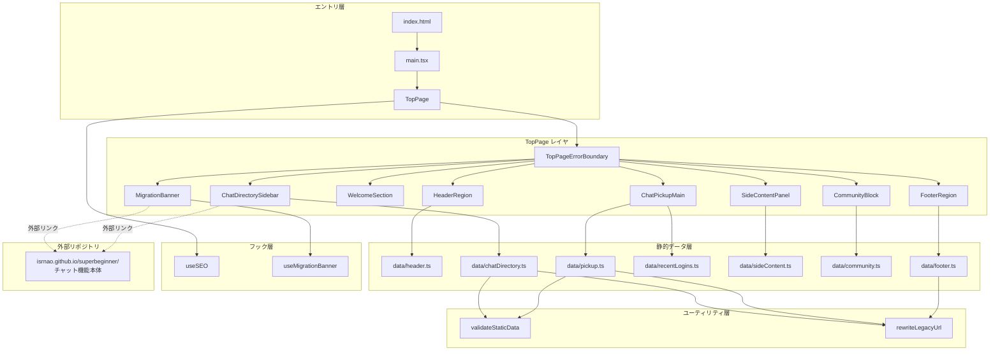

# 技術設計ドキュメント: okiraku-chat-top-page

## 概要

`yui-chat-ts` リポジトリは本改訂をもって**純粋な静的トップページ専用のリポジトリ**として再定義される。公開 URL (`https://isrnao.github.io/yui-chat-ts/`) はレガシーサイト「お気楽チャット」(`docs/お気楽チャット - チャットで友達探し＆仲間作り.htm` / web.archive.org 由来) と同一の見た目・情報構造を持つ新規トップページ (`TopPage`) のみを提供する。

既存のチャット機能 (`EntryForm` / `ChatRoom` / `ChatLogList` / `ChatRanking` ほか) は別リポジトリ (`https://isrnao.github.io/superbeginner/`) へ移管済み/移管予定であり、本リポジトリには**存在しない前提**で設計する。したがって本仕様にルーティングは存在せず、環境変数による分岐もない。GitHub Pages は単一の `index.html` を返すだけの静的ホスティングとして扱う。

### 設計方針

- **完全静的ページ**: ルーティングなし、クライアントサイドルータなし、SSR/SSG なし。Vite の標準 SPA ビルド (`vite build`) が `dist/` に出力する `index.html` / JS 1 本 / CSS 1 本 / 画像アセット群をそのまま GitHub Pages で配信する。
- **リポジトリ境界の明確化**: チャット機能関連の JS/TS コードは本リポジトリに入れない。超初心者チャット等への導線はすべて外部リンク (`https://isrnao.github.io/superbeginner/`) として提供する。
- **見た目の忠実性**: レガシー HTML の DOM 構造・セクション順・文言・配色・人数バッジ表現をできる限りそのまま復元する。`<table>` レイアウトは使用せず、CSS Grid/Flexbox とセマンティック HTML (`<header>`, `<nav>`, `<main>`, `<aside>`, `<footer>`) で再構築する。
- **データ駆動**: 繰り返し要素 (9 個のディレクトリブロック、6 個のピックアップブロック、4 個のフッターブロック、7 項目サイドパネル等) を型付き TypeScript モジュールに切り出し、JSX は反復描画のみを担う。これによりレガシー HTML との整合性を単体テストで検証可能にする。
- **広告・アーカイブ排除**: レガシーサイトに存在した Google AdSense (`show_ads.js`) / Urchin 解析 (`urchin.js`) / Ruffle SWF / `web.archive.org` 経由のスクリプト・リンク・画像ドメインを一切使用しない。
- **移管導線の維持**: 超初心者チャットへの導線 (Superbeginner_URL) を左カラム先頭と移管告知バナーの 2 箇所で明示的に提供し、既存ユーザーの迷子を防ぐ。`localStorage` に閉鎖フラグを記録して 2 回目以降は非表示化する。
- **アクセシビリティ**: レガシーサイトに欠けていたランドマーク・`aria-label`・見出し階層・コントラスト比を WCAG 2.1 AA 相当まで引き上げる。

### 非目標

- 既存 `ChatRoom` / `EntryForm` / `ChatLogList` / `ChatRanking` 等のコードファイル自体の別リポジトリへの移管作業。移管は別仕様で扱い、本仕様はその完了後の状態 (= 本リポジトリに `src/features/chat/**` が存在しない状態) を前提とする。
- ランタイムでの参加人数取得・Twitter 埋め込み・Vururu プロフィール API 連携は行わない (すべて静的プレースホルダーとして描画)。
- React Router / TanStack Router 等のルーティングライブラリの導入。そもそもルートが 1 つしかないため不要。
- Server-Side Rendering / Static Site Generation 専用ツール (Next.js 等) の導入。Vite の SPA ビルドが吐き出す静的成果物で十分。
- `/chat` など副次パスの扱い。本リポジトリは単一ページのみを提供する。

### 前提条件 (リポジトリ分離)

本設計は以下のリポジトリ状態を前提とする。本仕様の完了判定時にも以下を満たしていることを確認する:

- `yui-chat-ts/src/features/chat/**` は存在しない (物理的に削除済み、もしくは `tsconfig.json` の `exclude` と ESLint の `ignorePatterns` により本ビルドから完全に除外されている)。
- `yui-chat-ts/src/App.tsx` は存在しないか、または `<TopPage />` を返すだけの薄い関数コンポーネントに置き換えられている。
- `yui-chat-ts/src/main.tsx` は `TopPage` コンポーネントを直接マウントしている (後述)。
- 本リポジトリ側に残存する共通ユーティリティ (`useSEO` 等) は `src/shared/**` に移動済みで、TopPage が参照できる。

仮に `src/features/chat/**` を物理削除せず一時的に残置する場合は、以下の切り離し措置を取ることで lint/typecheck/build に悪影響を与えない状態を保つ:

```jsonc
// tsconfig.json (抜粋)
{
  "exclude": ["src/features/chat/**", "dist", "node_modules"],
}
```

```js
// eslint.config.js (抜粋)
{
  ignores: ['src/features/chat/**'];
}
```

ただし推奨は物理削除である。

## アーキテクチャ

### 全体構成



ルーティング判定層が存在しないため、`main.tsx` から `TopPage` までは一直線にマウントされる。

### レイヤ構成とファイル配置

| レイヤ                   | 役割                                                      | 新規/変更ファイル                                       |
| ------------------------ | --------------------------------------------------------- | ------------------------------------------------------- |
| エントリ                 | `#root` に `<TopPage />` をマウント                       | `src/main.tsx` (変更)                                   |
| ページコンポーネント     | トップページ全体のランドマーク組み立て                    | `src/features/top/TopPage.tsx` (新規)                   |
| セクションコンポーネント | 8 つの領域別 UI                                           | `src/features/top/components/*` (新規)                  |
| 共通 UI                  | ルームエントリ / 人数バッジ / 外部リンク / Error Boundary | `src/features/top/components/RoomEntry.tsx` ほか (新規) |
| 静的データ               | ナビ / ディレクトリ / ピックアップ / フッター等           | `src/features/top/data/*.ts` (新規)                     |
| 型定義                   | セクション別のドメイン型                                  | `src/features/top/types.ts` (新規)                      |
| フック                   | SEO / 移管告知バナー                                      | `src/features/top/hooks/*.ts` (新規)                    |
| ユーティリティ           | データ検証 / URL 書き換え / バッジクラス算出              | `src/features/top/utils/*.ts` (新規)                    |
| スタイル                 | レガシー配色トークン / 3 カラム Grid                      | `src/features/top/styles/topPage.css` (新規)            |

本設計ではルーティング層およびそれに付随する `useAppRoute` フック・`LegacyChatApp` 分離・`React.lazy` チャンク分割は存在しない。

### エントリポイント (main.tsx)

`src/main.tsx` は `TopPage` を直接マウントする最小構成となる。既存 `App.tsx` は削除してよい (もしくは `<TopPage />` を返すだけのラッパとして残してもよいが、直接マウント推奨)。

```tsx
// src/main.tsx (改訂後の完全形)
import { StrictMode } from 'react';
import { createRoot } from 'react-dom/client';
import { TopPage } from '@features/top/TopPage';
import '@features/top/styles/topPage.css';

const root = createRoot(document.getElementById('root')!);
root.render(
  <StrictMode>
    <TopPage />
  </StrictMode>
);
```

- チャット機能由来の `recordVisitOncePerSession` 呼び出しは削除する。
- `App.css` も削除 (存在する場合)。
- `useSEO` は TopPage 内で呼び出されるため、ここでは何もしない。

### 静的ビルドと配信

本リポジトリは Vite の標準 SPA ビルド (`pnpm run build` → `vite build`) をそのまま使い、以下を `dist/` に出力する:

- `dist/index.html` — ルート HTML。`<div id="root"></div>` と `<script type="module" src="/assets/main-*.js">` 相当を含む。
- `dist/assets/index-*.js` — TopPage とその依存すべてをバンドルした単一 JS (コード分割なし)。
- `dist/assets/index-*.css` — TopPage CSS を含む単一 CSS。
- `dist/legacy-top/**` — `public/legacy-top/**` に同梱したプロフィール / コミュニティ / 特設画像。Vite が `public` 配下をそのまま `dist` にコピーする。
- `dist/favicon.ico` 等の既存静的アセット。

これらを既存の `.github/workflows/deploy.yml` で `actions/upload-pages-artifact@v3` → `actions/deploy-pages@v4` に渡すだけで GitHub Pages 配信が成立する。ワークフローの変更は不要 (少なくとも本仕様の範囲では不要)。GitHub Pages 側で設定する SPA フォールバック (`404.html` → `index.html`) も不要で、ルート (`/`) のみを提供する単一 HTML 配信として機能する。

### エラーバウンダリ

`TopPage` は `TopPageErrorBoundary` (React クラス Error Boundary) を用い、子ツリーで例外が投げられた場合に以下を表示する:

- テキスト: 「ページを表示できませんでした」
- ボタン: 「再読み込み」→ `window.location.reload()` を呼ぶ

既存プロジェクトは React Error Boundary を導入していないため、本仕様で `src/features/top/components/TopPageErrorBoundary.tsx` としてクラスコンポーネントを 1 つだけ追加する (React 19 でも関数コンポーネントだけでは Error Boundary を作れないため)。

### CSS アーキテクチャ

レガシーサイトの視覚トークンを CSS カスタムプロパティとして一元管理し、Tailwind CSS v4 (`@theme` ブロック / ユーティリティクラス) と併用する。

1. **グローバル theme.css は変更しない**。`src/features/top/styles/topPage.css` 内で `.legacy-top` スコープのカスタムプロパティを定義する。
2. `.legacy-top` を `TopPage` のルート要素に付与し、配下にのみレガシーパレットを適用する。本リポジトリはトップページ単独のため実質ページ全体だが、スコープを切っておくことで将来の Storybook 複数ストーリー共存にも耐える。
3. 人数バッジの色 (`uspf0`, `uspf1`, `uspf2`, `uspf3`, `acu0`) は CSS 変数 `--badge-bg-user-0` などで表現し、クラス名は `.badge--user-0` 等の BEM 風に書き換える。レガシーのクラス名 (`uspf0` 等) はデータ層では参照のため保持するが DOM には出力しない。
4. 3 カラムレイアウトは `display: grid; grid-template-columns: minmax(220px, 240px) 1fr minmax(280px, 320px);` で実装する。
5. ブレークポイントは Tailwind 4 の `md:` `lg:` を使わず、`topPage.css` 内で `@media (max-width: 1023px)` と `@media (max-width: 767px)` を用いる (見た目忠実性を優先するため、レガシー固有のレイアウト崩れをチューニングしやすい生 CSS を選択)。

#### レガシー配色トークン

Legacy_Reference_HTML の `basic.css` / `base.css` は保存されていない (リンクのみ存在) ため、配色はレガシー HTML のクラス名とレガシーサイトのスクリーンショット慣習から推定して以下のように定義する:

| トークン                                                | 値                    | 用途                        |
| ------------------------------------------------------- | --------------------- | --------------------------- |
| `--legacy-bg-page`                                      | `#ffffff`             | ページ背景                  |
| `--legacy-bg-panel`                                     | `#f8fbe8`             | セクションパネル背景 (薄緑) |
| `--legacy-text`                                         | `#333333`             | 本文                        |
| `--legacy-link`                                         | `#0066cc`             | リンク                      |
| `--legacy-link-hover`                                   | `#cc3300`             | リンクホバー                |
| `--legacy-heading-orange`                               | `#ff8800`             | h2 帯見出し                 |
| `--legacy-heading-green`                                | `#6eb82f`             | h3 左ライン見出し           |
| `--legacy-border`                                       | `#dcdcdc`             | 罫線                        |
| `--legacy-badge-user-0-bg` / `--legacy-badge-user-0-fg` | `#dddddd` / `#666666` | 人数 0 (灰色)               |
| `--legacy-badge-user-1-bg` / `--legacy-badge-user-1-fg` | `#a8e063` / `#ffffff` | 人数 1-3 (緑)               |
| `--legacy-badge-user-2-bg` / `--legacy-badge-user-2-fg` | `#f7a440` / `#ffffff` | 人数 4-7 (橙)               |
| `--legacy-badge-user-3-bg` / `--legacy-badge-user-3-fg` | `#e74c3c` / `#ffffff` | 人数 8+ (赤)                |
| `--legacy-badge-acu-0-bg` / `--legacy-badge-acu-0-fg`   | `#eeeeee` / `#888888` | Pickup の 0 人 (淡灰)       |

上記の正確な色値は、実装タスクでレガシー HTML/CSS を再確認しつつ微調整する余地を残す。設計上重要なのは「CSS カスタムプロパティとして一元定義され、`.legacy-top` スコープでのみ有効」という構造である。

## コンポーネントとインターフェース

以下、`src/features/top/` 配下のモジュール群。コンポーネントはすべて React 関数コンポーネントで Props は TypeScript で厳密に型付けする。

### 1. `TopPage.tsx` (ルート)

```typescript
export function TopPage(): JSX.Element;
```

責務:

- `useSEO` を呼び `<title>` / `description` / `keywords` / `canonical` / OG タグを設定 (Requirement 12)
- `<TopPageErrorBoundary>` で全体を包む (Requirement 1.4)
- 子コンポーネントをランドマーク順に並べる (Requirement 11.1)
- CSS クラス `legacy-top` をルート `<div>` に付与

```tsx
<TopPageErrorBoundary>
  <div className="legacy-top">
    <MigrationBanner />
    <HeaderRegion />
    <main role="main" id="main-content">
      <WelcomeSection />
      <div className="legacy-top__grid">
        <ChatDirectorySidebar />
        <ChatPickupMain />
        <SideContentPanel />
      </div>
      <CommunityBlock />
    </main>
    <FooterRegion />
  </div>
</TopPageErrorBoundary>
```

### 2. `MigrationBanner`

責務: 超初心者チャットの移管告知バナー (Requirement 16.5, 16.6)。

- `useMigrationBanner()` フックから `isVisible` / `dismiss` を受け取る。
- `isVisible === false` のときは何もレンダリングしない。
- 表示内容:
  - テキスト: 「超初心者チャットは https://isrnao.github.io/superbeginner/ へ移動しました。」
  - 「開く」リンク (Superbeginner_URL, 外部リンク属性)
  - 「閉じる」ボタン (aria-label="移管告知を閉じる")

### 3. `HeaderRegion`

責務: ロゴ + Guide_Menu + Primary_Nav + Tab_Nav。

```tsx
<header className="legacy-top__header">
  <div className="legacy-top__logo">
    <h1>
      <a href="/">お気楽チャット - チャットで友達探し＆仲間作り</a>
    </h1>
  </div>
  <nav aria-label="ガイドメニュー" className="legacy-top__guide-menu">
    <ul>{guideMenu.map(renderNavLink)}</ul>
  </nav>
  <nav aria-label="メインナビゲーション" className="legacy-top__primary-nav">
    <ul>{primaryNav.map(renderNavLink)}</ul>
  </nav>
  <nav aria-label="チャット種別タブ" className="legacy-top__tab-nav">
    <ul>{tabNav.map(renderNavLink)}</ul>
  </nav>
</header>
```

- `renderNavLink` は `current: true` の項目に `aria-current="page"` と `.is-active` クラスを付与する。
- データは `data/header.ts` から import (Requirement 2.2-2.5)。
- 「チャット」項目のリンク先はルートパス (`/`) もしくは Superbeginner_URL に設定する (本リポジトリはトップページ単独のため `/` を指すことでページ内トップへ戻る挙動となる)。

### 4. `WelcomeSection`

責務: ページ見出し + 2 段落のウェルカムメッセージ (Requirement 3)。

- 段落内の「チャット」を `<strong>` で強調する位置はデータ層で事前に分割した配列 (`WelcomeParagraphSegment[]`) で表現し、JSX 側では単純にマップ描画する。

### 5. `ChatDirectorySidebar`

責務: 9 個の `ChatCategoryBlock` を縦方向に並べる (Requirement 4)。

```tsx
<aside aria-label="チャットディレクトリ" className="legacy-top__sidebar-left">
  {chatDirectory.map((block) => (
    <ChatCategoryBlockView key={block.id} block={block} />
  ))}
</aside>
```

内部コンポーネント:

- `ChatCategoryBlockView` — `<section>` + `<h3>` + キャッチコピー `<p>` + `<ul>` (エントリリスト)
- `RoomEntry` — `<li>` + `<a>` (ExternalLink) + `<UserCountBadge>` + 任意の注記 (例: 「※期間限定」)

左カラム先頭 (「初心者チャット」ブロックの最初のエントリ) のリンク先は Superbeginner_URL に差し替える (Requirement 4.5, 16.1)。

### 6. `ChatPickupMain`

責務: 中央カラム全体 (Requirement 5)。

- 見出し「注目のチャット ピックアップ」(`<h2>`)
- `RecentLoginList` — 10 件の入室ログ (`data/recentLogins.ts`)
- `PickupBlockView` × 6 — `data/pickup.ts` の各要素
- `ProfileSampleSection` — Vururu プロフィール説明 + 16 件のサンプルプロフィールグリッド (4×4)。画像は `public/legacy-top/profile/{id}.png` に事前配置。画像 `onError` 時は画像要素を `display:none` にし `alt` テキストのみ表示 (Requirement 5.8)

### 7. `SideContentPanel`

責務: 右カラム 7 ブロック (Requirement 6)。

- `@chat_aのつぶやき` — プレースホルダー `<li>ツイート読み込み中…</li>` を 1 件描画。外部スクリプトは読み込まない (Requirement 6.2, 15.3)。
- `つぶやき／ブックマーク` — 自作の共有リンク (`intent/tweet` / `sharer.php` / `b.hatena.ne.jp/entry/`) を `share-links.ts` で生成 (Requirement 6.3)。
- `詩集／待ち合わせ／壁紙` — レガシーと同名の 2 リンク。
- `特設コーナー` — プレースホルダーテキスト (画像は配置しないか、あるいは `public/legacy-top/special/rosenmembers_s.jpg` を同梱)。
- `応援してくれる方／ご協力者の方へ` — `<textarea>` に HTML スニペットを初期値設定。`onClick` / `onFocus` で `event.currentTarget.select()` を呼ぶ (Requirement 6.5, 6.6)。
- `チャットのルール・マナー` — 5 箇条 `<ul>`。
- `チャットの使い方` — 6 箇条 `<ul>`。
- レガシーの AdSense (`gad336x280`) は**レンダリングしない** (Requirement 6.9, 15.3)。

### 8. `CommunityBlock`

責務: 4 カード横並び (Requirement 7)。データは `data/community.ts`。カード内容はカード画像 + `<h3>` + 説明。Viewport_Mobile で 1 列に変形する。

### 9. `FooterRegion`

責務: 4 ブロック + コピーライト + Yahoo カテゴリ (Requirement 8)。データは `data/footer.ts`。

### 10. 共通コンポーネント

- `ExternalLink.tsx` — `<a href="..." target="_blank" rel="noopener noreferrer">children</a>`。`href` は `rewriteLegacyUrl(raw)` を通して `https://` を優先する。
- `UserCountBadge.tsx` — `userCount: number | null` と `variant: 'uspf' | 'acu'` から CSS クラスを算出。`null` のときは `` の代わりに「※期間限定」等の注記テキストを描画できるよう `children` を受け付ける。
- `TopPageErrorBoundary.tsx` — クラスコンポーネント。`componentDidCatch` で `console.error` し、フォールバック UI を描画。

### 11. フック

`useMigrationBanner.ts`:

```typescript
export function useMigrationBanner(): {
  isVisible: boolean;
  dismiss: () => void;
};
```

- 初期化時に `localStorage.getItem('yui-top:migration-banner-dismissed')` を参照し、`"true"` なら `isVisible=false`。
- `dismiss()` で `localStorage.setItem(..., 'true')` して `isVisible=false` に遷移。
- SSR 安全のため `typeof window === 'undefined'` ガード付き (本プロジェクトは Vite SPA だが Storybook 環境で暗黙に呼ばれるケースを考慮)。

`useSEO.ts`:

- 既存 `src/shared/hooks/useSEO.ts` を流用する (チャット機能 `features/chat/**` 以外で定義されているため、リポジトリ分離後も残る想定)。
- TopPage 側から `title` / `description` / `keywords` / `canonical` / OG メタを引数で与える。
- `features/chat/hooks/usePageView` 等チャット機能依存のフックは使用しない。

本設計では `useAppRoute` フック・`LegacyChatApp` コンポーネント・`VITE_ENABLE_LEGACY_CHAT_ROUTE` 環境変数は**存在しない**。

### 12. `main.tsx` / `App.tsx` の扱い

本改訂後の推奨構成:

- **`App.tsx` を削除する**。チャット機能の初期化 (`preloadCriticalResources` / `earlyDataFetch` / `useChatLog` / `useParticipants` / `useLookSound` 等) は本リポジトリでは不要になる。
- **`main.tsx` から `<TopPage />` を直接マウントする** (上記「エントリポイント」節の完全形を参照)。

これにより静的 import グラフは `main.tsx` → `@features/top/TopPage` → その依存のみとなり、`@features/chat/**` が import されないことが構造的に保証される (Requirement 16.2 の静的な読み替え: 「ルートパス表示時に `ChatRoom` / `EntryForm` を import しない」は、リポジトリから物理的に存在しなくなるため自明に満たされる)。

## データモデル

### 型定義 (`src/features/top/types.ts`)

```typescript
/** 外部リンク URL (http/https または相対パス) */
export type ExternalUrl = string;

/** ウェルカムメッセージ用: 平文 or strong 強調フラグ */
export type WelcomeParagraphSegment =
  | { kind: 'text'; value: string }
  | { kind: 'strong'; value: string };

export interface WelcomeParagraph {
  id: string;
  segments: WelcomeParagraphSegment[];
}

/** 人数バッジ種別 */
export type BadgeVariant = 'uspf' | 'acu';

/** 部屋エントリ 1 件 */
export interface ChatRoomEntry {
  /** 一意キー */
  id: string;
  /** ルーム名 (表示文字列) */
  label: string;
  /** 遷移先 */
  href: ExternalUrl;
  /** 参加人数。null は取得不能/静的値なし (例: 「※期間限定」) */
  userCount: number | null;
  /** バッジ種別 */
  badgeVariant: BadgeVariant;
  /** バッジ代替ノート (userCount が null の場合の表示) */
  note?: string;
  /** target=_blank を付けるか (デフォルト true) */
  external?: boolean;
}

/** ディレクトリの 1 ブロック (左カラム) */
export interface ChatCategoryBlock {
  id: string;
  /** セクション見出し */
  title: string;
  /** キャッチコピー (h3 下の p) */
  tagline: string;
  /** レガシー CSS クラス名 (スタイリング参照用。DOM には使わない) */
  legacyClass: string;
  /** ルーム一覧 */
  entries: ChatRoomEntry[];
  /** レガシーの <h3> に付くサブリンク (例: [モニタ] リンク) */
  titleSideLink?: { label: string; href: ExternalUrl };
}

/** ピックアップの 1 ブロック (中央カラム) */
export interface PickupBlock {
  id: string;
  title: string;
  tagline: string;
  legacyClass: string;
  entries: ChatRoomEntry[];
  /** 「XXXについて詳しく見る」リンク */
  more: { label: string; href: ExternalUrl };
}

/** 最新入室ログ 1 件 */
export interface RecentLogin {
  id: string;
  roomLabel: string;
  roomHref: ExternalUrl;
  userName: string;
  timestamp: string; // "2012-11-07 10:18:49" のような静的文字列
}

/** サンプルプロフィール 1 件 */
export interface ProfileSample {
  id: string; // Vururu プロフィール ID を元にした文字列
  name: string; // 空文字許容 (レガシーに空 <p></p> 存在)
  imageSrc: string; // 相対パス (例: "/legacy-top/profile/3950.png")
  href: ExternalUrl;
}

/** ナビリンク 1 件 */
export interface NavLink {
  id: string;
  label: string;
  href: ExternalUrl;
  legacyClass: string;
  /** 現在ページに対応するか (aria-current="page") */
  current?: boolean;
  /** external=true のとき target=_blank を付与 */
  external?: boolean;
}

/** 右カラム: テキスト箇条 1 件 */
export interface TextListItem {
  id: string;
  label: string;
  href?: ExternalUrl;
}

/** 右カラム全体 */
export interface SideContentData {
  opinionTweets: { id: string; text: string }[];
  socialShareBase: { title: string; url: string };
  bbsLinks: TextListItem[];
  specialContent: { imageAlt: string; description: WelcomeParagraphSegment[] };
  supporterSnippet: string; // <textarea> 初期値
  rules: TextListItem[];
  tutorial: TextListItem[];
}

/** コミュニティカード 1 件 */
export interface CommunityCard {
  id: string;
  title: string;
  description: string;
  imageSrc: string;
  imageAlt: string;
  href: ExternalUrl;
}

/** フッター 1 ブロック */
export interface FooterBlock {
  id: string;
  /** 複数見出し + リストの組み合わせに対応 */
  sections: {
    heading: { label: string; href?: ExternalUrl };
    links: TextListItem[];
  }[];
}
```

### 静的データモジュール

#### `data/header.ts`

```typescript
export const GUIDE_MENU: NavLink[] = [
  {
    id: 'faq',
    label: 'チャットのFAQ・よくある質問',
    href: 'https://www.okiraku-chat.com/faq/',
    legacyClass: 'faq',
    external: true,
  },
  {
    id: 'tutorial',
    label: 'チャットの使い方',
    href: 'https://www.okiraku-chat.com/tutorial/',
    legacyClass: 'tutorial',
    external: true,
  },
  {
    id: 'rule',
    label: 'チャットのルール・マナー',
    href: 'https://www.okiraku-chat.com/rule/',
    legacyClass: 'rule',
    external: true,
  },
  {
    id: 'profile',
    label: 'プロフィール作成',
    href: 'https://vururu.jp/',
    legacyClass: 'profile',
    external: true,
  },
  {
    id: 'contact',
    label: 'コンタクト',
    href: 'https://www.okiraku-chat.com/contact/crm/',
    legacyClass: 'contact',
    external: true,
  },
];

export const PRIMARY_NAV: NavLink[] = [
  { id: 'home', label: 'チャット', href: '/', legacyClass: 'home', current: true },
  {
    id: 'ranking',
    label: 'ランキング',
    href: 'https://www.okiraku-chat.com/ranking/',
    legacyClass: 'ranking',
    external: true,
  },
  // ... 以下 9 項目、Legacy_Reference_HTML 同順
];

export const TAB_NAV: NavLink[] = [
  { id: 'chat', label: 'チャット', href: '/', legacyClass: 'chat', current: true },
  {
    id: 'chugakusei',
    label: '中学生チャット',
    href: 'https://www.okiraku-chat.com/chugakusei-chat/',
    legacyClass: 'chugakusei_chat',
    external: true,
  },
  // ... 以下 7 項目
];
```

#### `data/chatDirectory.ts`

Legacy_Reference_HTML の `#chat-block-must-left` 配下 9 ブロックを忠実に移植する。URL は `rewriteLegacyUrl` を通して `https://web.archive.org/web/...` プレフィックスを除去し、元のサイト URL (`http://chat.studio.cx/o-cha/...` など) を保持する。その後 `http://` は `https://` 試行し、HTTPS が入手不能な旧ドメインは `http://` のまま残す (Requirement 13.3)。

ブロック順と代表ルームの抜粋 (完全な一覧は実装タスクで `docs/お気楽チャット - チャットで友達探し＆仲間作り.htm` を正本として写経):

| #   | blockId     | title            | 代表的な entries.id / label                                                                       | 備考                                                                              |
| --- | ----------- | ---------------- | ------------------------------------------------------------------------------------------------- | --------------------------------------------------------------------------------- |
| 1   | `beginners` | 初心者チャット   | `superbeginner`=超初心者チャット, `hajime`=初めましてチャット, `ofall`=みんなのチャット           | `superbeginner` の href のみ `Superbeginner_URL` に上書き (Requirement 4.5, 16.1) |
| 2   | `gakusei`   | 学生チャット     | 小学生, 中学生, 中学生3, 小・中学生, 大学生, 受験生 (`userCount: null`, note="※期間限定"), 高校生 | 7 件                                                                              |
| 3   | `nendai`    | 年代別チャット   | 20代, 30代                                                                                        | 2 件                                                                              |
| 4   | `fairytale` | メルヘンチャット | 花火大会, おみくじ, メルヘン1, メルヘン2, プチ, ギャル, ホッシーと秘密の部屋                      | 7 件。`titleSideLink` に「モニタ」リンク                                          |
| 5   | `anime`     | アニメルーム     | アニメ, リボーン, モンスターハンター, 銀魂, ローゼンメイデン                                      | 5 件                                                                              |
| 6   | `area`      | 地域別ルーム     | 関東, 北海道・東北, 東海, 関西, 中・四国, 九州・沖縄                                              | 6 件                                                                              |
| 7   | `hobby`     | 趣味別ルーム     | ダンス, 旅行, 音楽, ダーツ, サッカー, 卓球                                                        | 6 件                                                                              |
| 8   | `offkai`    | オフ会ルーム     | 社会人サークル, カラオケ, カラオケ2, スポーツ, 星ぞら, お昼寝, 牡蠣フライ                         | 7 件。`userCount: null` (元々バッジなし)                                          |
| 9   | `frontier`  | 歴史的チャット   | VIP, 元祖カラフル, まったり, わいわい, 元祖常連, 元祖20代, 30代以上, 美人, 2ショット              | 9 件                                                                              |

すべての `userCount` はレガシー HTML 上の `<span class="uspfN">N人</span>` の数値を静的値として反映する (時系列依存の外部 API 呼び出しは行わない)。

#### `data/pickup.ts`

| #   | blockId       | title            | entries 件数 | 備考                           |
| --- | ------------- | ---------------- | ------------ | ------------------------------ |
| 1   | `chugakusei`  | 中学生チャット   | 4            | `acu` バッジ                   |
| 2   | `shougakusei` | 小学生チャット   | 4            | `acu` バッジ                   |
| 3   | `koukousei`   | 高校生チャット   | 4            | `acu` バッジ                   |
| 4   | `narikiri`    | なりきりチャット | **20**       | `uspf` バッジ。Requirement 5.6 |
| 5   | `daigakusei`  | 大学生チャット   | 4            | `acu` バッジ                   |
| 6   | `shakaijin`   | 社会人チャット   | 4            | `acu` バッジ                   |

各ブロックには `more` (例: `{label: '中学生チャットについて詳しく見る', href: 'https://www.okiraku-chat.com/chugakusei-chat/'}`) を付与する。

#### `data/recentLogins.ts`

Legacy_Reference_HTML の `#chat-checkin-all` に存在する 10 件をそのまま静的配列化する。各項目は `{roomLabel, roomHref, userName, timestamp}` を含む。

#### `data/sideContent.ts`

レガシーの `#opinion-idx` / `#social-media` / `#specialcontents` / `#linkguide` / `#rule` / `#tutorial` を `SideContentData` 1 オブジェクトにまとめる。

- `opinionTweets`: 1 件のプレースホルダー `{ id: 'placeholder', text: 'ツイート読み込み中…' }`。
- `socialShareBase`: `{ title: 'お気楽チャット - チャットで友達探し＆仲間作り', url: 'https://isrnao.github.io/yui-chat-ts/' }` — `share-links.ts` がこのオブジェクトから `intent/tweet` 等の URL を生成する。
- `bbsLinks`: `[{id: 'shishuu', label: 'お気楽チャット詩集掲示板', href: ...}, {id: 'machiawase', label: 'チャット待ち合わせ掲示板', href: ...}]`
- `supporterSnippet`: `'<a href="https://isrnao.github.io/yui-chat-ts/" target="_blank">お気楽チャット - チャットで友達探し＆仲間作り</a>'`
- `rules`: 5 箇条。
- `tutorial`: 6 箇条。

#### `data/community.ts`

4 カード: プロフィール作成 (Vururu), 美人チャット, オフ会ならC-Dream, 頼むから重力に従ってくれ (レガシーの `community-scroll`)。画像は `public/legacy-top/community/{id}.gif` を同梱する。

#### `data/footer.ts`

4 ブロック: 「チャット」「中学生/小学生/高校生/大学生/社会人チャット」「なりきりチャット/プロフィール」「オフ会」。各ブロックは `sections[]` を持ち、2 ブロック目と 3 ブロック目は複数見出しを含む。

### ユーティリティ

#### `utils/rewriteLegacyUrl.ts`

```typescript
/**
 * レガシー URL を現行サイトで使える形に正規化する。
 * - "https://web.archive.org/web/{ts}/http://example.com/path" → "http://example.com/path"
 * - "http://example.com/path" → "https://example.com/path" (※下記 KNOWN_HTTPS_HOSTS に含まれるホストのみ)
 * - それ以外の http:// は "http://" のまま返す
 * - 既に https:// / 相対パス / mailto: / tel: はそのまま返す
 */
export function rewriteLegacyUrl(raw: string): string;
```

- `KNOWN_HTTPS_HOSTS` は `['www.okiraku-chat.com', 'vururu.jp', 'twitter.com', 'chugakusei-chat.com', 'shougakusei-chat.com', 'koukousei-chat.com', 'daigakusei-chat.com', 'shakaijin-chat.com', 'chanari.com', 'bijin-chat.com', 'www.cdream.co.jp', 'ma-jan.cdream.co.jp', 'maajan.jp']` を想定。
- `web.archive.org/web/...` で始まる URL を検出し、タイムスタンプ以降を抽出して元のアドレスに復元する正規表現: `^https?:\/\/web\.archive\.org\/web\/\d+(?:\w*)?\/(.+)$`。復元後の URL をさらに `rewriteLegacyUrl` に再帰的に通す。
- `chat.studio.cx` は HTTPS が存在しないため `http://` のまま保持する。

#### `utils/userCountStyle.ts`

```typescript
export function badgeClassName(userCount: number | null, variant: BadgeVariant): string;
```

- `userCount === null` → `'badge badge--none'`
- `variant === 'uspf'`: 0 → `badge--user-0`, 1..3 → `badge--user-1`, 4..7 → `badge--user-2`, 8+ → `badge--user-3`
- `variant === 'acu'`: 0 → `badge--acu-0`, 1..3 → `badge--acu-1`, 4..7 → `badge--acu-2`, 8+ → `badge--acu-3`

レガシー HTML 上の `uspf0/uspf1/uspf2/uspf3` クラスは実データ (0 人/1 人/2 人/4 人/5 人/6 人/8 人) を観察すると概ね上記の閾値に合致する。閾値は本設計で明示的に定め、ユーティリティテストで検証する (Requirement 9.3)。

#### `utils/validateStaticData.ts`

```typescript
export function validateStaticData<
  T extends { id: string; href?: string; label?: string; entries?: unknown[] },
>(items: readonly T[], context: string): void;
```

Requirement 17.2-17.3 に対応。各アイテムについて以下を検証し、不正があれば `Error(` + "`" + `${context}: <理由>; id=<id>` + "`" + `)` を throw する:

- `id` は空文字でない文字列
- `items` 内で `id` が一意である
- `label` (または `title`) が存在する場合は空文字でない
- `href` が存在する場合は `https?://` で始まるか、または `/` で始まる相対パスである
- `entries` が存在する場合は再帰的に検証する

#### `utils/shareLinks.ts`

```typescript
export function twitterIntent(base: { title: string; url: string }): string;
export function facebookSharer(base: { title: string; url: string }): string;
export function hatenaEntry(base: { title: string; url: string }): string;
```

- Twitter: `https://twitter.com/intent/tweet?text=<encoded title>&url=<encoded url>`
- Facebook: `https://www.facebook.com/sharer/sharer.php?u=<encoded url>`
- はてなブックマーク: `https://b.hatena.ne.jp/entry/<url without scheme>`

### データ検証の実行タイミング

`validateStaticData` は 2 箇所で呼び出される:

1. **モジュール評価時 (開発ビルドのみ)**: `import.meta.env.DEV === true` のとき、`data/chatDirectory.ts` / `data/pickup.ts` / `data/header.ts` / `data/footer.ts` の末尾で即時実行。不正データがあれば起動時にクラッシュし、開発者が早期に検知できる。
2. **単体テスト**: `TopPage.staticData.test.ts` で全データ配列を再検証 (Requirement 17.4)。

本番ビルド (`import.meta.env.PROD`) では検証をスキップしてランタイムコストを 0 にする。

## Correctness Properties

_A property is a characteristic or behavior that should hold true across all valid executions of a system — essentially, a formal statement about what the system should do. Properties serve as the bridge between human-readable specifications and machine-verifiable correctness guarantees._

本機能のほとんどの受け入れ基準はレガシー HTML との構造一致 (例示テストで担保) やビジュアル忠実性 (Storybook / Chromatic で担保) に属する。一方で以下のユーティリティ・共通コンポーネント・静的データには、入力多様性が意味を持つ純粋なロジックが存在し、プロパティベーステスト (fast-check) で最も効果的に検証できる。

本改訂では、旧設計にあった以下 2 Property を Correctness Properties から除外する:

- **旧 Property 7 (`useSEO` 冪等性)**: 本リポジトリはルーティング廃止により TopPage が単一マウント 1 回のみの静的ページとなる。マウント/アンマウントを繰り返す実コンテキストが消滅するため、Property ベーステストの現実的価値が低下する。`useSEO` の契約は例示ベースの単体テスト (「同一引数で 2 回呼んでも `document.head` 上の `<meta name="description">` が 1 個」) に格下げする。
- **旧 Property 11 (移管告知バナーの単調性)**: `useMigrationBanner` の状態遷移は「初期 visible → dismiss 後は常に invisible」という単純な 2 状態 1 方向のみで、入力多様性が低い。任意の操作列に対する不変条件テストは、例示テスト 3 件 (初回表示 / dismiss で非表示 / localStorage 保存) で十分にカバーできるため、例示ベースに格下げする。

残る 9 Property は引き続き有効であり、以下に再掲する。

### Property 1: ナビリンク配列の描画順序保存

_For any_ `NavLink[]` 入力に対し、`HeaderRegion` (あるいは共通の `NavLinkList`) が描画する `<li>` の `textContent` 列は入力配列の `label` 列と順序まで完全に一致する。

**Validates: Requirements 2.2, 2.3, 2.4**

### Property 2: `ExternalLink` のセキュア属性付与

_For any_ 文字列 `href` が `http://` または `https://` で始まり自ドメイン (`isrnao.github.io`) 以外のオリジンを指すとき、`<ExternalLink href={...} />` が描画する `<a>` 要素は `target="_blank"` かつ `rel` 属性に `noopener` と `noreferrer` の両トークンを含む。また同ドメイン内リンク (`/` で始まる相対パス) に対しては `target="_blank"` を付与しない。

**Validates: Requirements 4.6, 8.4, 13.1, 13.2**

### Property 3: 共有リンク生成の round-trip

_For any_ 非空文字列 `title` と URL 文字列 `url` に対し、`twitterIntent({title, url})` / `facebookSharer({title, url})` / `hatenaEntry({title, url})` が返す各 URL は `new URL(result)` でパース可能であり、そのクエリ文字列またはパスセグメントを `decodeURIComponent` した結果が元の `title` と `url` をそれぞれ含む。

**Validates: Requirements 6.3**

### Property 4: 人数バッジクラス算出の閾値契約

_For any_ 非負整数 `n` と `variant ∈ {'uspf', 'acu'}` に対し、`badgeClassName(n, variant)` は以下の決定表に従う:

- `n === 0` → `'badge badge--{variant}-0'`
- `1 <= n <= 3` → `'badge badge--{variant}-1'`
- `4 <= n <= 7` → `'badge badge--{variant}-2'`
- `n >= 8` → `'badge badge--{variant}-3'`

また `n === null` に対し `'badge badge--none'` を返す。関数は副作用を持たず、同じ入力に対し常に同じ結果を返す。

**Validates: Requirements 9.3**

### Property 5: 画像要素の `alt` 必須

_For any_ `ProfileSample[]` / `CommunityCard[]` を入力として `ProfileSampleSection` および `CommunityBlock` を描画したとき、描画結果 DOM 内のすべての `` 要素は `alt` 属性を持つ (装飾目的の場合は `alt=""`、意味のある画像は空でない文字列)。

**Validates: Requirements 11.3**

### Property 6: 見出し階層の連続性

_For any_ `TopPage` の描画結果 DOM に対し、ドキュメント順に収集した見出しレベル列 `L = [l1, l2, ..., lk]` は以下を満たす:

- `l1 === 1` (最初は `<h1>`)
- `l_{i+1} - l_i <= 1` (隣接見出しレベル差は 0 または +1、スキップなし)

**Validates: Requirements 11.6**

### Property 7: `rewriteLegacyUrl` の仕様と冪等性

_For any_ 文字列 `raw` に対し、`f = rewriteLegacyUrl` は以下を満たす:

- (a) **アーカイブ除去**: `raw` が `/^https?:\/\/web\.archive\.org\/web\/\d+(?:\w*)?\//` にマッチするなら、`f(raw)` はそのプレフィックスを除去した URL (さらに HTTPS 書き換えを再適用した結果) を返し、`f(raw)` は `'web.archive.org'` を部分文字列として含まない。
- (b) **HTTPS 昇格**: `raw` が `http://<host>/...` で `host` が `KNOWN_HTTPS_HOSTS` に含まれるなら、`f(raw)` は `https://<host>/...` を返す。
- (c) **保持**: `raw` が `http://` で `host` が `KNOWN_HTTPS_HOSTS` に含まれない場合、`f(raw)` は入力をそのまま返す。
- (d) **無変更**: `raw` が `https://` / `/` / `mailto:` / `tel:` / 空文字で始まるなら、`f(raw)` は入力と完全一致する。
- (e) **冪等性**: 任意の `raw` に対し `f(f(raw)) === f(raw)`。

**Validates: Requirements 13.3, 13.4**

### Property 8: `validateStaticData` の契約

_For any_ 配列 `items: T[]` に対し、`validateStaticData(items, context)` は以下を満たす:

- **受理**: すべての要素が次を満たすとき throw しない:
  - `id` が非空文字列で配列内で一意
  - `label` (または `title`) が存在する場合は非空文字列
  - `href` が存在する場合は `https?://` で始まるか `/` で始まる相対パス
  - `entries` が存在する場合は再帰的に同条件を満たす
- **拒否**: 上記のいずれかを破る要素が 1 つでも存在するとき、`Error` を throw し、エラーメッセージに `context` と破綻要素の `id` を含む。

**Validates: Requirements 14.3, 14.4, 17.2, 17.3**

### Property 9: プロフィール画像の遅延ロード

_For any_ `ProfileSample[]` を入力として `ProfileSampleSection` を描画したとき、描画結果 DOM 内のすべての `` 要素は `loading="lazy"` 属性を持つ。

**Validates: Requirements 15.2**

## Error Handling

### レンダリング時例外 (Requirement 1.4)

- **検知点**: `TopPageErrorBoundary` (React クラス Error Boundary)
- **挙動**: `componentDidCatch(error, info)` で `console.error('[TopPage]', error, info)` を呼び、state `{ hasError: true }` を `setState`。
- **フォールバック UI**: 中央寄せの簡素な `<div>` に以下を描画:
  - 見出し `<h1>ページを表示できませんでした</h1>`
  - 説明文 `<p>しばらくしてから再度お試しください。</p>`
  - `<button type="button" onClick={() => window.location.reload()}>再読み込み</button>` (44×44 px 以上のタップターゲット)

### 静的データ不整合 (Requirement 14.4, 17.3)

- **検知点**: `validateStaticData`
- **開発環境** (`import.meta.env.DEV`): `Error` を throw してビルド/起動時にクラッシュさせる。エラーメッセージ例: `"[chatDirectory] duplicate id detected; id=beginners"`。
- **本番環境** (`import.meta.env.PROD`): 検証をスキップ。ただし React の `key` 重複警告が出ないよう、`TopPage` 内の `map` は `id` に加えて `entryIndex` をフォールバック付きのキーとして使用する: ``key={`${block.id}::${entry.id || entryIndex}`}``。

### プロフィール画像読み込み失敗 (Requirement 5.8)

- `ProfileSample` コンポーネントは `` を使用。
- `handleError(e)`: `e.currentTarget.style.display = 'none'` を呼び、画像アイコンを非表示化。`<p>` の名前テキストは表示し続ける。
- 既に名前 `<p>` が空文字のサンプルに対しても、alt テキストが視覚的にフォールバックとして見える CSS (`.profile-sample__name:empty::before { content: attr(data-fallback); }`) を用意することを推奨 (実装タスクで判断)。

### `localStorage` アクセス失敗

- `useMigrationBanner` 内で `localStorage` 参照は `try/catch` で包み、プライベートブラウジング・SSR・Storybook 環境での例外を握りつぶす (例外時は既定値 `isVisible=true` を返す)。

本改訂ではルーティング判定が存在しないため、旧設計にあった「ルーティングフォールバック (Requirement 16.4)」のエラー処理は不要になった。GitHub Pages が任意の URL で単一 `index.html` を返すため、パスに関わらず TopPage が描画される。

## Testing Strategy

### 全体方針

本機能は以下の 3 層で品質を担保する:

1. **プロパティベーステスト (fast-check)** — 上記 9 個の Correctness Properties を直接検証。純粋関数・共通コンポーネント・静的データの普遍的性質を 100 イテレーション以上で網羅する。
2. **例示ベースユニットテスト (Vitest + @testing-library/react)** — レガシー HTML との構造・文言・順序一致、および静的 DOM 検証。移管告知バナーの挙動や `useSEO` の冪等性もここでカバーする。
3. **ビジュアル回帰テスト (Storybook + Chromatic)** — Viewport 依存レイアウト・配色・余白・ホバー状態などの視覚忠実性を 3 breakpoint (desktop / tablet / mobile) で確認。

### プロパティベーステスト

- **ライブラリ**: `fast-check` (既に `devDependencies` に導入済み)
- **実行回数**: 各 property につき最低 100 iterations。`fc.assert(fc.property(...), { numRuns: 100 })` を明示する。
- **タグ**: 各テストに以下コメントを付与する。

  ```typescript
  // Feature: okiraku-chat-top-page, Property 1: ナビリンク配列の描画順序保存
  it('describes the property in human terms', () => {
    fc.assert(
      fc.property(/* arbitrary */, (input) => { /* assertion */ }),
      { numRuns: 100 },
    );
  });
  ```

- **配置**: `src/features/top/__tests__/properties/*.test.ts` に各プロパティ 1 ファイルずつ。ヘルパ (DOM 生成・mock localStorage) は `src/features/top/__tests__/testUtils.ts` に共通化。

#### プロパティ → 実装対応

| Property                     | テスト対象モジュール                        | 主な arbitrary                                                                       |
| ---------------------------- | ------------------------------------------- | ------------------------------------------------------------------------------------ |
| 1. 順序保存                  | `NavLinkList` (`HeaderRegion` が内部で使用) | `fc.array(fc.record({id, label, href, legacyClass}))`                                |
| 2. ExternalLink セキュア属性 | `ExternalLink`                              | `fc.oneof(fc.webUrl(), fc.constant('/'), fc.constant('/chat'))`                      |
| 3. 共有リンク round-trip     | `shareLinks.ts`                             | `fc.record({title: fc.string({minLength:1}), url: fc.webUrl()})`                     |
| 4. バッジクラス契約          | `userCountStyle.ts`                         | `fc.oneof(fc.nat(100), fc.constant(null))` × `fc.constantFrom('uspf','acu')`         |
| 5. img alt                   | `ProfileSampleSection` / `CommunityBlock`   | `fc.array(fc.record<ProfileSample>({...}))`                                          |
| 6. 見出し階層                | `TopPage` フル描画                          | N/A (データ駆動ではないが、実データに対しランタイム検証)                             |
| 7. rewriteLegacyUrl 仕様     | `rewriteLegacyUrl.ts`                       | 手組 arbitrary (`buildArchiveUrl`, `buildHttpUrl`, `buildHttpsUrl`, `buildRelative`) |
| 8. validateStaticData        | `validateStaticData.ts`                     | 正常データ / 注入された不正データ両方                                                |
| 9. img lazy                  | `ProfileSampleSection`                      | `fc.array(fc.record<ProfileSample>({...}))`                                          |

### 例示ベースユニットテスト

- **DOM 一致テスト** (`TopPage.structure.test.tsx`):
  - `getByRole('banner')` `getByRole('main')` `getByRole('contentinfo')` が存在する。
  - `GUIDE_MENU` / `PRIMARY_NAV` / `TAB_NAV` の label 列がレガシー期待値と一致する (配列リテラル比較)。
  - `ChatDirectorySidebar` の 9 ブロック見出しがレガシーと一致、各ブロックのエントリ件数が期待通り。
  - `ChatPickupMain` の 6 ピックアップブロック順と `narikiri` ブロックのエントリ件数 20。
  - `Footer` の 4 ブロック、コピーライト文字列、Yahoo リンクの href。
- **レガシー排除テスト** (`TopPage.legacy-removal.test.tsx`): 本改訂でも引き続き有効。
  - `document.querySelectorAll('script[src*="show_ads"]').length === 0`
  - `document.querySelectorAll('script[src*="urchin"]').length === 0`
  - `container.innerHTML.includes('web.archive.org') === false`
  - `container.querySelectorAll('audio[autoplay], video[autoplay]').length === 0`
- **チャット機能分離の静的検証** (`TopPage.repoBoundary.test.ts`): 新規。リポジトリ分離の完了条件を自動テストで担保する (旧バンドルサイズ/React.lazy チャンク分離テストの置き換え)。
  - `grep -r` 相当の処理で `src/` 配下に `from '@features/chat` / `from '../chat` / `from 'src/features/chat'` など chat 機能への import が 1 件も存在しないことを確認する。
  - 実装例: Vitest から `fs.readdirSync` + 正規表現スキャン、もしくは `madge` / `dependency-cruiser` のようなライブラリ無しでも `import` 静的スキャンで十分。
  - 本テストは「`features/chat/**` ファイル自体が存在しないこと」と「TopPage から chat への import が 0 件であること」の両方をスモークテストで確認する。
- **`useSEO` 単体テスト** (`useSEO.test.tsx`): 旧 Property 7 の代替。
  - TopPage を 2 回連続でマウント/アンマウントし、`document.head` の `meta[name="description"]` / `link[rel="canonical"]` がそれぞれ 1 件であることを確認。
- **textarea 全選択** (`SupporterSnippet.test.tsx`): `fireEvent.click` で `selectionStart=0`, `selectionEnd=value.length`。
- **MigrationBanner 表示/dismiss** (`MigrationBanner.test.tsx`): 旧 Property 11 の代替。
  - (1) 初回マウントで文言と閉じるボタンが表示される。
  - (2) 閉じるボタン押下で文言が消える。
  - (3) `localStorage.getItem('yui-top:migration-banner-dismissed') === 'true'`。
  - (4) localStorage に 'true' を事前設定した状態でマウントすると最初から非表示。
- **Legacy HTML 静的参照一致** (`staticData.golden.test.ts`): `data/chatDirectory.ts` / `data/pickup.ts` / `data/footer.ts` を goldens (JSON ファイル) と比較。goldens は `docs/お気楽チャット - チャットで友達探し＆仲間作り.htm` から手動抽出した期待値の snapshot。

本改訂では旧設計にあった `useAppRoute` のテスト (4 ケース) は削除する。`useAppRoute` フックそのものが存在しないため。

### ビジュアル回帰テスト (Storybook)

- `TopPage.stories.tsx` に以下の Story を用意する:
  - `Default` (desktop 1280×800)
  - `Tablet` (viewport 900×1200)
  - `Mobile` (viewport 375×812)
  - `WithMigrationBanner` (localStorage 未設定)
  - `MigrationBannerDismissed` (localStorage に dismissed フラグ)
- Chromatic 差分で視覚確認する。CSS カスタムプロパティの色トークン変更は差分に現れる。

### アクセシビリティテスト

- `jest-axe` は現状未導入。本仕様では `@testing-library/react` + `document.querySelectorAll` で以下を検証:
  - 全 `<a>` が 3:1 以上のコントラストを持つ CSS クラスを使用していること (CSS ソース検索)
  - 全 `` が `alt` を持つこと (Property 5)
  - 見出し階層が単調増加 +1 以下 (Property 6)
  - `<nav>` が `aria-label` を持つこと
- 手動テスト項目: スクリーンリーダー読み上げ (VoiceOver / NVDA)、キーボードタブ移動、フォーカスリング視認性。

### パフォーマンステスト

- Lighthouse CI は既存 `package.json` の `lighthouse` スクリプトを使用。
- 目標値: LCP < 2.5s, CLS < 0.1, TBT < 200ms。実測はビルド後の `vite preview` + Lighthouse で行う。
- ビルドサイズの観点: 本改訂ではルート JS 1 本・CSS 1 本の静的成果物のみを出力する。コード分割 (`React.lazy`) は存在しないため、バンドルサイズ検証は「ルート JS の gzipped サイズが閾値以下である」という単純なアサーションで十分。実装タスクで具体的な閾値を決定する (目安: 150KB gzipped 以下)。

### テスト実行

- `pnpm test` (Vitest run): プロパティ + 例示ユニットを一括実行。
- `pnpm storybook` + `pnpm chromatic`: ビジュアル回帰。
- `pnpm typecheck` + `pnpm lint`: 型とスタイル。

## Requirements との整合

本改訂はユーザー指示「トップページは静的ページとして管理すべきです。ルーティングやチャット機能とは切り離して実装可能ですか」に基づき、ルーティング層とチャット機能を本リポジトリから完全に切り離す方針を採る。この結果、既存 `requirements.md` の以下の箇条は**本設計では適用外**となる。

| 要件                                                                                  | 扱い               | 理由                                                                                                                                                                   |
| ------------------------------------------------------------------------------------- | ------------------ | ---------------------------------------------------------------------------------------------------------------------------------------------------------------------- |
| Requirement 1.3 (`/chat` パスの非表示とリンク提供)                                    | 本設計では適用外   | ルーティング自体が存在せず、GitHub Pages は任意のパスで単一 `index.html` を返す。`/chat` という副次パスを扱う契約を本リポジトリは持たない。                            |
| Requirement 16.2 (ルートパスで `ChatRoom` / `EntryForm` を import しない)             | **形を変えて適用** | リポジトリ分離により `features/chat/**` が物理的に存在しないため自明に成立。静的検証テスト (`TopPage.repoBoundary.test.ts`) で「import が 0 件であること」を担保する。 |
| Requirement 16.3 (`VITE_ENABLE_LEGACY_CHAT_ROUTE=true` で `/chat` に代替ルートを維持) | 本設計では適用外   | 環境変数による分岐は廃止。`VITE_ENABLE_LEGACY_CHAT_ROUTE` は参照しない。                                                                                               |
| Requirement 16.4 (同環境変数未設定で `/chat` をトップページにフォールバック)          | 本設計では適用外   | 同上。GitHub Pages のフォールバック挙動により結果的に全パスで TopPage が表示されるが、これは本設計の明示的契約ではない。                                               |

### 引き続きスコープに残る要件

以下は本設計で引き続き担保される:

- Requirement 1.1, 1.2, 1.4 (単一ページ描画 / チャット機能非共存 / 例外フォールバック)
- Requirement 2-15 (ヘッダー / ウェルカム / 3 カラム / コミュニティ / フッター / 視覚忠実 / レスポンシブ / アクセシビリティ / SEO / 外部リンク / 静的データ / パフォーマンス)
- Requirement 16.1 (超初心者チャット誘導)
- Requirement 16.5, 16.6 (移管告知バナーと localStorage 永続化)
- Requirement 17 (テスト容易性)

### 要件書側の書き換え提案

本設計の方針に合わせて `requirements.md` の以下 4 箇条は、**別途ユーザー確認の上で書き換える**ことを推奨する。本設計ドキュメントではこの書き換え自体は行わず、提案のみ残す。

1. Requirement 1.3 を削除するか、「任意のパスでアクセスされてもトップページが表示される (GitHub Pages の単一ファイル配信挙動)」と書き換え。
2. Requirement 16.2 を「`src/features/top/**` 配下から `src/features/chat/**` への import が存在しない (リポジトリ分離が完了している)」に書き換え。
3. Requirement 16.3 / 16.4 を削除。

## 設計上の主要決定と根拠

| 決定                                                                                        | 根拠                                                                                                                        | トレードオフ                                                                                                           |
| ------------------------------------------------------------------------------------------- | --------------------------------------------------------------------------------------------------------------------------- | ---------------------------------------------------------------------------------------------------------------------- |
| **React Router を使わない** (本改訂ではルート自体が 1 つしかない)                           | ページは単一の静的トップページのみ。ルーティングライブラリは完全に不要。                                                    | 将来副次ページを追加する際はルーティング基盤の再導入が必要 (そのときに判断する)                                        |
| **`main.tsx` から直接 `<TopPage />` をマウント** (`App.tsx` 削除)                           | 静的 import グラフを最短化し、チャット機能への依存を構造的に排除する。                                                      | 既存 `App.tsx` を参照していたコードがあれば追随修正が必要 (本リポジトリでは `main.tsx` のみ)                           |
| **チャット機能のリポジトリ分離を前提とする** (本リポジトリに `features/chat/**` を残さない) | `yui-chat-ts` を純粋な静的トップページリポジトリとして再定義。関心の分離と成果物サイズの最小化。                            | 超初心者チャット側の更新が別リポジトリで必要。本仕様完了判定時にファイル存在チェックが必要。                           |
| **Vite 標準 SPA ビルド (`vite build`) をそのまま使用**                                      | 静的サイト出力として十分。SSG/SSR ツールの追加は過剰。                                                                      | `index.html` 内で初期 HTML をプリレンダしないため、JS を無効化されると白画面 (GitHub Pages のユースケースでは許容範囲) |
| **GitHub Pages 配信 (`deploy.yml`) をそのまま流用**                                         | `actions/upload-pages-artifact@v3` → `actions/deploy-pages@v4` のパイプラインは静的サイトに必要十分。ワークフロー改変なし。 | なし                                                                                                                   |
| CSS は `src/features/top/styles/topPage.css` に生 CSS で記述 (Tailwind ユーティリティ併用)  | レガシーサイトの微妙な余白・配色を Tailwind のユーティリティで全表現するのは冗長。生 CSS の方が見た目忠実化に合う           | Tailwind 中心の既存コードと書き味が混在する                                                                            |
| 静的データを `data/*.ts` に分離                                                             | Requirement 14.5 + 単体テストの goldens 比較が容易                                                                          | ブロック追加時はデータ + 型 + テスト goldens の 3 箇所更新が必要                                                       |
| `rewriteLegacyUrl` 内で `KNOWN_HTTPS_HOSTS` をハードコード                                  | 本仕様では確定的な変換表が必要 (ランタイム検出不能)                                                                         | 新ホスト追加時はコード変更が必要                                                                                       |
| `validateStaticData` を開発ビルドのみ実行                                                   | 本番の起動コストを 0 に、CI で throw を検出                                                                                 | 本番で投入される外部データには使えない (本機能は静的データのみなので問題なし)                                          |
| Error Boundary はクラスコンポーネント                                                       | React 19 時点でも関数コンポーネントだけでは Error Boundary は作れない                                                       | 既存コードベースに唯一のクラスコンポーネントが混ざる (単独 1 ファイルに隔離)                                           |

旧設計にあった「`LegacyChatApp` を `React.lazy` で分離」の決定は本改訂で**削除**する。`LegacyChatApp` 自体が存在せず、また `React.lazy` によるコード分割も不要となるため。

## レガシー HTML 正本の取扱い

本設計は `yui-chat-ts/docs/お気楽チャット - チャットで友達探し＆仲間作り.htm` (web.archive.org 由来) を正本として扱う。実装タスク段階で、データ配列を作成する際は以下の順序で作業する:

1. レガシー HTML の該当セクションを `grepSearch` / `readFile` で読む。
2. HTML の記載順 / 文言 / `href` を忠実に TypeScript 配列として写経する。
3. `href` はすべて `rewriteLegacyUrl` を通すか、事前に `web.archive.org` プレフィックスを除去した値を直接書く。
4. `staticData.golden.test.ts` の goldens JSON を更新する。

これにより、レガシーサイトの改変が生じた場合 (例: 追加ルーム) も、data モジュールと goldens を同時更新するだけで仕様整合を保てる。
