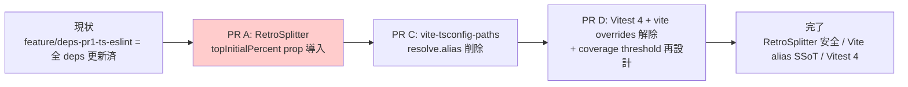

# 技術設計ドキュメント: post-deps-modernization-followup

## 概要

[[spec-deps-modernization-vite8]] の PR1 ~ PR6 を main にマージした後に残る、3 件の後処理を 1 spec で扱う:

1. RetroSplitter `top.type.name` 依存解消 (production minify 対応)
2. `vite-tsconfig-paths` 導入による path mapping SSoT 化
3. Vitest 4 移行 + coverage threshold 再設計 + `vite` overrides 解除

各 Requirement は独立に PR 化でき、独立に revert 可能であることを原則とする。

## 設計方針

- **Smallest-first, risk-ordered**: Requirement 1 (バグ修正、Surface 最小、緊急) → Requirement 2 (config 簡素化、Surface 中) → Requirement 3 (major migration、Surface 最大) の順で進める。
- **No new runtime APIs**: deps-modernization-vite8 spec の方針を継承し、React 19.2 新 API (`useEffectEvent` / `<Activity />`) や Supabase Realtime V2 metadata 等は本 spec でも採用しない。
- **Bisect-friendly**: 1 PR = 1 Requirement を原則とする (= 3 PR 構成)。Requirement 1 を最初に main に取り込めば、Req 2/3 の rebase コストが下がる。
- **Don't fight the tools**: rolldown 互換層・terser 既存設定・lint config 等、現状の決定事項は本 spec で変更しない。

## アーキテクチャ

### Implementation_PR_Sequence



- **強い順序制約**: なし (3 PR は技術的に独立)
- **推奨順序制約**: PR_A → PR_C → PR_D
  - PR_A は production バグ修正で最優先
  - PR_C は `vite.config.ts` の `resolve.alias` を削除するため、PR_D の `vite.config.ts` 更新 (`test.coverage` 設定変更) と同ファイル変更が衝突しやすい → PR_C を先に取り込む方が PR_D の rebase コストが小さい
- **完全独立**: 各 PR は他 PR をマージ前提とせず単独で動作する

### 各 Requirement の設計

#### Requirement 1: RetroSplitter `top.type.name` 依存解消

##### 現状コード

```ts
// src/features/chat/components/RetroSplitter/index.tsx
function getTopTypeName(top: ReactNode, bottom: ReactNode): string | null {
  if (top && bottom && isValidElement(top) && typeof top.type === 'function') {
    return top.type.name; // ← terser mangle で短縮されると 'ChatRoom' リテラルにマッチしない
  }
  return null;
}

function resolveInitialTopHeight(top: ReactNode, bottom: ReactNode): number {
  const name = getTopTypeName(top, bottom);
  if (name == null) return 30;
  return name === 'ChatRoom' ? 18 : 26;
}
```

`vite.config.ts` の `build.terserOptions.mangle.toplevel: true` で関数名が `r`, `e` 等に短縮されるため、production ビルドでは常に `name == null` ないし非 'ChatRoom' 扱いとなり、初期高さは `30` (case null) or `26` (case `else`) に縮退する。dev mode では関数名が保持されるため気付きにくい。

##### 採用案: (a) `topInitialPercent?: number` prop の明示

呼び出し側 (`ChatRoute.tsx`) が `entered` フラグを既に持っているため、そこから `topInitialPercent` を計算して渡すのが最も自然。

```tsx
// ChatRoute.tsx (修正後)
<RetroSplitter
  minTop={100}
  minBottom={100}
  topInitialPercent={entered ? 18 : 26}
  top={entered ? <ChatRoom .../> : <EntryForm .../>}
  bottom={...}
/>
```

```tsx
// RetroSplitter/index.tsx (修正後)
type Props = {
  top: ReactNode;
  bottom: ReactNode;
  minTop?: number;
  minBottom?: number;
  topInitialPercent?: number; // ← 新規 prop。未指定時のデフォルトは 30 (現挙動互換)
};

export default function RetroSplitter({
  top,
  bottom,
  minTop = 10,
  minBottom = 10,
  topInitialPercent = 30,
}: Props) {
  const [topHeight, setTopHeight] = useState(topInitialPercent);

  // 親で topInitialPercent が変わったら高さを巻き戻す
  useResetOnChange(topInitialPercent, setTopHeight);

  // getTopTypeName / resolveInitialTopHeight は削除
  // ...
}
```

**利点**:

- production minify と完全に独立 (関数名に依存しない)
- 既存の useResetOnChange パターンに乗れる (PR1 で導入済み)
- `RetroSplitter` の責務が「分割表示」だけになり「子コンポーネント種類を覗き見する」副次責務がなくなる
- ChanariChatPage 等の別の利用箇所があっても `topInitialPercent` を渡すだけで済む

**欠点**:

- 呼び出し側 (`ChatRoute.tsx`) に「18 / 26」のマジックナンバーが滲み出る → コメントで意図を残す
- 案 (c) (displayName 明示 + keep_fnames) と比べて他コンポーネントの React DevTools 表示改善メリットは得られない

**不採用案**:

- (b) `isChatRoom: boolean` prop: 1 bit の論理判定を親に強要するのは結合度が高い。`topInitialPercent` で値を直接渡す方が宣言的。
- (c) `displayName` + `keep_fnames`: terser の `keep_fnames` 追加で bundle size が増える可能性 (本プロジェクトで実測 +1-2KB gzip 程度の見込みだが、明確な利益は React DevTools 改善のみで、本 spec の目的に対して過剰)。

#### Requirement 2: `vite-tsconfig-paths` 導入

##### 現状

| ファイル            | 内容                                                                                 |
| ------------------- | ------------------------------------------------------------------------------------ |
| `tsconfig.app.json` | `"paths": { "@features/*": ["./src/features/*"], "@shared/*": ["./src/shared/*"] }`  |
| `tsconfig.json`     | 同上 (重複)                                                                          |
| `vite.config.ts`    | `resolve.alias: { '@features': '/src/features', '@shared': '/src/shared' }` (別表記) |

形式が二重化していて変更時に同期忘れリスクがある。Vite 公式推奨は `vite-tsconfig-paths` で tsconfig を SSoT 化する方式 (2026 主流)。

##### 変更概要

```ts
// vite.config.ts (修正後)
import { defineConfig } from 'vitest/config';
import react from '@vitejs/plugin-react';
import tsconfigPaths from 'vite-tsconfig-paths';

export default defineConfig({
  base: '/',
  plugins: [tsconfigPaths(), react()],
  // ... (resolve.alias セクションは削除)
});
```

- `tsconfigPaths()` は内部で `tsconfig.json` を読み、`compilerOptions.paths` を Vite の alias として登録する。
- `tsconfig.json` は本プロジェクトでは references を持つため、tsconfig-paths は `tsconfig.app.json` も合わせて読む (デフォルト挙動)。
- `vite-tsconfig-paths` バージョン: `^6.x` (本 spec 着手時点で 6.1.1)。peer は `vite: '*'` で Vite 8 対応。

##### Storybook 側の挙動

`vite-tsconfig-paths` plugin は `vite.config.ts` 側で登録されるため、Storybook がそれを継承する。（以前 `.storybook/main.ts` の `viteFinal` にあった `@mdx-js/rollup` の除去処理は、利用規約の MDX を削除した際に不要になり削除した。react-2026-refactoring R5.5）

#### Requirement 3: Vitest 4 + Coverage_Threshold_Strategy + Vite_Override_Cleanup

##### 現状と問題

- Vitest 3.2.4 / `@vitest/coverage-v8` 3.2.4
- `pnpm-workspace.yaml` に `overrides: { vite: ^8.0.0 }` (Vitest 3 が peer に Vite ^5||^6||^7 を要求する暫定回避)
- Vitest 4.x にすると `v8` coverage の `branches` が 48.4% を計測し、`test.coverage.thresholds.branches: 50` を割る

##### Coverage_Threshold_Strategy 選択肢

| 案                              | 内容                               | メリット                                          | デメリット                                                        |
| ------------------------------- | ---------------------------------- | ------------------------------------------------- | ----------------------------------------------------------------- |
| (a) `provider: 'istanbul'` 切替 | `@vitest/coverage-istanbul` を導入 | branches 計測値が安定 (Vitest 3 相当に戻る見込み) | 計測オーバーヘッド +10-20% / 追加 devDep                          |
| (b) 不足箇所にテスト追加        | 意味のある assertion を 1-2 件追加 | coverage が実質的に向上                           | 工数 / 「カバー率のためのテスト」アンチパターンに陥らないよう注意 |
| (c) threshold 引き下げ          | `branches: 45` 等に下げる          | 即座に対応可、追加コスト 0                        | リグレッション許容、recoverable な決定の積み残し                  |

##### 採用方針 (本 spec での第一候補)

**第一候補: (a) `istanbul` 切替**

理由:

- v8 coverage は V8 エンジン由来の bytecode カバレッジで、Vitest 4 で計測ロジックが変わったため数字が安定しない (本プロジェクトでは -2pt 程度)。
- Vitest 3 時代の数字と整合させたい (PR 前後で「カバレッジが落ちた」と見える PR を避けたい)。
- 追加 devDep 1 件 (`@vitest/coverage-istanbul`) で済み、設定変更は `provider: 'v8'` → `'istanbul'` の 1 行。
- 計測オーバーヘッドは CI のみ (`pnpm test` ローカル実行は coverage を OFF にしてもよい)。

(a) で本プロジェクトの `branches` が 50% をクリアできない場合のみ (b) または (c) にフォールバック。最終採用案と理由を本 design.md の「Coverage_Threshold_Strategy 採択結果」セクションに 1 段落で追記する (実装時 PR コミットメッセージにも明記)。

##### Vite_Override_Cleanup

```yaml
# pnpm-workspace.yaml (修正後 - overrides を削除)
packages:
  - '.'
allowBuilds: { ... }
onlyBuiltDependencies: [...]
# overrides: { vite: ^8.0.0 } を削除
```

Vitest 4 の peer dependency 範囲が `vite: ^6.0.0 || ^7.0.0 || ^8.0.0` で Vite 8 単独解決を許容するため、override は不要。削除後 `pnpm install` で `ls node_modules/.pnpm | grep ^vite@` が `vite@8.0.13` 1 件のみであることを確認する。

## コンポーネントとインターフェース

本 spec は runtime コードに新規コンポーネントを追加しない。変更対象は次の通り:

### 変更対象ファイル

| ファイル                                                                | 変更内容                                                                                                                               | 主な変更を含む Requirement |
| ----------------------------------------------------------------------- | -------------------------------------------------------------------------------------------------------------------------------------- | -------------------------- |
| `src/features/chat/components/RetroSplitter/index.tsx`                  | `topInitialPercent` prop 追加、`getTopTypeName` / `resolveInitialTopHeight` 削除                                                       | Req 1                      |
| `src/features/chat/components/RetroSplitter/RetroSplitter.test.tsx`     | 内部判定 → prop 駆動に追従するテストへ書き換え                                                                                         | Req 1                      |
| `src/routes/ChatRoute.tsx`                                              | `<RetroSplitter topInitialPercent={entered ? 18 : 26} ...>` を渡す                                                                     | Req 1                      |
| `src/features/chanari-chat/ChanariChatPage.tsx` 等 (利用箇所がある場合) | 同上                                                                                                                                   | Req 1                      |
| `vite.config.ts`                                                        | `resolve.alias` 削除 / `tsconfigPaths()` 追加 (Req 2) / `test.coverage.provider` 変更 (Req 3)                                          | Req 2, Req 3               |
| `package.json`                                                          | `vite-tsconfig-paths` 追加 (Req 2) / `vitest@^4` / `@vitest/coverage-v8` 削除 + `@vitest/coverage-istanbul` 追加 (Req 3, (a) 案採用時) | Req 2, Req 3               |
| `pnpm-workspace.yaml`                                                   | `overrides: { vite: ^8.0.0 }` 削除                                                                                                     | Req 3                      |
| `pnpm-lock.yaml`                                                        | `pnpm install` による自動更新                                                                                                          | 全 Requirement             |

### Coverage_Threshold_Strategy 採択結果

(実装時に追記。第一候補 (a) `istanbul` 切替で `branches` 50% クリアできれば確定。フォールバック時は採用案と理由を 1 段落で記録。)

## データフロー

本 spec は runtime のデータフローを変更しない。

## テスト戦略

### 各 Requirement 共通の検収

```bash
pnpm install
pnpm typecheck
pnpm lint
pnpm test            # Req 3 では coverage threshold もクリア
pnpm build
pnpm preview         # Req 1 では topHeight を実 DOM で目視
pnpm build-storybook # Req 2 では viteFinal の挙動も確認
```

### Requirement 別の追加検収

| Requirement                 | 追加検収                                                                                                                                                                                                      |
| --------------------------- | ------------------------------------------------------------------------------------------------------------------------------------------------------------------------------------------------------------- |
| Req 1 (RetroSplitter)       | `pnpm preview` で `/chat/superbeginner` を開き、(1) 未入室時 `topHeight ≈ 26%`、(2) 入室後 `topHeight ≈ 18%` を DevTools Elements の computed height で確認 (production build で minify されていることが本質) |
| Req 2 (vite-tsconfig-paths) | `ls node_modules/.pnpm` で `vite-tsconfig-paths` が 1 つだけ install されていること、`pnpm dev` で `@features/*` import が解決されること                                                                      |
| Req 3 (Vitest 4)            | `ls node_modules/.pnpm \| grep ^vite@` の出力が `vite@8.0.13` 1 件のみであること、`pnpm test --coverage` の `branches` が threshold をクリア                                                                  |

## 移行戦略

### 切り戻し方針

各 Requirement の PR は独立に revert 可能:

- **Req 1**: `RetroSplitter` の prop API 変更のみ。`topInitialPercent` を受け取らない旧 RetroSplitter にも `topInitialPercent` 渡しは無害 (TS unused prop 警告のみ)。Revert は package.json / src/ のみで完了。
- **Req 2**: `vite.config.ts` の `resolve.alias` 復活 + `vite-tsconfig-paths` 削除のみ。runtime コード変更なし。
- **Req 3**: `vitest@^4` → `vitest@^3` の downgrade + `pnpm-workspace.yaml` の override 復元 + `vite.config.ts` の coverage 設定 revert で完了。

### 衝突回避

- 推奨マージ順序: **Req 1 → Req 2 → Req 3**
- Req 2 と Req 3 は `vite.config.ts` を両方変更するため、後行 PR は先行 PR を base に rebase する
- 1 開発者が連続で進める前提なら 1 ブランチで 3 コミット積む選択肢もあるが、bisect 性を優先するなら 3 PR に分けるのが clean

## パフォーマンス目標

| 指標                                      | 計測方法                                                     | 期待値                                 | 合否判定                                                                                       |
| ----------------------------------------- | ------------------------------------------------------------ | -------------------------------------- | ---------------------------------------------------------------------------------------------- |
| `pnpm test` wall-clock (Vitest 4)         | `time pnpm test` を 3 回計測し中央値                         | Vitest 3 比で同等以上                  | なし (観測のみ)                                                                                |
| `pnpm dev` 起動時間 (vite-tsconfig-paths) | `time pnpm dev` を初回 cold start で計測                     | 変化なし (誤差以内)                    | なし (観測のみ)                                                                                |
| `dist` gzip 総 JS サイズ                  | `find dist/assets -name '*.js' -exec gzip -c {} \; \| wc -c` | 現状 138,481 bytes 比 ±2% 以内         | **合否判定あり** (Req 1 で keep_fnames を追加した場合のみ問題化、不採用方針なので原則変化なし) |
| node_modules install サイズ               | `du -sh node_modules`                                        | Vitest 4 + istanbul で +5MB 程度を許容 | なし (観測のみ)                                                                                |
