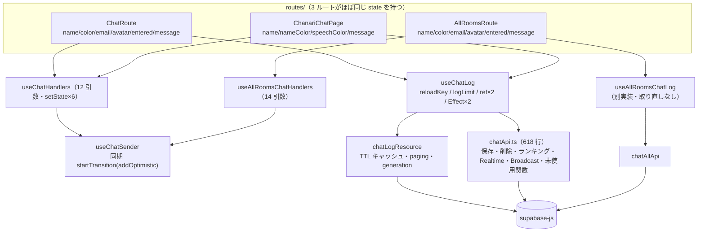
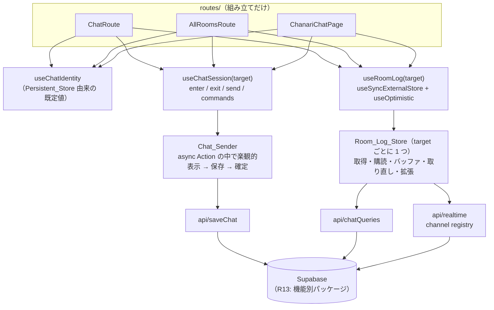
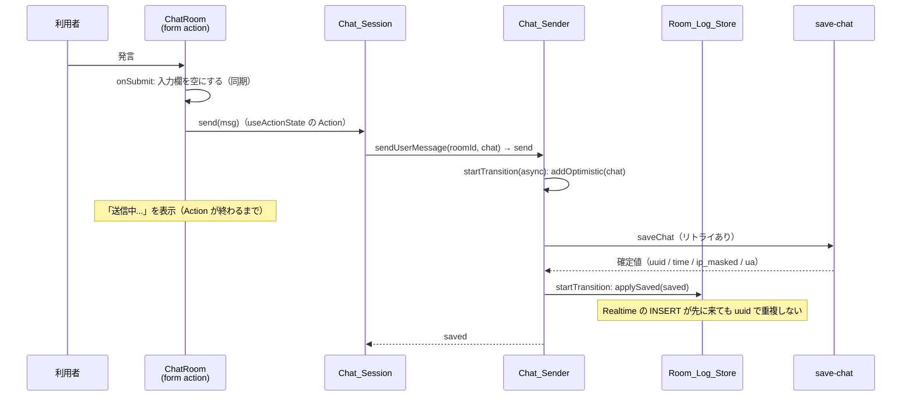
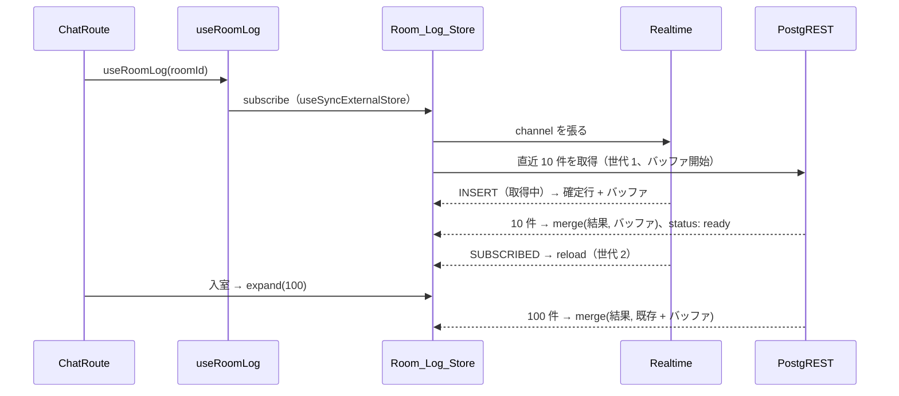

# 技術設計ドキュメント: react-2026-refactoring

## 概要

[requirements.md](./requirements.md) の 18 要件を実現するための設計。背景にある 2026 年の React の動向は
[research.md](./research.md) にまとめた。

変更は 3 層に分かれる。

1. **土台を直す（P0）**: コンパイラを実際に効かせ（R1）、楽観的更新・参加者リスト・エラー表示の不具合を直す
   （R2〜R4）。小さな差分で、効果が大きい
2. **構造を整える（P1）**: デッドコードを消し（R5）、ログの状態を外部ストアへ（R6）、セッションの処理を 1 つに
   （R7）まとめる。フォームは Actions に（R8）、永続化ストアは共通の実装に（R9）、分割バーは Pointer Events に
   （R10）揃え、lint を強化する（R11）
3. **プラットフォームに追従する（P2 / P3）**: React 19.3（R12）、初期 JS とトップの転送量の削減（R13 / R14）、
   Vite 8 の設定と SSG の API（R15）、遷移方式の決定（R16）、長いログの描画（R17）

### 設計方針

- **Async React の型に合わせる。** 非同期の操作は Action（async Transition）の中で完結させ、楽観的な表示の寿命を
  Action に結びつける。「呼び出し元がたまたま Action の中にいたから動く」状態をなくす
- **Effect で同期しない。** 外部の状態（Supabase のログ、localStorage）はストアに置き、`useSyncExternalStore` で
  読む。Effect の依存配列で取得や購読を制御しない
- **レンダーを純粋に保つ。** 時刻などの揺らぐ値は引数で渡す。コンパイラのメモ化と矛盾させない
- **コンパイラを信じる前に確かめる。** 手動メモ化を外した前提（CLAUDE.md）は、Compiler_Check が CI で守る
- **依存は増やさない。** TanStack Query などは入れず、今ある仕組みを小さくする
- **1 PR = 1 つの関心事。** 各 PR は単独で revert でき、振る舞いを変える PR と構造だけを変える PR を混ぜない

## アーキテクチャ

### 現状（before）



### 目標（after）



## コンポーネントとインターフェース

### 1. Compiler_Check（Requirement 1）

**原因。** `babel-plugin-react-compiler@1.0.0` は、分割代入のデフォルト値を処理する前に `path.isLVal()` で型を
確かめる。Babel 8 では `AssignmentPattern` が `LVal` から外れたため、この確認で落ちる
（[react/react#36868](https://github.com/react/react/issues/36868)）。`@rolldown/plugin-babel` は本リポジトリの
`@babel/core`（8.0.1）を使うので、本番ビルドでもテストでも同じように失敗している。

**対応。**

- `package.json` の devDependencies を `"@babel/core": "~7.29.7"` に固定する。`@rolldown/plugin-babel@0.2.x` の
  peerDependencies は `^7.29.0 || ^8.0.0-rc.1` なので、そのまま動く
- `useRoomCounts` の既定引数 `windowMs = 6 * 60 * 60 * 1000` を `const DEFAULT_WINDOW_MS = …` にする
  （Babel 7 でも残る 2 件のうちの 1 件。もう 1 件の ChatLogPage は R5 で削除する）
- Compiler_Check は vitest のテストとして書く（`src/test/reactCompiler.test.ts`、node 環境）

```ts
// src/test/reactCompiler.test.ts（概略）
// @vitest-environment node
import { transformSync } from '@babel/core';
import reactCompiler from 'babel-plugin-react-compiler';
import { readdirSync, readFileSync } from 'node:fs';

// Node 20 には fs.globSync がないので readdirSync の recursive で走査する
const files = readdirSync('src', { recursive: true, encoding: 'utf8' })
  .map((f) => `src/${f}`)
  .filter(
    (f) => /\.tsx?$/.test(f) && !/\.(test|stories)\.|^src\/(test|storybook)\/|\.d\.ts$/.test(f)
  );

/**
 * CompileError を出した関数が意図した opt-out か。本体の先頭に 'use no memo' があり、
 * その直前の行が理由のコメントであること。位置だけを並べた許可リストは、リストに足すだけで
 * CompileError を隠せてしまうので使わない（'use no memo' を付けてもコンパイラは CompileError を報告する）。
 */
function isDocumentedOptOut(lines: string[], fnStartLine: number): boolean {
  const body = lines.slice(fnStartLine - 1, fnStartLine + 3);
  const at = body.findIndex((line) => /^\s*['"]use no memo['"];?\s*$/.test(line));
  if (at <= 0) return false;
  return /^\s*\/\/\s*\S/.test(body[at - 1]);
}

test('src の本番コードに React Compiler がコンパイルできない関数がない', () => {
  const failures: string[] = [];
  for (const file of files) {
    const source = readFileSync(file, 'utf8');
    const lines = source.split('\n');
    transformSync(source, {
      filename: file,
      babelrc: false,
      configFile: false,
      parserOpts: { plugins: ['typescript', 'jsx'] },
      plugins: [
        [
          reactCompiler,
          {
            panicThreshold: 'none',
            logger: {
              logEvent(_f: string, e: { kind: string; fnLoc?: { start: { line: number } } }) {
                if (e.kind !== 'CompileError') return;
                const line = e.fnLoc?.start.line ?? 0;
                if (!isDocumentedOptOut(lines, line)) failures.push(`${file}:${line}`);
              },
            },
          },
        ],
      ],
    });
  }
  expect(failures).toEqual([]);
});
```

調査で使ったスクリプトでは、109 ファイルの変換が約 1.8 秒で終わった。CI の時間への影響は小さい。

**固定を外す条件**（CLAUDE.md に書く）: `babel-plugin-react-compiler` の Babel 8 対応版（#37492 か、その後継）が
リリースされ、`@babel/core` 8 で Compiler_Check が通ること。

**効果の確認。** 固定した後、ChatRoom / EntryForm / ChatLogList / RetroSplitter / Button / Input /
useChatHandlers の出力に `_c(` が入ることを `dist/` で確かめる。React DevTools の Profiler で、発言の入力中に
ChatRoute 配下で再レンダーされる範囲を記録する（R8 の前後比較の基準にする）。

### 2. Chat_Sender（Requirement 2）

楽観的な表示から保存の完了までを、Chat_Sender が自分で 1 つの async Action にする。

```ts
// features/chat/hooks/useChatSender.ts（概略）
import { startTransition } from 'react';

// useChatSender({ addOptimistic, mergeChat }) が返す send
function send(roomId: RoomId, chat: Chat, options?: SaveChatOptions): Promise<Chat> {
  return new Promise((resolve, reject) => {
    startTransition(async () => {
      addOptimistic(chat); // この Action が pending の間だけ表示される
      try {
        const saved = await saveChat(roomId, chat, options);
        // await の後は Transition の文脈が切れるので、もう一度包む（React の既知の制約）
        startTransition(() => mergeChat(saved)); // R6 以降は store.applySaved を渡す
        resolve(saved);
      } catch (error) {
        // Action の中で投げると最寄りの Error Boundary に届いてしまうので、ここで捕まえて返す
        reject(error);
      }
    });
  });
}
```

- 呼び出し元（ChatRoom の `useActionState` など）が Action の中にいる場合、React はこの Transition を外側の
  Action に束ねる。どちらの場合でも、楽観的な表示は保存が終わるまで残る
- `showOptimistic` と `saveAndMerge` を分けて呼ぶ API はなくし、`send` 1 つにする（利用者の発言は、操作 ID を
  発行して `send` を呼ぶ `sendUserMessage`）。退室の「表示を先に戻す」処理（入室状態を戻す、入力欄を空にする）は、
  `send` を呼ぶ前に同期で行う
- 保存が失敗すると、Action が終わった時点で楽観的な表示は自動で消える（R2.3）

### 3. 参加者リスト（Requirement 3）

- `getRecentParticipants(chatLog, now)` にして、関数の中で時刻を取らない
- 参加者の計算を ChatLogList から ParticipantsList に移す。ParticipantsList はすでに `useNowMinute()` を持って
  いるので、そこで `now` を得て計算する。毎分の再レンダーが ParticipantsList だけで済み、ChatLogList（最大 1000 行）
  は巻き込まない
- `useDeferredValue(chatLog)` は残す（React 19.3 で古い値のまま止まる不具合が直っている。R12）

```tsx
// ParticipantsList（概略）
export default function ParticipantsList({ chatLog }: { chatLog: Chat[] }) {
  const now = useNowMinute();
  const deferredLog = useDeferredValue(chatLog);
  const participants = getRecentParticipants(deferredLog, now); // メモ化はコンパイラに任せる
  // …
}
```

### 4. エラー表示（Requirement 4）

R6 のストアより先に出すため、PR2 では最小限の変更にする。

- `useChatLog`: 取得の Promise に `.catch` を付けて `loadError` を持つ。ChatLogList は `loadError` のとき
  「チャットログの読み込みに失敗しました。」と「再読み込み」ボタン（`reload`）を出す。R6 でストアの
  `status: 'error'` に置き換える
- EntryForm: 入室の失敗はルート（ChatRoute / AllRoomsRoute / ChanariChatPage）が持ち、`error` prop で渡す。
  入室中は EntryForm がアンマウントされ（保存を待たずにチャット画面へ切り替える）、失敗して戻ったときには別の
  インスタンスになるため、フォームの中には状態を持てない。`onSubmit` は Promise の失敗を必ず受け取る。
  localStorage への保存（`updateSettings`）は成功したときだけ行う（現行と同じ）
- ChanariChatRoom: 送信と「ログ消去」の失敗を部品の中の state で受け取り、メッセージにする
- **`useActionState` を使わない理由:** Action の中の状態更新（`setEntered(true)`、`setMessage('')`）は
  Action の終わりにまとめて反映される。入室フォームやちゃなりの送信を Action にすると、画面の切り替えや入力欄の
  クリアが保存の完了まで遅れる
- R11 の `no-misused-promises` で、async 関数を `onSubmit` などに直接渡すことを禁じる

### 5. API 層の整理（Requirement 5）

**削除するもの**（F6）:

| 対象                                                                                                                                                                                                            | 理由                                                                         |
| --------------------------------------------------------------------------------------------------------------------------------------------------------------------------------------------------------------- | ---------------------------------------------------------------------------- |
| `pages/ChatLogPage.tsx`（+ test / stories）、`hooks/usePreloadChatLogs.ts`（+ test）                                                                                                                            | どのルートからも使われていない                                               |
| `hooks/useChatRanking.ts`（+ test）                                                                                                                                                                             | ランキングはサーバー集計（useRoomRanking）に移った                           |
| `shared/components/Loader.tsx`、各 `index.ts` の barrel                                                                                                                                                         | 未使用                                                                       |
| `shared/components/TermsModal.tsx`、`Modal.tsx`、`content/terms.mdx`、`@mdx-js/*`                                                                                                                               | 未使用（Q1: 本番に戻さない）                                                 |
| chatApi の `loadChatLogsWithPaging` / `loadInitialChatLogs` / `saveChatLog` / `invalidateCacheAsync` / `loadChatLogsByTimeRange` / `clearChatLogs` / `getCacheInfo` / `prefetchChatLogs` / `getSnapshotHasMore` | 本番から呼ばれていない（prefetch は R16 で必要になったら store 側に作る）    |
| `chatAllSend.buildAllRoomsSendPayload`                                                                                                                                                                          | 未使用。`useAllRoomsChatHandlers` の中の実装と食い違っている                 |
| `uuid.ts` の `generateSecureUUIDv7` / `generateChatId` / `extractTimestampFromUUIDv7` / `generateUUIDv7Range` / `generateUUIDv7FromTimestamp` / `benchmarkUUIDGeneration`                                       | UUID はサーバーが振る。`generateOperationId` は `crypto.randomUUID()` にする |
| `fallback.ts` の `monitorNetworkStatus`                                                                                                                                                                         | 中身が空                                                                     |

**分割後の構成:**

```
features/chat/api/
  retry.ts          # retryWithBackoff(fn, { attempts, baseDelayMs, slowWarnMs })。可変のモジュール状態を持たない
  saveChat.ts       # invokeSaveChat + saveChat（リトライ・操作 ID・試行番号）
  chatQueries.ts    # fetchRecentChats(target, limit) / fetchRanking / markDeletedByName
  realtime.ts       # postgres / broadcast の channel registry（今の chatApi.ts 後半を移す）
  roomLogStore.ts   # R6
```

`chatApi.ts` と `chatLogResource.ts` は、R6 が終わった時点でなくなる。R5 の段階では、import の張り替えを伴わない
削除だけを行う（振る舞いを変えない PR にする）。

**オフラインと認証エラーの表示（Q2）。** `mockChatData` を表示する今の挙動は意図したものなので残す。

### 6. Room_Log_Store（Requirement 6）

```ts
// features/chat/api/roomLogStore.ts（インターフェース）
export type LogTarget = RoomId | 'all';

export type RoomLogState = {
  status: 'loading' | 'ready' | 'error';
  chats: readonly Chat[]; // サーバーで確定した行だけ。uuid v7 の降順
  realtime: RealtimeStatus; // 'connecting' | 'connected' | 'disconnected'
  error?: Error;
};

export interface RoomLogStore {
  subscribe(listener: () => void): () => void; // 最初の購読で取得と Realtime を開始し、最後の解除で止める
  getSnapshot(): RoomLogState; // 変化がなければ同じ参照を返す
  getServerSnapshot(): RoomLogState; // SSG と同じ { status: 'loading', chats: [], realtime: 'connecting' }
  reload(): void; // キャッシュを使わずに取り直す
  expand(limit: number): void; // 取得件数を増やす（減らさない）
  applySaved(chat: Chat): void; // 保存の確定値を合流させる
  removeOwn(name: string, roomId: RoomId): void; // clear コマンドの表示への反映
  onInsert(listener: (chat: Chat) => void): () => void; // 計測（onRealtimeChat）向け
}

export function getRoomLogStore(target: LogTarget): RoomLogStore; // target ごとに 1 つ（モジュールの Map）
```

**内部の規則**（今の `useChatLog` が Effect と ref で表している規則を、そのまま状態遷移として書く）:

| 契機                             | 処理                                                                                                          |
| -------------------------------- | ------------------------------------------------------------------------------------------------------------- |
| 最初の `subscribe`               | Realtime の channel を張る → 取得を始める（今と同じく、購読の確立を先に始める）                               |
| 取得を始める                     | 世代番号を 1 つ進め、到着バッファを空にして記録を始める                                                       |
| Realtime で INSERT               | 確定行に合流させる。取得中ならバッファにも入れる。`onInsert` のリスナーに通知する                             |
| 取得が完了（世代が最新のとき）   | 拡張のとき: `merge(結果, 既存 + バッファ)`。それ以外: `merge(結果, バッファ)`（取り直しで論理削除を反映する） |
| 取得が失敗（リトライ後）         | `status: 'error'`。表示中の行は残す                                                                           |
| `realtime` が `connected` へ遷移 | `reload()`（切れていた間の取りこぼしを埋める）                                                                |
| `expand(n)`（n > 現在の件数）    | 件数を更新して取得する（拡張として扱う）                                                                      |
| 最後の `unsubscribe`             | 1 タスク遅らせて channel を外す（StrictMode の購読 → 解除 → 再購読で channel を張り直さないため）             |

**target の違いは取得と購読のアダプタに閉じ込める:**

| 項目             | 部屋（RoomId）                             | 全部屋まとめ（`'all'`）                                |
| ---------------- | ------------------------------------------ | ------------------------------------------------------ |
| 取得             | `room_id = ?`、`deleted = false`、件数指定 | room の条件なし、論理削除も表示、既定 200 件           |
| 取得する列       | email / ua / ip_masked を含む              | email / ua を除く（個人情報の露出を防ぐ）              |
| Realtime         | `chats-postgres-${roomId}`（部屋で絞る）   | `chats-postgres-all`。payload から email / ua を落とす |
| 接続時の取り直し | する                                       | **する**（今はしていない。R6.4 で揃える）              |

**フック:**

```ts
export function useRoomLog(target: LogTarget, onRealtimeChat?: (chat: Chat) => void) {
  const store = getRoomLogStore(target);
  const state = useSyncExternalStore(store.subscribe, store.getSnapshot, store.getServerSnapshot);
  const [chats, addOptimistic] = useOptimistic(state.chats, reduceOptimisticChat);

  // 計測のコールバックは依存にしたくないので Effect Event にする
  const onInsert = useEffectEvent((chat: Chat) => onRealtimeChat?.(chat));
  useEffect(() => store.onInsert(onInsert), [store]);

  return { ...state, chats, addOptimistic, store };
}
```

- `store.subscribe` / `getSnapshot` は store ごとに固定の関数にする（毎回作ると `useSyncExternalStore` が購読を
  張り直す）
- SSG では `getServerSnapshot` が「読み込み中」を返すので、今と同じ HTML になり hydration も一致する
- React 19.3 の「非表示の `<Activity>` の中で `useSyncExternalStore` が変更を見落とす」修正（#36947）が R12 の
  Activity と組み合わせるときの前提になる。R6 と R12 のどちらを先に出しても、R12 の時点で 19.3 に上げる

`chatLogResource` の TTL キャッシュ、paging の Map、generation は、この store の世代番号と進行中の取得の共有に
置き換わる。画面遷移が全ページ読み込みである限り、ページをまたぐキャッシュは存在しないので失うものはない（F7）。
R16 でクライアントルーティングを選んだ場合も、store がモジュールに残るので、そのまま遷移をまたいで再利用できる。

### 7. Chat_Identity と Chat_Session（Requirement 7）

```ts
type ChatIdentity = { name: string; color: string; email: string; avatar: AvatarId };

// 既定値は Persistent_Store（settingsStore）から取り、編集後はローカルの値を優先する（今の useStoreBackedState と同じ）
function useChatIdentity(defaults: Partial<ChatIdentity>): {
  identity: ChatIdentity;
  update: (patch: Partial<ChatIdentity>) => void;
  entered: boolean;
};

type SessionTarget = { kind: 'room'; roomId: RoomId } | { kind: 'all'; replyTo: RoomId };

function useChatSession(args: {
  target: SessionTarget;
  identity: ChatIdentity;
  store: RoomLogStore;
  // 楽観的な表示は store ではなく useRoomLog の useOptimistic が持つので、その追加アクションを受け取る。
  // store はサーバーで確定した行だけを持つ（R6.6）。setState ではなく useOptimistic のアクション
  addOptimistic: (chat: Chat) => void;
  measurement: ConversationMeasurement;
}): {
  entered: boolean;
  enter: (opts: { silent: boolean }) => Promise<void>;
  exit: () => Promise<void>;
  send: (message: string, metadata?: ChatMetadata) => Promise<void>;
};
```

- 入室状態（`entered`）は Chat_Session が持つ。入力欄とランキングの表示（`showRanking`）はルートの UI の状態として
  残し、ルートが送信・退室の操作に合わせて自分で戻す（空でない発言を送ったら入力欄を空にしてランキングを閉じる）。
  Chat_Session には `setState` を渡さない（R7.3）
- **部屋と全部屋まとめで違う点は、今の挙動を保つ**（R7.4）。統合するときに消してしまわないよう、ここに列挙しておく:

| 項目                   | 部屋                                    | 全部屋まとめ                                     |
| ---------------------- | --------------------------------------- | ------------------------------------------------ |
| 送信先                 | その部屋                                | 返信先（`replyTo`。既定は `all`）                |
| clear の対象がない場合 | 何もせず入力欄を空にする                | 「削除対象の発言がありません」を投げる           |
| look / unlook          | 通知音 + Broadcast                      | 計測だけ（音も Broadcast もなし）                |
| metadata               | ChatRoom が作ったもの（アバター・書式） | アイデンティティのアバターと書式を足して合成する |
| analytics の `room_id` | 部屋                                    | 返信先                                           |
| ランキング             | あり                                    | なし                                             |

- ちゃなりは `target: { kind: 'room', roomId }` の Chat_Session をそのまま使い、`setShowRanking: () => {}` の
  ような穴埋めは不要になる

### 8. フォーム（Requirement 8）

```tsx
// ChatRoom（概略）
const [message, setMessage] = useState(''); // ルートから下ろしてくる
const [error, formAction, isPending] = useActionState(async (_prev: string, formData: FormData) => {
  const msg = String(formData.get('message') ?? '');
  if (!msg.trim()) return '';
  try {
    await onSend(msg, buildMetadata());
    return '';
  } catch (err) {
    return (err as Error).message || '送信エラー';
  }
}, '');

<form
  action={formAction}
  // onSubmit は action より先に同じイベントで呼ばれる。ここで空にすると保存を待たずに入力欄が空になる。
  // FormData はこの更新の反映より前に作られるので、送信する値は失われない（テストで確かめる）
  onSubmit={() => {
    onBackToChat?.();
    setMessage('');
  }}
>
```

- 入力中の値が ChatRoom の中に閉じるので、1 文字ごとの再レンダーは ChatRoom だけになる（R8.2）。R1 で ChatRoom が
  コンパイルされるようになれば、ChatRoom の中でも入力欄以外の要素は再計算されない
- 入室フォームと、ちゃなりのフォームは Action にしない（R8.4、§4 の理由）。ちゃなりの入力欄は下書きの復元と
  最後の発言の保存があるので、今のままページで持つ
- 今は送信中（`isPending`）に入力欄を無効にしている。保存が遅いと次の発言を打てないが、二重送信を防いでいるので、
  本 spec では変えない（別途検討）

### 9. Persistent_Store（Requirement 9）

```ts
// shared/utils/persistentStore.ts（概略）
export function createPersistentStore<T>(options: {
  key: string;
  parse: (raw: unknown) => T; // 不正な値は既定値にする
  defaults: T;
}): {
  subscribe(listener: () => void): () => void; // 同じタブの変更（独自イベント）と別タブの storage イベント
  getSnapshot(): T; // 生の文字列が同じなら前回と同じ参照を返す（useSyncExternalStore の無限ループを防ぐ）
  getServerSnapshot(): T; // 常に defaults
  update(patch: Partial<T> | ((prev: T) => T)): void;
};
```

- settingsStore はこの上に作り直す（公開している関数の形は変えない）
- ちゃなりの下書きは `Record<roomId, ChanariDraft>` を 1 つのストアにし、`useSyncExternalStore(subscribe, () =>
getSnapshot()[roomId])` で読む。部屋ごとの値の参照も、変化がなければ同じものを返す
- `useChanariSettings` の、roomId が変わったときに読み直す Effect と ref を同期する Effect は削除する
  （App が `key={roomId}` で再マウントしている）

### 10. RetroSplitter（Requirement 10）

```tsx
<div
  role="separator"
  style={{ touchAction: 'none' }}
  onPointerDown={(e) => {
    e.currentTarget.setPointerCapture(e.pointerId);
    setDragging(true);
  }}
  onPointerMove={(e) => {
    if (!e.currentTarget.hasPointerCapture(e.pointerId)) return;
    scheduleFrame(() => setAdjustedTopHeight(calcPercent(e.clientY)));
  }}
  onPointerUp={() => setDragging(false)}
  onLostPointerCapture={() => setDragging(false)}
  onKeyDown={onBarKeyDown}
/>
```

- ポインタをキャプチャするので、window への `mousemove` / `mouseup` の登録と、その張り替えのための
  `useCallback`（CLAUDE.md で「残す」としている例外）がなくなる
- ドラッグ中の `body` のカーソルと `user-select` は外部の DOM への同期なので、`dragging` を見る Effect に残す
- `topHeightRef` を Effect で同期しているのは、`calcPercent` をイベントの中で呼べば不要になる

### 11. 型情報を使う lint（Requirement 11）

```js
// eslint.config.js に追加する（概略）
import tseslint from 'typescript-eslint';

{
  files: ['src/**/*.{ts,tsx}'],
  ignores: ['**/*.test.*', '**/*.stories.*', 'src/test/**', 'src/storybook/**'],
  languageOptions: { parserOptions: { projectService: true, tsconfigRootDir: import.meta.dirname } },
  plugins: { '@typescript-eslint': tseslint.plugin },
  rules: {
    '@typescript-eslint/no-floating-promises': 'error',
    '@typescript-eslint/no-misused-promises': 'error',
    '@typescript-eslint/no-explicit-any': 'error',
  },
}
```

調査時点の違反（Promise 関連 17 件、`any` 2 件）の大半は R2 / R4 / R5 で消える。残ったものを PR4 で直すか、
意図的に投げっぱなしにしている箇所（`void import(...).catch(() => {})` など、すでに明示されているもの）に理由を書く。

### 12. React 19.3、Activity、ViewTransition（Requirement 12）

```tsx
// ChatRoute の下段（概略）
<Activity mode={showRanking ? 'hidden' : 'visible'}>
  <ViewTransition>
    <ChatLogList chatLog={chats} status={status} windowRows={windowRows} />
  </ViewTransition>
</Activity>
{showRanking && (
  <ViewTransition>
    <ChatRanking … />
  </ViewTransition>
)}
```

- ランキングの開閉は `startTransition(() => setShowRanking(…))` で行う。ViewTransition は Transition の更新にだけ
  反応するので、Realtime の受信（通常の更新）ではアニメーションしない（R12.5）
- **ただし送信・「更新」で閉じるときは Transition にしない。** 発言の送信は Action（非同期の Transition）なので、
  同じイベントの `startTransition` の更新は Action に束ねられ、保存が終わるまでランキングが閉じない（一時テストで
  確認: Transition だと保存の解決前は `ranking` のまま、即時の更新なら `log`）。入室フォームとチャット入力の
  切り替えも、Transition にすると入室の保存まで切り替わらないのでアニメーションしない
- 非表示の Activity の中では Effect が止まる（ParticipantsList の `useNowMinute` のタイマーも止まる）。更新は
  低優先度で裏で反映される
- **スクロール位置（R12.2a）**: 今は RetroSplitter の下段の枠がスクロールしている。Activity は DOM を残しても
  `display: none` にするので、枠のスクロール量はランキングの高さに合わせて変わってしまう。ChatLogList と
  ChatRanking がそれぞれ自分のスクロール枠を持つようにし、下段の枠は `overflow: hidden` にする
- `prefers-reduced-motion: reduce` のときは `::view-transition-group(*)` のアニメーションを止める CSS を入れる
- 19.3 では hydration のときも Strict Mode が Effect を二重に呼ぶ（#35961）。開発環境の SSG ページで、Realtime の
  channel が重複しないことを確かめる（registry の参照カウントと、R6 の遅延解除で吸収できる想定）

### 13. Supabase クライアントの軽量化（Requirement 13）

- まずスパイクで測る。`@supabase/postgrest-js`、`@supabase/realtime-js`、`@supabase/functions-js` を直接使う
  最小のクライアント（`shared/supabase/{rest,realtime,functions}.ts`）を作り、チャット系ルートの初期 JS の差を
  gzip で比べる。15 kB gz 以上減るときだけ採用する（R13.1）
- 使っていない Auth と Storage が外れる。Storage の依存である `vendor-iceberg-js`（1.6 kB gz）もなくなる見込み
- 残すべき挙動: `apikey` と `Authorization` のヘッダ、Realtime の `eventsPerSecond`、Edge Function への
  `x-chat-operation-id` / `x-chat-attempt` と New Relic の `traceparent`
- `supabaseClient.ts` のグローバルヘッダから `Accept-Encoding`（ブラウザが設定を許さないヘッダ）と
  `X-My-Custom-Header` を外す。`Content-Type: application/json` は各パッケージが自分で付けるので外す（R13.2）。
  これは採否に関係なく先に出せる

### 14. トップの参加人数（Requirement 14）

- 先に出せる変更: `buildRoomCountsUrl` の `select` から `message` を外す（R14.1）
- サーバー集計は RPC にする（期間を引数で渡せるようにするため）。トップは supabase-js を読まないので、
  今と同じく `fetch` で `/rest/v1/rpc/room_participant_counts` を呼ぶ

```sql
-- supabase/migrations/2026xxxx_room_participant_counts.sql（概略）
create or replace function public.room_participant_counts(since_ms bigint)
returns table (room_id text, participants bigint)
language sql stable security invoker as $$
  select room_id, count(distinct name)
  from public.chats
  where deleted = false
    and time >= since_ms
    and coalesce(system, false) = false
    and coalesce(metadata->>'kind', '') <> 'admin'
    -- 現行の aggregateCountsFromRows は `if (!row.name) continue` で空文字も除く
    and coalesce(name, '') <> ''
  group by room_id
$$;
```

- 一覧に出す部屋だけに絞る処理（`getListableRoomIds`）はクライアントに残す
- `security invoker` なので、呼び出しは anon の SELECT の RLS の範囲に収まる（R14.4）
- 集計が今の `aggregateCountsFromRows` と一致することを、同じ入力データで比べるテストを書く。`chat_ranking`
  ビュー（20260921000000）と同じく、必要なら `time` の部分インデックスを足す

### 15. Vite 8 の設定と SSG（Requirement 15）

- `build.rollupOptions` を `build.rolldownOptions` に改名する
- 関数形式の `manualChunks` を Rolldown の `codeSplitting` の groups（名前 + `test` の正規表現）に書き換える。
  オプションの正確な形は、実装する時点の Rolldown 1.x のドキュメントで確かめる。前後で `dist/assets` のチャンク名と
  サイズを並べて比べ、境界（vendor-react、vendor-supabase、preload-helper の分離）が変わらないことを確かめる
- minify: 今は terser（`drop_console`、`toplevel` の mangle を使っている）。Oxc で同じ設定（console の削除）が
  できることを確かめたうえで gzip の合計を比べ、差が 1% 以内なら Oxc にする（ビルドが速くなる）
- SSG は `react-dom/static` にする。`onAllReady` と `Writable` で組み立てていた部分がなくなる

```ts
// src/entry-server.tsx（概略）
import { prerenderToNodeStream } from 'react-dom/static';
import { text } from 'node:stream/consumers';

export async function render(pathname: string): Promise<string> {
  const { prelude } = await prerenderToNodeStream(
    <StrictMode>
      <App initialPathname={pathname} />
    </StrictMode>
  );
  return text(prelude);
}
```

- 移行の前後で `dist/**/index.html` の `#root` の中身を差分で比べ、同じであることを確かめる（R15.4）

### 16. 遷移方式の決定（Requirement 16）

| 観点               | A: MPA + ドキュメント間 View Transitions + Speculation Rules                     | B: クライアントルーティング + React の ViewTransition         |
| ------------------ | -------------------------------------------------------------------------------- | ------------------------------------------------------------- |
| 実装量             | 小さい（CSS 1 行 + `<script type="speculationrules">`）                          | 大きい（ルーター、リンクの差し替え、スクロールと SEO の扱い） |
| 対応ブラウザ       | View Transitions: Chromium 126+ / Safari 18.2+。Speculation Rules: Chromium のみ | すべて（アニメーションは View Transition API の対応ブラウザ） |
| 遷移のたびのコスト | JS の再評価と Realtime の再接続（WebSocket のハンドシェイク）                    | Realtime の接続を使い回せる                                   |
| SSG / SEO          | 今のまま                                                                         | 各ページの SSG は残しつつ、遷移後の meta 更新が必要           |
| 既存 spec          | top-and-transition-performance の R4 を置き換え、R5 を Speculation Rules で代替  | 同 R4 / R5 をそのまま進める                                   |

**スパイクで測るもの:** トップ → 部屋の遷移で入室フォームが操作できるまでの時間（A は prefetch あり・なし）、
Realtime が `SUBSCRIBED` になるまでの時間、それぞれの実装差分の行数。

**推奨:** まず A を入れる。変更が小さく、非対応のブラウザでは何も変わらないので、失うものがない。A を入れたうえで、
Realtime の再接続の待ちが体感を損なっていると計測で分かったときだけ B に進む。

**決定（Q3、2026-09-23）:** A を採る。top-and-transition-performance の Requirement 4（クライアントサイド遷移）は
本方式で置き換え、Requirement 5（Room_Prefetcher）のうちチャンクと HTML の先読みは Speculation Rules の `prefetch`
で代替する。

### 17. 長いログの描画（Requirement 17）

- 1 件の合流は、uuid v7 の降順に並んでいる前提で挿入位置を二分探索する。同じ uuid があれば置き換える
- 比較は `a.uuid < b.uuid` にする（ロケールを考慮する必要がない）。調査時の計測では、2000 件への合流 1 回が
  0.32 ms → 0.02 ms になる
- ChatLogList で毎回やっているソートは、入力がソート済みであることを前提にして外す
- 行数が 200 を超えるとき、各行に `content-visibility: auto; contain-intrinsic-size: auto 1.5em` を当てる

## データフロー

### 発言の送信（after）



### ログの読み込み（after）



## テスト戦略

### 単体テスト

- **Compiler_Check**（R1）: 上記のテストそのもの
- **Chat_Sender**（R2）: 実際の `useOptimistic` と組み合わせ、F2 の 3 通りで、保存の解決前に楽観的なチャットが
  表示され、失敗したら消えることを確かめる。調査で使った一時テストをもとに書く
- **getRecentParticipants / ParticipantsList**（R3）: 偽のタイマーで 4 分前の発言 → 3 分進める → 0 人
- **Room_Log_Store**（R6）: Supabase のアダプタを偽物に差し替え、上の状態遷移表の各行を 1 テストずつ書く。
  特に「取得中に届いた発言が残る」「SUBSCRIBED で取り直す」「拡張で既存を残す」「取り直しで論理削除が消える」
  「StrictMode の購読 → 解除 → 再購読で channel を張り直さない」
- **Persistent_Store**（R9）: 変化がなければ同じ参照を返す、別タブの `storage` イベントに追随する、壊れた JSON は
  既定値にする
- **RetroSplitter**（R10）: `pointerdown` → `pointermove` → `pointerup` で高さが変わる。jsdom は
  `setPointerCapture` を持たないので、テストのセットアップでスタブを用意する

### 統合テスト

- ChatRoute / AllRoomsRoute / ChanariChatPage: 入室 → 発言 → 退室を、アダプタを差し替えた store で通す。
  analytics と計測のイベント列が、リファクタリングの前後で一致することをスナップショットで比べる（R7.4）
- ChatRoom: `onSubmit` で入力欄を空にしても、送信した値が失われない（R8.3）
- EntryForm: 入室に失敗するとメッセージが出て、未処理の rejection がない（R4.2）

### ビルドの検証

- `pnpm build:prod` の前後で、`dist/assets` のチャンクの一覧と gzip サイズ、プリレンダ HTML の `#root` と
  modulePreload を比べる（R13 / R15）
- 本番ビルドの出力に、コンパイル済みのコンポーネント（`react.memo_cache_sentinel` を参照する関数）が増えている
  ことを確かめる（R1）

### 手動の確認

- タッチ端末（または DevTools のタッチのエミュレーション）で分割バーをドラッグできる（R10）
- Chrome と Safari で、ランキングの開閉と入室のアニメーション、reduced-motion のときに止まること（R12）

## 移行戦略

PR の順序は [tasks.md](./tasks.md) に書く。進め方の要点:

- **PR1（R1）を最初に出す。** 他の PR の性能の評価（再レンダーの範囲など）は、コンパイラが効いている状態で
  行わないと意味がない
- **R6 は段階的に移す。** まず `useChatLog` の中身を store に置き換え、返り値の形を保つ（ルートは変えない）。
  次の PR で呼び出し元を `useRoomLog` に移し、`useChatLog` / `useAllRoomsChatLog` / `chatLogResource` を消す
- **R7 は R6 の後。** `setChatLog` を store の操作に置き換えられるようになってから、セッションの API から
  `setState` を外す
- **振る舞いを変える PR（R2 / R3 / R4 / R12 / R14）と、構造だけを変える PR（R5 / R6 / R7 / R9 / R15）を
  分ける。** 構造の PR は既存のテストが変更なしで通ることを完了の条件にする
- 既存 spec との衝突: `vite.config.ts` は top-and-transition-performance と post-deps-modernization-followup も
  触る。R15 はそれらの進行中の PR がないことを確かめてから着手する

## パフォーマンス目標

| 指標                                           | 現状                                     | 目標                           | 関係する要件 |
| ---------------------------------------------- | ---------------------------------------- | ------------------------------ | ------------ |
| コンパイラが処理した関数                       | 55 / 73（未コンパイル 18）               | CompileError 0（opt-out 以外） | R1           |
| 発言の入力 1 文字で再レンダーされる範囲        | ChatRoute 配下（未コンパイルの子を含む） | ChatRoom の中だけ              | R1 / R8      |
| 楽観的なチャットが保存の解決前に出る経路       | 1 / 4                                    | 4 / 4                          | R2           |
| チャット系ルートの初期 JS（gzip）              | 約 153 kB                                | −15 kB 以上（採用した場合）    | R13          |
| トップの参加人数取得のレスポンス               | 最大 5000 行（本文あり）                 | 部屋の数の行                   | R14          |
| 2000 件のログへの 1 件の合流（Node 22 の計測） | 0.32 ms                                  | 0.05 ms 以下                   | R17          |

## 検討したが採らなかった案

- **TanStack Query:** キャッシュ、重複の排除、リトライは揃うが、このアプリの難しさは「Realtime の push と
  スナップショットの取得の合流」で、ライブラリの外で書くことになる。初期 JS も増える
- **Zustand などの状態管理ライブラリ:** 必要な外部ストアは 2 種類（ログと localStorage）で、
  `useSyncExternalStore` で直接書ける
- **仮想スクロール（react-window など）:** 旧チャットの見た目（全行をそのまま並べる）と相性が悪い。
  `content-visibility`（R17）で足りる
- **RSC / Next.js:** Non-Goals を参照
- **useSEO を React 19 のネイティブのメタデータに置き換える:** Non-Goals を参照
