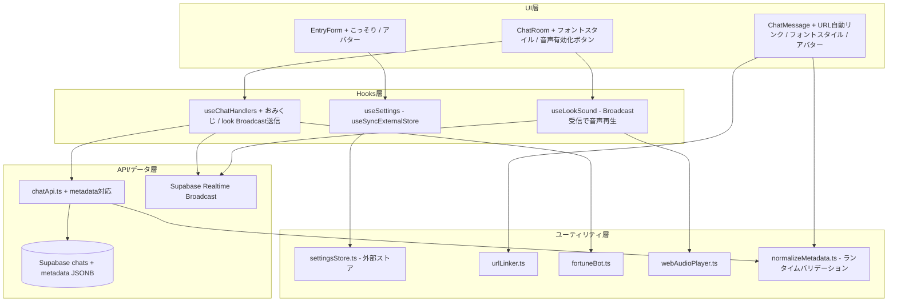
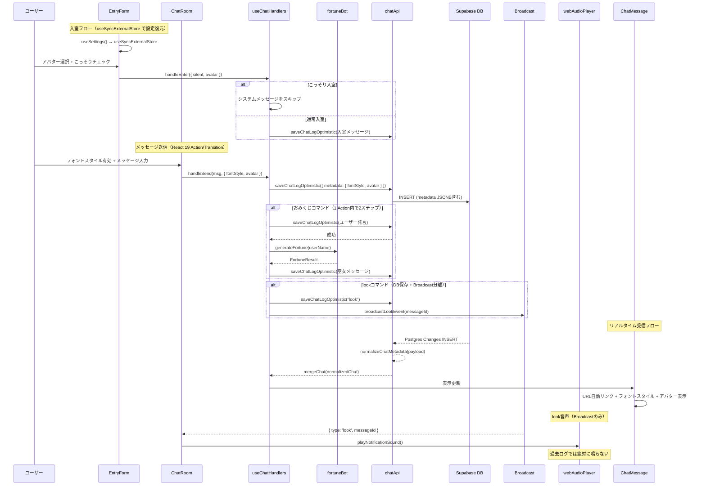

# 技術設計ドキュメント: retro-chat-enhancements (v2)

## 概要

ゆいちゃっとTS（yui-chat-ts）に、オリジナルCGIチャット（YuiChat-Pro / yuichat2）のレトロ機能群を移植する。対象は7つの機能：設定永続化、URL自動リンク化、フォントスタイル変更、こっそり入室、アバター選択、おみくじ、lookコマンド（音声通知）。

既存のReact 19 + TypeScript + Supabase + Tailwind CSS 4アーキテクチャを維持しつつ、Feature-Based Architectureの `features/chat/` 配下に新しいモジュールを追加する。

### 設計方針

- **2026年React設計**: `useSyncExternalStore` による外部ストア同期、React 19 Actions/Transition による非同期処理、Effect最小化
- **型安全性**: literal union型でDB境界・レンダリング境界を閉じる。ランタイムバリデーションでDB由来データを正規化
- **最小限のスキーマ変更**: JSONB `metadata` カラム1つ（ネスト構造）で拡張性を確保
- **クライアントサイド優先**: おみくじはサーバーラウンドトリップ不要、URL変換はレンダリング時にReactテキストノードとして描画
- **look音声の安全設計**: Supabase Realtime Broadcastで副作用を分離し、過去ログ・再接続時の重複再生を防止
- **段階的導入**: 各機能は独立しており、個別にリリース可能

## アーキテクチャ

### 全体構成の変更



### レイヤー構成の変更点

| レイヤー          | 変更内容                                                  | 新規/変更ファイル                                      |
| ----------------- | --------------------------------------------------------- | ------------------------------------------------------ |
| UI コンポーネント | EntryForm, ChatRoom, ChatMessage の拡張                   | 既存ファイルの変更                                     |
| カスタムフック    | useSettings, useLookSound 新規、useChatHandlers 拡張      | `hooks/useSettings.ts`, `hooks/useLookSound.ts` (新規) |
| ユーティリティ    | URL変換、おみくじ、音声再生、設定ストア、メタデータ正規化 | `utils/` 配下に5ファイル新規                           |
| API層             | metadata フィールド対応、Broadcast送受信                  | `api/chatApi.ts` (変更)                                |
| 静的アセット      | アバター画像、通知音                                      | `public/avatars/`, `public/sounds/`                    |

## コンポーネントとインターフェース

### 1. settingsStore.ts（useSyncExternalStore対応の外部ストア）

localStorageはReact外部の状態であるため、`useSyncExternalStore` で外部ストアとして明示的に扱う。これにより複数タブ同期やReactの並行レンダリングとの整合性を確保する。

```typescript
// src/features/chat/utils/settingsStore.ts

const STORAGE_KEY = 'yui-chat-settings';
const SETTINGS_CHANGE_EVENT = 'yui-chat-settings-change';
const SESSION_VISIT_KEY = 'yui-chat-visit-counted';

import type { AvatarId } from '../types';

export type UserSettings = {
  name: string;
  color: string;
  email: string;
  windowRows: number;
  avatar: AvatarId;
  visitCount: number;
  lastLogin: number; // Unix timestamp ms
};

export const DEFAULT_SETTINGS: UserSettings = {
  name: '',
  color: '#ff69b4',
  email: '',
  windowRows: 30,
  avatar: 'none',
  visitCount: 0,
  lastLogin: 0,
};

// useSyncExternalStore 用インターフェース
export function getSnapshot(): UserSettings;
export function getServerSnapshot(): UserSettings; // SSR安全用（常にDEFAULT_SETTINGS）
export function subscribe(callback: () => void): () => void;
export function updateSettings(partial: Partial<UserSettings>): void;

// 訪問カウント（セッション単位で1回のみ）
export function recordVisitOncePerSession(now?: number): void;
```

**設計判断**:

- `updateSettings()` 内で `window.dispatchEvent(new Event(SETTINGS_CHANGE_EVENT))` を発火し、同一タブ内の反応性を確保
- `subscribe()` は `SETTINGS_CHANGE_EVENT` と `storage` イベント（クロスタブ）の両方をリッスン
- `recordVisitOncePerSession()` は `sessionStorage` に `SESSION_VISIT_KEY` フラグを置き、1セッション1回のみ加算。React Strict Modeの二重実行に耐性あり

### 2. useSettings フック（useSyncExternalStore）

```typescript
// src/features/chat/hooks/useSettings.ts
import { useSyncExternalStore } from 'react';
import * as settingsStore from '../utils/settingsStore';

export function useSettings() {
  const settings = useSyncExternalStore(
    settingsStore.subscribe,
    settingsStore.getSnapshot,
    settingsStore.getServerSnapshot
  );
  return {
    settings,
    updateSettings: settingsStore.updateSettings,
  };
}
```

App.tsx のマウント時ではなく、`main.tsx`（React外のエントリーポイント）で `recordVisitOncePerSession()` を1回だけ呼び出す。これによりReactライフサイクルの影響を受けない。

### 3. urlLinker.ts（URL自動リンク化モジュール）

```typescript
// src/features/chat/utils/urlLinker.ts

export type MessageSegment = { type: 'text'; content: string } | { type: 'url'; href: string };

export function parseMessageSegments(message: string): MessageSegment[];
```

**設計判断**:

- HTMLとして保存せず、レンダリング時にURLを検出してReactコンポーネントとして変換
- `dangerouslySetInnerHTML` は使用しない。テキストセグメントはReactテキストノードとして描画し、Reactの標準エスケープ機構でXSSを防止
- HTML文字列の連結は行わない
- URL検出正規表現: `https?:\/\/[^\s<>"']+` で大まかに検出後、末尾の日本語句読点（`。`、`、`、`）`）やMarkdown風の `)` をtrimしてtextセグメントに戻す
- `javascript:` スキームはリンク化しない（`http://` と `https://` のみ許可）

### 4. フォントスタイル変更（literal union型 + セマンティックトークン）

ChatRoom コンポーネントにフォントスタイルのトグルと追加コントロールを追加する。型はliteral unionで閉じ、DBにはセマンティックトークンを保存する。

```typescript
// src/features/chat/types.ts に追加

export type FontSize = 1 | 2 | 3 | 4 | 5;

export const FONT_COLOR_NAMES = [
  'black',
  'gray',
  'silver',
  'white',
  'red',
  'hotpink',
  'orange',
  'gold',
  'yellow',
  'lime',
  'green',
  'aqua',
  'blue',
  'navy',
  'purple',
] as const;

export type FontColorName = (typeof FONT_COLOR_NAMES)[number];

export type FontStyleMetadata = {
  fontSize?: FontSize;
  fontColor?: FontColorName;
  bold?: boolean;
};

// セマンティックトークン → CSS値マッピング（描画時に使用）
export const FONT_COLOR_CSS: Record<FontColorName, string> = {
  black: '#000000',
  gray: '#808080',
  silver: '#c0c0c0',
  white: '#ffffff',
  red: '#ff0000',
  hotpink: '#ff69b4',
  orange: '#ff8c00',
  gold: '#ffd700',
  yellow: '#ffff00',
  lime: '#00ff00',
  green: '#008000',
  aqua: '#00ffff',
  blue: '#0000ff',
  navy: '#000080',
  purple: '#800080',
};

export const FONT_SIZE_CSS: Record<FontSize, string> = {
  1: '0.8em',
  2: '1em',
  3: '1.2em',
  4: '1.5em',
  5: '2em',
};
```

**描画方法**: Tailwind CSS 4の動的クラス名はビルド時検出に引っかからないため、フォントスタイルはinline styleで適用する。

```tsx
<span style={{
  fontSize: FONT_SIZE_CSS[metadata.fontStyle?.fontSize ?? 2],
  color: FONT_COLOR_CSS[metadata.fontStyle?.fontColor ?? 'black'],
  fontWeight: metadata.fontStyle?.bold ? 700 : undefined,
}}>
```

**アクセシビリティ注意**: white/yellowは背景色（`#a1fe9f`）とのコントラスト不足になる。レトロ再現を優先するが、将来的にtext-shadowオプションの追加を検討。

### 5. こっそり入室（Silent Entry）のスコープ明確化

Silent Entryは**入室システムメッセージの抑制のみ**を行う。以下には影響しない：

- 参加者としてのアイデンティティ（名前・色・アバター）
- メッセージ送信・退室・リロード機能
- 将来のPresence機能（Supabase Realtime Presence）

Supabase RealtimeにはBroadcast、Presence、Postgres Changesの3機能があり、将来「オンライン一覧」を実装する場合もSilent Entryの影響範囲はシステムメッセージのみに限定する。

### 6. アバター選択（literal union型 + BASE_URL対応）

```typescript
// src/features/chat/types.ts に追加

export type AvatarId =
  | 'none'
  | 'hoshi1'
  | 'hoshi2'
  | 'hoshi3'
  | 'hoshi4'
  | 'hoshi5'
  | 'hoshi6'
  | 'hoshi7'
  | 'hoshi8'
  | 'miko1'
  | 'tuki1'
  | 'tuki2'
  | 'tuki3'
  | 'tuki4';

export const AVATAR_IDS: readonly AvatarId[] = [
  'none',
  'hoshi1',
  'hoshi2',
  'hoshi3',
  'hoshi4',
  'hoshi5',
  'hoshi6',
  'hoshi7',
  'hoshi8',
  'miko1',
  'tuki1',
  'tuki2',
  'tuki3',
  'tuki4',
] as const;
```

**画像パス**: `import.meta.env.BASE_URL` を使用し、GitHub Pagesなどのbase path変更に対応。

```typescript
const avatarSrc = `${import.meta.env.BASE_URL}avatars/${avatar}.gif`;
```

metadataには `avatar?: Exclude<AvatarId, 'none'>` として保存（'none'の場合はフィールド自体を省略）。

### 7. fortuneBot.ts（おみくじ機能）

```typescript
// src/features/chat/utils/fortuneBot.ts

export type FortuneResult = {
  message: string;
  senderName: '巫女';
  color: 'hotpink';
};

export function isFortuneCommand(message: string): boolean;
// message.trim() === 'おみくじ' の場合のみtrue（前後空白を許容）

export function generateFortune(userName: string): FortuneResult;
export const FORTUNE_MESSAGES: readonly string[];
```

**エラーハンドリング方針**:

- ユーザー発言の保存に失敗した場合 → 巫女メッセージも投稿しない
- ユーザー発言が成功し、巫女メッセージの保存に失敗した場合 → サイレントに失敗（再試行しない）
- React 19のActions/Transitionパターンで、ユーザー発言→巫女応答の2ステップ送信を1つのActionとしてまとめる

### 8. lookコマンド（Supabase Realtime Broadcast設計）

**最大の設計変更点**: DBログ駆動ではなく、Supabase Realtime Broadcastで音声副作用を分離する。

**lookはmetadataに保存しない**: `look` / `unlook` は通常メッセージとしてログに残すが、`metadata` に `{ "look": true }` のようなフラグは入れない。音声再生のトリガーをDBログに依存させると、過去ログ読み込み・再接続・楽観更新で鳴る事故が起きる。将来の監査用に `metadata.command = "look"` を入れる余地はあるが、初期実装では不要。

DBログ駆動の問題点：

- 初回ロードで過去ログの `look` で鳴る
- Realtime再接続時に重複受信して鳴る
- 楽観更新とRealtime確定の両方で鳴る
- ページ復帰時に再購読して鳴る

**推奨設計**:

```
look発言時:
  1. 通常メッセージとして "look" をDB保存（chatApi経由）
  2. 同時に Supabase Realtime Broadcast で { type: 'look', messageId } を送信

音声再生:
  - Broadcast受信でのみ行う
  - 過去ログ表示では絶対に鳴らさない

unlook:
  - 通常メッセージとして "unlook" をDB保存
  - Broadcast で { type: 'unlook' } を送信
  - Broadcast受信で再生中の音声を停止
```

```typescript
// src/features/chat/hooks/useLookSound.ts

export function useLookSound(channelRef: React.RefObject<RealtimeChannel | null>): {
  isAudioEnabled: boolean;
  enableAudio: () => Promise<void>;
};
```

**Broadcastチャネル**: 既存の `chats` チャネルを共有し、Broadcastイベントを追加する。

```typescript
// chatApi.ts に追加
export function broadcastLookEvent(messageId: string): void;
export function broadcastUnlookEvent(): void;
export function onLookBroadcast(callback: (event: LookEvent) => void): () => void;
```

### 9. webAudioPlayer.ts（音声再生 + unlock UI）

```typescript
// src/features/chat/utils/webAudioPlayer.ts

export function playNotificationSound(): Promise<void>;
export function stopNotificationSound(): void;
export function isAudioUnlocked(): boolean;
export function unlockAudio(): Promise<void>;
// unlockAudio() は AudioContext.resume() を呼ぶ。ユーザーインタラクション内で呼ぶ必要がある。
```

**設計判断**:

- `AudioBufferSourceNode` は再利用不可のため、再生ごとに新しいSourceNodeを作成する
- ChatRoomに「🔔 通知音を有効にする」ボタンを表示し、初回クリックで `unlockAudio()` を呼ぶ
- 音声ファイルは `public/sounds/rin.mp3` と `public/sounds/rin.webm` に配置
- ブラウザの対応フォーマットに応じてmp3またはwebmを選択

### 10. normalizeMetadata.ts（ランタイムバリデーション）

TypeScriptの型はビルド時のみ有効。DBから返る `metadata` は信用せず、API境界で正規化する。

```typescript
// src/features/chat/utils/normalizeMetadata.ts

import type { Chat, ChatMetadata, FontSize, FontColorName, AvatarId } from '../types';
import { FONT_COLOR_NAMES, AVATAR_IDS } from '../types';

export function isFontSize(value: unknown): value is FontSize;
export function isFontColorName(value: unknown): value is FontColorName;
export function isAvatarId(value: unknown): value is AvatarId;

// DB由来のmetadataを正規化。不正値はサイレントに除去。version未対応の場合もフォールバック。
export function normalizeChatMetadata(input: unknown): ChatMetadata | undefined;

// Chat行全体を正規化するラッパー（API境界で使用）
export function normalizeChat(row: unknown): Chat;
// 内部で normalizeChatMetadata(chat.metadata) を適用
```

**API境界での適用**: chatApi.ts の `loadChatLogs()` と `subscribeChatLogs()` で `normalizeChat()` を使用する。

```typescript
// loadChatLogs() 内
const chatData = (data ?? []).map(normalizeChat);

// subscribeChatLogs() 内
callback(normalizeChat(payload.new));
```

`normalizeChat()` は `metadata` の正規化に加え、`version` フィールドの検証も行う。未知のバージョンの場合は metadata を undefined にフォールバックする。

## データモデル

### Chat 型の拡張（ネスト構造 + バージョニング）

```typescript
// src/features/chat/types.ts（変更）

export type ChatMetadata = {
  version: 1; // スキーマバージョン（将来の移行に備える）
  fontStyle?: FontStyleMetadata; // フォントスタイル設定
  avatar?: Exclude<AvatarId, 'none'>; // アバター（'none'の場合は省略）
  kind?: 'normal' | 'fortune'; // メッセージ種別（拡張分類用）
};

export type Chat = {
  uuid: string;
  name: string;
  color: string;
  message: string;
  time: number;
  client_time?: number; // ★metadataに入れない（クライアント一時状態）
  optimistic?: boolean; // ★metadataに入れない（UI制御用フラグ）
  system?: boolean; // ★既存互換として維持（metadata.kindとは別）
  email?: string;
  ip: string;
  ua: string;
  metadata?: ChatMetadata; // ★追加（ネスト構造）
};
```

**設計判断**:

1. **`version: 1`**: 将来metadataスキーマを変更する際のマイグレーション判定に使用。normalizeMetadata内でバージョンに応じた正規化ロジックを分岐できる。

2. **`kind?: 'normal' | 'fortune'`**: 既存の `system` フラグは参加者一覧やランキング除外に使われているため、そのまま維持する。`kind` は「巫女のおみくじ」「将来のbot種別」など、追加分類に使う。`system` を `metadata.kind = 'system'` に統一する破壊リスクより、共存させる方が安全。

3. **metadataに入れないもの**:
   - `client_time`: DB永続化データではなくクライアント側の一時状態
   - `optimistic`: 「送信中...」表示のUI制御用フラグ。永続化対象ではない
   - look音声再生状態: Broadcastで分離。DBログに `{ "look": true }` は不要
   - localStorage設定: 完全にクライアントローカル

4. **ネスト構造の理由**: `fontColor` と `avatar` が同じ階層にあるより、意味ごとにまとまっていた方が将来の拡張時にキー衝突しにくい。

**DB上のmetadata例**:

```json
{
  "version": 1,
  "fontStyle": { "fontSize": 3, "fontColor": "hotpink", "bold": true },
  "avatar": "miko1",
  "kind": "normal"
}
```

### Supabase テーブルスキーマの変更

```sql
ALTER TABLE chats ADD COLUMN metadata JSONB DEFAULT NULL;
```

**API層の変更は最小限**:

既存の chatApi.ts では select と insert の列を明示しているため、metadata対応は以下を足すだけ。

```typescript
// 読み込み側
.select('uuid,name,color,message,time,system,email,ip,ua,metadata')

// 保存側
const sanitized = {
  name: chat.name,
  color: chat.color,
  message: chat.message,
  system: chat.system,
  email: chat.email,
  ip: chat.ip,
  ua: chat.ua,
  metadata: chat.metadata ?? null,
};

// saveChatLogOptimistic() の select('uuid,time') はそのままでOK
// 返却時に ...chat しているので、楽観更新で持っていた metadata は維持される
return {
  ...chat,
  uuid: data.uuid,
  time: data.time,
  optimistic: false,
};

// Realtime payload には metadata が含まれる前提
// subscribeChatLogs() 内で normalizeChat() を適用
```

**追加確認事項**（実装時に対応）:

- RLS policyが `metadata` を含む INSERT/SELECT を許可しているか確認
- Supabase generated types を再生成する
- 2026年4月以降のSupabaseセキュリティデフォルト変更（public schemaのData API公開設定）を確認
- metadata に任意JSONを入れられるため、バリデーション責務はクライアントサイド（`normalizeMetadata.ts`）で担保

### UserSettings 型（localStorage）

```typescript
export type UserSettings = {
  name: string;
  color: string;
  email: string;
  windowRows: number;
  avatar: AvatarId; // literal union型
  visitCount: number;
  lastLogin: number;
};
```

### 静的アセット配置

```
public/
├── avatars/
│   ├── hoshi1.gif 〜 hoshi8.gif
│   ├── miko1.gif
│   └── tuki1.gif 〜 tuki4.gif
└── sounds/
    ├── rin.mp3
    └── rin.webm
```

## コンポーネント間のデータフロー



## 正当性プロパティ（Correctness Properties）

### Property 1: 設定の保存・復元ラウンドトリップ

*任意の*有効な UserSettings オブジェクトに対して、`updateSettings()` で保存した後 `getSnapshot()` で読み込むと、元のオブジェクトと同一の値が復元される。

**Validates: Requirements 1.1, 1.6, 5.7**

### Property 2: 訪問回数のセッション単位インクリメント

*任意の*初期訪問回数 N に対して、同一セッション内で `recordVisitOncePerSession()` を複数回呼び出しても、visitCount は N+1 のみに増加する。

**Validates: Requirements 1.4**

### Property 3: URLパース正当性

*任意の*メッセージ文字列に対して、`parseMessageSegments()` の結果は以下を満たす：

- `http://` または `https://` で始まるURLが `url` 型セグメントとして検出される
- `javascript:` スキームはリンク化されない
- URLを含まない文字列は `text` 型セグメントのみを返す
- N個のURLを含む文字列は正確にN個の `url` 型セグメントを返す
- すべてのセグメントのコンテンツを結合すると元のメッセージ文字列と一致する（ラウンドトリップ）
- 末尾の日本語句読点（。、）等）はURLに含まれずtextセグメントに分離される

**Validates: Requirements 2.1, 2.3, 2.4, 2.5**

### Property 4: メタデータのランタイム正規化

*任意の*unknown型入力に対して、`normalizeChatMetadata()` は以下を満たす：

- 有効な ChatMetadata を返すか、undefined を返す
- `fontStyle.fontSize` が FontSize (1-5) の範囲外なら除去される
- `fontStyle.fontColor` が FontColorName の15色以外なら除去される
- `avatar` が AvatarId の14種以外なら除去される
- 不正な入力でも例外をスローしない

**Validates: Requirements 3.3, 3.4, 5.4**

### Property 5: フォントスタイルの適用

*任意の*有効な FontStyleMetadata を持つ Chat オブジェクトに対して、ChatMessage のレンダリング結果のメッセージ本文要素は、指定された fontSize に対応する CSS font-size（`FONT_SIZE_CSS` マッピング）、fontColor に対応する CSS color（`FONT_COLOR_CSS` マッピング）、bold に対応する CSS font-weight を持つ。

**Validates: Requirements 3.4**

### Property 6: アバター画像の表示

*任意の*有効なアバター識別子を `metadata.avatar` に持つ Chat オブジェクトに対して、ChatMessage のレンダリング結果にはユーザー名の前に `${import.meta.env.BASE_URL}avatars/${avatar}.gif` を src とする img 要素が含まれる。

**Validates: Requirements 5.5**

### Property 7: こっそり入室

*任意の*有効なユーザー名に対して、silent=true で入室した場合、入室処理によってチャットログに「おいでやすぅ」を含むシステムメッセージが追加されない。こっそり入室は入室システムメッセージの抑制のみを行い、参加者アイデンティティやメッセージ送信機能には影響しない。

**Validates: Requirements 4.2, 4.4**

### Property 8: おみくじボットの正当性

*任意の*ユーザー名に対して、`generateFortune(userName)` の結果は以下を満たす：

- `senderName` は `'巫女'` に等しい
- `color` は `'hotpink'` に等しい
- `message` は `FORTUNE_MESSAGES` リストのいずれかの要素を含む
- `message` は `＞{userName}さん` という形式で発言者名を含む

**Validates: Requirements 6.1, 6.2, 6.3, 6.4**

### Property 9: おみくじコマンド検出

*任意の*文字列に対して、`isFortuneCommand(str)` は `str.trim()` が `'おみくじ'` に等しい場合のみ `true` を返す（前後空白を許容）。

**Validates: Requirements 6.5**

### Property 10: look音声の安全性

look音声再生は Supabase Realtime Broadcast 受信時のみ発火する。以下の場合は再生しない：

- 初回ログ読み込み時の過去 `look` メッセージ
- Realtime Postgres Changes による `look` メッセージ受信
- 楽観更新中の `look` メッセージ

**Validates: Requirements 7.2**

## エラーハンドリング

### localStorage エラー

| シナリオ                                          | 対応                                                                                             |
| ------------------------------------------------- | ------------------------------------------------------------------------------------------------ |
| localStorage が無効（プライベートブラウジング等） | `try-catch` でエラーを捕捉し、デフォルト値を使用。`getSnapshot()` は常にメモリ内キャッシュを返す |
| localStorage の容量超過                           | `QuotaExceededError` を捕捉し、警告のみ                                                          |
| 保存データのJSON解析失敗                          | デフォルト値にフォールバック。破損データは次回 `updateSettings()` で上書き                       |

### metadata カラムのエラー

| シナリオ                              | 対応                                                                |
| ------------------------------------- | ------------------------------------------------------------------- |
| metadata が null                      | `normalizeChatMetadata()` が undefined を返し、通常表示（後方互換） |
| metadata の値が不正                   | `normalizeChatMetadata()` が不正フィールドをサイレントに除去        |
| Supabase が metadata カラムを返さない | `metadata` を optional として扱い、undefined の場合は通常表示       |

### 音声再生エラー

| シナリオ                                 | 対応                                                                                                  |
| ---------------------------------------- | ----------------------------------------------------------------------------------------------------- |
| AudioContext の作成失敗                  | 音声機能を無効化し、チャット機能は継続                                                                |
| 音声ファイルの読み込み失敗               | `console.warn` で警告し、音声なしで継続                                                               |
| ブラウザの自動再生ポリシーによるブロック | ChatRoomに「🔔 通知音を有効にする」ボタンを表示。クリックで `unlockAudio()` → `AudioContext.resume()` |

### おみくじエラー

| シナリオ                 | 対応                             |
| ------------------------ | -------------------------------- |
| ユーザー発言の保存失敗   | 巫女メッセージも投稿しない       |
| 巫女メッセージの保存失敗 | サイレントに失敗（再試行しない） |

### URL パースエラー

| シナリオ             | 対応                                                              |
| -------------------- | ----------------------------------------------------------------- |
| 正規表現のマッチ失敗 | メッセージ全体をプレーンテキスト（Reactテキストノード）として表示 |
| 極端に長いURL        | 表示は切り詰めず、ブラウザのデフォルト動作に委ねる                |

## テスト戦略

### テストフレームワーク

| ツール                 | 用途                             |
| ---------------------- | -------------------------------- |
| Vitest                 | ユニットテスト・プロパティテスト |
| @testing-library/react | コンポーネントテスト             |
| fast-check             | プロパティベーステスト（PBT）    |

### PBT設定

- 各プロパティテストは最低100回のイテレーション
- タグ形式: `Feature: retro-chat-enhancements, Property {number}: {property_text}`

### テスト対象と分類

| テスト対象                                  | テスト種別                            | テスト数目安                 |
| ------------------------------------------- | ------------------------------------- | ---------------------------- |
| settingsStore.ts                            | PBT（Property 1, 2） + ユニット       | PBT 2件 + ユニット 3件       |
| urlLinker.ts                                | PBT（Property 3） + ユニット          | PBT 1件 + ユニット 5件       |
| normalizeMetadata.ts                        | PBT（Property 4） + ユニット          | PBT 1件 + ユニット 3件       |
| fortuneBot.ts                               | PBT（Property 8, 9） + ユニット       | PBT 2件 + ユニット 1件       |
| ChatMessage（フォントスタイル・アバター）   | PBT（Property 5, 6） + コンポーネント | PBT 2件 + コンポーネント 4件 |
| useChatHandlers（こっそり入室）             | PBT（Property 7） + コンポーネント    | PBT 1件 + コンポーネント 2件 |
| useLookSound + webAudioPlayer               | ユニット（Property 10）               | ユニット 4件                 |
| EntryForm（UI）                             | コンポーネント                        | コンポーネント 4件           |
| ChatRoom（フォントスタイルUI + 音声ボタン） | コンポーネント                        | コンポーネント 4件           |

### 追加テストケース（レビュー指摘分）

**URL_Linker**:

- URL末尾の日本語句読点（。、）等）がURLに含まれないこと
- 複数URLが個別にリンク化されること
- `<script>` を含むテキストがプレーンテキストとして描画されること
- `javascript:` スキームがリンク化されないこと
- `http://` と `https://` のみ許可されること

**ChatMessage**:

- XSS文字列がReactテキストノードとして描画されること
- 不正metadataが無視されること（normalizeChatMetadata経由）
- `avatar` が未設定のとき画像が出ないこと

**look音声**:

- 初回ロードの過去 `look` で鳴らないこと
- Broadcast受信の新規 `look` でのみ鳴ること
- 同じmessageIdでは一度しか鳴らないこと
- `unlook` Broadcast受信で停止すること

**settings**:

- localStorage破損JSONでデフォルト値にフォールバックすること
- localStorage unavailableでアプリが動作すること
- 同一セッションでvisitCountが二重加算されないこと

### テストファイル配置

```
src/features/chat/
├── utils/
│   ├── settingsStore.ts / settingsStore.test.ts
│   ├── urlLinker.ts / urlLinker.test.ts
│   ├── fortuneBot.ts / fortuneBot.test.ts
│   ├── webAudioPlayer.ts / webAudioPlayer.test.ts
│   └── normalizeMetadata.ts / normalizeMetadata.test.ts
├── components/
│   ├── ChatMessage/ index.tsx / ChatMessage.test.tsx
│   ├── EntryForm/ index.tsx / EntryForm.test.tsx (新規)
│   └── ChatRoom/ index.tsx / ChatRoom.test.tsx
└── hooks/
    ├── useChatHandlers.ts / useChatHandlers.test.ts (新規)
    └── useLookSound.ts / useLookSound.test.ts (新規)
```

### テスト命名規則

```typescript
describe('settingsStore', () => {
  it('任意の有効な設定を保存・復元できる（ラウンドトリップ）', () => {});
  it('同一セッション内で複数回呼んでも訪問回数は1だけ増える', () => {});
  it('localStorageが破損JSONの場合デフォルト値を返す', () => {});
  it('localStorage unavailableでもアプリが動作する', () => {});
});
```

### React設計ノート

- **React Compiler前提**: 過剰な `useMemo` / `useCallback` / `React.memo` は避ける。コンポーネントを純粋に保ち、状態の粒度を適切にする
- **ChatMessage内のURL parse**: React Compilerが自動メモ化するため、手動 `useMemo` は初期段階では不要。パフォーマンス問題が出た場合のみ追加
- **metadata正規化**: API境界（chatApi.ts）で済ませ、コンポーネント側では正規化済みデータを信頼する
