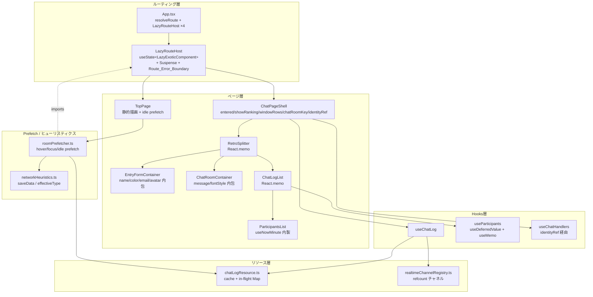
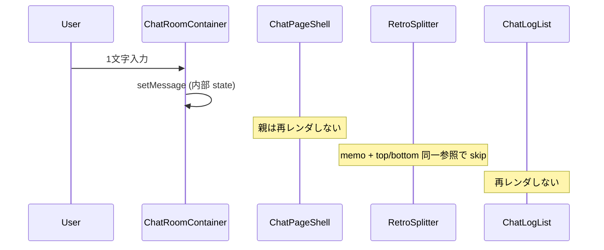
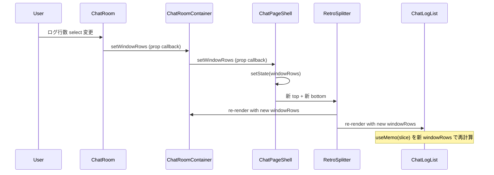
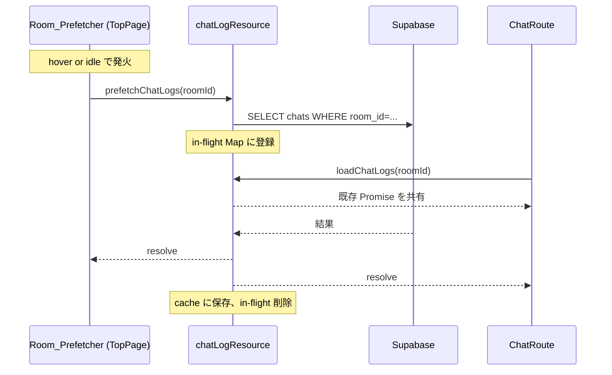
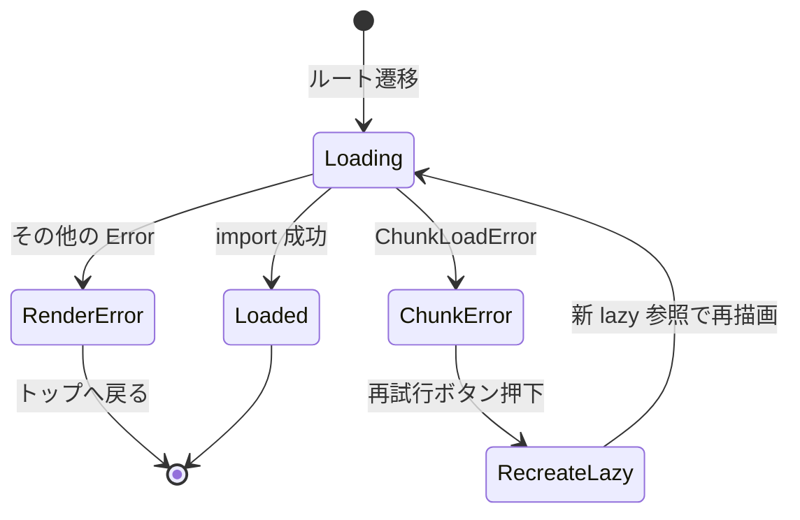

# 技術設計ドキュメント: spa-performance-optimization

## 概要

ゆいちゃっとTS の SPA パフォーマンスを最大化するため、6つの技術領域に分けて改善する：

1. ルーティング層の責務縮小と Code Splitting（lazy 再生成可能な ErrorBoundary 含む）
2. 入力 state の局所化（windowRows は Chat_Page_Shell に残す）
3. 派生値メモ化（ChatLogList / useParticipants / ParticipantsList の timer 内製化）
4. データリソース統合（chatLogResource + realtimeChannelRegistry）
5. TopPage の段階描画と遷移先プリフェッチ（hover + idle）
6. 障害耐性（RetroSplitter memo・Route_Error_Boundary・index.html 静的ヒント）

既存の React 19 + Vite + Supabase + Tailwind CSS 4 構成を維持し、ライブラリ依存は追加しない。

### 設計方針

- **Route-first**: 初期 JS を `TopPage` チャンクのみに絞り、`ChatPage` / `ChanariChatPage` は遷移直前に動的 import する。
- **State locality**: 文字入力系 state は Container に閉じ込め、`windowRows` のみは Chat_Page_Shell に残してメモ化境界（top/bottom）に従って局所的に伝播させる。
- **Derive cheaply, memoize correctly**: ChatLogList のソートは設計上不要なので除去し、`useParticipants` は `useDeferredValue` → `useMemo` の正しい順序で並べる。
- **One resource per roomId**: 既存 Map ベースキャッシュに in-flight Promise 共有を足し、`earlyDataFetch` / `useChatLog` / `usePreloadChatLogs` の三系統取得を一本化する。
- **Channel sharing with refcount**: realtime チャネルは `broadcastChannels` パターンに倣い、roomId 単位で共有し参照カウントで解放する。
- **Defer non-critical work**: realtime 購読・分析イベントは first paint 後の `requestIdleCallback` 起動。
- **Prefetch with budget**: hover/focus/touchstart は即時、加えて TopPage 表示後の idle 時間で Chat_Route チャンクを先読み。低速回線・データセーバーでは抑制。
- **Resilience over silence with re-creatable lazy**: lazy チャンクのロード失敗をユーザーに見える形で扱い、retry 時は `React.lazy` の payload キャッシュを回避するため lazy 参照自体を作り直す。
- **Static hints, not runtime hints**: preconnect / dns-prefetch は index.html に静的記述し、JS 実行を待たない。

## アーキテクチャ

### 全体構成



### レイヤー構成の変更点

| レイヤー     | 変更内容                                                                             | 新規/変更ファイル                                                                                                                                                                                          |
| ------------ | ------------------------------------------------------------------------------------ | ---------------------------------------------------------------------------------------------------------------------------------------------------------------------------------------------------------- |
| HTML         | preconnect / dns-prefetch を静的記述                                                 | `index.html`（変更）                                                                                                                                                                                       |
| ルーティング | App から chat 系 import を除去し、Lazy_Route_Host で個別 lazy + Route_Error_Boundary | `src/App.tsx`（変更）、`src/shared/components/LazyRouteHost.tsx`（新規）、`src/shared/components/RouteErrorBoundary.tsx`（新規）、`src/routes/{TopRoute,ChatRoute,ChanariRoute,NotFoundRoute}.tsx`（新規） |
| ページ層     | ChatPage を ChatPageShell に改名し、入力 state を子へ移譲。RetroSplitter 化          | `src/routes/ChatRoute.tsx`、`EntryForm` / `ChatRoom` を Container 化、`ParticipantsList` の timer 内製化                                                                                                   |
| リソース層   | chatLogsCache + in-flight Map に統合、降順保証                                       | `src/features/chat/api/chatLogResource.ts`（新規）、`chatApi.ts`（リファクタ）                                                                                                                             |
| Realtime層   | roomId 単位でチャネル共有 + refcount                                                 | `src/features/chat/api/realtimeChannelRegistry.ts`（新規）、`subscribeChatLogs` 差し替え                                                                                                                   |
| Hooks層      | useParticipants の defer 修正、useChatHandlers の ref 化                             | `src/features/chat/hooks/{useParticipants,useChatHandlers}.ts`（変更）                                                                                                                                     |
| Prefetch層   | TopPage 専用 hover/idle プリフェッチ                                                 | `src/features/top/utils/roomPrefetcher.ts`（新規）、`src/shared/utils/networkHeuristics.ts`（新規）、`TopPage.tsx`（変更）                                                                                 |

## コンポーネントとインターフェース

### 1. index.html の静的ヒント（Requirement 11）

```html
<!-- index.html の <head> 内に追加 -->
<link rel="dns-prefetch" href="https://tklxdjqlvwntdsfxfcwo.supabase.co" />
<link rel="preconnect" href="https://tklxdjqlvwntdsfxfcwo.supabase.co" crossorigin />
```

これに伴い `usePreloadChatLogs.ts:46` の `preloadCriticalResources` 関数は削除する。ChatPage 側の `useEffect(() => preloadCriticalResources(), [])` も削除する。`<link rel="modulepreload">` は Vite の既定挙動に任せる（`build.modulePreload.polyfill: false` は維持）。

### 2. LazyRouteHost と App.tsx の責務縮小（Requirements 1, 10）

`App` は route 解決と `LazyRouteHost` の配置だけを担う。チャット関連の hook / コンポーネントの import は完全に削除する。`LazyRouteHost` は各 route の `React.lazy` 参照を `useState` で保持し、`RouteErrorBoundary` から retry 通知を受けたときに `lazy(factory)` を新規生成する。

```tsx
// src/shared/components/LazyRouteHost.tsx
import {
  Suspense,
  lazy,
  useCallback,
  useState,
  type ComponentType,
  type LazyExoticComponent,
  type ReactNode,
} from 'react';
import RouteErrorBoundary from './RouteErrorBoundary';

type AnyProps = Record<string, unknown>;

type Props<P extends AnyProps> = {
  factory: () => Promise<{ default: ComponentType<P> }>;
  componentProps?: P;
  fallback?: ReactNode;
};

export default function LazyRouteHost<P extends AnyProps>({
  factory,
  componentProps,
  fallback = <div className="p-4 text-sm text-gray-500">読み込み中…</div>,
}: Props<P>) {
  const [Component, setComponent] = useState<LazyExoticComponent<ComponentType<P>>>(() =>
    lazy(factory)
  );
  const handleRetry = useCallback(() => {
    setComponent(lazy(factory));
  }, [factory]);

  return (
    <RouteErrorBoundary onRetry={handleRetry}>
      <Suspense fallback={fallback}>
        <Component {...(componentProps ?? ({} as P))} />
      </Suspense>
    </RouteErrorBoundary>
  );
}
```

```tsx
// src/App.tsx
import { useState, useEffect, useMemo } from 'react';
import { matchRoute } from '@features/chat/routing';
import { matchChanariRoute } from '@features/chanari-chat/routing';
import LazyRouteHost from '@shared/components/LazyRouteHost';

const topFactory = () => import('./routes/TopRoute');
const chatFactory = () => import('./routes/ChatRoute');
const chanariFactory = () => import('./routes/ChanariRoute');
const notFoundFactory = () => import('./routes/NotFoundRoute');

function resolveRoute(pathname: string) {
  const chanari = matchChanariRoute(pathname);
  if (chanari !== null) return chanari;
  return matchRoute(pathname);
}

export default function App() {
  const [route, setRoute] = useState(() => resolveRoute(window.location.pathname));

  useEffect(() => {
    const onPop = () => setRoute(resolveRoute(window.location.pathname));
    window.addEventListener('popstate', onPop);
    return () => window.removeEventListener('popstate', onPop);
  }, []);

  useEffect(() => {
    if (route.type !== 'redirect') return;
    window.history.replaceState(null, '', route.to);
    setRoute(resolveRoute(window.location.pathname));
  }, [route]);

  const chatProps = useMemo(
    () => (route.type === 'chat-room' ? { roomId: route.roomId } : null),
    [route]
  );
  const chanariProps = useMemo(
    () => (route.type === 'chanari-room' ? { roomId: route.roomId } : null),
    [route]
  );

  if (route.type === 'top') {
    return <LazyRouteHost factory={topFactory} />;
  }
  if (route.type === 'chat-room' && chatProps) {
    return <LazyRouteHost factory={chatFactory} componentProps={chatProps} />;
  }
  if (route.type === 'chanari-room' && chanariProps) {
    return <LazyRouteHost factory={chanariFactory} componentProps={chanariProps} />;
  }
  if (route.type === 'not-found') {
    return <LazyRouteHost factory={notFoundFactory} />;
  }
  return null;
}
```

`route.type` ごとに `LazyRouteHost` のインスタンスがツリー位置で分離するため、各 Route は専用の Error Boundary を持つ（R10.2）。route 遷移時には別インスタンスが mount/unmount されるため、過去 Route のエラー状態は引きずらない。

### 3. RouteErrorBoundary（Requirement 10）

外部ライブラリに依存しない class component で実装する。`ChunkLoadError` を含むネットワーク失敗とそれ以外の render error を区別する。`onRetry` 通知で親 `LazyRouteHost` に lazy 参照の再生成を依頼する。

```tsx
// src/shared/components/RouteErrorBoundary.tsx
import { Component, type ReactNode } from 'react';

type Props = {
  children: ReactNode;
  onRetry?: () => void;
};
type State = { error: Error | null };

function isChunkLoadError(error: unknown): boolean {
  if (!(error instanceof Error)) return false;
  const msg = error.message ?? '';
  const name = error.name ?? '';
  return (
    name === 'ChunkLoadError' ||
    /Failed to fetch dynamically imported module/i.test(msg) ||
    /Loading chunk \S+ failed/i.test(msg) ||
    /Importing a module script failed/i.test(msg)
  );
}

export default class RouteErrorBoundary extends Component<Props, State> {
  state: State = { error: null };

  static getDerivedStateFromError(error: Error): Partial<State> {
    return { error };
  }

  handleRetry = () => {
    this.setState({ error: null });
    this.props.onRetry?.();
  };

  render() {
    const { error } = this.state;
    if (!error) return this.props.children;

    if (isChunkLoadError(error)) {
      return (
        <div className="mx-auto max-w-md p-6 text-sm text-gray-700">
          <p className="mb-3">読み込みに失敗しました。電波の良いところで再試行してください。</p>
          <button
            type="button"
            className="rounded border border-blue-500 bg-blue-50 px-3 py-1 text-blue-700"
            onClick={this.handleRetry}
          >
            再試行
          </button>
        </div>
      );
    }

    return (
      <div className="mx-auto max-w-md p-6 text-sm text-gray-700">
        <p className="mb-3">予期しないエラーが発生しました。</p>
        <a className="text-blue-600 underline" href={import.meta.env.BASE_URL}>
          トップへ戻る
        </a>
      </div>
    );
  }
}
```

`handleRetry` は `setState({ error: null })` で boundary 自身のエラー状態を解除した上で、`onRetry()` で親に通知する。親 `LazyRouteHost` は `setComponent(lazy(factory))` で新しい lazy 参照を生成するため、次回 render では新しい payload に対する `import()` が再発火する。これにより `React.lazy` の payload キャッシュ（reject を保持する性質）を回避できる。

### 4. ChatRoute.tsx と ChatPageShell（旧 ChatPage、Requirements 1, 2, 7, 9）

`src/routes/ChatRoute.tsx` の中で `ChatPageShell` が以下のみを管理する：

- `entered` / `showRanking` / `chatRoomKey` / `windowRows` の 4 state
- `identityRef`（useRef による snapshot）
- `useChatLog` / `useChatHandlers` / `useLookSound` の hooks 呼び出し

文字入力系の state（message / name / color / email / fontSize / fontColor / bold / avatar）は Container 内に閉じる。

```tsx
// src/routes/ChatRoute.tsx
import { useCallback, useEffect, useId, useMemo, useRef, useState } from 'react';
import { useChatLog } from '@features/chat/hooks/useChatLog';
import { useChatHandlers } from '@features/chat/hooks/useChatHandlers';
import { useLookSound } from '@features/chat/hooks/useLookSound';
import EntryFormContainer from '@features/chat/components/EntryForm/Container';
import ChatRoomContainer from '@features/chat/components/ChatRoom/Container';
import ChatLogList from '@features/chat/components/ChatLogList';
import RetroSplitter from '@features/chat/components/RetroSplitter';
import ChatRanking from '@features/chat/components/ChatRanking';
import { useSEO, usePageView } from '@shared/hooks/useSEO';
import { buildChatRoomPath } from '@features/chat/routing';
import { getRoomMeta, type RoomId } from '@features/chat/rooms';
import type { AvatarId } from '@features/chat/types';

type Identity = { name: string; color: string; email: string; avatar: AvatarId };

export default function ChatRoute({ roomId }: { roomId: RoomId }) {
  const room = getRoomMeta(roomId);

  useSEO({
    title: `${room.title} | ゆいちゃっとTS`,
    description: `${room.title}をブラウザですぐに使えるお気楽チャットとして公開しています。`,
    keywords: ['ゆいちゃっとTS', 'お気楽チャット', '無料チャット', room.title],
    canonical: `https://isrnao.github.io${buildChatRoomPath(roomId)}`,
  });
  usePageView(`${room.title} - ゆいちゃっとTS`);

  const { chatLog, isLoading, setChatLog, addOptimistic, mergeChat } = useChatLog(roomId);
  const [entered, setEntered] = useState(false);
  const [showRanking, setShowRanking] = useState(false);
  const [windowRows, setWindowRows] = useState(30);
  const [chatRoomKey, setChatRoomKey] = useState(0);

  const identityRef = useRef<Identity>({
    name: '',
    color: '#ff69b4',
    email: '',
    avatar: 'none',
  });

  const myId = useId();
  const channelRef = useRef(null);
  useLookSound(channelRef, roomId);

  const { handleEnter, handleExit, handleSend, handleReload } = useChatHandlers({
    roomId,
    identityRef,
    myId,
    entered,
    setEntered,
    setChatLog,
    setShowRanking,
    addOptimistic,
    mergeChat,
  });

  const onExit = useCallback(async () => {
    await handleExit();
    setChatRoomKey((k) => k + 1);
  }, [handleExit]);

  const onShowRanking = useCallback(() => setShowRanking(true), []);
  const onHideRanking = useCallback(() => setShowRanking(false), []);

  const top = useMemo(
    () =>
      entered ? (
        <ChatRoomContainer
          key={chatRoomKey}
          identityRef={identityRef}
          windowRows={windowRows}
          setWindowRows={setWindowRows}
          onSend={handleSend}
          onExit={onExit}
          onReload={handleReload}
          onShowRanking={onShowRanking}
        />
      ) : (
        <EntryFormContainer
          roomTitle={room.title}
          identityRef={identityRef}
          onEnter={handleEnter}
        />
      ),
    [
      entered,
      chatRoomKey,
      room.title,
      windowRows,
      handleSend,
      onExit,
      handleReload,
      onShowRanking,
      handleEnter,
    ]
  );

  const bottom = useMemo(
    () =>
      !showRanking ? (
        <ChatLogList chatLog={chatLog} isLoading={isLoading} windowRows={windowRows} />
      ) : (
        <ChatRanking chatLog={chatLog} onBack={onHideRanking} />
      ),
    [showRanking, chatLog, isLoading, windowRows, onHideRanking]
  );

  return (
    <main className="flex min-h-dvh h-dvh flex-col overflow-hidden bg-yui-green" role="main">
      <header className="sr-only">
        <h1>{room.title}</h1>
        <p>{room.description}</p>
      </header>
      <RetroSplitter minTop={100} minBottom={100} top={top} bottom={bottom} />
    </main>
  );
}
```

`windowRows` は Chat_Page_Shell に残し、`top` / `bottom` の `useMemo` deps 両方に含める。windowRows 変化時は両 slot が更新されるが、これは windowRows という共有値の本質的要求であり、message / フォント / 名前・色などの「入力系 state の変化では Chat_Page_Shell は再レンダしない」という主要目的は維持される。

### 5. EntryFormContainer / ChatRoomContainer の Container 化（Requirement 2）

既存の `EntryForm` / `ChatRoom` は presentational のまま残し、入力 state を持つ **Container** を新設する。

```tsx
// src/features/chat/components/EntryForm/Container.tsx
import { useEffect, useState, type MutableRefObject } from 'react';
import EntryForm from './';
import { useSettings } from '@features/chat/hooks/useSettings';
import type { AvatarId } from '@features/chat/types';

type Identity = { name: string; color: string; email: string; avatar: AvatarId };

type Props = {
  roomTitle: string;
  identityRef: MutableRefObject<Identity>;
  onEnter: (args: {
    name: string;
    color: string;
    email: string;
    silent: boolean;
    avatar: AvatarId;
  }) => void | Promise<void>;
};

export default function EntryFormContainer({ roomTitle, identityRef, onEnter }: Props) {
  const { settings } = useSettings();
  const [name, setName] = useState(settings.name ?? '');
  const [color, setColor] = useState(settings.color ?? '#ff69b4');
  const [email, setEmail] = useState(settings.email ?? '');

  useEffect(() => {
    identityRef.current = { ...identityRef.current, name, color, email };
  }, [name, color, email, identityRef]);

  return (
    <EntryForm
      roomTitle={roomTitle}
      name={name}
      setName={setName}
      color={color}
      setColor={setColor}
      email={email}
      setEmail={setEmail}
      onEnter={(args) => {
        identityRef.current = {
          name: args.name,
          color: args.color,
          email: args.email,
          avatar: args.avatar,
        };
        return onEnter(args);
      }}
    />
  );
}
```

```tsx
// src/features/chat/components/ChatRoom/Container.tsx
import { useState, type Dispatch, type MutableRefObject, type SetStateAction } from 'react';
import ChatRoom from './';
import type { ChatMetadata, AvatarId } from '@features/chat/types';

type Identity = { name: string; color: string; email: string; avatar: AvatarId };

type Props = {
  identityRef: MutableRefObject<Identity>;
  windowRows: number;
  setWindowRows: Dispatch<SetStateAction<number>>;
  onSend: (msg: string, metadata?: ChatMetadata) => Promise<void>;
  onExit: () => void | Promise<void>;
  onReload: () => void;
  onShowRanking: () => void;
};

export default function ChatRoomContainer({
  identityRef,
  windowRows,
  setWindowRows,
  onSend,
  onExit,
  onReload,
  onShowRanking,
}: Props) {
  const [message, setMessage] = useState('');
  return (
    <ChatRoom
      message={message}
      setMessage={setMessage}
      windowRows={windowRows}
      setWindowRows={setWindowRows}
      onExit={onExit}
      onSend={onSend}
      onReload={onReload}
      onShowRanking={onShowRanking}
      avatar={identityRef.current.avatar}
      userName={identityRef.current.name}
    />
  );
}
```

#### ChatRoom 本体の変更（必須）

`ChatRoom` の既存 props のうち `chatLog: Chat[]` を**完全に削除**する。`chatLog` を使っていたのは `ChatRoom/index.tsx:91-93` のフォーカス制御 effect のみ：

```tsx
// 変更前
useEffect(() => {
  if (!isPending && inputRef.current) inputRef.current.focus();
}, [chatLog, isPending]);

// 変更後
useEffect(() => {
  if (!isPending && inputRef.current) inputRef.current.focus();
}, [isPending]);
```

送信完了直後（isPending が false に戻った瞬間）にフォーカスを戻す挙動は維持される。`chatLog` 更新時のフォーカス復帰は実質的に「自分の発言が反映されたとき」と重なるが、これは `isPending` 監視で十分カバーできる。`chatLog` プロップは Container から渡されないため、空配列のダミー値などを渡してはならない（render ごとに新規参照が発生して effect が誤発火する）。

#### Identity_Ref の snapshot 性質

`ChatRoomContainer` 内の `identityRef.current.avatar` / `userName` は render 時の値を ChatRoom に渡す。これは入室時 snapshot として扱う：

- 入室前: `EntryFormContainer` の `useEffect` で `identityRef.current` が name/color/email の最新値で同期される。avatar は `onEnter` ラッパー内で synchronous に書き込まれる。
- 入室時: `setEntered(true)` で Chat_Page_Shell が re-render、`top` useMemo は `entered` 変化により新規評価され、`ChatRoomContainer` が mount。この瞬間の `identityRef.current` は入室直前の値を保持している。
- 入室後: name / avatar 変更 UI は提供しない（Non-Goals 参照）。

### 6. chatLogResource: 取得の dedupe と統合（Requirement 5）

要点：

- 定数 `MAX_CHAT_LOG = 100`（既存 `chatApi.ts:10` から移植）
- `cache: Map<RoomId, CacheEntry>`（既存 5 分 TTL 維持）
- `snapshotInflight: Map<RoomId, Promise<Chat[]>>` — canonical snapshot 用、roomId 単独キー
- `pagingInflight: Map<string, Promise<Chat[]>>` — `offset > 0` 用、キーは `${roomId}|${offset}|${limit}` 文字列
- `fetchSnapshot(roomId)` を private に持ち、Supabase へ常に `MAX_CHAT_LOG=100` 件で問い合わせる。limit パラメータは受け付けない
- `fetchPage(roomId, offset, limit)` を private に持ち、`offset > 0` の独立クエリのみ担当
- 公開 API:
  - `loadChatLogs(roomId)`: canonical snapshot を返す。`snapshotInflight` で dedup。シグネチャ互換維持
  - `loadChatLogsWithPaging(roomId, offset, limit)`:
    - `offset === 0 && limit <= MAX_CHAT_LOG` → `loadChatLogs(roomId)` の結果から `.slice(0, limit)` で応答
    - `offset === 0 && limit > MAX_CHAT_LOG` → 同上だが警告ログ（要求超過は仕様外）
    - `offset > 0` → `pagingInflight` で dedup した独立クエリ
  - `loadInitialChatLogs(roomId)`: `loadChatLogs(roomId)` のエイリアス（既存シグネチャ互換）
  - `prefetchChatLogs(roomId)`: `loadChatLogs(roomId)` を発火するが結果を捨てる（キャッシュ充填目的）
  - `invalidateCache(roomId)` / `applyOptimisticToCache(roomId, chat)`
- 既存 `retryApiCall` の指数バックオフは `fetchSnapshot` / `fetchPage` 内に移植
- 確定（成功または失敗）後に該当 in-flight Map エントリを削除
- `chatApi.ts` の旧関数は新リソースを呼ぶ薄いラッパーに置き換え

これにより「prefetch（limit=100 で取得）と useChatLog（windowRows=50 表示）が同時走行する場合、Supabase へのリクエストは 1 件で済み、表示側は slice で必要分だけ取り出す」という挙動が保証される。

#### 追加検討: 初回 30 件表示 + 背景 100 件補完

PR7 の段階描画と合わせて、ChatPage 初回表示を `limit=30` の軽量取得に分ける。これは canonical snapshot（100 件）の意味を変更しない追加経路として扱う。

- `loadChatLogs(roomId)` は引き続き 100 件 canonical snapshot を返す
- 初回表示専用 API（例: `loadVisibleChatLogs(roomId, limit = 30)`）を追加し、表示に必要な列のみ取得する
- 初回表示用 SELECT から `ip` / `ua` を除外する（表示・参加者・ランキングでは未使用）
- 30 件を先に描画し、first paint 後の idle で `prefetchChatLogs(roomId)` または `loadChatLogs(roomId)` により 100 件 snapshot を補完する
- 補完時は uuid dedupe で既存 30 件と統合し、重複表示を避ける
- TopPage の Room_Prefetcher が canonical snapshot を先に埋めている場合、ChatPage は cache から `slice(0, 30)` して初回表示し、追加の 30 件 request を発火しない
- 参加者抽出・ランキングは補完前は 30 件ベース、補完後は 100 件ベースに更新される

この追加は「単発 Supabase API latency を短くする」よりも「初回描画に必要な payload を小さくし、残りを背景補完する」目的で導入する。

### 7. realtimeChannelRegistry: refcount チャネル共有（Requirement 6）

要点：

- roomId 単位で `Map<RoomId, Entry>` を保持
- `subscribeChatLogs(roomId, listener): () => void` を export、refCount で `removeChannel` を制御
- `useChatLog` の useEffect は `requestIdleCallback`（無ければ `setTimeout(fn, 0)`）で realtime 購読を遅延起動

### 8. ChatLogList の派生値メモ化（Requirement 3）

```tsx
// src/features/chat/components/ChatLogList/index.tsx
import { Fragment, memo, useMemo } from 'react';
import { useParticipants } from '@features/chat/hooks/useParticipants';
import ParticipantsList from '../ParticipantsList';
import ChatMessage from '../ChatMessage';
import Divider from '../shared/Divider';
import type { Chat } from '@features/chat/types';

type Props = {
  chatLog: Chat[];
  isLoading?: boolean;
  windowRows: number;
};

function ChatLogListImpl({ chatLog, isLoading = false, windowRows }: Props) {
  const participants = useParticipants(chatLog);
  const chats = useMemo(() => chatLog.slice(0, windowRows), [chatLog, windowRows]);

  if (isLoading) {
    return <div className="text-gray-400 mt-8 animate-pulse">チャットログを読み込み中...</div>;
  }

  return (
    <div
      className="overflow-y-auto rounded-none mt-2 pb-4 font-yui px-[var(--page-gap)]"
      data-testid="chat-log-list"
    >
      <ParticipantsList participants={participants} />
      <Divider />
      {chats.length === 0 && <div className="text-gray-400 py-3">まだ発言はありません。</div>}
      {chats.map((c) => (
        <Fragment key={c.uuid}>
          <ChatMessage chat={c} />
          <Divider />
        </Fragment>
      ))}
    </div>
  );
}

export default memo(ChatLogListImpl);
```

`ChatMessage` も `memo` 化。`currentTime` prop は廃止し、ParticipantsList が内部 timer で時刻を更新する（次項）。

`memo` の shallow compare は `chatLog` / `windowRows` / `isLoading` の 3 props に対して効く。`useDeferredValue`（`useParticipants` 内部）の deferred 値が commit されるタイミングで render が 1 回追加で走り得るが、これは React の正常動作であり、その追加 render でも `useMemo(slice)` と `memo(ChatMessage)` で再計算は最小に抑えられる。

### 8.1 ParticipantsList の timer 内製化（Requirement 3.7）

```tsx
// src/features/chat/hooks/useNowMinute.ts（新規）
import { useEffect, useState } from 'react';

const MINUTE = 60_000;

function nextMinuteDelay(): number {
  const now = Date.now();
  return MINUTE - (now % MINUTE);
}

export function useNowMinute(): number {
  const [now, setNow] = useState(Date.now);
  useEffect(() => {
    let timeoutId: ReturnType<typeof setTimeout> | null = null;
    let intervalId: ReturnType<typeof setInterval> | null = null;
    timeoutId = setTimeout(() => {
      setNow(Date.now());
      intervalId = setInterval(() => setNow(Date.now()), MINUTE);
    }, nextMinuteDelay());
    return () => {
      if (timeoutId) clearTimeout(timeoutId);
      if (intervalId) clearInterval(intervalId);
    };
  }, []);
  return now;
}
```

```tsx
// src/features/chat/components/ParticipantsList/index.tsx
import { formatTime } from '@shared/utils/format';
import type { Participant } from '@features/chat/types';
import { useNowMinute } from '@features/chat/hooks/useNowMinute';

type Props = {
  participants: Participant[];
};

export default function ParticipantsList({ participants }: Props) {
  const now = useNowMinute();
  const formattedTime = formatTime(now).slice(0, 5);
  // 以下既存実装
}
```

これにより `ChatLogList` の render と `[HH:MM]` 表示の更新が切り離される。`ChatLogList` が memo 化されていて再 render しなくても、`ParticipantsList` 内の timer が時刻を進める。逆に `ChatLogList` が頻繁に再 render しても、`now` が分単位でしか変化しないため `ParticipantsList` 自体の再 render 頻度は最小になる（`Object.is` 比較で同じ値）。

### 8.2 useChatLog の useOptimistic reducer dedup（Requirement 3.6）

現行 `useChatLog.ts:28-36` の `useOptimistic` reducer は uuid 一致だけで dedup している。temp 行（temp-\* UUID）と realtime INSERT が運んできた savedChat（server UUID）は UUID 文字列が異なるため、両者が `optimisticLog` 上で同時表示されうる（transition 中の数十〜数百ミリ秒）。

修正方針: reducer の冒頭で `client_time` 一致による dedup を加える。`client_time` は `createOptimisticChat` が打刻し、Supabase に保存される際にも保持されるため、temp と savedChat で同値となる。

```ts
// src/features/chat/hooks/useChatLog.ts（reducer 部分）
const [optimisticLog, addOptimistic] = useOptimistic(chatLog, (state: Chat[], chat: Chat) => {
  // すでに base state に同一 client_time のエントリがあれば temp 行の prepend を抑制
  if (
    chat.uuid.startsWith('temp-') &&
    state.some((c) => c.client_time === chat.client_time && c.name === chat.name)
  ) {
    return state;
  }
  const index = state.findIndex((c) => c.uuid === chat.uuid);
  if (index !== -1) {
    const next = [...state];
    next[index] = chat;
    return next.slice(0, 2000);
  }
  return [chat, ...state].slice(0, 2000);
});
```

- `chat.uuid.startsWith('temp-')` で temp 行に限定して dedup チェック（通常 mergeChat 経由の upsert は従来通り）
- `client_time + name` で同定（同一ユーザーの同時刻発言は実用上ほぼ起きない、起きても 1 つだけ表示する方が安全）
- underlying `chatLog` は server UUID のみを保持し、`mergeChat` は変更しない

これにより「saveChatLogOptimistic 応答前に realtime INSERT が savedChat を届けた」「Postgres 側のレイテンシで保存応答と realtime INSERT が前後する」いずれのケースでも、temp と savedChat が並ぶ瞬間が消える。

### 9. useParticipants の defer + memo（Requirement 4）

```ts
// src/features/chat/hooks/useParticipants.ts
import { useDeferredValue, useMemo } from 'react';

export function useParticipants(chatLog: Chat[]) {
  const deferred = useDeferredValue(chatLog);
  return useMemo(() => getRecentParticipants(deferred), [deferred]);
}
```

### 10. useChatHandlers の ref 安定化（Requirement 7）

`name` / `color` / `email` を引数から削除し、`identityRef` 経由で読む。退室時の入力クリアロジックは `ChatRoomContainer` の `key` 再マウントに任せ、`handleExit` からは削除する。

### 11. RetroSplitter のメモ化（Requirement 9）

```tsx
// src/features/chat/components/RetroSplitter/index.tsx の末尾を変更
function RetroSplitter({ top, bottom, minTop = 10, minBottom = 10 }: Props) {
  // 既存実装はそのまま
}

export default memo(RetroSplitter);
```

呼び出し側（`routes/ChatRoute.tsx`）で `top` / `bottom` を `useMemo` で安定化することで shallow compare が効く。

### 12. TopPage の Room_Prefetcher（Requirement 8）

#### Network_Heuristics（新規）

```ts
// src/shared/utils/networkHeuristics.ts
type ConnectionLike = {
  saveData?: boolean;
  effectiveType?: 'slow-2g' | '2g' | '3g' | '4g';
};

export function shouldSkipPrefetch(): boolean {
  const conn = (navigator as unknown as { connection?: ConnectionLike }).connection;
  if (!conn) return false;
  if (conn.saveData) return true;
  if (conn.effectiveType === 'slow-2g' || conn.effectiveType === '2g') return true;
  return false;
}
```

#### roomPrefetcher（新規）

**重要**: `chatLogResource` や `isRoomId` を静的 import すると、TopPage が `roomPrefetcher` を import した時点で chat 専用コードが初期バンドルに混入する（R1.4 / Success Metrics と衝突）。runtime 依存はすべて動的 import に閉じる。`RoomId` は型のみの import なので erased し、initial bundle に乗らない。

```ts
// src/features/top/utils/roomPrefetcher.ts
import type { RoomId } from '@features/chat/rooms'; // type-only: 型情報は erased
import { shouldSkipPrefetch } from '@shared/utils/networkHeuristics';

const prefetchedKeys = new Set<string>();
let chatRouteImport: Promise<unknown> | null = null;
let chatLogResourceImport: Promise<typeof import('@features/chat/api/chatLogResource')> | null =
  null;
let roomsImport: Promise<typeof import('@features/chat/rooms')> | null = null;

function prefetchChatRoute(): Promise<unknown> {
  if (!chatRouteImport) {
    chatRouteImport = import('../../../routes/ChatRoute');
  }
  return chatRouteImport;
}

function loadChatLogResource() {
  if (!chatLogResourceImport) {
    chatLogResourceImport = import('@features/chat/api/chatLogResource');
  }
  return chatLogResourceImport;
}

function loadRooms() {
  if (!roomsImport) {
    roomsImport = import('@features/chat/rooms');
  }
  return roomsImport;
}

export function prefetchRoom(roomId: RoomId | null, key: string): void {
  if (prefetchedKeys.has(key)) return;
  // R8.7: 外部リンクまたは roomId 未解決のリンクではプリフェッチを一切発火しない
  if (!roomId) return;
  prefetchedKeys.add(key);
  void prefetchChatRoute();
  void loadChatLogResource().then((mod) => {
    mod.prefetchChatLogs(roomId);
  });
}

export function schedulePrefetchOnIdle(getLastRoomId: () => string | null): void {
  if (shouldSkipPrefetch()) return;
  const idle: (cb: () => void, opts?: { timeout: number }) => number =
    (window as any).requestIdleCallback ?? ((cb) => window.setTimeout(cb, 1500));
  idle(
    () => {
      const key = '__idle__';
      if (prefetchedKeys.has(key)) return;
      prefetchedKeys.add(key);
      void prefetchChatRoute();
      const last = getLastRoomId();
      if (!last) return;
      void Promise.all([loadChatLogResource(), loadRooms()]).then(([resource, rooms]) => {
        if (rooms.isRoomId(last)) resource.prefetchChatLogs(last);
      });
    },
    { timeout: 2000 }
  );
}
```

ビルド検証で `dist/assets/index-*.js` に `prefetchChatLogs` / `isRoomId` の名前が含まれないこと、`vendor-supabase` が initial chunk modulepreload の対象外であることを `grep` で確認する（Non-Goals に従い vendor-supabase は別の initial chunk として残る可能性はあるが、TopPage utility 経由で増えないことが要点）。

#### TopPage 側の差し替え

```tsx
// src/features/top/TopPage.tsx の関連箇所
import { useEffect } from 'react';
import { prefetchRoom, schedulePrefetchOnIdle } from './utils/roomPrefetcher';
import { readLastRoomId } from '@features/chat/utils/settingsStore'; // 既存 settingsStore に getter 追加

function RoomAnchor({ item, className }: { item: RoomLink; className: string }) {
  const external = isExternalLink(item);
  const trigger = () => {
    if (external) return;
    prefetchRoom(item.roomId ?? null, item.href);
  };
  return (
    <a
      className={className}
      href={item.href}
      onMouseEnter={trigger}
      onFocus={trigger}
      onTouchStart={trigger}
      {...(external ? { target: '_blank', rel: 'noopener noreferrer' } : {})}
    >
      {item.label}
    </a>
  );
}

export default function TopPage() {
  // ... 既存 useSEO / usePageView / useRoomCounts
  useEffect(() => {
    schedulePrefetchOnIdle(() => readLastRoomId());
  }, []);
  // ... 静的部分は liveCounts === {} でも描画される（既存挙動）
}
```

`readLastRoomId` は `settingsStore.ts` に追加する小さな getter。`yui-chat-settings` の JSON に `lastRoomId?: string` を追加し、`updateSettings({ lastRoomId })` で書き込む。書き込みタイミングは `useChatHandlers.handleEnter` の入室成功時、または `EntryFormContainer.onEnter` 完了後。

## データフロー

### 入力イベントの再レンダ範囲（after）



### windowRows 変更時の再レンダ範囲（after）



### 初回ログ取得の dedupe（after）



### lazy ルート失敗時の復旧（after）



`RecreateLazy` ステップで `LazyRouteHost` が `setComponent(lazy(factory))` を実行し、`React.lazy` の payload キャッシュをバイパスする。

## エラーハンドリング

- `chatLogResource.loadChatLogs` が失敗した場合、in-flight Map から削除し、呼び出し側で再試行可能な状態にする。指数バックオフは内部関数 `fetchInternal` 内に保持。
- `prefetchChatLogs` の失敗はサイレントに握りつぶす（`.catch(() => {})`）。プリフェッチはベストエフォート。
- `realtimeChannelRegistry` の `removeChannel` が失敗してもアプリは継続。エラーはコンソール警告のみ。
- TopPage の `useRoomCounts` が失敗してもバッジは 0 表示のまま（既存挙動）。
- lazy ルート import が失敗した場合は `RouteErrorBoundary` が拾い、ユーザーに再試行ボタンを提示する。再試行時は `LazyRouteHost` が lazy 参照を作り直すので `import()` が再発火する。
- `schedulePrefetchOnIdle` の `import()` 失敗もサイレントに握りつぶす（実際の遷移時に再試行されるため）。

## テスト戦略

### 単体テスト

- `chatLogResource.test.ts`:
  - 同一 roomId への並行呼び出しでネットワークが 1 回のみ発生する（Supabase クライアントを mock）
  - キャッシュヒット時はネットワークを呼ばない
  - TTL 切れ時は再フェッチする
  - エラー時に in-flight が削除される
- `realtimeChannelRegistry.test.ts`:
  - 同一 roomId への複数 subscribe で `supabase.channel()` が 1 回のみ呼ばれる
  - 全 subscriber が unsubscribe するとチャネルが削除される
  - INSERT イベントが全 listener に dispatch される
- `useParticipants.test.ts`:
  - `chatLog` 参照不変なら `getRecentParticipants` が再実行されない（spy で検証）
- `RouteErrorBoundary.test.tsx`:
  - `ChunkLoadError` を投げた子で再試行ボタンが表示される
  - 再試行ボタン押下で `onRetry` コールバックが呼ばれ、boundary の error state が null に戻る
  - 通常の render error では「トップへ戻る」リンクが表示される
- `LazyRouteHost.test.tsx`:
  - 失敗 → 再試行で `lazy(factory)` が 2 回呼ばれることを spy で検証
  - 成功時に `factory` が 1 回だけ呼ばれる
- `useNowMinute.test.ts`:
  - 初期値が `Date.now()` 近傍であること
  - 60 秒経過で `setState` が呼ばれること（タイマーモック）
- `networkHeuristics.test.ts`:
  - `saveData=true` / `effectiveType='slow-2g'` で `shouldSkipPrefetch()` が true を返す
- `roomPrefetcher.test.ts`:
  - 同じ key で 2 回 `prefetchRoom` を呼んでも `prefetchChatLogs` は 1 回のみ呼ばれる
  - 外部リンク（`roomId === null` 等）では `prefetchChatLogs` が呼ばれない

### 統合テスト

- `ChatRoute.test.tsx`:
  - 発言入力中に `ChatLogList` が React.Profiler 上で commit しない
  - 退室後の再入室で `ChatRoomContainer` の入力 state が初期化されている
  - ログ行数 select の変更で `ChatLogList` の slice が新 windowRows で再計算される
- `TopPage.test.tsx`:
  - `useRoomCounts` が pending の状態でもリンク・ニュースが描画される
  - ルームリンクの `mouseenter` で `prefetchChatLogs` が 1 回だけ呼ばれる
  - first paint 後 idle で `prefetchChatRoute` が発火する（タイマーモック）

### ビルド検証

- `pnpm build` 後に `dist/index.html` を確認：
  - `<link rel="preconnect" href="https://...supabase.co" crossorigin>` が含まれる
  - `<link rel="modulepreload">` が initial chunk について生成されている
- `dist/assets/` のチャンク分割：
  - entry chunk に `EntryForm` / `ChatRoom` / `RetroSplitter` の関数名が含まれない（`grep` で確認）
  - chat 専用 hook 名（`useChatLog`, `useChatHandlers`, `useParticipants`）が entry の依存に含まれない
  - `vendor-supabase-*.js` は TopPage 用 `useRoomCounts` の依存として initial bundle に残ってよい（Non-Goals 参照）

## 移行戦略

11 Requirement を 7 PR に分けて段階マージする。**最初にコード分割の骨組みを入れ、以後の差分を局所化する**順序：

1. **PR1: R1 + R10 + R11** — `routes/{TopRoute,ChatRoute,ChanariRoute,NotFoundRoute}.tsx` 新設、ChatPage の物理移動（state 構造は維持）、`LazyRouteHost` + `RouteErrorBoundary` 導入、`index.html` 静的ヒント。bundle 構造変更を最初に終わらせる。
2. **PR2: R3 + R4** — ChatLogList の sort 除去・memo 化、`useParticipants` 修正、`ParticipantsList` timer 内製化。差分最小・効果即時。
3. **PR3: R5** — `chatLogResource` 統合と `earlyDataFetch` 削除。
4. **PR4: R6** — `realtimeChannelRegistry` + idle subscribe。
5. **PR5: R7** — `useChatHandlers` の identityRef 化。
6. **PR6: R2 + R9** — Container 化と RetroSplitter memo（密結合のため 1 PR）。`ChatRoom` から `chatLog` prop を削除、focus effect を `[isPending]` に変更。
7. **PR7: R8** — TopPage 段階描画と Room_Prefetcher（hover + idle）。必要に応じて ChatPage 初回 30 件表示 + 背景 100 件補完も同 PR で扱う。

各 PR は既存テストが green である状態でマージし、必要に応じて新規テストを追加する。PR1 で物理移動だけを先に済ませることで、PR2〜PR6 の差分が `routes/ChatRoute.tsx` 内に閉じてレビューしやすくなる。

## パフォーマンス目標と計測

| 項目                                 | 計測方法                                                | 目標                                                                            |
| ------------------------------------ | ------------------------------------------------------- | ------------------------------------------------------------------------------- |
| TopPage 初期 JS 転送量               | `pnpm analyze:bundle` + Network タブ                    | 現状比 -30% 以上（chat 専用コードが initial に含まれないこと）                  |
| ChatPage 発言時の ChatLogList commit | React DevTools Profiler                                 | 発言送信時のみ commit、入力中 0 件                                              |
| 初回ログ取得リクエスト数             | Chrome DevTools Network                                 | 同一 roomId で 1 件                                                             |
| Lighthouse Performance               | `pnpm lighthouse:mobile`                                | 現状以上を維持                                                                  |
| Lazy チャンクロード失敗              | DevTools の Network throttling で再現                   | RouteErrorBoundary のフォールバックが表示され、再試行で `import()` が再発火する |
| TopPage idle prefetch                | Network タブで `assets/ChatRoute-*.js` の発火タイミング | first paint 後 5 秒以内（高速回線）                                             |
