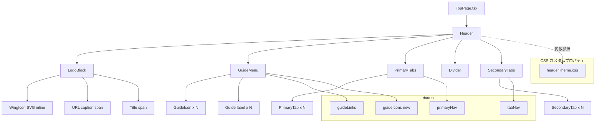
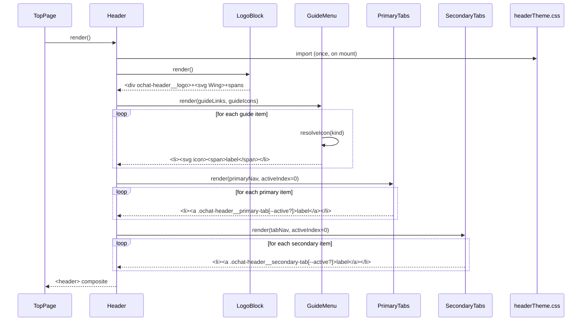

# 技術設計ドキュメント: text-based-header

## 概要

お気楽チャットのトップページヘッダー領域（ロゴ・ガイドメニュー・プライマリタブ・セカンダリタブ）を、**画像アセットを一切使用せず、プレーンテキストと CSS のみで**再現するための設計である。添付のスクリーンショットに写るレガシーサイトの視覚特性（白〜薄グレー背景のプライマリタブ行（アクティブ時のみ青グラデ）、水色グラデーションのセカンダリタブ行（アクティブ時のみ白塗り）、両者の間に入る濃青の細帯、太青色の「お気楽チャット」ロゴ、翼型アイコン、各ガイドメニュー項目のアイコンなど）を CSS カスタムプロパティ、グラデーション、疑似要素、Unicode/SVG インライン、CSS のみで構築する。

既存 `TopPage.tsx` は `public/okiraku/images/logo.png` `head.png` `navi.png` `faq.png` など複数の画像アセットに依存している。本機能はこれらすべての画像参照を取り除き、DOM 上は `<span>` / `<svg>` / `<a>` / 疑似要素だけで同等の見た目を得られるようにする。これにより、アセット配信コスト削減・ダークモード/スケーリング耐性の向上・保守容易性（色トークン変更だけで全体が追従する）が得られる。

本 spec は既存 `.kiro/specs/okiraku-chat-top-page/` の `HeaderRegion` 設計を前提にしつつ、その内部実装のみを「画像なし」方針で差し替える位置付けである（`okiraku-chat-top-page` の上位要件は変更しない）。

### 設計方針

- **No Images**: `` / `background-image: url(…)` のいずれも使用しない。ラスター画像・GIF・SVG ファイルの外部参照を禁止する。SVG をインライン `<svg>` として DOM に直接書き出すのは許容する（これはテキストデータである）。
- **色の単一出典**: 配色は `src/features/top/components/header/headerTheme.css` の CSS カスタムプロパティで一元管理する。Tailwind のインラインクラスで色を書かない。
- **データ駆動**: ナビゲーション項目・アイコン種別は既存 `data.ts` の `primaryNav` / `tabNav` / `guideLinks` をそのまま流用し、アイコン識別子を別データ `guideIcons` としてコロケートする。
- **アクセシビリティ**: ロゴとガイドアイコンは装飾扱い (`aria-hidden="true"`) とし、意味は隣接テキストで伝える。アクティブタブは `aria-current="page"` を維持する。
- **CSS スコープ**: 本機能の CSS はクラス接頭辞 `ochat-header__` で始め、既存 `.okiraku-header` / `.okiraku-primary-tab` / `.okiraku-secondary-tab` と衝突しない。移行期は両方が共存しても問題ない命名とする。
- **レスポンシブ**: デスクトップ幅 (`>= 768px`) はスクリーンショットと同一の 1 行レイアウト、タブレット/モバイルでは折り返し + 横スクロールで閲覧可能性を担保する。

### 非目標

- `TopPage` のヘッダー以外の領域（左カラム / メイン / 右カラム / フッター）の画像削除。本 spec はヘッダー領域（`<Header />` コンポーネント内）のみを対象とする。
- 画像ベースのロゴに戻せるフォールバック機構。既存の `public/okiraku/images/**` は削除しないが、`TopPage.tsx` からの参照は消す。
- アイコンライブラリ（lucide-react 等）の導入。依存増を避けるため、アイコンは最小限のインライン SVG で自作する。
- レガシーサイトのピクセル単位完全一致。スクリーンショットを参考にしつつ、モダンブラウザで「同じ雰囲気」と認識できる水準を目指す。

## アーキテクチャ

### コンポーネント構成



- `TopPage.tsx` 内既存の `Header` 関数コンポーネントを内部実装だけ差し替える。外部インターフェース（`<TopPage />` の props）は変更しない。
- `LogoBlock` / `GuideMenu` / `PrimaryTabs` / `SecondaryTabs` は `Header` のサブコンポーネントとして同ファイルに置くか、または `src/features/top/components/header/*.tsx` へ切り出す（実装タスクで決定）。
- 視覚構造は上から順に「① ロゴ + ガイドメニュー（白背景）」「② プライマリタブ行（白〜薄グレーのグラデ背景、アクティブのみ青グラデ塗り）」「③ 濃青の細帯（Seam）」「④ セカンダリタブ行（水色グラデ背景、アクティブのみ白塗り）」の 4 段構成とする。

### レイヤ構成

| レイヤ                     | 役割                                                                         | 新規/変更ファイル                                             |
| -------------------------- | ---------------------------------------------------------------------------- | ------------------------------------------------------------- |
| コンポーネント             | ヘッダー全体の組み立て                                                       | `src/features/top/TopPage.tsx` (`Header` 関数を変更)          |
| ロゴ・サブコンポーネント   | `LogoBlock` / `GuideMenu` / `PrimaryTabs` / `SecondaryTabs`                  | `src/features/top/components/header/*.tsx` (新規、任意で同居) |
| アイコン                   | 翼型ロゴアイコン + ガイドメニューアイコン（5 種）の inline SVG               | `src/features/top/components/header/icons.tsx` (新規)         |
| 静的データ                 | ガイドメニュー項目とアイコン種別の紐付け                                     | `src/features/top/data.ts` (`guideIcons` を追加)              |
| スタイル                   | 色トークン + グラデーション + タブ形状                                       | `src/features/top/components/header/headerTheme.css` (新規)   |
| グローバル CSS（変更なし） | 既存 `src/App.css` の `.okiraku-header` / `.okiraku-primary-tab` は保持（※） | `src/App.css`                                                 |

※ 既存 `.okiraku-*` クラスは本 spec では削除しない。`Header` が使わなくなるため死にコードになるが、別機能で参照される可能性があるため撤去は別 spec で行う（out-of-scope）。

### 視覚トークン（CSS カスタムプロパティ）

以下はユーザー提供のスポイトサンプリング値に基づいて確定した配色である。`src/features/top/components/header/headerTheme.css` の `.ochat-header` スコープで定義する。

| トークン                              | 値                       | 用途                                              |
| ------------------------------------- | ------------------------ | ------------------------------------------------- |
| `--ochat-h-bg`                        | `#ffffff`                | ヘッダー上段（ロゴ + ガイド）の白背景             |
| `--ochat-h-logo-text`                 | `#0167ff`                | 「お気楽チャット」ロゴ太字の青                    |
| `--ochat-h-logo-url`                  | `#333333`                | ロゴ上部の `www.okiraku-chat.com` キャプション    |
| `--ochat-h-logo-wing`                 | `#76d3ef`                | 翼アイコンのメイン水色                            |
| `--ochat-h-logo-wing-shadow`          | `#0167ff`                | 翼アイコンの濃淡（陰影）                          |
| `--ochat-h-guide-link`                | `#1a6dbc`                | ガイドメニューの青リンク                          |
| `--ochat-h-guide-link-hover`          | `#d9463d`                | ガイドメニューのホバー色                          |
| `--ochat-h-guide-icon-pink`           | `#ff5f8a`                | FAQ / ハートなど暖色アイコン                      |
| `--ochat-h-guide-icon-orange`         | `#ff9a3c`                | 「使い方」アイコン                                |
| `--ochat-h-guide-icon-green`          | `#3fbf8f`                | プロフィール作成アイコン                          |
| `--ochat-h-guide-icon-blue`           | `#2e8fd1`                | コンタクト（封筒）アイコン                        |
| `--ochat-h-primary-tab-bg-top`        | `#fefefe`                | プライマリタブ（1段目）非アクティブ背景グラデ上端 |
| `--ochat-h-primary-tab-bg-btm`        | `#e8e8e8`                | プライマリタブ（1段目）非アクティブ背景グラデ下端 |
| `--ochat-h-primary-tab-fg`            | `#333333`                | プライマリタブ非アクティブ文字色                  |
| `--ochat-h-primary-tab-active-bg-top` | `#0099ff`                | プライマリタブアクティブ青グラデ上端              |
| `--ochat-h-primary-tab-active-bg-btm` | `#016fff`                | プライマリタブアクティブ青グラデ下端              |
| `--ochat-h-primary-tab-active-fg`     | `#ffffff`                | プライマリタブアクティブ文字色（太字）            |
| `--ochat-h-primary-tab-divider`       | `rgba(0,0,0,0.12)`       | プライマリタブ間の細い仕切り線                    |
| `--ochat-h-seam`                      | `#006cff`                | 1段目と2段目の間に挟まる濃青の細帯                |
| `--ochat-h-secondary-bar-top`         | `#0bbbfe`                | セカンダリタブ（2段目）水色グラデ背景上端         |
| `--ochat-h-secondary-bar-btm`         | `#068ae3`                | セカンダリタブ（2段目）水色グラデ背景下端         |
| `--ochat-h-secondary-tab-fg`          | `#ffffff`                | セカンダリタブ非アクティブ文字色（太字）          |
| `--ochat-h-secondary-tab-active-bg`   | `#ffffff`                | セカンダリタブアクティブ背景（白塗り）            |
| `--ochat-h-secondary-tab-active-fg`   | `#333333`                | セカンダリタブアクティブ文字色                    |
| `--ochat-h-secondary-tab-divider`     | `rgba(255,255,255,0.35)` | セカンダリタブ間の縦仕切り線                      |

### 主要シーケンス（レンダリング）



## コンポーネントとインターフェース

### Header (ルート)

**責務**: ヘッダー全体のランドマーク構築。外部 API は無い。既存 `TopPage.tsx` の `Header` 関数を内部書き換えする。

**インターフェース**:

```typescript
// Header は props を取らない関数コンポーネント
function Header(): JSX.Element;
```

**責務一覧**:

- `<header className="ochat-header">` をルートに置く
- サブセクションを以下の順で並べる:
  1. `LogoBlock` + `GuideMenu`（左右 flex、デスクトップで横並び、モバイルで縦積み）
  2. `PrimaryTabs`（白〜薄グレーのグラデ背景のタブ行。アクティブ項目のみ青グラデ塗り）
  3. `Seam`（`<div aria-hidden="true" className="ochat-header__seam" />`）— 1段目と2段目の間に挟まる濃青 `#006cff` の細帯
  4. `SecondaryTabs`（水色グラデ背景の下段タブ。アクティブ項目のみ白塗り）
- 画像 import / `` / `background-image: url()` を**含まない**

### LogoBlock

**責務**: 翼アイコン + URL キャプション + 大文字の青タイトルを描画。

```typescript
interface LogoBlockProps {
  /** ロゴクリック時の遷移先。省略時は import.meta.env.BASE_URL */
  href?: string;
}
function LogoBlock(props?: LogoBlockProps): JSX.Element;
```

**DOM 構造**:

```tsx
<a className="ochat-header__logo" href={props.href ?? baseUrl} aria-label="お気楽チャット トップへ">
  <WingIcon className="ochat-header__logo-wing" aria-hidden="true" />
  <span className="ochat-header__logo-texts">
    <span className="ochat-header__logo-url">www.okiraku-chat.com</span>
    <span className="ochat-header__logo-title">お気楽チャット</span>
  </span>
</a>
```

### GuideMenu

**責務**: `guideLinks`（5 項目）に対応するアイコン付きリンク行。

```typescript
type GuideIconKind = 'faq' | 'tutorial' | 'heart' | 'profile' | 'mail';

interface GuideMenuItem {
  label: string;
  iconKind: GuideIconKind;
  href: string;
}

interface GuideMenuProps {
  items: readonly GuideMenuItem[];
}
function GuideMenu(props: GuideMenuProps): JSX.Element;
```

**データ取得**: `data.ts` の `guideLinks` と `guideIcons` を zip して `items` を構築する。

### PrimaryTabs

**責務**: 9 項目のメインタブ行を白〜薄グレーのグラデ背景で並べ、`activeIndex` の項目のみ青グラデ塗り + 白文字に切り替える。

```typescript
interface PrimaryTabsProps {
  items: readonly string[];
  activeIndex: number;
  /** タブクリック時の href（デフォルトは '#'） */
  resolveHref?: (label: string, index: number) => string;
}
function PrimaryTabs(props: PrimaryTabsProps): JSX.Element;
```

**クラス付与ルール**:

- `ochat-header__primary-tab` を全項目に付与
- アクティブ項目には `ochat-header__primary-tab--active` を追加
- `aria-current="page"` はアクティブ項目のみに付与

### SecondaryTabs

**責務**: 7 項目のチャット種別タブ行を水色グラデ背景で並べ、`activeIndex` の項目のみ白背景で塗り潰し + 濃色文字に切り替える。

```typescript
interface SecondaryTabItem {
  label: string;
  href: string;
}

interface SecondaryTabsProps {
  items: readonly SecondaryTabItem[];
  activeIndex: number;
}
function SecondaryTabs(props: SecondaryTabsProps): JSX.Element;
```

### WingIcon（inline SVG）

**責務**: ロゴ左の翼型アイコン。外部 SVG ファイルではなく `src/features/top/components/header/icons.tsx` の React コンポーネントとして DOM に展開する。

```typescript
interface SvgIconProps {
  className?: string;
  'aria-hidden'?: boolean;
  size?: number; // 既定 40
}
function WingIcon(props?: SvgIconProps): JSX.Element;
```

**形状**: 2 枚の水色の翼が左右対称に並ぶ形。SVG `<path>` で曲線描画する。`fill: var(--ochat-h-logo-wing)` と内側の陰影 `fill: var(--ochat-h-logo-wing-shadow)` の 2 層。

### GuideIcon（inline SVG × 5 種）

**責務**: `GuideIconKind` ごとに異なるシルエットの SVG を返すディスパッチ。

```typescript
function GuideIcon(props: { kind: GuideIconKind; className?: string }): JSX.Element;
```

**マッピング**（形状は簡略シルエット）:

| kind       | 形状             | 色トークン                    |
| ---------- | ---------------- | ----------------------------- |
| `faq`      | `?` 入り吹き出し | `--ochat-h-guide-icon-pink`   |
| `tutorial` | 本のような矩形   | `--ochat-h-guide-icon-orange` |
| `heart`    | ハート           | `--ochat-h-guide-icon-pink`   |
| `profile`  | 人物シルエット   | `--ochat-h-guide-icon-green`  |
| `mail`     | 封筒             | `--ochat-h-guide-icon-blue`   |

## データモデル

### 既存 `data.ts` への追加

既存の `guideLinks` は配列のまま残し、同じインデックスで対応する新規 `guideIcons` 配列を追加する。

```typescript
// src/features/top/data.ts に追加
export type GuideIconKind = 'faq' | 'tutorial' | 'heart' | 'profile' | 'mail';

/**
 * `guideLinks` と同じ順序・同じ長さのアイコン種別配列。
 * 既存 `guideLinks` を変更せず追加するため、両者を zip して扱う。
 */
export const guideIcons: readonly GuideIconKind[] = [
  'faq', // チャットのFAQ・よくある質問
  'tutorial', // チャットの使い方
  'heart', // チャットのルール・マナー
  'profile', // プロフィール作成
  'mail', // コンタクト
] as const;
```

### 不変条件

- `guideIcons.length === guideLinks.length` を型レベルで保証することは TS の配列型では難しいため、実行時に `console.assert` で確認するユニットテスト 1 本を追加する。

## Algorithmic Pseudocode

### アルゴリズム: Header レンダリング

```pascal
ALGORITHM renderHeader()
INPUT: （なし。データはモジュールスコープの guideLinks, guideIcons, primaryNav, tabNav から取得）
OUTPUT: JSX 要素 rootHeader

BEGIN
  ASSERT guideLinks.length = guideIcons.length

  // 1. ガイドメニュー項目を合成
  guideItems ← []
  FOR i FROM 0 TO guideLinks.length - 1 DO
    guideItems.push({ label: guideLinks[i], iconKind: guideIcons[i], href: '#' })
  END FOR

  // 2. ロゴブロック
  logo ← LogoBlock({ href: baseUrl })

  // 3. ガイドメニュー
  guide ← GuideMenu({ items: guideItems })

  // 4. プライマリタブ
  primary ← PrimaryTabs({
    items: primaryNav,
    activeIndex: 0
  })

  // 5. セカンダリタブ
  secondary ← SecondaryTabs({
    items: tabNav,
    activeIndex: 0
  })

  // 6. 組み立て
  rootHeader ← <header class="ochat-header">
    <div class="ochat-header__top">
      {logo}
      {guide}
    </div>
    {primary}
    <div class="ochat-header__seam" aria-hidden="true" />
    {secondary}
  </header>

  RETURN rootHeader
END
```

**事前条件 (Preconditions)**:

- `guideLinks` / `guideIcons` / `primaryNav` / `tabNav` はモジュール読み込み時点で非空配列として定義されている
- `guideLinks.length === guideIcons.length`
- `headerTheme.css` が `TopPage.tsx` 経由で（または `main.tsx` で）import 済み

**事後条件 (Postconditions)**:

- 戻り値の JSX ツリー内に `` 要素と `style="background-image: url(…)"` は**存在しない**
- 戻り値の JSX ツリー内でアクティブ要素（`primary[0]` と `secondary[0]`）には `aria-current="page"` が付与されている
- 戻り値は任意のビューポート幅でレンダリング可能（`overflow-x: auto` による横スクロールで折り返し不要）

**ループ不変条件**: `guideItems` 組立ループ内で、各反復後 `guideItems.length === i + 1` かつ全要素の `label` / `iconKind` / `href` が定義済みである。

### アルゴリズム: GuideIcon ディスパッチ

```pascal
ALGORITHM guideIconDispatch(kind)
INPUT: kind ∈ {'faq', 'tutorial', 'heart', 'profile', 'mail'}
OUTPUT: SVG 要素

BEGIN
  ASSERT kind IS ONE OF the allowed literal types

  CASE kind OF
    'faq':      RETURN <FaqBubble />      // ? 入り吹き出し
    'tutorial': RETURN <BookIcon />       // 本
    'heart':    RETURN <HeartIcon />      // ハート
    'profile':  RETURN <PersonIcon />     // 人物
    'mail':     RETURN <MailIcon />       // 封筒
  END CASE
END
```

**事前条件**: `kind` は `GuideIconKind` 型（TypeScript の判別ユニオン）として検証済み。

**事後条件**: 返される SVG は `viewBox="0 0 16 16"`、`width`/`height` は props `size` または既定 `16` に従う、`fill` 属性は CSS カスタムプロパティ参照 `var(--ochat-h-guide-icon-*)` を指す。

## Low-Level Design: TypeScript/React/CSS 実装

### ファイル: `src/features/top/components/header/headerTheme.css`

```css
/* スコープ: .ochat-header 配下にのみ適用 */
.ochat-header {
  --ochat-h-bg: #ffffff;
  --ochat-h-logo-text: #0167ff;
  --ochat-h-logo-url: #333333;
  --ochat-h-logo-wing: #76d3ef;
  --ochat-h-logo-wing-shadow: #0167ff;

  --ochat-h-guide-link: #1a6dbc;
  --ochat-h-guide-link-hover: #d9463d;
  --ochat-h-guide-icon-pink: #ff5f8a;
  --ochat-h-guide-icon-orange: #ff9a3c;
  --ochat-h-guide-icon-green: #3fbf8f;
  --ochat-h-guide-icon-blue: #2e8fd1;

  /* 1段目（プライマリタブ）: 白〜薄グレー背景。アクティブのみ青グラデ */
  --ochat-h-primary-tab-bg-top: #fefefe;
  --ochat-h-primary-tab-bg-btm: #e8e8e8;
  --ochat-h-primary-tab-fg: #333333;
  --ochat-h-primary-tab-active-bg-top: #0099ff;
  --ochat-h-primary-tab-active-bg-btm: #016fff;
  --ochat-h-primary-tab-active-fg: #ffffff;
  --ochat-h-primary-tab-divider: rgba(0, 0, 0, 0.12);

  /* 1段目と2段目の間に入る濃青の細帯 */
  --ochat-h-seam: #006cff;

  /* 2段目（セカンダリタブ）: 水色グラデ背景。アクティブのみ白塗り */
  --ochat-h-secondary-bar-top: #0bbbfe;
  --ochat-h-secondary-bar-btm: #068ae3;
  --ochat-h-secondary-tab-fg: #ffffff;
  --ochat-h-secondary-tab-active-bg: #ffffff;
  --ochat-h-secondary-tab-active-fg: #333333;
  --ochat-h-secondary-tab-divider: rgba(255, 255, 255, 0.35);

  background: var(--ochat-h-bg);
}

/* ===== 上段: ロゴ + ガイドメニュー ===== */
.ochat-header__top {
  display: flex;
  align-items: flex-start;
  justify-content: space-between;
  gap: 16px;
  max-width: 990px;
  margin: 0 auto;
  padding: 16px 8px 12px;
}

@media (max-width: 767px) {
  .ochat-header__top {
    flex-direction: column;
  }
}

/* ===== ロゴ ===== */
.ochat-header__logo {
  display: inline-flex;
  align-items: center;
  gap: 10px;
  text-decoration: none;
  color: inherit;
}

.ochat-header__logo-wing {
  flex-shrink: 0;
  width: 42px;
  height: 42px;
}

.ochat-header__logo-texts {
  display: inline-flex;
  flex-direction: column;
  line-height: 1;
}

.ochat-header__logo-url {
  font-size: 10px;
  font-weight: 400;
  letter-spacing: 0.02em;
  color: var(--ochat-h-logo-url);
  margin-bottom: 2px;
}

.ochat-header__logo-title {
  font-size: 28px;
  font-weight: 800;
  letter-spacing: 0.02em;
  color: var(--ochat-h-logo-text);
  font-family: 'Hiragino Kaku Gothic ProN', 'Meiryo', 'MS PGothic', sans-serif;
}

/* ===== ガイドメニュー ===== */
.ochat-header__guide {
  padding-top: 18px;
}

.ochat-header__guide-list {
  display: flex;
  flex-wrap: wrap;
  gap: 6px 16px;
  margin: 0;
  padding: 0;
  list-style: none;
}

.ochat-header__guide-item {
  display: inline-flex;
  align-items: center;
  gap: 4px;
  font-size: 11px;
  font-weight: 700;
  white-space: nowrap;
}

.ochat-header__guide-link {
  display: inline-flex;
  align-items: center;
  gap: 4px;
  color: var(--ochat-h-guide-link);
  text-decoration: none;
}

.ochat-header__guide-link:hover,
.ochat-header__guide-link:focus {
  color: var(--ochat-h-guide-link-hover);
  text-decoration: underline;
}

.ochat-header__guide-icon {
  flex-shrink: 0;
  width: 14px;
  height: 14px;
}

/* ===== 1段目: プライマリタブ（白〜薄グレー背景） ===== */
.ochat-header__primary {
  /* 行自体の背景も同じ白グラデとする（タブ間の隙間や overflow 領域のため） */
  background: linear-gradient(
    to bottom,
    var(--ochat-h-primary-tab-bg-top) 0%,
    var(--ochat-h-primary-tab-bg-btm) 100%
  );
  border-top: 1px solid rgba(0, 0, 0, 0.08);
}

.ochat-header__primary-list {
  display: flex;
  flex-wrap: nowrap;
  justify-content: flex-start;
  max-width: 990px;
  margin: 0 auto;
  padding: 0;
  list-style: none;
  overflow-x: auto;
}

.ochat-header__primary-item {
  flex-shrink: 0;
  border-right: 1px solid var(--ochat-h-primary-tab-divider);
}

.ochat-header__primary-item:first-child {
  border-left: 1px solid var(--ochat-h-primary-tab-divider);
}

.ochat-header__primary-tab {
  display: block;
  min-width: 108px;
  height: 36px;
  line-height: 36px;
  padding: 0 12px;
  text-align: center;
  font-size: 13px;
  font-weight: 500;
  color: var(--ochat-h-primary-tab-fg);
  text-decoration: none;
  /* 非アクティブは白〜薄グレーグラデ。テキストシャドウは入れない */
  background: linear-gradient(
    to bottom,
    var(--ochat-h-primary-tab-bg-top) 0%,
    var(--ochat-h-primary-tab-bg-btm) 100%
  );
}

.ochat-header__primary-tab--active,
.ochat-header__primary-tab:hover,
.ochat-header__primary-tab:focus {
  background: linear-gradient(
    to bottom,
    var(--ochat-h-primary-tab-active-bg-top) 0%,
    var(--ochat-h-primary-tab-active-bg-btm) 100%
  );
  color: var(--ochat-h-primary-tab-active-fg);
  font-weight: 700;
  text-shadow: 0 1px 0 rgba(0, 0, 0, 0.15);
}

/* 1段目と2段目の間に入る濃青の細帯 */
.ochat-header__seam {
  height: 4px;
  background: var(--ochat-h-seam);
}

/* ===== 2段目: セカンダリタブ（水色グラデ背景） ===== */
.ochat-header__secondary {
  background: linear-gradient(
    to bottom,
    var(--ochat-h-secondary-bar-top) 0%,
    var(--ochat-h-secondary-bar-btm) 100%
  );
  border-bottom: 1px solid rgba(0, 0, 0, 0.1);
}

.ochat-header__secondary-list {
  display: flex;
  flex-wrap: nowrap;
  max-width: 990px;
  margin: 0 auto;
  padding: 0;
  list-style: none;
  overflow-x: auto;
}

.ochat-header__secondary-item {
  flex-shrink: 0;
}

.ochat-header__secondary-item + .ochat-header__secondary-item {
  border-left: 1px solid var(--ochat-h-secondary-tab-divider);
}

.ochat-header__secondary-tab {
  display: inline-block;
  min-width: 120px;
  height: 34px;
  line-height: 34px;
  padding: 0 14px;
  text-align: center;
  font-size: 12px;
  font-weight: 700;
  color: var(--ochat-h-secondary-tab-fg);
  text-decoration: none;
  box-sizing: border-box;
  /* 非アクティブは透明背景（親の水色グラデが透ける）+ 白文字 */
  background: transparent;
}

.ochat-header__secondary-tab--active {
  background: var(--ochat-h-secondary-tab-active-bg);
  color: var(--ochat-h-secondary-tab-active-fg);
}

.ochat-header__secondary-tab:hover,
.ochat-header__secondary-tab:focus {
  /* ホバー時はアクティブと同様に白塗り + 濃色文字へ寄せる */
  background: var(--ochat-h-secondary-tab-active-bg);
  color: var(--ochat-h-secondary-tab-active-fg);
}
```

### ファイル: `src/features/top/components/header/icons.tsx`

```typescript
import type { SVGProps } from 'react';

type Size = { size?: number };

export function WingIcon({ size = 42, ...rest }: SVGProps<SVGSVGElement> & Size) {
  return (
    <svg
      viewBox="0 0 40 40"
      width={size}
      height={size}
      aria-hidden="true"
      {...rest}
    >
      {/* 左側の翼 */}
      <path
        d="M20 22 C 12 10, 4 12, 2 20 C 4 28, 12 30, 20 22 Z"
        fill="var(--ochat-h-logo-wing)"
      />
      {/* 右側の翼 */}
      <path
        d="M20 22 C 28 10, 36 12, 38 20 C 36 28, 28 30, 20 22 Z"
        fill="var(--ochat-h-logo-wing)"
      />
      {/* 中心の影 */}
      <path
        d="M16 20 Q 20 14, 24 20 Q 20 26, 16 20 Z"
        fill="var(--ochat-h-logo-wing-shadow)"
        opacity="0.85"
      />
    </svg>
  );
}

export type GuideIconKind = 'faq' | 'tutorial' | 'heart' | 'profile' | 'mail';

export function GuideIcon({
  kind,
  className,
}: {
  kind: GuideIconKind;
  className?: string;
}) {
  const common = {
    viewBox: '0 0 16 16',
    width: 14,
    height: 14,
    'aria-hidden': true as const,
    className,
  };
  switch (kind) {
    case 'faq':
      return (
        <svg {...common}>
          <path
            d="M3 2 H13 A1 1 0 0 1 14 3 V10 A1 1 0 0 1 13 11 H9 L6 14 V11 H3 A1 1 0 0 1 2 10 V3 A1 1 0 0 1 3 2 Z"
            fill="var(--ochat-h-guide-icon-pink)"
          />
          <text x="8" y="9" textAnchor="middle" fontSize="7" fontWeight="700" fill="#fff">
            ?
          </text>
        </svg>
      );
    case 'tutorial':
      return (
        <svg {...common}>
          <rect x="2" y="2" width="12" height="12" rx="1" fill="var(--ochat-h-guide-icon-orange)" />
          <rect x="4" y="5" width="8" height="1" fill="#fff" />
          <rect x="4" y="7.5" width="8" height="1" fill="#fff" />
          <rect x="4" y="10" width="5" height="1" fill="#fff" />
        </svg>
      );
    case 'heart':
      return (
        <svg {...common}>
          <path
            d="M8 14 C 3 10, 1 7, 3 4 C 5 2, 7 3, 8 5 C 9 3, 11 2, 13 4 C 15 7, 13 10, 8 14 Z"
            fill="var(--ochat-h-guide-icon-pink)"
          />
        </svg>
      );
    case 'profile':
      return (
        <svg {...common}>
          <circle cx="8" cy="5.5" r="2.6" fill="var(--ochat-h-guide-icon-green)" />
          <path
            d="M2.5 14 C 3.5 10.5, 6 9.5, 8 9.5 C 10 9.5, 12.5 10.5, 13.5 14 Z"
            fill="var(--ochat-h-guide-icon-green)"
          />
        </svg>
      );
    case 'mail':
      return (
        <svg {...common}>
          <rect x="1.5" y="3.5" width="13" height="9" rx="1" fill="var(--ochat-h-guide-icon-blue)" />
          <path d="M1.5 4 L8 9 L14.5 4" stroke="#fff" strokeWidth="1" fill="none" />
        </svg>
      );
  }
}
```

### ファイル: `src/features/top/components/header/Header.tsx`

```typescript
import type { ReactNode } from 'react';
import { guideLinks, guideIcons, primaryNav, tabNav } from '../../data';
import { GuideIcon, WingIcon, type GuideIconKind } from './icons';
import './headerTheme.css';

function LogoBlock() {
  return (
    <a className="ochat-header__logo" href={import.meta.env.BASE_URL} aria-label="お気楽チャット トップへ">
      <WingIcon className="ochat-header__logo-wing" />
      <span className="ochat-header__logo-texts">
        <span className="ochat-header__logo-url">www.okiraku-chat.com</span>
        <span className="ochat-header__logo-title">お気楽チャット</span>
      </span>
    </a>
  );
}

function GuideMenu({
  items,
}: {
  items: readonly { label: string; iconKind: GuideIconKind; href: string }[];
}) {
  return (
    <nav aria-label="ガイドメニュー" className="ochat-header__guide">
      <ul className="ochat-header__guide-list">
        {items.map((item) => (
          <li key={item.label} className="ochat-header__guide-item">
            <a className="ochat-header__guide-link" href={item.href}>
              <GuideIcon kind={item.iconKind} className="ochat-header__guide-icon" />
              <span>{item.label}</span>
            </a>
          </li>
        ))}
      </ul>
    </nav>
  );
}

function PrimaryTabs({
  items,
  activeIndex,
}: {
  items: readonly string[];
  activeIndex: number;
}) {
  return (
    <nav aria-label="メインナビゲーション" className="ochat-header__primary">
      <ul className="ochat-header__primary-list">
        {items.map((label, index) => {
          const isActive = index === activeIndex;
          const cls =
            'ochat-header__primary-tab' +
            (isActive ? ' ochat-header__primary-tab--active' : '');
          return (
            <li key={label} className="ochat-header__primary-item">
              <a
                className={cls}
                href="#"
                aria-current={isActive ? 'page' : undefined}
              >
                {label}
              </a>
            </li>
          );
        })}
      </ul>
    </nav>
  );
}

function SecondaryTabs({
  items,
  activeIndex,
}: {
  items: readonly { label: string; href: string }[];
  activeIndex: number;
}) {
  return (
    <nav aria-label="チャット種別タブ" className="ochat-header__secondary">
      <ul className="ochat-header__secondary-list">
        {items.map((item, index) => {
          const isActive = index === activeIndex;
          const cls =
            'ochat-header__secondary-tab' +
            (isActive ? ' ochat-header__secondary-tab--active' : '');
          return (
            <li key={item.label} className="ochat-header__secondary-item">
              <a
                className={cls}
                href={item.href}
                aria-current={isActive ? 'page' : undefined}
              >
                {item.label}
              </a>
            </li>
          );
        })}
      </ul>
    </nav>
  );
}

export function Header(): ReactNode {
  const guideItems = guideLinks.map((label, i) => ({
    label,
    iconKind: guideIcons[i],
    href: '#',
  }));
  return (
    <header className="ochat-header">
      <div className="ochat-header__top">
        <LogoBlock />
        <GuideMenu items={guideItems} />
      </div>
      <PrimaryTabs items={primaryNav} activeIndex={0} />
      <div className="ochat-header__seam" aria-hidden="true" />
      <SecondaryTabs items={tabNav} activeIndex={0} />
    </header>
  );
}
```

### 使用例（TopPage.tsx の改修）

既存 `TopPage.tsx` の内部 `Header` 関数を削除し、`Header` を `components/header/Header` から import する。

```typescript
// yui-chat-ts/src/features/top/TopPage.tsx
import { Header } from './components/header/Header';

// ...existing code...

export default function TopPage() {
  useSEO({ /* ... */ });
  usePageView('お気楽チャット トップ');
  const { counts: liveCounts } = useRoomCounts();
  return (
    <div className="min-h-dvh bg-white font-yui text-[12px] text-gray-700">
      <Header />
      {/* main 以下は従来通り */}
    </div>
  );
}
```

### データ追加（data.ts）

```typescript
// yui-chat-ts/src/features/top/data.ts に追加
export type GuideIconKind = 'faq' | 'tutorial' | 'heart' | 'profile' | 'mail';

export const guideIcons: readonly GuideIconKind[] = [
  'faq',
  'tutorial',
  'heart',
  'profile',
  'mail',
] as const;
```

## Correctness Properties

_A property is a characteristic or behavior that should hold true across all valid executions of a system-essentially, a formal statement about what the system should do. Properties serve as the bridge between human-readable specifications and machine-verifiable correctness guarantees._

これらは実装タスクフェーズで fast-check を用いたプロパティベーステストおよびユニットテストで検証する。各プロパティは `requirements.md` の受入基準を参照する。最小反復回数は 100 回とする。

### Property 1: No `` tag in rendered output

_For any_ rendering of the `Header` component with any valid `activeIndex` in the range `[0, primaryNav.length) × [0, tabNav.length)`, the string returned by `renderToStaticMarkup(<Header ... />)` SHALL NOT contain the substring ` tag', () => {
  const html = renderToStaticMarkup(<Header />);
  assert(!/ {
  const html = renderToStaticMarkup(<Header />);
  assert(!/background-image\s*:\s*url\(/i.test(html));
  assert(!html.includes('okiraku/images/'));
});
```

### Property 3: Four-row header structure with ochat-header root and single seam

_For any_ rendering of the `Header` component, the returned HTML SHALL:

1. Contain exactly one `<header>` element whose `class` attribute contains `ochat-header`.
2. Contain exactly one element whose `class` attribute contains `ochat-header__seam` and whose `aria-hidden` attribute equals `"true"`.
3. Contain the class strings `ochat-header__top`, `ochat-header__primary`, `ochat-header__seam`, `ochat-header__secondary` in that order of first occurrence.

**Validates: Requirements 3.1, 3.2, 3.3, 7.4**

```typescript
property('header has single root and 4-row ordered structure', () => {
  const html = renderToStaticMarkup(<Header />);
  assertEqual(occurrences(html, 'class="ochat-header"'), 1);
  assertEqual(occurrences(html, 'ochat-header__seam'), 1);
  const order = ['ochat-header__top', 'ochat-header__primary', 'ochat-header__seam', 'ochat-header__secondary'];
  const positions = order.map((cls) => html.indexOf(cls));
  for (let i = 1; i < positions.length; i++) {
    assert(positions[i] > positions[i - 1]);
  }
});
```

### Property 4: PrimaryTabs active exclusivity across all valid activeIndex values

_For any_ `activeIndex` drawn from `fc.integer({ min: 0, max: primaryNav.length - 1 })`, the rendered `PrimaryTabs` component SHALL contain:

- Exactly one element with class `ochat-header__primary-tab--active`.
- Exactly one `<a>` with attribute `aria-current="page"`, and that `<a>` SHALL be the one at the `activeIndex`-th position among PrimaryTab anchors.

**Validates: Requirements 4.1, 4.3, 4.5, 8.1, 8.3, 8.7**

```typescript
property('primary tabs have exactly one active at the given activeIndex', () => {
  fc.assert(
    fc.property(fc.integer({ min: 0, max: primaryNav.length - 1 }), (activeIndex) => {
      const html = renderToStaticMarkup(<PrimaryTabs items={primaryNav} activeIndex={activeIndex} />);
      assertEqual(occurrences(html, 'ochat-header__primary-tab--active'), 1);
      assertEqual(occurrences(html, 'aria-current="page"'), 1);
      // The i-th <a> (0-indexed) is the active one
      const anchors = extractAnchors(html);
      assert(anchors[activeIndex].includes('ochat-header__primary-tab--active'));
      assert(anchors[activeIndex].includes('aria-current="page"'));
    }),
    { numRuns: 100 },
  );
});
```

### Property 5: SecondaryTabs active exclusivity across all valid activeIndex values

_For any_ `activeIndex` drawn from `fc.integer({ min: 0, max: tabNav.length - 1 })`, the rendered `SecondaryTabs` component SHALL contain:

- Exactly one element with class `ochat-header__secondary-tab--active`.
- Exactly one `<a>` with attribute `aria-current="page"`, and that `<a>` SHALL be at the `activeIndex`-th position among SecondaryTab anchors.

**Validates: Requirements 4.2, 4.4, 4.5, 8.2, 8.3, 8.7**

```typescript
property('secondary tabs have exactly one active at the given activeIndex', () => {
  fc.assert(
    fc.property(fc.integer({ min: 0, max: tabNav.length - 1 }), (activeIndex) => {
      const html = renderToStaticMarkup(<SecondaryTabs items={tabNav} activeIndex={activeIndex} />);
      assertEqual(occurrences(html, 'ochat-header__secondary-tab--active'), 1);
      assertEqual(occurrences(html, 'aria-current="page"'), 1);
      const anchors = extractAnchors(html);
      assert(anchors[activeIndex].includes('ochat-header__secondary-tab--active'));
      assert(anchors[activeIndex].includes('aria-current="page"'));
    }),
    { numRuns: 100 },
  );
});
```

### Property 6: All navigation labels appear in rendered output in declared order

_For any_ rendering of the `Header` component, the returned HTML SHALL contain:

- Every label in `primaryNav` as a substring, with the first occurrences appearing in the same order as the array.
- Every `tabNav[i].label` as a substring, with the first occurrences appearing in the same order as the array.
- Every label in `guideLinks` as a substring, with the first occurrences appearing in the same order as the array.

**Validates: Requirements 3.5, 3.6, 8.4, 8.5, 8.6**

```typescript
property('all navigation labels appear in declared order', () => {
  const html = renderToStaticMarkup(<Header />);
  const checkOrder = (labels: readonly string[]) => {
    let cursor = 0;
    for (const label of labels) {
      const pos = html.indexOf(label, cursor);
      assert(pos >= 0, `missing label: ${label}`);
      cursor = pos + label.length;
    }
  };
  checkOrder(primaryNav);
  checkOrder(tabNav.map((t) => t.label));
  checkOrder(guideLinks);
});
```

### Property 7: guideLinks / guideIcons length parity and index-paired rendering

_For any_ index `i` in the range `[0, guideLinks.length)`, the `i`-th `<li>` produced by `GuideMenu` SHALL:

- Contain the text `guideLinks[i]` as a substring.
- Contain an `<svg>` element whose shape corresponds to the icon kind `guideIcons[i]`.

Additionally, `guideIcons.length` SHALL equal `guideLinks.length`.

**Validates: Requirements 6.3, 6.5, 6.6, 6.7**

```typescript
property('guideLinks and guideIcons have equal length', () => {
  assertEqual(guideLinks.length, guideIcons.length);
});

property('guide menu pairs labels with icons by index', () => {
  const items = guideLinks.map((label, i) => ({ label, iconKind: guideIcons[i], href: '#' }));
  const html = renderToStaticMarkup(<GuideMenu items={items} />);
  const listItems = extractListItems(html, 'ochat-header__guide-item');
  assertEqual(listItems.length, guideLinks.length);
  for (let i = 0; i < guideLinks.length; i++) {
    assert(listItems[i].includes(guideLinks[i]));
    assert(listItems[i].includes('<svg'));
    // icon kind check: each kind produces a distinguishable marker (e.g. text '?'
    // for 'faq', rect shape for 'tutorial', path d="M8 14..." for 'heart', etc.)
    assert(matchesIconKind(listItems[i], guideIcons[i]));
  }
});
```

### Property 8: GuideIcon returns `<svg viewBox="0 0 16 16">` for every GuideIconKind

_For any_ `kind` drawn from `fc.constantFrom<GuideIconKind>('faq', 'tutorial', 'heart', 'profile', 'mail')`, the rendered `GuideIcon` component SHALL return a non-null `<svg>` element whose `viewBox` attribute equals `"0 0 16 16"`.

**Validates: Requirements 1.4, 8.8**

```typescript
property('GuideIcon returns <svg viewBox="0 0 16 16"> for any kind', () => {
  fc.assert(
    fc.property(fc.constantFrom<GuideIconKind>('faq', 'tutorial', 'heart', 'profile', 'mail'), (kind) => {
      const html = renderToStaticMarkup(<GuideIcon kind={kind} />);
      assert(/^<svg\b/.test(html));
      assert(html.includes('viewBox="0 0 16 16"'));
    }),
    { numRuns: 100 },
  );
});
```

### Property 9: All decorative icons carry `aria-hidden="true"`

_For any_ rendering of the `Header` component, every `<svg>` element produced by `WingIcon` or `GuideIcon` within the output SHALL carry the attribute `aria-hidden="true"`, so that screen readers announce the adjacent textual label only once.

**Validates: Requirements 4.7**

```typescript
property('every decorative svg is aria-hidden', () => {
  const html = renderToStaticMarkup(<Header />);
  const svgs = extractSvgOpenTags(html);
  assert(svgs.length > 0);
  svgs.forEach((tag) => assert(/aria-hidden="true"/.test(tag)));
});
```

### Out-of-scope (covered by non-property tests)

以下は `requirements.md` の受入基準のうち property-based testing で検証しない項目。該当するテスト戦略を併記する。

| Requirement(s)                       | Classification | Rationale / Test Strategy                                                                                                                        |
| ------------------------------------ | -------------- | ------------------------------------------------------------------------------------------------------------------------------------------------ |
| 2.1–2.9 (個別色値)                   | EXAMPLE        | `headerTheme.css` のソース文字列に `--ochat-h-*: <hex>;` が存在することを単体テストで検証。                                                      |
| 2.10 (色の単一出典)                  | EXAMPLE        | `Header.tsx` / `icons.tsx` のソース文字列に `#0167ff` 等の色値リテラルが含まれないことを静的検査で確認（`var(--ochat-h-*)` 参照のみ許可）。      |
| 3.4 (ロゴ文字列)                     | EXAMPLE        | 単体テストで `"お気楽チャット"` と `"www.okiraku-chat.com"` の出現を確認。                                                                       |
| 4.6, 4.8, 4.9, 4.10 (nav aria-label) | EXAMPLE        | 単体テストで特定文字列の出現を確認。                                                                                                             |
| 5.1–5.6 (レスポンシブ CSS)           | EXAMPLE        | `headerTheme.css` のソースに該当 CSS 宣言（`@media (max-width: 767px)`、`overflow-x: auto`、`flex-wrap: nowrap` 等）が含まれることを文字列検査。 |
| 6.1, 6.2 (import 構造)               | EXAMPLE        | `Header.tsx` のソースが `data` から必要な symbol を import していることを確認。Property 6 / 7 により間接的にも担保。                             |
| 6.4 (`GuideIconKind` 型 export)      | SMOKE          | `import type { GuideIconKind } from '../../data'` がコンパイルできることで満たされる。                                                           |
| 7.1, 7.2 (TopPage 統合)              | EXAMPLE        | `TopPage.tsx` の差分レビュー + `TopPage` 描画時に `<header class="ochat-header">` が最初の子として出現することを単体テストで確認。               |
| 7.5 (既存フック保持)                 | INTEGRATION    | 既存の `TopPage` テストスイートがリグレッションしないこと。                                                                                      |

## エラー処理

本ヘッダーコンポーネントはネットワーク I/O や動的状態を持たない純粋な宣言的レンダリングのため、以下のエラーケースは該当しない:

- 画像ロード失敗 → **画像を使わないため発生しない**
- ネットワークエラー → 該当なし
- 状態遷移エラー → 該当なし

考えられる実行時エラーは 1 件のみ:

| シナリオ                                  | 発生条件                                            | 対応                                                                                                                                        |
| ----------------------------------------- | --------------------------------------------------- | ------------------------------------------------------------------------------------------------------------------------------------------- |
| `guideIcons.length !== guideLinks.length` | データ変更時の不整合                                | ユニットテストで事前検出。実行時は `guideIcons[i]` が `undefined` になり `GuideIcon` の `switch` が網羅されず TypeScript のコンパイルエラー |
| 未知の `GuideIconKind` が渡される         | `guideIcons.ts` を変更したが `GuideIcon` を更新せず | TypeScript の判別ユニオンにより網羅性チェック（`never` 型）で検出                                                                           |

## テスト戦略

### 単体テスト（Vitest）

- `icons.tsx` の各 SVG コンポーネントが描画される（snapshot test）
- `Header` の構造テスト（ランドマーク / nav ラベル / 項目数）

### プロパティベーステスト（fast-check）

- 「Correctness Properties」節の 6 項目
- テスト対象ファイル: `src/features/top/components/header/__tests__/Header.properties.test.tsx`
- ランダム入力は主に `activeIndex` をランダム化し、`items.length` の範囲内であれば Property 3 (アクティブ 1 件) が常に成り立つことを確認

### 視覚回帰テスト（Storybook + 手動チェック）

- Storybook に `components/header/Header.stories.tsx` を追加
- ビューポート幅 320 / 768 / 1024 / 1280 のスナップショットを取る
- スクリーンショット（添付画像）と横並び比較し、色・文字サイズ・タブ高さの差を目視確認

### 統合テスト

- `TopPage` レンダリング後に `` が DOM 上に**存在しないこと**を確認
- `` / `head.png` / `navi.png` / `faq.png` 等の参照がゼロであることを確認

## パフォーマンス考慮事項

- 画像リクエストが従来 7 件（logo.png, head.png, navi.png, faq.png, tutorial.png, heart.png, profile.png, email.gif）あったのを**すべて削除**。ヘッダー表示のための追加 HTTP リクエスト数はゼロになる
- CSS グラデーションとインライン SVG のレンダリングコストは現代ブラウザで無視できる水準（合計 DOM ノード増加は約 20 前後）
- アニメーションなし、トランジションなしで CPU 負荷ほぼゼロ

## セキュリティ考慮事項

- インライン SVG に外部 URL (`xlink:href` 等) を含めない
- `href="#"` のプレースホルダーは実装タスクでアンカーテキストの整合性（`rel="noopener noreferrer"` を外部リンク時のみ付ける）を確認
- ユーザー入力を受け取らないため XSS 経路なし

## 依存関係

### 追加依存

なし。既存の React 19 / TypeScript / Vite のみで実装可能。

### 変更ファイル

- `yui-chat-ts/src/features/top/TopPage.tsx` — 内部 `Header` 関数の削除と import への差し替え
- `yui-chat-ts/src/features/top/data.ts` — `GuideIconKind` 型と `guideIcons` 配列の追加

### 新規ファイル

- `yui-chat-ts/src/features/top/components/header/Header.tsx`
- `yui-chat-ts/src/features/top/components/header/icons.tsx`
- `yui-chat-ts/src/features/top/components/header/headerTheme.css`
- `yui-chat-ts/src/features/top/components/header/__tests__/Header.properties.test.tsx`（タスクフェーズで追加）
- `yui-chat-ts/src/features/top/components/header/Header.stories.tsx`（オプション）

### 既存 spec との関係

- `.kiro/specs/okiraku-chat-top-page/design.md` の `HeaderRegion` 節の実装戦略を本 spec が差し替える。ただし上位要件（ランドマーク順序・アクセシビリティ基準・データ駆動）は継承する
- 既存の `src/App.css` 内 `.okiraku-header` / `.okiraku-primary-tab` / `.okiraku-secondary-tab` は本 spec で使用しなくなるが、削除は行わない（別機能の依存可能性を考慮し、撤去は別 spec で扱う）
