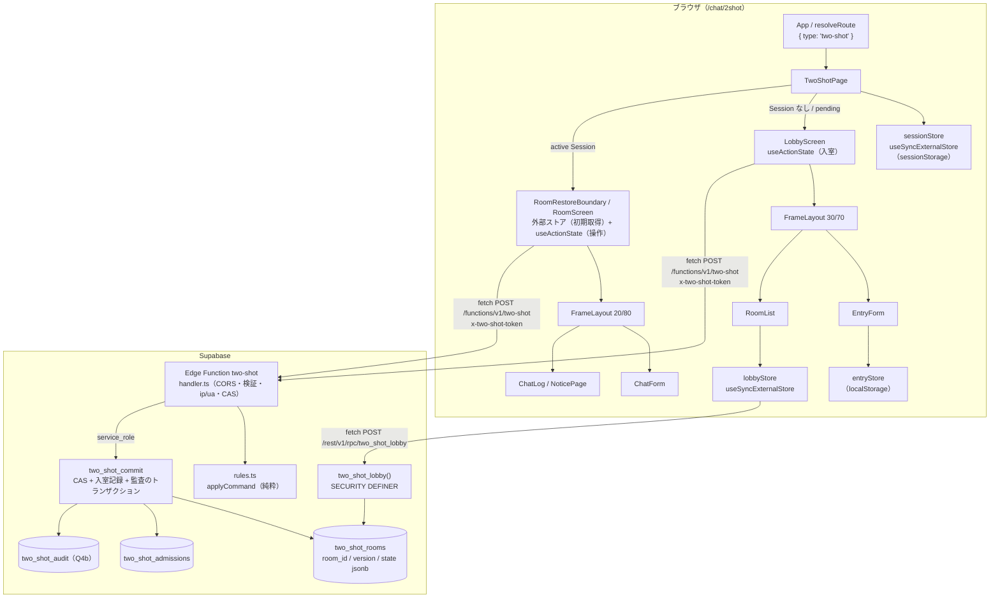
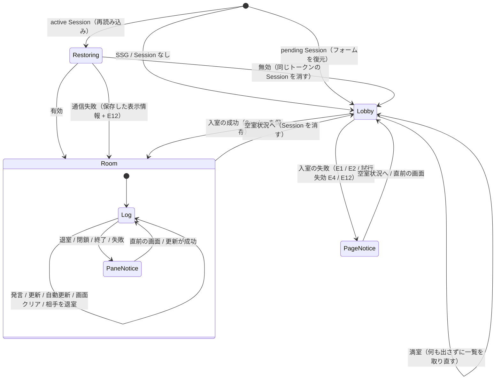
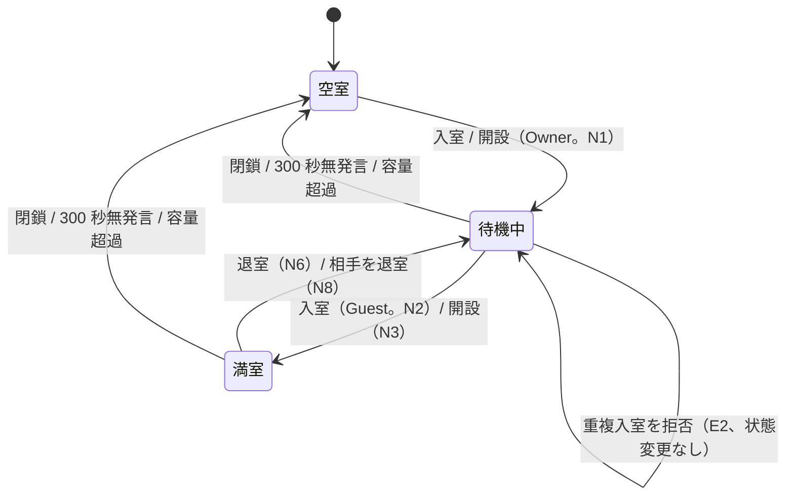
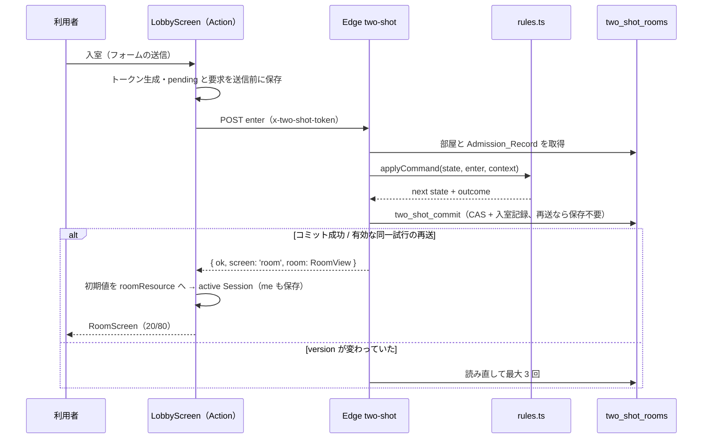
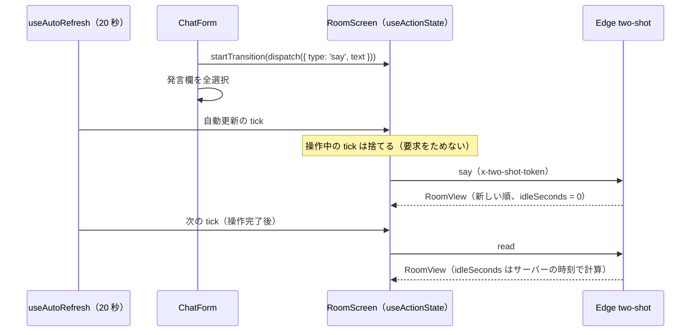

# 技術設計ドキュメント: two-shot-chat

## 概要

[requirements.md](./requirements.md) の 18 要件を実現するための設計。原作の画面・文言・状態遷移は
[research.md](./research.md) にまとめた。

作るものは 3 つに分かれる。

1. **サーバー**: 部屋ごと 1 行の `two_shot_rooms`、再送を判定する `two_shot_admissions`、Edge Function `two-shot`、
   一覧用の公開関数 `two_shot_lobby()`、Q4(b) の `two_shot_audit`。状態遷移の規則は import を持たない
   純粋な TypeScript（`rules.ts`）にまとめ、状態の CAS と付随する記録を専用 RPC で原子的に保存する
2. **画面**: `src/features/two-shot-chat/`。フレームを再現する Frame_Layout と、原作の 6 画面（入室フォーム、一覧、
   入力画面、ログ画面、お知らせ、その組み合わせ）を作る
3. **既存との接続**: `/chat/2shot` のルーティング、プリレンダ、SEO、トップの参加人数

requirements.md の Q1〜Q7 は 2026-09-24 に推奨どおり決定した（Q4 は (a) と (b) の両方）。各節の
「Q の決定で変わるもの」は、将来方針を変える場合の影響範囲として残す。

2026-09-23 のレビューで、重複入室の拒否、入室の再送、Member_ID、初回取得失敗の復元、監査の原子的保存を追加した。
関連実装との照合により、既存ストアの再利用、人数集計のフォールバック、古い応答の排除、Guest 交代時のログ初期化も
反映した。原作との差は requirements.md の D8・D16〜D19 で明示する。

### 設計方針

原作の CGI の仕組みを、2026 年の React の型に一つずつ置き換える。

| 原作（CGI）                                          | 本機能                                                                                                                                                                     |
| ---------------------------------------------------- | -------------------------------------------------------------------------------------------------------------------------------------------------------------------------- |
| フォームを POST し、応答の HTML でフレームを描き直す | 操作は Action。`useActionState` の非同期の reducer がサーバーの応答を次の画面の状態にする。操作は届いた順に 1 つずつ処理される（リクエストと応答の順序が原作と同じになる） |
| `<frameset>` と `target`                             | 1 つの React ツリーの上下ペイン。「どちらのペインを書き換えるか」は状態の形（上ペインの状態 / 下ペインの状態 / ページ全体のお知らせ）で表す                                |
| `<meta http-equiv="Refresh">`                        | `useEffectEvent` のタイマーが、Transition の中で「更新」の Action を送る                                                                                                   |
| cookie                                               | `localStorage` を裏に持つ外部ストア（`useSyncExternalStore`、`getServerSnapshot` あり）                                                                                    |
| URL の認証コード                                     | `sessionStorage` の Session_Token を外部ストアで読み、ヘッダで送る                                                                                                         |
| 3 つのファイル（`ent` / `mes` / `log`）              | 部屋ごと 1 行の JSON（`state jsonb`）と `version`。読み → 純粋な関数で次の状態を計算 → `version` が同じときだけ書く（CAS）                                                 |
| 画面を開いたときに時間切れを判定して書き換える       | 時刻を引数にとる純粋な関数で判定する。一覧の読み取りは書き込まない                                                                                                         |
| お知らせの HTML を組み立ててログに書く               | お知らせは「種類 + 引数」のデータとして保存し、表示するときに原作の文言にする（HTML を保存しない）                                                                         |

加えて、react-2026-refactoring の方針に従う。

- **レンダーを純粋に保つ。** 経過秒数はサーバーが計算して返す。時刻の表示は保存された時刻を整形するだけ
- **手動のメモ化を書かない。** Compiler_Check が本機能のファイルも検査する
- **依存を増やさない。** ルーター、状態管理、フォームのライブラリは入れない。このルートでは `supabase-js` も読み込まない
- **1 PR = 1 つの関心事。** サーバー、見た目、状態、切り替えを別の PR にし、切り替えの PR を revert すれば元の部屋に戻る

## アーキテクチャ



### 画面の状態（クライアント）



### 部屋の状態（サーバー）



## コンポーネントとインターフェース

### 1. ルーティングと設置（Requirement 1）

```ts
// src/features/two-shot-chat/routing.ts
export const TWO_SHOT_ROOM_ID = '2shot' satisfies RoomId;
export type TwoShotRouteMatch = { type: 'two-shot' } | { type: 'redirect'; to: string };

export function matchTwoShotRoute(pathname: string): TwoShotRouteMatch | null;
// /chat/2shot と /chat/2shot/ → { type: 'two-shot' }
// /chanari/2shot と末尾 /   → { type: 'redirect', to: buildChatRoomPath('2shot') }
// それ以外                   → null（既存の matchChanariRoute / matchRoute に任せる）
```

- パスの判定は既存ルートと同じく `BASE_URL` を考慮し、末尾 `/` を受け付ける。base はパス区切り単位で除去する。
  `/chat/2shot/extra` や `/chat/2shot-other` は一致させない。
- `resolveRoute.ts` は `matchTwoShotRoute` → `matchChanariRoute` → `matchRoute` の順に試す。`ResolvedRoute` に
  `{ type: 'two-shot' }` が加わる
- `routeLoaders` に `'two-shot': () => import('./TwoShotRoute')` を足す。`preloadRoute` は `route.type` をキーに
  しているので変更は要らない
- `App.tsx`: `TwoShotRoute` を `lazy` で読み、シェルの色は `#FFFFFF`（`TWO_SHOT_SHELL_CHROME`）にする
- `RoomId` の `'2shot'` と `rooms.ts` のメタデータ（タイトル、カテゴリ、紹介文）は残す。トップのリンク、サイトマップ、
  関連部屋、SEO の canonical はそのまま使える。紹介文だけ書き換える（Requirement 15.4）

**プリレンダ（Requirement 1.5 / 1.6）**

- `scripts/prerender-rooms.ts` の通常の部屋のループは `'2shot'` を ChatRoute として描かない。代わりに
  `renderTwoShotHtml()`（`prerenderHtml.ts` に追加）で `dist/chat/2shot/index.html` を作る。modulePreload は
  `src/routes/TwoShotRoute.tsx` の manifest から解決する。部屋紹介の静的な内容（`RoomInfo` 相当）は入れない
- ちゃなりのループからも `'2shot'` を外す
- `generate-sitemap.ts` は変更しない（`/chat/2shot` は今も載る）
- 検証: ビルド後の `dist/chat/2shot/index.html` の modulePreload に `vendor-supabase` がないことを
  `prerenderHtml.test.ts` と同じ形のテスト、または build 後のスクリプトで確かめる（Requirement 17.5）

**SEO**

- `useSEO({ title: buildPageTitle('ツーショットチャット'), description: room.description, canonical:
buildRoomSeo('2shot').canonical })`。プリレンダの head も同じ値にする（ズレると hydrate 後に書き換わる）
- タイトルは TwoShotPage の `useSEO` 一か所で、Lobby / pending では入口のタイトル、active では
  `ツーショットチャット - ルーム１` に切り替える。Lobby に戻ったときも復元し、RoomScreen から別途
  `document.title` を書かない。canonical / description は同じ公開ページの値を保ち、名前などは head に入れない

### 2. ディレクトリ構成

```
src/features/two-shot-chat/
  TwoShotPage.tsx              ページ。Session の有無で LobbyScreen / RoomScreen を出し分ける
  config.ts                    Two_Shot_Config（§3）
  routing.ts                   §1
  protocol.ts                  Two_Shot_API の要求・応答の型と、応答の検証（§7）
  screens/LobbyScreen.tsx      入室の Action と、ページ全体のお知らせ
  screens/RoomRestoreBoundary.tsx 初期取得の購読と復元
  screens/RoomScreen.tsx       入室後の Action（下ペインの状態）
  components/FrameLayout/      §4
  components/EntryForm/        research.md §3.1
  components/RoomList/         research.md §3.2
  components/ChatForm/         research.md §3.3
  components/ChatLog/          research.md §3.4
  components/NoticePage/       research.md §3.5
  components/SexLabel/         性別の色付き表記（一覧・入力画面・お知らせで共用）
  api/twoShotApi.ts            fetch のクライアント（supabase-js を使わない）
  api/lobbyStore.ts            一覧の外部ストア
  api/sessionStore.ts          Session_Token の外部ストア（sessionStorage）
  api/roomResource.ts          Session ごとの初期取得の外部ストア（解除時にキャッシュ破棄）
  api/entryStore.ts            入力値の保存（localStorage）
  hooks/useAutoRefresh.ts      タブが見えている間だけ動くタイマー（§8）
  utils/noticeText.ts          N1〜N10 と E1〜E12 の文言（research.md §5.2 / §5.3）
  utils/formatTime.ts          日本時間の HH:MM
  utils/decodeCharRefs.ts      文字参照の展開（Requirement 7.10、P2）
  styles/two-shot.css          §5
src/routes/TwoShotRoute.tsx
supabase/functions/two-shot/
  index.ts                     Deno.serve に依存を渡すだけ（save-chat と同じ）
  handler.ts                   CORS、検証、トークンと入室記録、信頼できる ip、CAS RPC、トレース
  rules.ts                     import を持たない純粋な状態遷移と定数（§6）
  handler.test.ts              Deno のテスト（専用 CI で実行）
supabase/migrations/2026MMDD000000_two_shot_rooms.sql
supabase/tests/two_shot.sql    ロール別の権限、CAS と付随記録、ロールバック、削除の統合テスト
.github/workflows/two-shot.yml 本機能の Vitest / Deno / ローカル Supabase テストを失敗時に止める CI
```

`rules.ts` の単体テストとプロパティテストは `src/features/two-shot-chat/rules.test.ts` に置き、`rules.ts` を相対パスで
読む。既存 CI の Deno 未実行と `pnpm test` の `continue-on-error: true` は本機能の検証保証に使わない。
専用 workflow で本機能の Vitest・Deno・SQL の統合テストを失敗時に止める。既存の全機能の CI 方針は本 spec で変えない。
`rules.ts` に import を持たせないのは、Deno と Vite の両方でそのまま読めるようにするため。

### 3. Two_Shot_Config（Requirement 3 / 4 / 14.4）

```ts
// src/features/two-shot-chat/config.ts（値は research.md §4）
export const TWO_SHOT_CONFIG = {
  title: 'ツーショットチャット',
  homeLabel: 'ホームページへ戻る',
  sexName: '性別',
  sexLabels: { M: '男', F: '女', '-': '？' },
  colors: {
    text: '#000000',
    background: '#FFFFFF',
    link: '#f55550', // 原作は link=#f5555。レガシーな色の解析で #f55550 になる（research.md O8）
    visited: '#ff5555',
    headerText: '#FFFFFF',
    headerBackground: '#000000',
    own: '#888888',
    sex: { M: '#5555ff', F: '#ff0000', '-': '#555555' },
    status: { empty: '#8888ff', waiting: '#cc6633', full: '#ff0000' },
  },
  rooms: [
    { id: '01', name: 'ルーム１' },
    /* … */ { id: '10', name: 'ルーム１０' },
  ],
  frames: { lobby: 30, room: 20 }, // 上ペインの %
  lobbyReloadSeconds: 60,
  chatReloadOptions: [0, 20, 30],
} as const;
```

- サーバーが守る数値（Max_Lines = 10、Log_Size_Limit = 5000（概算）、Idle_Timer = 300、名前 30 / プロフィール 60 文字、
  部屋の ID）は `rules.ts` の定数を唯一の定義にする。`config.ts` は表示に要る値（`〔表示10行〕`、`300秒後閉鎖`）を
  `rules.ts` から import する
- `rules.test.ts` で「`config.ts` の部屋の ID = `rules.ts` の部屋の ID」を確かめる。DB の行はマイグレーションで
  同じ ID を入れる（ID を変えるときはマイグレーションを足す）

**Q1 / Q6 の決定で変わるもの:** 旧お気楽チャットに寄せる場合は色・文言に加え、research.md §7 の
ペイン比率・一覧の寸法・入力上限・開設ボタンの有無も見直す。部屋数を変える場合は `ROOM_IDS` と DB 行も変更する。

### 4. Frame_Layout（Requirement 2）

```tsx
<FrameLayout initialTopPercent={30} top={<EntryForm … />} bottom={<RoomList … />} />
```

- CSS grid（`grid-template-rows: <上> 5px 1fr`、高さ `100dvh`）。上下のペインは `overflow: auto` で独立して
  スクロールし、ページは `overflow: hidden`
- 初期の比率は props から CSS 変数に入れるだけなので、SSG と hydration で一致する
- 境界線（5px）の描き方は Oracle を Chromium で描いたスクリーンショットから決める。Chromium の frameset の境界は、
  `bordercolor` の塗りの両端に明るい線と暗い線を 1px ずつ描く実装になっているはずなので、`border-top` /
  `border-bottom` と背景色で作る想定（Task 0 で確かめる）
- ドラッグは Pointer Events と `setPointerCapture`。`role="separator"`、`aria-orientation="horizontal"`、
  `aria-valuenow`（上ペインの %）、`tabIndex={0}` にし、上下の矢印キーで 1% ずつ動かす。上下とも最小 40px
- 既存 RetroSplitter は Pointer Events 化済みだが、見た目（プリセットの高さ、グリップ）が違うので部品ごとは使わない。
  capture の取得・解除とキャンセルの扱いを参照し、共通化のための別リファクタリングは行わない
- LobbyScreen と RoomScreen は別のコンポーネントの中に FrameLayout を置くので、画面が切り替わると比率も既定に戻る
  （Requirement 2.7）

### 5. スタイル（Requirement 17.6 / 17.7）

```css
/* styles/two-shot.css（概略） */
@layer base {
  /* サイト共通の preflight（@layer base）を、スコープの中だけブラウザ既定に戻す */
  .two-shot-scope,
  .two-shot-scope * {
    all: revert;
  }
}

/* 以下はレイヤーの外に書き、上の revert より優先させる */
.two-shot-scope {
  font-family: initial; /* 原作はフォントを指定していない = ブラウザ既定 */
  font-size: initial;
  color: #000000;
  background: #ffffff;
}
.two-shot-scope a:link,
.two-shot-scope .ts-link {
  color: #f55550;
}
.two-shot-scope a:visited {
  color: #ff5555;
}
.two-shot-scope .ts-small {
  font-size: small;
} /* <font size=-1> */
```

- 表の罫線と余白はブラウザ既定の描画を使うため、`<table border={3} cellPadding={2} cellSpacing={2}>` のように
  **属性のまま**書く（React は小文字の未知の属性をそのまま出す。`cellPadding` / `cellSpacing` は React が知っている）
- `<font color>` → `<span style={{ color }}>`、`<center>` → `text-align: center`、`bgcolor` → `background-color`、
  `<th nowrap>` → `white-space: nowrap`、`<table align=center>` → `margin-inline: auto`
- 一覧の `〔手動更新〕` などリンクの形をした操作は `<button type="button" className="ts-link">` にし、リンクと同じ
  見た目にする（URL を持たない操作のため）
- リセット（`all: revert`）だけを `base` レイヤーに入れ、それ以外はレイヤーの外に書く。どのセレクタも
  `.two-shot-scope` の下に限るので、Two_Shot_Page の外の要素には当たらない

### 6. サーバー: `rules.ts`（Requirement 5 / 9 / 10 / 12）

```ts
// supabase/functions/two-shot/rules.ts（import なし）
export const ROOM_IDS = ['01', '02', /* … */ '10'] as const;
export const MAX_LINES = 10;
export const LOG_SIZE_LIMIT = 5000; // 互換用の概算バイト
export const IDLE_SECONDS = 300;
export const NAME_MAX = 30;
export const PROFILE_MAX = 60;
export const ENTRY_WINDOW_MS = 600_000;
export const ENTRY_FUTURE_SKEW_MS = 60_000;
export const ADMISSION_RETENTION_MS = 86_400_000;

export type Sex = 'M' | 'F' | '-';
export type Seat = {
  memberId: string; // 入室ごとの識別子。席が再利用されても同じにならない
  tokenHash: string;
  name: string;
  sex: Sex;
  profile: string;
  ip: string | null; // 信頼できる値がなければ null
  ua: string;
};
export type StoredLine =
  | { at: number; kind: 'message'; memberId: string; name: string; text: string }
  | { at: number; kind: 'notice'; code: NoticeCode; params: NoticeParams };
export type RoomState = {
  lastActivityAt: number | null; // Unix ミリ秒。時刻は全境界でこの単位に統一
  seats: [Seat | null, Seat | null]; // JSON に undefined / 配列の穴を持ち込まない
  lines: StoredLine[];
};
export type Command =
  | { op: 'enter'; name: string; sex: Sex; profile: string; make: boolean }
  | { op: 'read' }
  | { op: 'say'; text: string }
  | { op: 'clear' }
  | { op: 'leave' }
  | { op: 'kick' }
  | { op: 'close' };
export type AdmissionRecord = {
  roomId: string;
  requestHash: string;
  memberId: string | null;
  result: 'accepted' | 'duplicate' | 'full';
};
export type Context = {
  roomId: string;
  now: number;
  tokenHash: string | null;
  admission: AdmissionRecord | null;
  requestHash: string | null;
  entryCreatedAt: number | null;
  newMemberId: string; // handler が用意し、同一要求の CAS 再試行では同じ値
  ip: string | null;
  ua: string;
};
export type Outcome =
  | { kind: 'room'; seat: 0 | 1 }
  | { kind: 'lobby' }
  | { kind: 'notice'; code: ErrorCode; placement: 'page' | 'pane' }
  | { kind: 'invalid-request' }; // 400。トークンの形式・試行の部屋/入力の不一致等
export function applyCommand(
  state: RoomState,
  cmd: Command,
  ctx: Context
): { state: RoomState; outcome: Outcome };
export function sjisSize(text: string): number;
export function logSize(lines: StoredLine[]): number;
export function toRoomView(roomId: string, state: RoomState, seat: 0 | 1, now: number): RoomView;
```

**入室トークンと再送**

- ブラウザは送信前に `crypto.getRandomValues` の 32 バイトで
  `v1.<作成時刻のUnixミリ秒>.<base64url>` を作る。トークンと元の入室要求を `sessionStorage` に保存してから送る。
  サーバーはトークン全体の SHA-256 のみ保存する。乱数の生成に失敗したら入室要求を送らない。
- トークンは全操作で `x-two-shot-token` に入れる。入室前のトークンを知っているだけでは認証は成立しない。
  サーバーが確定した席のハッシュとの一致が必要。応答にはトークンを含めない。
- `requestHash` は正規化済みの `room / name / sex / profile / make` を固定順序で直列化した SHA-256。
  IP / UA は含めない（同じ試行の再送中に回線が変わっても回復できる）。トークンを他の部屋や要求に転用したら 400。
- `two_shot_admissions` に結果を残し、再送時はそれと現在の席を照合する。`accepted` かつ同じ Member_ID とハッシュが
  現在も席にあれば、現在の RoomView を返す。入室通知、ログ初期化、Idle_Timer のリセットは繰り返さない。
  退室・kick・close・正規化で席が失効した場合はページ全体の E4 とし、元の入室を再実行しない。
- E2 / 満室の確定結果も保存し、同一試行には同じ結果を返す。新たに入室を試すときだけ新しいトークンを作る。
  入室記録に IP / UA / 本文 / 生のトークンは置かない。
- 未記録の試行は作成から 10 分以内、未来は 60 秒以内だけ受理する。時刻はトークンのハッシュに含まれるので、
  時刻を書き換えれば別の試行になる。入室記録は作成時刻から 24 時間で削除する。記録削除後に古い試行が届いても
  新規受付期限を過ぎているため E4。記録が削除されても有効な席の通常の `read` / `say` は認証できる。
- 入室以外の変更操作は自動再送しない。応答を失った場合は E12 を出し、まず `read` で現在の状態を確認する。
  CAS だけでは発言の二重送信を防げないため、エラー処理から元の `say` / `kick` 等を再実行しない。

**処理の順序**

0. handler が JSON、操作、部屋、トークン形式を検証する。未選択の部屋による `enter` は E1（page）、
   未知の部屋 ID は 400。切り詰め・匿名化の順序は「コードポイント数で切り詰め → research.md §5.1 の匿名化」。
1. **正規化**: `now - lastActivityAt >= 300_000` または `logSize(lines) > 5000` なら空室にする。
   空室は `{ lastActivityAt: null, seats: [null, null], lines: [] }`。入室以外はこの後で認証する。
2. **入室試行の再送 / 期限の判定**: 上記の Admission_Record を照合する。既存結果の適用・期限切れの拒否は、
   新規入室や IP / UA の判定より先に行う。正規化で失効した席の再送は E4 とする。
3. **新規入室**: 満室なら `lobby`。待機中かつ双方の IP が非 null で IP / UA が同じなら、部屋を変更せず E2（page）。
   それ以外は空室で Owner、待機中で Guest とする。新規 Guest の確定では以前のログを消す（D18）。
   N1〜N3 → N4 → N5 を追加して最新 10 行に切り、`lastActivityAt = now`。新しい Member_ID とトークンハッシュを席に保存する。
4. **認証**（`enter` 以外）: ハッシュと一致する現在の席を探す。操作の許可は席で、発言者の同一性は Member_ID で判断する。

| 操作    | トークンなし | 一致する席がない     | Guest           | Owner                |
| ------- | ------------ | -------------------- | --------------- | -------------------- |
| `read`  | E3           | E4                   | ログ            | ログ                 |
| `say`   | E3           | E4                   | 書いてログ      | 書いてログ           |
| `clear` | E3           | E4                   | E4              | N9 だけにしてログ    |
| `kick`  | E5           | E6                   | E4              | N8 / N7 を書いてログ |
| `leave` | E5           | E6                   | N6 を書いて E7  | E6                   |
| `close` | E9           | E9（ログは書かない） | N10 を書いて E9 | 空室にして E8        |

E3〜E9 は原則 pane。ただし入室試行の失効の E4 は page。
`close` 自身の正規化で空室になった場合だけ、トークンに関係なく E8 を返す（既存の原作互換の例外）。

5. **変更**: `say` は認証済み席の Member_ID・名前で追加し、`lastActivityAt = now`。
   空文字の `say` はサーバーでも `read` と同じ扱い。`read` / `clear` / `kick` / `leave` / N10 は時刻を更新しない。
   どの操作でも通知を含めて最新 10 行まで。状態が変わらない場合は同じ参照を返す。

**容量と入力の定義**

- `sjisSize` は `for…of` でコードポイントごとに ASCII（U+0000〜007F）なら 1、それ以外なら 2 を加算する。
  `text.length` は使わない。半角カナ・絵文字もこの互換用の規則に従い、実際の Shift_JIS 長とは呼ばない。
- `logSize` は各行の `HH:MM + '\t' + 表示名 + '\t' + 本文 + '\n'` の概算バイトの合計。
  通知の表示名・本文は純粋な文字列関数で確定し、性別ラベルや E2 / E12 の差分も共通定義に置く。
  HTML の装飾・IP・ハッシュ・JSON のキーは数えない。原作の装飾 HTML 込みの容量との差は D19 とする。
- 1 発言はこの規則で 5000 バイト以下。超過は保存せず 400（画面は E12）。名前 30 / プロフィール 60 は
  コードポイント数で制限する。UI の `maxLength` は原作どおり残すが、サーバー側でも必ず検証する。
- API の JSON ボディは UTF-8 で最大 64 KiB、UA は最大 1024 バイト（超過時 400）。ボディは読み込み時にも上限を守る。
  これらの検証失敗では状態を変えない。

**不変条件と例外**

- 席は 2 つまで。Guest がいれば Owner もいる。空室なら席・ログはない。ログは常に最新 10 行以下。
- 認証できない入室後の操作は正規化以外で状態を変えない。Guest の N10 は認証できている要求のため例外ではない。
- `enter` は入室専用の規則を通った場合だけ席とログを変える。拒否・再送では正規化以外で Room_State を変えない。
- 席を空けたらその席の IP / UA / ハッシュを Room_State から消す。生のトークンはどの DB 行にも保存しない。
- 異なる Member_ID の発言は同じ席を再利用しても `mine` にしない。新規 Guest に以前のログを返さない。

### 7. Edge Function・保存 RPC・テーブル（Requirement 14）

```ts
// POST /functions/v1/two-shot
// headers: apikey, authorization（anon key）, content-type, x-two-shot-token
// enter も x-two-shot-token 必須。read 等の欠落は §6 のお知らせにする
export type TwoShotRequest = { room: string } & Command;
export type TwoShotResponse =
  | { ok: true; screen: 'room'; room: RoomView }
  | { ok: true; screen: 'lobby' }
  | { ok: false; notice: ErrorCode; placement: 'page' | 'pane' };
export type RoomView = {
  roomId: string;
  seat: 0 | 1;
  me: { name: string; sex: Sex };
  lines: ViewLine[]; // 新しい順
  idleSeconds: number; // floor((now - lastActivityAt) / 1000)
};
export type ViewLine =
  | { at: number; kind: 'message'; mine: boolean; name: string; text: string }
  | { at: number; kind: 'notice'; code: NoticeCode; params: NoticeParams };
```

`mine` は現在の席の Member_ID と比較する。応答には IP / UA / ハッシュ / 内部 Member_ID を含めない。
`protocol.ts` の検証関数は判別子だけでなく各フィールド・配列長・roomId / seat の範囲まで検証する。
Edge とクライアントは同じ JSON フィクスチャを使う。400 / 413 / 5xx・不正 JSON は E12 とする。
E1 / E2 / E4 等の業務上のお知らせは HTTP 200 で返す。

**handler と認証境界**

- `save-chat/handler.ts` の `createHandler(deps)`、CORS、OPTIONS、405、トレースの注入を踏襲する。
  `[functions.two-shot] verify_jwt = false` とするが、認可は匿名キーでなく本機能のトークンと席で行う。
- `save-chat` の `resolveClientIp` は `x-forwarded-for` の先頭を無条件に読む。この部分は認証相当の根拠として流用しない。
  デプロイ先でプロキシがどの値を上書き・追記するかを確認したうえで、信頼境界を設定した resolver を注入する。
  確定できない IP は null。UA は受信値だが利用者が変更できるため、認可・重複試行の識別には使わない。
- New Relic は `two_shot.room` / `two_shot.op` / 結果 / CAS 試行回数だけを記録する。
  トークン、要求・応答本文、IP、UA、入力値をログに出さない。全応答に `Cache-Control: no-store`。
- `read` も期限切れを正規化する場合は保存 RPC を使う。状態が変わらず入室記録も不要なら SELECT の結果で返す。

**CAS と原子的な保存**

ルールは TypeScript に置き、SQL は保存境界だけを受け持つ。`two_shot_commit` は service_role 専用、
`SECURITY INVOKER SET search_path = ''` とし、anon / authenticated / PUBLIC から EXECUTE を剥奪する。
引数は部屋 ID、期待 version、評価時刻、次の状態、任意の入室記録、任意の監査対象発言。

1. 対象の部屋行を `FOR UPDATE` でロックし、期待 version を比較する。一致しなければ何も保存せず conflict。
2. 新規の入室記録を保存するときだけ、トークンハッシュの一意制約と要求指紋も確認する。同じ試行が確定済みなら何も保存せず
   admission-conflict を返し、Edge が入室記録と部屋を読み直す。同時に別の部屋へ転用されても両方には入れない。
3. 新規の入室受付期限は DB の実時刻でも検証する。SELECT と保存の間に 300 秒の境界を越え、評価時と正規化要否が
   変わっていたら conflict にしてルールを再評価する。`updated_at` は SQL 内の `clock_timestamp()` で設定する。
   期限の再検証もロック取得後の `clock_timestamp()` を使い、トランザクション開始時に固定される `now()` にしない。
4. 新規の入室記録がある場合だけ `INSERT … ON CONFLICT DO NOTHING RETURNING` で確保する。0 行なら状態を更新せず
   admission-conflict を返す。ここまで既存行を変更しない。同一トークンの別部屋への同時要求も一意制約で直列化する。
5. 状態が変わるなら version を 1 増やして更新する。拒否された入室の記録だけなら version を増やさない。
   Q4(b) の対象であれば発言の監査行を同じトランザクションで INSERT する。
   監査の失敗を捕捉して成功扱いにせず、全体をロールバックする。成功応答はコミット後だけ返す。

```ts
for (let attempt = 1; attempt <= 3; attempt++) {
  let row = await deps.loadRoom(room);
  const admission = cmd.op === 'enter' ? await deps.loadAdmission(tokenHash) : null;
  if (admission?.result === 'accepted' && !hasAdmissionSeat(row.state, admission)) {
    row = await deps.loadRoom(room); // 同時入室で入室記録だけが新しい場合を除く
  }
  const ctx = { ...requestContext, now: deps.now(), admission };
  const next = applyCommand(row.state, cmd, ctx);
  if (next.state === row.state && !needsAdmissionRecord(cmd, admission, next.outcome)) {
    return respond(next.outcome, next.state, ctx.now);
  }
  const result = await deps.commit(buildCommit(row, next, cmd, ctx));
  if (result.kind === 'committed') return respond(next.outcome, next.state, ctx.now);
  if (result.kind === 'expired-entry') return pageNotice('E4');
  // version / admission の競合だけを再評価。DB 例外や通信エラーは再送せず 5xx。
}
return error('conflict', 503);
```

入室記録は部屋 SELECT の直後に取得するため、同時入室の結果だけを新しく読んで古い部屋と組み合わせる可能性がある。
`accepted` だが読み取った部屋に Member_ID がいない場合は、部屋を読み直してから失効を判断する。
確定済み試行の失効時は正規化だけを保存し、入室記録の再 INSERT や期限の再受付は行わない。
最終結果を返す直前の競合まで過去の応答を取り消す保証はしないが、古い席からの次の操作は必ず再認証する。

**テーブルと公開一覧**

```sql
create table public.two_shot_rooms (
  room_id text primary key check (room_id ~ '^[0-9]{2}$'),
  version bigint not null default 0,
  state jsonb not null default '{"lastActivityAt":null,"seats":[null,null],"lines":[]}',
  updated_at timestamptz not null default now()
);
create table public.two_shot_admissions (
  token_hash text primary key,
  room_id text not null references public.two_shot_rooms(room_id),
  request_hash text not null,
  attempt_at timestamptz not null,
  member_id uuid,
  result text not null check (result in ('accepted', 'duplicate', 'full')),
  check ((result = 'accepted') = (member_id is not null))
);
-- 両テーブルは RLS 有効・ポリシーなし。PUBLIC / anon / authenticated の全権限を剥奪。
-- service_role だけに必要な SELECT / INSERT / UPDATE / DELETE を明示的に付与する。
insert into public.two_shot_rooms (room_id)
  select to_char(n, 'FM00') from generate_series(1, 10) n on conflict do nothing;

create function public.two_shot_lobby()
returns table (room_id text, status text, sex text, name text, profile text)
language sql stable security definer set search_path = '' as $$ … $$;
revoke all on function public.two_shot_lobby() from public;
grant execute on function public.two_shot_lobby() to anon, authenticated;
```

- 一覧は書き込まない。`lastActivityAt` が null、または Unix ミリ秒で 300 秒以上前なら empty。
  それ以外は `state->'seats'->1 <> 'null'::jsonb` なら full、そうでなければ waiting。
  JSON の null を SQL の `IS NOT NULL` だけで判定しない。sex / name / profile は waiting のときだけ返す。
- 容量超過は原作どおり「次の部屋への操作」で閉鎖する。一覧だけの取得は容量による閉鎖を先取りしない。
- `lastActivityAt` / 300 秒 / 部屋 ID の SQL と TypeScript の一致を境界テストで確認する。
  ロビーの時刻は DB の現在時刻を使う。自己検証用の行はトランザクション内で元に戻す。
- 自己検証では anon **と authenticated** の各テーブルの読み書き禁止、保存 RPC の実行禁止、service_role の操作、
  公開関数の 5 列、empty / waiting / full と匿名化を確認する。
- `two_shot_admissions(attempt_at)` に削除用インデックスを付け、毎時の pg_cron ジョブで 24 時間以上の記録を消す。
  ジョブが遅れても再送判定は保持期限を越えた記録を新規入室の許可には使わない。

**Q2 の決定で変わるもの:** Realtime を採用する場合は非公開ログの認可を別途設計する。
この設計ではポーリングだけを使い、既存の公開チャット向け Realtime 購読は再利用しない。

### 8. クライアントの状態（Requirement 8 / 11 / 13 / 17）

**Session と入室試行（`api/sessionStore.ts`）**

```ts
type EntryRequest = Extract<TwoShotRequest, { op: 'enter' }>;
type TwoShotSession =
  | { status: 'pending'; token: string; request: EntryRequest }
  | {
      status: 'active';
      roomId: string;
      seat: 0 | 1;
      token: string;
      me: { name: string; sex: Sex };
    };
export const sessionStore: {
  subscribe(listener: () => void): () => void;
  getSnapshot(): TwoShotSession | null;
  getServerSnapshot(): null;
  set(session: TwoShotSession): void;
  clearIfToken(token: string): void;
};
```

- `sessionStorage` の値はバージョン付きで検証する。不正な JSON / 古い形 / 不正な room / token / sex は Session として使わない。
  `me` はサーバーで匿名化した確定値。表示専用であり、要求で送って認可に使わない。会話本文は永続保存しない。
- 生の文字列が同じなら同じ snapshot 参照を返し、同じタブの変更を通知する。
  保存不可時は既存 `persistentStore.ts` の例外処理を参考にメモリへ退避し、現在のページ内では動くようにする。
  保存不可の環境で再読み込みからの復元は保証しない。
- `sessionStorage` だけでは複製されたタブのトークン共有を防げない。独立したタブは別の利用者、コピーされたトークンは
  同じ利用者とする。アプリが新しいタブを開くリンクには `rel="noopener"` を使う。
- `clearIfToken` と応答適用時の比較により、古い要求が新しい Session を消したり置き換えたりしない。

**入室（LobbyScreen の Action）**

1. 未選択の部屋は通信せず E1。入力値保存のチェックを反映する。
2. 新規試行ならトークンを生成し、元の要求を含む pending Session を保存してから API を呼ぶ。
   通信失敗した pending があり、部屋と入力が同じなら同じトークン・要求を再送する。二重 submit は実行中に受け付けない。
3. 成功したら RoomView を `roomResource` に初期値として渡し、サーバーの `me` と席で active Session にする。
   応答適用は現在の pending トークンが同じ場合だけ。入室直後の追加 read は不要。
4. 通信失敗は pending を保持してページ全体の E12。〔直前の画面〕で戻り、同じ入力の〔入室〕で再送できる。
   再読み込みで pending があればフォームを元の要求で復元する。自動的な入室再送はせず、利用者の submit で行う。
5. E2 / 満室 / 期限切れ E4 は pending を消す。満室は入力を残して一覧を再取得する。
   入力を変更して再試行する場合は新しいトークンにする。既に旧要求が確定していた場合、その席は時間切れまで残り得る。
   〔空室状況へ〕は試行を破棄して一覧へ戻す（サーバーの入室取消を意味しない）。

**初期取得（`api/roomResource.ts`）**

- `use()` 用の Promise キャッシュは使わず、既存 `roomLogStore.ts` と同じ外部ストアのライフサイクルを使う。
  active Session ごとに `loading | ready(RoomView) | error(E12) | invalid` の安定した snapshot を持ち、
  最初の subscribe で `read` を始める。レンダーや `getSnapshot` の中では通信・Session の更新を行わない。
- 入室応答を初期値として渡した最初の購読だけは read を省く。最後の購読解除では要求を abort し、世代を進めて
  ログとキャッシュを破棄する。StrictMode の解除・再購読は既存ストア同様にマイクロタスクでまとめる。
  同じルートに戻った場合も以前のログを確定値として再利用せず、現在の状態を read する。
- E3 / E4 / E6 は `clearIfToken` して Lobby へ。通信失敗では Session を保持する。
  成功時は表示用 `me` / seat を更新する（トークンが一致する場合だけ）。
- TwoShotPage は Session なし / pending なら LobbyScreen、active なら RoomRestoreBoundary を出す。
  RoomRestoreBoundary は `useSyncExternalStore` で初期取得を読み、loading 中は空の RoomFrames、
  完了後はトークンを key に RoomScreen を一度 mount する。以降の操作は RoomScreen の Action に渡す。
- 初回通信失敗でも active Session に保存した `me` / seat から上ペインを構成できる。
  下ペインは E12、previous は null とし、手動更新で回復する。未確定 pending を active として描かない。

**入室後の操作**

```ts
type Bottom = { kind: 'log'; view: RoomView } | { kind: 'notice'; code: ErrorCode };
type RoomUiState = {
  seat: 0 | 1;
  me: { name: string; sex: Sex };
  bottom: Bottom;
  previous: Extract<Bottom, { kind: 'log' }> | null;
  auto: 0 | 20 | 30;
  terminal: boolean; // 退室・閉鎖・失効。back しても false には戻さない
};
type RoomAction =
  | { type: 'read' }
  | { type: 'say'; text: string }
  | { type: 'setAuto'; auto: 0 | 20 | 30 }
  | { type: 'clear' | 'kick' | 'leave' | 'close' | 'back' };
const [ui, dispatch, isPending] = useActionState(roomReducer, initial);
```

- Action は順に処理する。ただし直列化だけではタイマー要求が無限にたまるため、dispatch の入口で同期的な実行中フラグを
  立て、ユーザーの重複操作を抑止し、自動更新は実行中なら捨てる。後でまとめて再送しない。finally でフラグを戻す。
- fetch は 10 秒で abort。5xx / 通信失敗 / 検証失敗は E12 に変換し、次の操作を止め続けない。
  各 Action は開始時のトークンを閉じ込め、適用前に現在のトークンと画面の世代を確認する。
  unmount 後の応答は保存値・画面を変更しない。abort はサーバーのコミット取消ではない。
- `setAuto` は設定を変えて read、`kick` は送信前に auto=0 にする。自動更新はログを表示中だけ動かし、
  お知らせの表示中は止める。terminal の E3 / E4 / E6 / E7 / E8 では auto=0 と terminal=true。
  権限エラー E9 や一時的な E12 だけで Session を失効扱いにしない。
- お知らせが続いても `previous` の直前のログを上書きしない。`back` は API を呼ばず直前ログを表示する。
  previous=null なら back は手動 read（Room）またはフォームへ戻る（Lobby）。terminal は back 後も自動更新しない。
- 入室後の E7 / E8 では上ペインを残すため Session を即時削除しない。〔空室状況へ〕または再読み込み時の失効判定で消す。
  画面内の Session 消去と同時に roomResource のキャッシュを破棄する。

**フォームと入力値保存**

- EntryForm は `createPersistentStore`（`src/shared/utils/persistentStore.ts`）の `okiraku:two-shot:entry` を読み、
  名前・性別・プロフィールは `useStoreBackedState` で制御する。未編集なら保存値に追随し、編集後は DOM の再作成や
  保存値の遅延到着で入力を上書きしない。pending の復元値は保存値より優先する。
- 入室の `<form action>` は残すが、入力は controlled にする。満室・E1・E2・通信失敗でも名前や選択部屋を保持する。
  `make` は submit ボタンの `name` から取得する。通常の入力値保存はチェックに従い、pending の要求保存とは区別する。
- ChatForm は controlled の発言欄と `onSubmit` を使い、`startTransition` の中で dispatch する。
  送信後は文字を残して全選択。手動更新とラジオは発言欄を空にして read / setAuto を送る。
  空の発言は read とし、閉鎖・kick・退室は確認ダイアログで同意されたときだけ送る。
- React の `<form action>` は成功した Action の後で uncontrolled な入力をリセットするため、
  入室失敗を通常の戻り値で扱う本画面では uncontrolled な入力と組み合わせない。

**自動更新と一覧ストア**

- `useAutoRefresh(seconds, onTick, enabled)` は既存 `useReloadInterval` の useEffectEvent とタイマー解除を参考にする。
  `enabled` は表示中のログ、auto≠0、terminal=false を満たす場合のみ true。非表示タブではタイマーを止める。
  表示へ戻ったら更新可能なら 1 回取得し、実行中なら捨てて次の間隔を待つ。
- `lobbyStore` は `idle | loaded | error`。最初の subscribe と明示的な reload で取得し、SSG snapshot は idle。
  `roomLogStore` の generation に倣い、古い応答は成功・失敗とも捨てる。最後の解除で abort、次の購読では再取得する。
  一覧の自動更新は 60 秒で、実行中なら次の取得を重ねない。手動 reload は現在の取得を共有する。
- error は各行を `異常(2)` にする。タイムアウトも同じ扱い。トップの人数取得とはストアを共有せず、
  小さな fetch クライアントとレスポンス検証だけを共有する。

### 9. 表示の部品

**お知らせの文言（`utils/noticeText.ts`）**

```ts
type Segment = string | { sex: Sex }; // 性別は SexLabel で色付きにする
export function noticeSegments(code: NoticeCode, params: NoticeParams): Segment[];
export function errorPage(code: ErrorCode): { title: string; lines: string[] };
```

- 文言は research.md §5.2 / §5.3 を基にし、E2 は拒否のみの本文、E12 は通信失敗の本文に置き換える。
  `rules.ts` に置く純粋な通知テキストの定義を容量計算と表示で共有し、`noticeText.ts` は表示用 Segment に変換する。`〔〕` や `.`（全角ではなく半角のピリオド）、`『 』` の内側の空白も
  同じにする。原作で `さん` と `が` の間にあった空白 2 つは、表示で 1 つに詰まるので 1 つにする
- ログの名前の欄: 通常の行は発言者の名前、お知らせは `おしらせ`（N10 だけ `管制者へおしらせ`）

**ログの行（ChatLog）**

```tsx
{
  line.kind === 'message' && line.mine ? (
    <>
      <span style={{ color: own }}>
        {line.name} &gt; {decodeCharRefs(line.text)}
      </span>{' '}
      <span className="ts-small" style={{ color: own }}>
        ({formatTime(line.at)})
      </span>
    </>
  ) : (
    <>
      <b>{name}</b> &gt; {body} <span className="ts-small">({formatTime(line.at)})</span>
    </>
  );
}
<hr />;
```

- `formatTime` は `Intl.DateTimeFormat('ja-JP', { timeZone: 'Asia/Tokyo', hour: '2-digit', minute: '2-digit',
hourCycle: 'h23' })`。ログは SSG しないので、サーバーとクライアントでタイムゾーンが違っても hydration には影響しない
- `decodeCharRefs`（P2）は、数値の文字参照（`&#9829;` / `&#x2665;`）と、よく使われた名前付きの文字参照
  （`&hearts;` `&amp;` `&quot;` `&nbsp;` `&copy;` など、一覧は実装時に決める）だけを文字に戻す。`innerHTML` は使わない

### 10. 既存機能との整合（Requirement 15 / 16）

- **トップの参加人数**: R14 の `room_participant_counts(since_ms)` と 404 時の行取得は実装済み。
  既存 RPC は通常部屋用のままにし、`two_shot_lobby()` を並行取得してツーショットの人数だけを合流する。
  `toRoomCountMap` と `aggregateCountsFromRows` の両方で公開 `chats` の `2shot` を除外し、旧フォールバック URL の
  対象からも外す。独立した失敗として扱い、ロビーが失敗しても通常部屋の人数は残す（2shot は既存 UI の 0 人表示）。
  ロビーだけ成功した場合も 2shot の人数は表示する。旧 RPC を変更しないので、切り替え PR の revert だけで旧集計に戻せる。
- **紹介文・注意書き**: 2 人だけの会話、新しい Guest に以前の会話を渡さないこと、個人情報や出会い目的の投稿への注意を記す。
  Q4(b) を採用したので「部屋を閉じると消えます」とだけ案内せず、画面のログは閉鎖で消えるが通報対応用の控えを 30 日保存する
  ことと管理者が確認できることと物理削除までの最大遅延を明記する。
- **全部屋まとめ・ランキング**: 新しいログは `chats` に入れない。過去の公開ログは Q7 のとおり残す。
- **CLAUDE.md**: ディレクトリ、Edge、非公開の 3 テーブル、保存 RPC、公開一覧と監査のアクセス範囲を追記する。

**Q4(b): 監査の保存と保持期限**

- `two_shot_audit(room_id, room_version, at, member_id, seat, name, text, ip)` を用意する（Q4(b) は採用済み）。
  主キーは `(room_id, room_version)`、`at` に削除用インデックス。`at` はサーバーで確定した発言時刻で、
  `member_id` は入室の識別に使う。IP は null 可。生トークン・ハッシュ・UA は監査に入れない。
- 全 `say` のコミットを §7 の保存 RPC で監査行と一体にする。read、空文字、拒否された要求、CAS 競合には監査行を作らない。
  Q4 の採否はサーバー設定・マイグレーションで決め、クライアントのフラグでは無効化できない。
- RLS 有効、ポリシーなし、PUBLIC / anon / authenticated の権限を剥奪し、service_role のみ保存・参照を許可する。
  管理者の調査は service_role をブラウザに渡さない管理用環境から行い、`at > now() - interval '30 days'` に限定する。
- pg_cron の毎時ジョブで `at <= now() - interval '30 days'` を削除する。物理的な保持の最大遅延は 1 時間とする。
  ジョブの存在・実行権限・直近成功を検証し、失敗を監視する。導入先で pg_cron が未有効なら PR3 の導入手順に含める。
  この監視が未整備なら Q4(b) を満たした扱いにせず、切り替えの前提条件に残す。
- Q4(a) の注意書きは一覧の更新リンクと表の間に配置する。Q4(b) 不採用時は監査テーブル・監査 INSERT・30 日保存の文言を
  まとめて外すが、入室再送用の Admission_Record とその削除ジョブは残す。

## データフロー

### 入室



### 発言と自動更新



## テスト戦略

### Oracle との比較（Requirement 18.1）

Oracle（research.md §2）で各画面の HTML を作り、フレームの `src` をその HTML に差し替えた静的なページとして
Chromium（アプリ内ブラウザ）で開く。同じ状態の Storybook のストーリーを同じビューポート（1280×800 と 375×812）で
開き、並べて比べる。Oracle とスクリーンショットはリポジトリの外に置き、PR には比較の結果だけを載せる。

| #   | 状態                                                                  | 画面                     |
| --- | --------------------------------------------------------------------- | ------------------------ |
| S1  | 保存値なし                                                            | Lobby_Screen             |
| S2  | 保存値あり（女・プロフィールあり）                                    | Lobby_Screen             |
| S3  | 一覧に 空室 / 待機中 / 満室 が混ざる、手動                            | Room_List                |
| S4  | 一覧が 60 秒自動                                                      | Room_List                |
| S5  | Owner が入室した直後（N1・N4・N5）                                    | Room_Screen（Owner）     |
| S6  | Guest が入室した直後（N2）                                            | Room_Screen（Guest）     |
| S7  | 開設の競合（N3）                                                      | Chat_Log_View            |
| S8  | 自分と相手の発言が 10 行、20 秒自動                                   | Chat_Log_View            |
| S9  | 相手を退室（N8）/ 相手なし（N7）/ 画面クリア（N9）/ 不正な閉鎖（N10） | Chat_Log_View            |
| S10 | 退室（E7）/ 閉鎖（E8）/ 終了（E4）                                    | 下ペインの Notice_Page   |
| S11 | 部屋を選ばずに入室（E1）/ 重複入室（E2）                              | ページ全体の Notice_Page |

画面クリアのボタン（O1）は原作のコードの意図（`num` が 0 のとき）で比べる。
D16 の E2 の本文と D18 の Guest 入室前ログの消去、Q3 / Q4 の承認された差分は比較結果に明記し、
それ以外を原作と比較する。research.md の原作の記録自体を書き換えて一致させない。

### 単体テスト（Vitest、CI で走る）

- `rules.test.ts`: research.md §5.2 / §5.3 の各文言が出る操作列（例ベース）、§6 の不変条件（fast-check で任意の
  操作列と時刻）、`sjisSize`、匿名化の規則、300 秒と 5000 バイトの境界、`config.ts` と `rules.ts` の部屋の ID の一致
- `noticeText.test.ts`: 原作文言と、要件で明示した E2 / E12 の差分の一致。容量計算と表示が同じ通知本文を使うこと
- `protocol.test.ts`: Edge のフィクスチャを検証関数に通す
- `formatTime` / `decodeCharRefs` / `sessionStore` / `entryStore` / `lobbyStore` / `useAutoRefresh`（visibilitychange）

### コンポーネントのテスト（Testing Library、日本語の名前）

- EntryForm: 保存値の有無でフォーカスと性別の既定が変わる。部屋を選ばずに入室すると E1 がページ全体に出る
- RoomList: 取得前は状態の欄が空、失敗で `異常(2)`、`自動更新(60秒)にする` で表示が変わる
- ChatForm: 発言の後も文字が残って全選択されている。確認ダイアログでキャンセルすると何も送らない。ラジオで発言欄が
  空になり取得が走る。相手を退室で自動更新が なし になる
- RoomScreen: 退室の後も上ペインが残る。`直前の画面` で下ペインが戻る。自動更新と発言の応答の順序
- TwoShotPage: `sessionStorage` のトークンで Room_Screen に戻る。無効なら Lobby_Screen に戻ってトークンが消える

### Edge Function と DB（専用 CI で必須実行）

- save-chat の `handler.test.ts` と同じ作り（Supabase のクライアントを差し替える）。CORS、405 / 400、トークンの
  ヘッダ、信頼できる ip / ua、CAS の競合で読み直すこと、競合が続くと 503、未認証の操作で正規化以外の変更がないこと。
- ローカル Supabase の実 DB: CAS と入室記録の競合、監査 INSERT 失敗時の全体ロールバック、権限、
  JSON null の席判定、時刻境界、期限切れ入室記録の削除、監査の 30 日期限と cron 設定。モックだけで原子性を検証しない。
- 専用 workflow は Vitest / Deno / SQL のいずれかの失敗で落とし、成功した検証結果を PR に記録する。

### レビューで追加した受け入れケース

| ケース                                                      | 期待する結果                                             |
| ----------------------------------------------------------- | -------------------------------------------------------- |
| 同じ IP / UA から新しい試行トークンで重複入室               | E2、既存の席・ログ・時刻は不変                           |
| 入室コミット直後に応答を喪失し、再送 / 再読み込み           | 同じ Member_ID で復帰、通知・席・Idle_Timer は重複しない |
| 同一トークンを同時送信 / 別の部屋や入力で再利用             | 一度だけ確定 / 不一致は拒否                              |
| 退室・kick・close・期限切れ後に元の enter を再送            | E4、新しい席を作らない                                   |
| 入室記録の削除後に古い試行を再送                            | 受付期限で拒否、長時間有効な席の read は継続可能         |
| Guest A が発言・退室し Guest B が入室                       | A との会話は返らず、席再利用で mine を誤判定しない       |
| 再読み込み直後の read がタイムアウト                        | 保存した me で上ペイン、下ペイン E12、手動更新で復旧     |
| 古い Session の応答が新 Session の後に到着                  | 新しい Session・画面を変更しない                         |
| 多数の tick・visibilitychange が操作中に到着                | 要求をためず、タイムアウト後に次の操作が可能             |
| 入室の満室 / E2 / 通信失敗、保存値の遅延到着                | 入力を保持し、編集中の値を上書きしない                   |
| 人数 RPC の通常経路 / 404 フォールバック / ロビーだけの障害 | 公開 2shot を二重計上せず、成功した人数を表示            |
| マウント解除後に同ルートへ戻る                              | 古いログのキャッシュを表示せず read で復元               |
| 監査 INSERT の失敗                                          | 発言も version も変わらず、一部だけ保存されない          |

### ビルドの検証

- `pnpm build:prod` の後、`dist/chat/2shot/index.html` に Lobby_Screen の SSG があり、modulePreload に
  `vendor-supabase` と分割済みの Supabase SDK の静的依存がないこと
- Compiler_Check が本機能のファイルを許可リストなしで通すこと

### 手動の確認

- ローカルの Supabase（`supabase start`）で、異なる IP または UA の 2 クライアントを使って research.md §5 の
  状態遷移を一通りたどる。通常窓とシークレット窓は IP / UA が同じになり得るので、別途 E2 の拒否を確かめる
- ステージングの Edge で入室から Room_Screen が操作できるまでの時間を測る（Success Metrics）

## 移行戦略

リリースは 3 段階で、各段階は単独で戻せる。

1. **DB**: マイグレーションを適用する。既存の表や画面には影響しない
2. **Edge Function**: 専用 CI とローカル DB テストを通し、入室記録・監査・削除ジョブの準備を確認してから `supabase functions deploy two-shot`（save-chat と同じく、先に Edge Runtime での起動を確かめる）
3. **画面**: `/chat/2shot` の切り替え（Task 8 の PR）をマージしてデプロイする。戻すときはこの PR を revert すれば、
   `/chat/2shot` は元の通常の部屋に戻る

画面の PR（見た目・状態）は、切り替えの PR まではどこからも到達しない。Storybook とテストだけで確かめる。

## パフォーマンス目標

| 指標                                       | 目標                                     |
| ------------------------------------------ | ---------------------------------------- |
| `/chat/2shot` のルートチャンク（gzip）     | 15 kB 以下                               |
| `/chat/2shot` の modulePreload             | `vendor-supabase` を含まない             |
| 一覧の応答                                 | 10 行、2 kB 以下                         |
| Two_Shot_API（`read`）の p95               | 300 ms 以内                              |
| 入室中の通信（自動更新 20 秒、タブ表示中） | 1 人あたり 3 回 / 分。非表示のタブでは 0 |

## 既存 spec との関係と着手の順序

- 2026-09-23 の関連実装確認では、`src/shared/utils/persistentStore.ts`（R9）、RetroSplitter の Pointer Events（R10）、
  `room_participant_counts` とクライアントの 404 フォールバック（R14）が既にある。未実装時の代替案を残さず、これらを前提にする。
- ルートは `src/routes/resolveRoute.ts` / `routeLoaders.ts`、`src/App.tsx` の現在の構造に接続する。
  Task 8 の着手時に対象の main にこれらがあることを確認し、過去のブランチ名・PR番号を固定の前提にしない。
- `roomLogStore.ts` の snapshot 安定化・generation・購読解除の扱いを参考にするが、公開ログ向けの Realtime は持ち込まない。
- `package.json` は既に `@supabase/functions-js` / `postgrest-js` / `realtime-js` の個別パッケージに分割済み。
  旧 `vendor-supabase` というチャンク名の不在だけでは検証が弱いため、本ルートの静的依存グラフにこれらも
  `@supabase/supabase-js` も含まれないことをビルド成果物で確認する。

### 参照した関連処理と仕様

- `src/shared/utils/persistentStore.ts`、`src/shared/hooks/useStoreBackedState.ts`: 保存値の到着と入力中の値の両立。
- `src/features/chat/api/roomLogStore.ts`: 古い応答の排除と購読のライフサイクル。
- `src/features/top/api/roomCountsApi.ts`、`supabase/migrations/20260923000000_room_participant_counts.sql`: 通常 / 404 の集計経路。
- `supabase/functions/save-chat/handler.ts`: CORS・トレースの注入。IP resolver の信頼境界は別途確認する。
- `src/shared/hooks/useSEO.ts`: タイトル更新をページ一か所に集め、Lobby 復帰時に復元する。
- `.github/workflows/ci.yml`: Deno / DB テストがなく、Vitest が continue-on-error のため専用 CI を追加する。
- [React の form リファレンス](https://react.dev/reference/react-dom/components/form): Action 後の uncontrolled 入力のリセット。
- [MDN の sessionStorage](https://developer.mozilla.org/en-US/docs/Web/API/Window/sessionStorage): opener からのコピーと保存例外。
- [PostgreSQL のトランザクション](https://www.postgresql.org/docs/current/tutorial-transactions.html): 複数の保存を一体として確定する境界。

## リスクと対策

| リスク                                                                 | 対策                                                                                                                                     |
| ---------------------------------------------------------------------- | ---------------------------------------------------------------------------------------------------------------------------------------- |
| 1 人が全部の部屋に入って埋める（原作にも同じ穴がある）                 | 300 秒で自動的に空く。目立つようなら Edge で「同じ IP の席は N 部屋まで」を足す（P2。本 spec では作らない）                              |
| 非公開の 1 対 1 の会話が、出会い目的や未成年への接触に使われる         | Q4 の (a) 注意書きと (b) 会話の控え（30 日）。控えの削除ジョブと監視が整うまで切り替えの PR（Task 8）を出さない                          |
| 同じ回線・同じブラウザの別人が重複入室として弾かれる（O10）            | 拒否は残すが、既存の部屋は消さない。信頼できる IP がない場合は一致と判定しない                                                           |
| 境界線やフォントの描き方がブラウザで違い、「同じ見た目」の判定がぶれる | Chromium に固定し、フォントの描画差と明示した意図的差分は対象外にする（Requirement 18.1）                                                |
| Edge / DB の障害で操作や一覧が使えなくなる                             | 一覧 RPC と Edge の失敗は独立に扱い、失敗した側で `異常(2)` / `システムエラー` を出す。New Relic のアラートは save-chat と同じ条件で足す |

## 検討したが採らなかった案

- **`<iframe>` で原作と同じく別の文書にする。** 見た目の再現は簡単だが、ペインごとに React のツリーと JS が要り、
  SSG・SEO・状態の受け渡しが複雑になる。`<frameset>` は現在の HTML にない
- **`chats` テーブルを使う。** `chats` は anon が誰でも読めるので、2 人の会話が公開される（Requirement 15.1）。
  全部屋まとめやランキングにも混ざる
- **Realtime（`postgres_changes`）で配る。** RLS で守った表を anon に配るには Supabase Auth が要る。更新の方式を
  原作どおりにする限り不要（Q2）
- **状態遷移を plpgsql で書く。** 原子性は得られるが、文言と分岐の多い規則を SQL で書くとテストしにくい。
  1 行の JSON と CAS なら規則は TypeScript の純粋な関数に置ける。SQL の保存 RPC は原子性と入室再送記録だけを担当する
- **一覧をビュー（security definer view）で公開する。** Supabase の検査でエラーになる。関数で同じことができる
- **RetroSplitter を使う。** 見た目とプリセットの高さが違う（§4）
- **uncontrolled な `<form action>` で発言を送る。** Action 完了時の自動リセットと、
  原作の「文字を残して全選択」が食い違う。発言は既存方針の controlled + onSubmit に揃える（§8）
