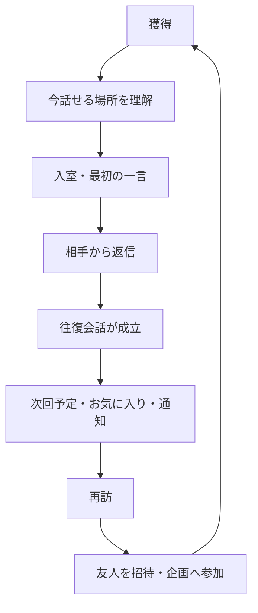
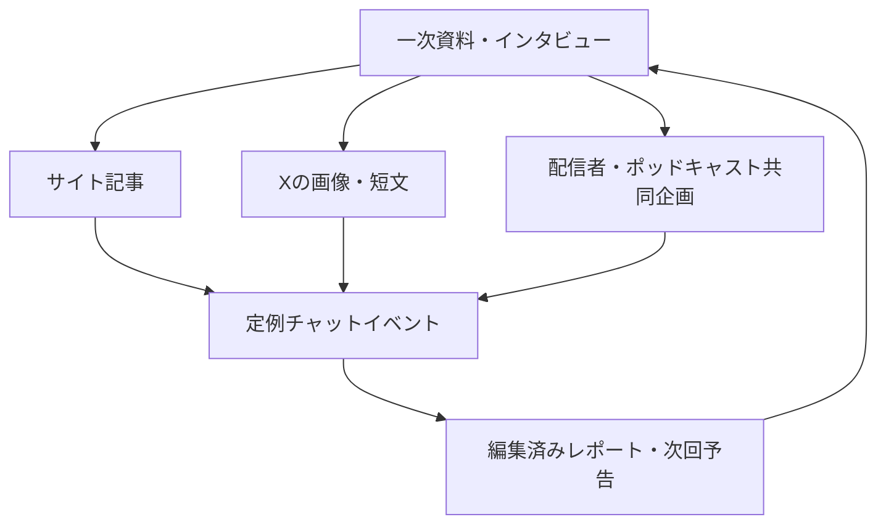

# お気楽チャット 成長戦略

最終更新: 2026-08-19

## 0. この文書の位置づけ

本書は、月間10万自然検索という個別目標から一段上がり、お気楽チャットを持続的に成長させるための全体計画を定める。対象はSEOだけではなく、流入獲得、初回体験、会話成立、リピート、紹介、コミュニティ運営、安全、計測、実装順序である。

2026-08-19時点のリポジトリ、公開サイト、検索結果、類似チャット／コミュニティの公開事例を監査した。Search Console、GA4管理画面、Supabase本番データにはアクセスしていないため、実トラフィック、部屋別稼働、継続率は未確認である。本文中の数値目標は、実績がない部分については最初の実験を判定するための仮説値であり、ベースライン取得後に更新する。

## 1. 経営判断としての結論

### 最重要課題は「流入不足」ではない

現在の最大の制約は、訪問者数ではなく、同じ時間に同じ部屋へ人が集まり、相手から返事を得られる確率である。

チャットは在庫型コンテンツと違い、供給側も利用者である。1万人が別々の時刻に81部屋へ来ても、誰とも話せなければ価値は生まれない。一方、毎週同じ時間に30人が3部屋へ集まり、会話が成立して再訪すれば、小さくても成長可能なコミュニティになる。

したがって、主目標を「月間セッション」から次へ変更する。

> 1週間に、他の参加者との往復会話が成立したユニーク参加者数を増やす

自然検索は重要だが、獲得チャネルの一つへ降格する。最初の90日は、流入拡大より会話密度、定例イベント、初回発言、再訪、招待を優先する。

### 採用する成長の順番

1. 未成年者を含む匿名チャットとして必要な安全基盤を整える
2. 計測を入れ、どこで会話が不成立になるかを可視化する
3. 実利用を3〜5部屋と特定時間帯へ集約する
4. 運営主催の定例イベントで、会話が成立する初期供給を作る
5. 初参加者が最初の一言を送り、返事を得るまでを支援する
6. イベント招待と適切なリマインドで再訪・紹介ループを作る
7. レトロ文化の一次資料、SNS、共同企画、広報、SEOで獲得を広げる
8. 会話成立率と継続率が確認できてから広告を小額で試す

## 2. 現状監査

| 項目     | 確認結果                                                                               | 成長上の意味                                                   |
| -------- | -------------------------------------------------------------------------------------- | -------------------------------------------------------------- |
| 部屋数   | `CHAT_ROOM_IDS` は82 ID。通常一覧81部屋＋まとめビュー `all`                            | 人と評価が分散する構造                                         |
| 公開状態 | 一覧対象81部屋はすべて `enabled: true`                                                 | 稼働状況による絞り込みがない                                   |
| 人数表示 | 直近6時間のユニーク通常発言者数                                                        | 現在接続中の人数ではなく、今話せる保証にならない               |
| 入室     | 名前必須。色、メール／URL、アバター等を選択可能                                        | レトロらしさは強いが、初回の意思決定が多い                     |
| 再訪支援 | 名前、色、メール／URL、アバター、訪問回数、最終訪問をlocalStorageへ保存                | 軽量な継続基盤はあるが、好きな部屋、予定、通知はない           |
| 会話支援 | おみくじ、look/unlook、ランキング                                                      | 話題切れ対策は限定的。発言数ランキングは量だけを促す恐れがある |
| 外部発信 | XタイムラインとX共有ボタン                                                             | 投稿→イベント→入室の計測導線がない                             |
| GA4      | `room_selected`、`chat_enter`、`message_sent`、`chat_exit` 等                          | 会話成立、相手の返信、再訪、招待の計測がない                   |
| SEO      | 部屋ごとの静的HTML、固有description、canonical、sitemap                                | クロール基盤はあるが、成長の主要制約ではない                   |
| 安全     | 利用規約はある。コード上で通報、ブロック、NGワード、独立した安全ガイド等を確認できない | 未成年向け集客と成長施策のブロッカー                           |
| 運用     | 定例イベント、ホスト、参加予定、リマインドの仕組みを確認できない                       | 人を同時刻へ集める運営システムがない                           |

### 現行競合から学ぶこと

- ChatPadは「1クリック」で匿名会話へ進ませ、時間価値を明快にしている。
- チャベリは現在人数、入室者の事前確認、ルームPR、招待、友だち、イベント、通知、無視、通報などを長年積み上げている。
- Discordのコミュニティ運営資料は、オンボーディング、3〜5個の初期タスク、運営者の歓迎、定例イベント、メンバー招待、継続率の計測を一体として扱っている。

全機能を模倣する必要はない。お気楽チャットでは、登録不要・レトロUI・ブラウザ完結を維持したまま、「今誰かと話せる」「次にいつ集まるか分かる」「もう一度戻れる」の3点を先に解く。

## 3. 誰の、どの用事を解決するか

### 最優先セグメント

#### A. 2000年代チャット経験者

- 想定: 現在30〜50代を中心とする旧利用者、類似サイト経験者
- 用事: 昔の空気を懐かしむ、昔の名前や仲間を探す、今の誰かと同じ話をする
- 強い導線: X、検索、個人ブログ、mixi等の既存コミュニティ、ネット文化の配信者、同窓会イベント
- 本サイトの優位性: 回顧記事だけでなく、実際に当時風の場へ入って会話できる

#### B. 大人の軽い匿名雑談需要

- 想定: 登録やプロフィール作成をせず、短時間誰かと話したい成人
- 用事: 暇つぶし、仕事後の雑談、趣味の話、気持ちの切り替え
- 強い導線: 検索、紹介リンク、SNSのイベント告知、話題ツール
- 本サイトの優位性: ランダム1対1ではなく、昔ながらの複数人ルーム

#### C. 平成・個人サイト・ネット文化の関心層

- 想定: 当時の経験者、若いレトロ文化ファン、研究・制作・発信者
- 用事: UIや文化を知る、一次資料を見る、イベントへ参加する
- 強い導線: アーカイブ、共同企画、記事、動画・ポッドキャスト、広報
- 本サイトの優位性: 復刻を運営する当事者の技術・文化記録

### 当面、集客対象にしないセグメント

小学生、中学生、高校生など未成年者を明示した集客は、安全機能、監視・通報運用、保護者向け情報、外部連絡先抑制等が整うまで拡大しない。匿名で見知らぬ相手と容易に連絡できる場には、児童被害へ悪用される現実的なリスクがある。SEO上の信頼性ではなく、プロダクト運営上のリリース条件として扱う。

## 4. 成長モデル

獲得だけを増やしても、B〜Eで落ちれば広告費や編集工数を浪費する。実装・運用の優先順位は、原則として右側の再訪・紹介よりも、B〜Eの会話成立を先にする。

## 5. 指標設計

### 北極星指標

**Weekly Reciprocal Chatters（WRC）**

1週間に、次の条件を満たしたユニークな匿名参加者数とする。

- 通常メッセージを2件以上送信
- 同じ会話時間帯に、別の参加者から通常メッセージを1件以上受信
- 入退室システム文、bot、同一人物の連投は除外

「30分以内に相互発言」等の厳密な会話セッション定義は、実データを見て確定する。表示名は衝突・変更があるため集計IDに使わず、localStorageへ保存するランダムな `visitor_id` とセッションIDを、同意・プライバシー設計の範囲内で利用する。

### 成長ファネル

| 段階     | 主指標                    | 補助指標                                 |
| -------- | ------------------------- | ---------------------------------------- |
| 獲得     | チャネル別ユニーク訪問    | UTM、自然検索、紹介、イベント、直接流入  |
| 理解     | 稼働ハブからの部屋選択率  | 稼働人数表示、イベント閲覧、空室到達率   |
| 入室     | `chat_enter`              | 入室フォーム開始・完了、エラー、所要時間 |
| 初回発言 | `chat_first_message`      | 入室からの秒数、話題カード利用           |
| 会話成立 | `conversation_activated`  | 最初の返信時間、3往復到達率、空振り率    |
| 継続     | W1／W4再訪率              | 同じ曜日・時間帯への再訪、お気に入り利用 |
| 紹介     | 招待経由のactivated参加者 | 招待作成率、開封率、参加率               |
| 安全     | 重大通報率と対応時間      | ブロック、NGワード、レート制限、削除依頼 |

### イベント定義

既存イベントを残し、少なくとも次を追加する。

| イベント                    | 主なパラメータ                               |
| --------------------------- | -------------------------------------------- |
| `active_lobby_view`         | `source`, `active_room_count`, `event_id`    |
| `room_join_started`         | `room_id`, `source`, `event_id`              |
| `chat_first_message`        | `room_id`, `seconds_from_enter`, `prompt_id` |
| `reciprocal_reply_received` | `room_id`, `seconds_bucket`                  |
| `conversation_activated`    | `room_id`, `activation_rule`, `event_id`     |
| `event_rsvp`                | `event_id`, `room_id`                        |
| `event_join`                | `event_id`, `room_id`, `source`              |
| `invite_created`            | `room_id`, `event_id`, `invite_type`         |
| `invite_opened`             | `invite_id`, `source`                        |
| `invite_activated`          | `invite_id`, `room_id`                       |
| `reminder_opt_in`           | `channel`, `context`, `event_id`             |
| `reminder_click`            | `channel`, `event_id`                        |
| `report_submitted`          | `reason_category`, `room_id`                 |

メッセージ本文、表示名、メールアドレス、URL、検索語等の自由入力をGA4へ送らない。現在の「E-Mail/URL」欄は公開プロフィール的な入力であり、リマインド配信の同意取得には流用しない。

### 週次ダッシュボード

- WRC、初回参加者WRC、既存参加者WRC
- 時間帯別の現在接続人数とp50／p90
- 入室→初回発言→返信→会話成立の転換率
- 最初の相手返信までの中央値、空室到達率
- D1、W1、W4再訪率を獲得チャネル・イベント別に比較
- 上位3〜5部屋が通常発言とWRCに占める割合
- イベントの予定、参加、会話成立、次回再訪
- 招待経由の会話成立者、招待係数
- 通報、ブロック、重大事案、対応時間

月間PVと総発言数は参考値にする。発言数だけを増やすランキングやbot発言でWRCを水増ししない。

## 6. 施策候補を広く評価する

スコアは5段階の相対評価であり、`優先度 = Impact × Confidence ÷ Effort` の参考値である。安全基盤はスコアに関係なく必須とする。

| 施策                                   | Impact | Confidence | Effort | 判定             |
| -------------------------------------- | -----: | ---------: | -----: | ---------------- |
| 安全・通報・ブロック・運用SLA          |      5 |          5 |      4 | P0・必須         |
| 稼働部屋を3〜5へ集約                   |      5 |          5 |      3 | P0               |
| 本当の現在接続をPresenceで表示         |      5 |          4 |      3 | P0               |
| 毎週同時刻の運営ホスト付きイベント     |      5 |          4 |      2 | P0               |
| 初回の話題カードと歓迎導線             |      4 |          4 |      2 | P1               |
| 日時・話題入りの招待リンク             |      4 |          4 |      2 | P1               |
| イベント予定・参加表明                 |      4 |          4 |      3 | P1               |
| 成功体験後の通知／予定登録             |      4 |          3 |      3 | P1               |
| 旧利用者・既存コミュニティへの個別広報 |      4 |          4 |      2 | P1               |
| レトロ文化の一次資料・共同企画         |      4 |          3 |      3 | P1               |
| Xの定例運用                            |      3 |          4 |      2 | P1               |
| 配信者・ブログ・ポッドキャスト連携     |      4 |          3 |      3 | P2               |
| 会話ネタ生成ツール                     |      3 |          3 |      4 | P2               |
| 一般SEO記事                            |      2 |          3 |      3 | P2               |
| LINE公式／メールの定期配信             |      3 |          2 |      4 | 検証後           |
| 有料広告                               |      2 |          2 |      2 | activation確立後 |
| モバイルアプリ化                       |      2 |          2 |      5 | 今はしない       |
| 81部屋の長文化                         |      1 |          2 |      4 | しない           |
| 生チャットログの検索公開               |      1 |          1 |      5 | しない           |

## 7. 深掘りする最重要施策

### 7.1 安全を成長基盤にする

#### 実装

- 各発言から2操作以内で通報できる
- 特定ユーザーの発言を端末単位で即時非表示にできる
- 電話番号、メール、SNS ID、住所等の外部連絡先パターンを警告・抑制する
- NGワード、連投、同文、URL、接続元等で段階的なレート制限を行う
- 管理画面で通報、対象ログ、対応状況、判断理由を記録する
- 安全ガイド、プライバシーポリシー、削除依頼、相談先、運営者情報を公開する
- 重大カテゴリごとの初動時間とエスカレーション先を運用手順にする
- 未成年向けページは完了まで `noindex` とsitemap除外を行う

#### リリース条件

- PC／モバイルでテスト通報とブロックが完了する
- 運営者がテスト通報を確認し、対応記録を残せる
- 利用規約の「監視しない」という記述と実運用が矛盾しない
- 緊急性のある投稿を誰が、いつ、どこへ連携するかが明記されている

### 7.2 「今話せる」ハブと部屋集約

#### 体験

`/chat/` を全部屋一覧ではなく、次を示す稼働ロビーにする。

- 現在オンラインの人数
- 直近の通常発言時刻
- 現在の話題またはイベント
- 初参加者向けの推奨部屋
- 次の定例イベント
- レトロな全部屋一覧への副導線

Supabase Realtime Presenceは、online/offlineや現在ページのような低頻度状態に適している。現在の6時間発言者数は「直近6時間に発言した人数」と正しく表示し、Presence実装後にのみ「現在オンライン」と表現する。

#### 部屋選定

部屋名を先に決めず、28日データで最大5つを選ぶ。

- 会話成立セッション: 40%
- 発言があった日数: 25%
- ユニーク通常発言者: 20%
- 初参加者の会話成立率: 15%

最初は「総合雑談」「レトロ／同窓会」「趣味」の3用途で十分かを検証する。残りの部屋は削除せず、歴史的な街並みとして残す。ただし主CTA、トップの目立つ導線、index対象は稼働部屋へ集中する。

#### 成功判定

4週間の前後比較で次を確認する。

- 空室到達率が半減
- 入室者の会話成立率が相対20%以上改善
- 最初の返信までの中央値が短縮
- 上位部屋へWRCの70%以上が集約

母数が小さい場合は有意差検定を無理に行わず、曜日・時間帯を揃えたコホートで判断する。

### 7.3 毎週の運営ホスト付きイベント

イベントは宣伝企画ではなく、リアルタイムサービスの供給を作る運用である。最初の8週間は、運営が確実に在席する。

#### 基本フォーマット

- 毎週金曜 21:00〜22:00等、同じ曜日・時間で固定
- 1回1テーマ、1部屋、ホスト1名＋安全担当1名
- 20:50にロビーを開け、参加者を歓迎
- 21:00、21:15、21:30に話題カードを投入
- 21:50に次回テーマ投票と予定案内
- 終了後に参加者数、会話成立、通報、改善点を記録

最初の候補:

- 「2000年代のチャットで使っていた名前・部屋」
- 「平成インターネット黒歴史供養会」
- 「今も覚えているアニメ・ゲーム・Flash」
- 「大人になった元学生たちの金曜雑談」

#### イベントページ

各イベントは永続URLを持ち、日時、テーマ、対象、ルール、参加ボタン、予定登録、共有、終了後の編集済みレポートを表示する。生ログは公開しない。

#### 8週間の継続基準

- 予定表明者の30%以上が実参加
- 参加者の50%以上が会話成立
- 4回目までにイベントWRCが初回比で増加
- 参加者の20%以上が4週間以内に再参加
- 重大安全事案に運用SLA内で対応

数値未達でも、参加者インタビューで明確な改善仮説が得られる場合は4回だけ延長する。

### 7.4 初参加者を最初の返信まで案内する

#### フォーム簡略化

- 初回必須は名前だけにする
- 色とアバターは「あとで変更」に畳む
- E-Mail/URL欄は初回フォームから外すか、用途と公開範囲を明確化する
- 前回設定がある再訪者は1操作で入室できる
- 入室前に「今この部屋で話している人数／話題」を表示する

#### 入室後の支援

- 「こんばんは」「どこから来ましたか」等の定型文ではなく、現在の話題に合う3つの発言候補を出す
- クリックで入力欄へ入れ、送信前に本人が編集できる
- ホストが新規参加者を歓迎する
- 60秒返信がなければ、別の稼働部屋または次のイベントを案内する
- botの自動返信を人間の返信としてWRCに数えない

#### 実験

低トラフィック時はA/Bテストではなく、2週間ずつの段階導入で比較する。

1. 現行
2. 名前だけの簡略フォーム
3. 簡略フォーム＋話題カード
4. 簡略フォーム＋話題カード＋ホスト歓迎

評価は入室完了率、初回発言率、返信受信率、会話成立率、安全指標で行う。

### 7.5 日時・話題入りの招待リンク

単なる部屋URLではなく、次の情報を持つ招待を作る。

- 部屋
- 集合日時
- 話題
- 招待者が設定した短いメッセージ
- カレンダー追加
- 参加前の安全ルール

例: `金曜21時に「昔使っていたハンドルネーム」の話をしませんか`

招待リンクは個人情報を含まない短いIDで表現する。招待者の表示名を公開する場合は明示的に選ばせる。リンク作成、開封、入室、会話成立を同一invite IDで測る。

成功基準の初期仮説:

- WRC参加者の10%以上が招待を作成
- 招待開封者の20%以上が入室
- 招待入室者の会話成立率が通常流入以上
- スパム招待・嫌がらせに対する停止、期限、通報が機能する

### 7.6 再訪の仕組み

#### 先に作るもの

- 好きな部屋を端末へ1つ保存
- 次回イベントをサイト上に常時表示
- `.ics` カレンダー追加
- 前回の名前・色・アバターで再入室
- 「毎週金曜21時」の定例性

#### 通知は成功体験の後だけ求める

Web Pushは適時・関連性の高い情報なら再訪に使えるが、ページ表示直後の権限要求は不信と拒否を生む。次の条件でのみ案内する。

- 1回以上会話が成立した
- イベントへ参加表明した
- 「この部屋の開催予定を知らせる」を自分で選んだ

通知内容はイベント開始、参加表明した予定、明示的に選んだ部屋の開催だけに絞る。停止ボタン、静かな時間、頻度上限を設ける。

Web Pushの実装前はカレンダー追加で需要を測る。メールやLINE公式を使う場合も別の同意画面を設け、現行のE-Mail/URL欄を流用しない。外部Discord／LINEオープンチャットを主コミュニティにすると、本体の会話をさらに分散するため、告知・リマインド用途に限定する。

### 7.7 レトロ文化を獲得ループにする

「平成レトロ」を一般的に語るのではなく、このサイトしか持てない一次資料を作る。

#### コンテンツ

- 放課後学生タウンの確認可能な年表
- 部屋名、文字色、ハンドルネーム、入退室、更新、コマンドの文化
- 復刻で再現した点と、安全・モバイル対応のために変えた点
- 旧利用者への同意済みインタビュー
- 当時の名前を公開せずに投稿できる「思い出募集」
- 毎年の「平成インターネット回顧調査」

#### 1素材を複数チャネルへ展開

#### 広報

- 旧サイト・個人サイト・平成文化を扱う運営者へ、文脈を添えて個別に連絡する
- 既存コミュニティへは管理者の許可を取り、リンク投下ではなく共同イベントを提案する
- 配信者には広告依頼だけでなく、復刻UI体験、旧利用者インタビュー、同窓会企画を提供する
- Wikipediaの宣伝編集は行わない。独立した信頼できる出典が増える状態を先に作る

## 8. 流入チャネル戦略

### チャネルごとの役割

| チャネル           | 役割                             | 最初の施策                                   | 成功指標             | 注意点                     |
| ------------------ | -------------------------------- | -------------------------------------------- | -------------------- | -------------------------- |
| 直接・再訪         | 最も質の高い継続利用             | 定例時刻、ブックマーク、お気に入り、予定登録 | W1／W4、WRC          | 習慣ができる前に通知しない |
| メンバー紹介       | 同時参加を作る                   | 日時・話題入り招待                           | invite activated     | 迷惑招待対策               |
| X                  | 旧利用者発見、実況、イベント告知 | 思い出カード＋毎週の開催案内                 | event join、指名流入 | 投稿数を目的化しない       |
| 既存コミュニティ   | 同窓会層への到達                 | 管理者許可の共同イベント                     | activated参加者      | 宣伝スパム禁止             |
| 共同企画・広報     | 信頼とまとまった流入             | 配信者、ブログ、ポッドキャスト               | WRC、参照ドメイン    | PVだけで評価しない         |
| アーカイブ・SEO    | 継続的な発見                     | 一次資料、会話支援ツール                     | 非指名流入→WRC       | 記事量産しない             |
| LINE／メール／Push | 再訪                             | 参加表明イベントの通知                       | reminder return      | 明示同意、頻度制限         |
| 有料広告           | メッセージ検証                   | 小額のイベント告知                           | cost per activated   | activation前に拡大しない   |

### 最初の外部チャネルは2つに絞る

同時に全SNSを運用しない。最初の8週間は次を推奨する。

1. **X自社運用**: 2000年代ネット経験者への到達、リアルタイム告知、既存サイトとの相性
2. **共同企画／個別広報**: 既に平成文化・個人サイト・懐古コンテンツの読者を持つ発信者から、信頼と一緒に送客

YouTube、TikTok、Instagramは、内製の継続体制ができるまで自社チャンネルを増やさず、まず共同企画で反応を見る。LINEは広い利用率があっても公開発見チャネルではないため、再訪の許諾チャネルとして後から試す。

### Xの8週間運用例

- 火曜: 当時のUI・用語・部屋の記憶を1投稿
- 木曜: 今週のテーマと参加方法
- 金曜20:30: 開催30分前の案内
- イベント終了後: 個人情報を含まない短い振り返りと次回予告

全リンクにUTMを付け、インプレッション、フォロワー、いいねではなく、イベント参加とWRCまで追う。投稿制作がイベント運営を圧迫する場合は週2本へ減らす。

### 有料広告の開始条件

次を4週間満たすまで広告は拡大しない。

- 稼働部屋の会話成立率50%以上
- イベント参加者の会話成立率60%以上
- 初参加者のW1再訪率が測定可能で改善傾向
- 通報対応SLAが守られている

開始時は1チャネル、1イベント、1訴求で上限を決めた小額実験にする。評価単価はクリックや入室ではなく `cost per first-time WRC` と `cost per W1 retained WRC` を使う。

## 9. 90日実行計画

### 0〜2週: 安全・計測・ベースライン

- 通報、ブロック、連絡先抑制、レート制限、運用SLAの仕様決定
- 未成年向けページのindex停止
- `visitor_id`、会話成立、イベント、招待、再訪イベントのデータ設計
- 直近28〜90日の部屋別通常発言者、時間帯、相互発言を集計
- GA4／Search Consoleのチャネル・ランディング基準値を保存
- 毎週イベントの曜日、担当、緊急連絡、記録テンプレートを決定

成果物: 安全運用手順、計測仕様、ベースライン、稼働候補5部屋、イベント8回分の日程。

### 3〜4週: 稼働ロビーと集約

- `/chat/` 稼働ロビー
- Supabase Presenceによる現在接続
- 3〜5稼働部屋の選定と主導線集約
- 空室から稼働部屋への案内
- 6時間発言者数の表現修正
- 初回フォームの簡略化

成果物: 「今話せる場所」が1画面で分かり、現在接続とイベント予定が表示される。

### 5〜8週: 4回の定例イベントと初回会話支援

- 毎週同時刻に4回開催
- ホスト・安全担当が在席
- 話題カード、歓迎、返信なし救済導線を段階導入
- X運用と既存コミュニティへの許可制案内
- 参加表明、カレンダー追加、イベント計測
- 各回24時間以内に運用レビュー

ゲート: イベントWRCと通常時間帯WRCが増えない場合、外部流入を増やさず、時間、テーマ、部屋、歓迎方法を修正する。

### 9〜12週: 招待・再訪・共同企画

- 日時・話題入り招待リンク
- 好きな部屋、次回予定、再入室
- 会話成立後の通知需要を測るUI。まずカレンダー追加
- レトロ文化の一次資料3本
- 発信者・運営者との共同企画2件を打診
- 会話ネタツールは、イベント内話題カードの利用データを基にMVP判断

成果物: 獲得→会話成立→再訪→招待の一周を計測可能にする。

## 10. 90日後の意思決定

### 続行・拡大

- WRCが4週移動平均で増加
- 稼働部屋で会話成立率50%以上
- 初参加W1再訪率15%以上
- 定例イベントの再参加率20%以上
- 紹介または共同企画から継続的にWRCが発生
- 安全運用SLAを維持

この場合、イベントテーマ、ホスト、共同企画、アーカイブ、会話ネタツールを増やす。SEOは実際にWRCへつながった検索意図だけ展開する。

### 改善継続

- 訪問・入室は増えたが会話成立が弱い
- イベント時だけ成立し、通常時間帯へ波及しない
- 初回会話は成立するがW1再訪が弱い

それぞれ、部屋集約、開催頻度、次回予定、再訪導線の該当箇所だけを4週間改善する。新チャネルを追加しない。

### 縮小・再定義

- 8回の運営イベント後もWRCが増えない
- ホスト不在では会話が成立しない
- 旧利用者層、匿名雑談層、文化関心層のいずれにも強い継続がない
- 安全運用コストを維持できない

この場合、常時チャットの大規模成長を追わず、「月数回のレトロ同窓会イベント＋文化アーカイブ」へプロダクトを再定義する。月間10万流入目標も凍結する。

## 11. 実装PRへの分割

1. `growth-measurement`: 匿名ID、conversation activation、チャネル、コホート計測
2. `safety-foundation`: 通報、ブロック、抑制、レート制限、管理運用、安全ページ
3. `active-lobby-presence`: `/chat/`、Presence、人数表現、部屋集約
4. `entry-activation`: 入室簡略化、話題カード、返信なし救済
5. `hosted-events`: イベントデータ、参加表明、予定登録、運営画面
6. `scheduled-invites`: 日時・話題入り招待、計測、期限・停止
7. `return-loop`: お気に入り、次回予定、再入室、通知需要計測
8. `retro-archive-pilot`: 一次資料3本、出典、同意、訂正フロー
9. `topic-tool-mvp`: イベントデータで需要確認後の会話ネタツール
10. `seo-content-platform`: 勝った意図が確認できた後の静的記事基盤

各PRは機能だけでなく、対応イベント、成功指標、ロールバック条件を含める。

## 12. 今はやらないこと

- 81部屋すべてのSEO長文化
- 一般論の会話記事50〜60本
- SNSアカウントの一斉開設
- 会話成立前のPush許可要求
- メール／URL欄を使った無断リマインド
- 外部Discord／LINEコミュニティへの本体機能移転
- 生チャットログの公開・index
- DM、1対1チャット、外部連絡先交換の促進
- 発言数、連続訪問、煽り通知による依存的ゲーミフィケーション
- activation未確認の有料広告拡大
- ネイティブモバイルアプリ
- 安全体制がない状態での未成年者向け集客

## 13. 参考資料

### コミュニティ成長・競合

- [Discord: Understanding Server Insights](https://discord.com/community/understanding-server-insights)
- [Discord: Community Onboarding FAQ](https://support.discord.com/hc/en-us/articles/11074987197975-Community-Onboarding-FAQ)
- [Discord: Server Guide FAQ](https://support.discord.com/hc/en-us/articles/13497665141655-Server-Guide-FAQ)
- [Discord: Growing Your Server Community Through Member Referrals](https://discord.com/community/growing-your-community-through-member-referrals)
- [Discord: Understanding Event Metrics](https://discord.com/community/understanding-event-metrics)
- [チャベリ](https://www.chaberi.com/)
- [チャベリ: よくある質問](https://www.chaberi.com/static/faq)
- [ChatPad: 初めての方へ](https://chatpad.jp/beginner.html)

### 技術・再訪

- [Supabase Realtime Presence](https://supabase.com/docs/guides/realtime/presence)
- [Web permissions best practices](https://web.dev/articles/permissions-best-practices)
- [Push notifications overview](https://web.dev/articles/push-notifications-overview)
- [GA4 Retention overview](https://support.google.com/analytics/answer/11004084)
- [GA4 Cohort exploration](https://support.google.com/analytics/answer/9670133)

### 安全

- [警察庁: SNSを悪用した犯罪の実態と対策](https://www.npa.go.jp/hakusyo/r07/honbun/html/bbf111000.html)
- [こども家庭庁: 普及啓発リーフレット集](https://www.cfa.go.jp/policies/youth-kankyou/leaflet)
- [警察庁: インターネット上の誹謗中傷等への対応](https://www.npa.go.jp/bureau/cyber/countermeasures/defamation.html)
- [Discord: Commitment to Teen and Child Safety](https://discord.com/safety/commitment-to-teen-child-safety)
- [Google: Prevent user-generated spam](https://developers.google.com/search/docs/monitor-debug/prevent-abuse)

### 獲得・SEO

- [総務省「令和6年度情報通信メディアの利用時間と情報行動に関する調査」公表案内（国立国会図書館）](https://current.ndl.go.jp/car/254953)
- [Google: Creating helpful, reliable, people-first content](https://developers.google.com/search/docs/fundamentals/creating-helpful-content)
- [Google Search spam policies](https://developers.google.com/search/docs/essentials/spam-policies)
- [Google: Understand JavaScript SEO basics](https://developers.google.com/search/docs/crawling-indexing/javascript/javascript-seo-basics)

外部事例は成功を保証するものではない。お気楽チャットの判断は、WRC、会話成立、再訪、安全の実測値を優先する。
