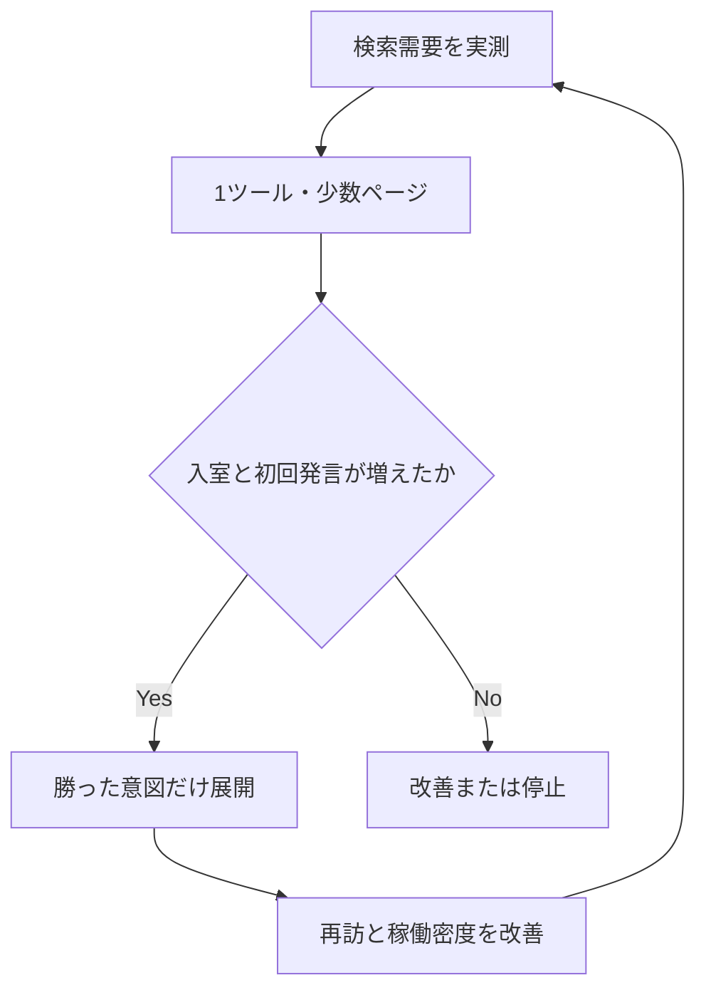

# お気楽チャット 自然検索成長計画

最終更新: 2026-08-19

## 結論

月間10万の自然検索セッションは、現時点では「計画値」ではなく12〜18か月以上のストレッチ目標である。Search Consoleの実績、検索需要、被リンク、継続率が提示されていないため、達成確率や到達時期はまだ算出できない。

元案の方向性は半分正しい。82ページのmetaタグを整えるだけでは足りず、部屋の過疎分散を先に直す必要がある。一方、次の見立ては楽観的すぎる。

- 「2000年代チャット文化」は強い差別化要因だが、月間10万を単独で支える検索市場とは確認できない。
- 「会話ネタ」は需要が広い代わりに、大手求人・恋愛・生活メディアと専用ジェネレーターが既に競合している。一般論の記事50本では勝ちにくい。
- 検索者が会話ネタを探す場面は、デート、職場、学校、配信などが中心であり、匿名チャットへの参加意図とは一致しないことが多い。「記事を読めば入室する」という前提は置けない。
- 81部屋すべてをindex可能なまま強化すると、利用者、内部リンク、クロール、評価が分散する。固有文を70〜120文字にしても、検索者への価値が薄ければ薄いページ群であることは変わらない。
- 小学生・中学生を明示的に集客しながら、現行規約が「投稿内容の監視・保証は行いません」としている状態は、SEOより先に解消すべきプロダクトリスクである。

最も効果が期待できる順番は次である。

1. 安全対策と計測を整え、実利用を3〜5部屋へ集約する
2. 会話ネタツールを1つだけ作り、検索流入と会話開始の両方を90日で検証する
3. 運営者しか作れない一次資料として、放課後学生タウン／2000年代チャット文化のアーカイブを小さく公開する
4. 実測で反応した検索意図だけを記事・ツール・調査へ展開する

「50記事を公開する」は目標にしない。北極星指標は、自然検索から来た利用者が最初の通常メッセージを送り、再訪することである。

## 監査で確認した事実

2026-08-19時点のリポジトリと公開サイトを確認した。Search Console、GA4管理画面、Supabase本番データにはアクセスしていないため、検索流入、検索クエリ、実際の部屋稼働率は未確認である。

| 項目           | 確認結果                                                                                                       | 判断                                                                               |
| -------------- | -------------------------------------------------------------------------------------------------------------- | ---------------------------------------------------------------------------------- |
| URL数          | `CHAT_ROOM_IDS` は82 ID。内訳は通常の一覧対象81部屋と、まとめビュー `all`                                      | 「既存82部屋」ではなく「81部屋＋まとめ1ページ」と定義する                          |
| 公開状態       | 一覧対象81部屋はすべて `enabled: true`                                                                         | 分散を抑える仕組みがない                                                           |
| ルーティング   | トップ、`/chat/:id`、`/chanari/:id`、404のみ                                                                   | 記事・ツール・アーカイブの公開基盤は未実装                                         |
| 静的HTML       | 部屋ごとにtitle、description、canonical、本文、関連リンクをプリレンダ                                          | 最低限のクロール要件は満たす。検索価値の十分条件ではない                           |
| サイトマップ   | トップ＋81部屋＋`/chat/all` を生成                                                                             | index対象の選別がなく、全URLへ評価を分散している                                   |
| 末尾スラッシュ | `/chat/anime` はGitHub Pagesで `/chat/anime/` へ301。canonicalとsitemapはスラッシュなし                        | 致命傷ではないが、最終200 URLに統一すべき                                          |
| GA4            | `page_view` 相当、`room_selected`、`chat_enter`、`message_sent`、`chat_exit` を送信                            | ファネルの材料はあるが、検索ランディング種別、CTA、ツール利用、7日再訪の設計が不足 |
| 参加人数       | トップの人数は現在接続数ではなく、直近6時間のユニーク通常発言者数                                              | 「現在の参加人数」と表示・施策判断に使うと誤認を招く                               |
| 安全導線       | 利用規約はあるが、コード検索では通報、ブロック、NGワード、独立した安全ガイド／プライバシーページを確認できない | 未成年向け集客を拡大する前のブロッカー                                             |
| 検索露出       | Google検索でトップと複数の部屋ページを確認                                                                     | index自体は始まっている。ただし `site:` の件数はKPIにしない                        |

## 元案の辛口レビュー

| 元案                                     | 評価                                                               | 現実的な修正                                                                                                                   |
| ---------------------------------------- | ------------------------------------------------------------------ | ------------------------------------------------------------------------------------------------------------------------------ |
| レトロチャットを一次ポジションにする     | 採用。ただし集客の主柱ではなく、指名検索・広報・被リンクの差別化軸 | 「復刻を実際に運営している当事者の一次資料」に限定し、一般的な平成回顧記事を量産しない                                         |
| 会話支援記事を大量に作る                 | 条件付き。SERPは大手メディアが強く、一般論では勝てない             | ツールの利用データ、匿名チャットで実際に会話が続いた問い、運営上の知見を加えられるテーマだけ作る                               |
| 会話ネタ生成ツールを最大の流入装置にする | 仮説として採用。ただし既に競合ツールが複数ある                     | ランダム出題で終わらせず、相手との関係、避けたい話題、会話の深さ、利用場面で絞り、コピー／共有／チャット投入まで測る           |
| 部屋診断を作る                           | 後回し                                                             | 人がいない部屋を推薦すると失敗体験になる。稼働部屋集約後に、最大5部屋から選ぶ診断として実装する                                |
| 主要10部屋を長文化する                   | 優先度を下げる                                                     | まず14〜28日の実利用データでindex対象を5〜10ページに選別する。文章量ではなく、稼働・固有価値・検索意図で判断する               |
| 50〜60記事を作る                         | 不採用                                                             | 90日でツール1、アーカイブ3、支援記事3〜5まで。各URLに継続／改善／停止判定を付ける                                              |
| UGCをDiscussionForumPostingで公開する    | 当面不採用                                                         | 構造化データは品質や安全性を作らない。永続トピック、事前／事後モデレーション、削除窓口、スパム対策が揃ってから別企画で検討する |
| Discover向け画像を全記事に用意する       | 優先度は低い                                                       | Discoverは保証されない。固有画像が内容理解や共有に効くページだけ制作し、ロゴの使い回しを避ける                                 |
| Core Web Vitals改善                      | 継続                                                               | 合否はラボ値だけでなくCrUXのモバイル／デスクトップ別75パーセンタイルで判定する。データ不足時はRUMを併用する                    |

### この戦略で最も危険な思い込み

#### 1. 検索需要と事業価値を混同している

「会話ネタ」は広い需要を持ちうるが、その訪問者が匿名チャットへ入るとは限らない。検索セッションが増えても、広告収益や別の事業価値を持たない限り、会話参加へ転換しなければサーバー・編集・モデレーションコストだけが増える。

したがって、自然検索セッション数と同じ重要度で `検索ランディング → 入室 → 初回メッセージ → 7日以内再訪` を計測する。

#### 2. 独自性だけで市場規模を補えると考えている

「放課後学生タウン」は本サイトとの適合性が非常に高い。一方で、検索結果にはWikipedia、現存する `houkago.org`、LINEオープンチャット、個人の回顧記事が既にある。狭いテーマで首位を取れても、それだけで月間10万には届かない可能性が高い。

ここはトラフィック量より、引用、指名検索、外部メディア掲載、旧利用者の再訪を狙う。

#### 3. ツールなら自然にリンクされると考えている

会話ネタのジェネレーター、ガチャ、ルーレットは既に存在する。機能差がないツールは検索にも共有にも弱い。最初のツールには、次の最低条件を置く。

- 3タップ以内に結果が出る
- 相手との関係と場面を選べる
- センシティブな話題を除外できる
- 1問だけでなく、答えへの「次の一問」まで提案する
- 結果をコピー、共有、チャット入力へ渡せる
- どの条件・話題が実際の初回発言と継続会話につながったかを匿名集計できる
- 生成AI APIを必須にせず、編集済みデータセットで高速・低コストに動く

#### 4. 安全対策をSEO施策の一項目として扱っている

未成年を名指しした部屋が検索に出ている一方、現行規約には監視しない旨がある。この状態で小中高生向けページの順位と流入を伸ばすべきではない。安全対策は「信頼性向上施策」ではなく、集客を始めるためのリリース条件である。

## 採用する成長モデル

### 役割を分ける

| ページ群               | 主目的                       | 成功指標                                                      |            初期本数 |
| ---------------------- | ---------------------------- | ------------------------------------------------------------- | ------------------: |
| チャットハブ／稼働部屋 | 会話開始                     | `chat_enter`、初回 `message_sent`、会話相手あり率             | 1ハブ＋3〜5稼働部屋 |
| 会話ネタツール         | 非指名流入と会話開始         | GSCクリック、結果生成率、コピー率、チャット投入率、初回発言率 |                   1 |
| 支援記事               | ツールで解決できない説明     | 非指名クリック、ツール利用、入室補助                          |                3〜5 |
| 文化アーカイブ         | 指名・引用・広報・自然リンク | 参照ドメイン、指名検索、旧利用者投稿                          |                   3 |
| 安全／運営情報         | 利用障壁と事故の低減         | 通報対応時間、安全導線閲覧、離脱理由                          |            必須一式 |

## 90日実行計画

### Phase 0: 0〜2週 — 安全と計測をリリース条件にする

#### 安全

- 小学生、中学生、中学生3、小・中学生、10代など未成年を直接対象にするページを、対策完了までsitemapから外し、静的HTMLで `noindex` にする。
- 通報、ユーザーブロック、NGワード／外部連絡先抑制、レート制限、削除依頼窓口、運営者情報、プライバシーポリシー、安全ガイドを実装する。
- 規約の「監視・保証は行いません」と実際の運用方針を整合させ、通報受付時間、対応基準、ログ保持、違反時の措置を明示する。
- チャットログは引き続きindexさせない。URLを自動リンクする場合は、公開UGCでは `rel="ugc nofollow"` を使う。

完了条件: PC／モバイルの入室後画面から2操作以内で通報・ブロックでき、運営がテスト通報を受けて記録・対応できる。

#### 計測

現行イベントを残し、次を追加する。

| イベント                | 必須パラメータ                                                                           |
| ----------------------- | ---------------------------------------------------------------------------------------- |
| `seo_landing_view`      | `landing_type`, `content_id`, `query_cluster`（URLから定義し、検索語そのものは送らない） |
| `content_cta_click`     | `content_id`, `cta_type`, `destination_room_id`                                          |
| `topic_generated`       | `relationship`, `scene`, `depth`, `topic_id`                                             |
| `topic_copied`          | `topic_id`                                                                               |
| `topic_chat_prefill`    | `topic_id`, `destination_room_id`                                                        |
| `chat_first_message`    | `room_id`, `landing_type`, `content_id`                                                  |
| `chat_partner_response` | `room_id`, `seconds_to_response_bucket`                                                  |

メッセージ本文、氏名、メール、検索語などの個人情報・自由入力はGA4へ送らない。7日再訪はGA4のコホート／保持レポートと、必要なら同意設計に沿った匿名のファーストパーティIDで確認する。

#### ベースライン

Search Consoleで過去16か月と直近28日をエクスポートし、以下をページ／クエリ単位で保存する。

- クリック、表示回数、CTR、平均掲載順位
- ブランド／非ブランド
- トップ／部屋／今後のツール／記事／アーカイブ
- モバイル／デスクトップ
- index状況、クロール済み未登録、重複、soft 404

GA4では自然検索ランディング別に `room_selected → chat_enter → chat_first_message → chat_partner_response` のファネルを作る。

### Phase 1: 2〜4週 — 過疎分散を止める

1. Supabaseの直近28日データから、部屋別に通常発言者、発言日数、相手から返信があったセッション、時間帯を集計する。
2. 次のスコアで稼働部屋を最大5つ選ぶ。部屋名を先に決めない。
   - 直近28日の会話相手ありセッション: 50%
   - 発言があった日数: 25%
   - ユニーク通常発言者: 15%
   - 検索流入後の初回発言: 10%
3. `/chat/` を「全部屋一覧」ではなく「今話せる場所を選ぶハブ」として追加する。
4. トップとコンテンツの主CTAは、個別の空室ではなく稼働部屋を優先する。
5. 6時間のユニーク発言者数は「現在参加中」ではなく「直近6時間に発言した人数」と表示する。リアルタイムpresenceを実装できる場合だけ「現在」に変更する。
6. 残りの部屋は廃止しない。レトロな部屋一覧として閲覧可能にし、入室前に稼働状況と「会話中の部屋へ」導線を出す。

index対象は当初5〜10部屋に絞る。検索意図が明確で固有価値があるページだけindexし、残りは `noindex,follow` とsitemap除外を使う。別意図の部屋を稼働部屋へcanonicalすることはしない。

### Phase 2: 4〜8週 — 1つのツールで需要を検証する

公開するのは `/tools/conversation-topic-generator/` の1ページだけとする。

#### MVP

- 条件: 相手との関係、場面、会話の深さ、避けたいカテゴリ
- 出力: 最初の質問、答えに応じた掘り下げ2つ、避けるべき聞き方
- 操作: もう一度、コピー、共有、この話題でチャット
- 事前編集済みの話題データを利用し、同じ条件でも十分なバリエーションを持たせる
- 本文に、使い方、場面別例、安全上避けたい質問、編集方針を静的HTMLで含める
- クエリパラメータの組み合わせをindexさせず、canonicalはツール本体へ固定する

#### 90日後の継続基準

公開から90日または自然検索クリック1,000件の遅い方で評価する。初期データが少ないため、数値は仮説として運用中に補正する。

| 指標                    |      継続 |     改善 | 停止／別用途化 |
| ----------------------- | --------: | -------: | -------------: |
| 非指名GSCクリック／28日 | 1,000以上 | 200〜999 |        200未満 |
| 結果生成率              |   45%以上 |  25〜44% |        25%未満 |
| コピー＋共有率          |   12%以上 |   5〜11% |         5%未満 |
| チャット投入率          |    5%以上 |    1〜4% |         1%未満 |
| 投入後の初回発言率      |   40%以上 |  20〜39% |        20%未満 |

検索流入が増えてもチャット投入率が低ければ、SEO成功・プロダクト失敗として扱う。その場合、ツールを記事獲得用に残すか、チャット誘導を弱めるかを明示的に決める。

### Phase 3: 6〜12週 — 一次資料を3本公開する

最初の候補は次の3本とする。

1. `/history/houkago-gakusei-town/`: 何が確認済みで、何が記憶・推測かを分けた年表
2. `/history/2000s-chat-ui/`: 文字色、ハンドルネーム、更新、入退室、コマンドなどのUI文化と現行実装の比較
3. `/history/rebuilding-retro-chat/`: 復刻で再現した点、現代向けに変えた点、技術・安全上の判断

必須要件:

- 運営者自身の記録、スクリーンショット、コード、Wayback Machine等の出典を区別する
- 旧利用者の証言は同意を取り、公開範囲を確認し、個人情報を除去する
- 「公式」「後継」を誤認させず、非公式個人サイトであることを各ページに表示する
- 公開日、更新日、著者／編集者、訂正窓口を表示する
- 固有画像は記事内容を表すものにし、共通OGPだけで済ませない
- 広報先候補を公開前に20件作り、公開後に個別の文脈で案内する。一斉送信はしない

### Phase 4: 8〜12週 — 勝ったクラスターだけ3〜5記事追加する

記事案を先に固定しない。Search Consoleのクエリ、ツール内の条件選択、サイト内検索、問い合わせを材料にする。採用条件は次のすべてを満たすこと。

- 明確な検索意図があり、既存ページと重複しない
- 運営経験、ツールデータ、一次調査のいずれかを加えられる
- 読後の次の行動がツール利用、安全確認、稼働部屋参加のいずれかに自然につながる
- 公開後90日の改善責任者と判定日がある

「初対面」「友達」「高校生」など語句だけを差し替えたページは作らない。

## 技術実装方針

### URLとレンダリング

- `/chat/`, `/tools/:slug/`, `/topics/:slug/`, `/history/:slug/`, `/safety/:slug/`, `/about/`, `/privacy/` をルーティングに追加する。
- 主要本文、title、description、canonical、robots、OGP、JSON-LDをビルド時に静的HTMLへ入れる。
- 現在の `prerender-rooms.ts` をページ種別共通のmanifest駆動へ拡張し、ルート、出力先、index可否、更新日、画像を一元管理する。
- GitHub PagesがディレクトリURLを末尾スラッシュへ301する現状では、canonical、sitemap、内部リンクを最終200 URLの末尾スラッシュありへ統一する。
- `lastmod` は本文またはツール仕様が実際に更新された日だけ出す。ビルド日を全URLへ付けない。
- 未知URLは可能な限り実HTTP 404を維持し、200へ変換された画面だけのsoft 404を増やさない。

### index制御

- ページmanifestに `indexable` を持たせ、robots、sitemap、静的HTMLの三者を同じ値から生成する。
- `noindex` ページをrobots.txtでブロックしない。クローラーがmetaを読めるようにする。
- 条件クエリ、ツール結果、空の検索結果、短命なチャットログはindexさせない。
- index対象部屋の選定を月次で見直すが、短期変動で毎週出し入れしない。

### 構造化データと画像

- 記事は表示内容と一致する `Article` と `BreadcrumbList` を使用する。
- ツールは過剰なschemaを付けず、ページ内容に合う `WebApplication` を検討する。構造化データは順位向上の保証ではない。
- `DiscussionForumPosting` は公開・永続・モデレーション済みの議題ページを作るまで実装しない。
- Discoverを狙う記事画像は横1200px以上、30万画素超、16:9を基本にし、`max-image-preview:large` と関連性のある `og:image` を設定する。

### パフォーマンス

目標はモバイル／デスクトップ別の75パーセンタイルで LCP 2.5秒以下、INP 200ms以下、CLS 0.1以下とする。公開直後などCrUXが不足する期間は、Lighthouseだけで合否を決めず、`web-vitals` 等によるRUMを補助的に使う。

会話ネタMVPでは生成AIのネットワーク待ちを避け、初回JavaScriptを増やさない。記事ページではチャット本体のSupabase接続や重いチャンクを、CTA操作まで遅延ロードする。

## KPIと意思決定

### 北極星指標

`自然検索から来た利用者のうち、相手から返答を得られる最初の通常メッセージを送信した人数／週`

単なる `message_sent` では、自分だけが空室へ投稿したケースを成功に数えてしまう。可能なら別ユーザーから一定時間内に通常メッセージが届いたことまで集計する。

### 先行指標

- GSC非指名クリック、非指名表示回数、CTR
- index対象URLの有効率
- 自然検索ランディングからの入室率
- 入室から初回通常メッセージまでの到達率・所要時間
- 会話相手ありセッション率
- 3〜5稼働部屋が全通常発言のうち占める割合
- ツール結果生成、コピー、共有、チャット投入
- 新規参照ドメインと指名検索

### ガードレール

- 通報件数、重大通報率、初動／解決時間
- ブロック利用率、NGワード検知、レート制限発動
- 未成年向けページのindex状態
- スパム投稿、削除依頼、個人情報を含む投稿
- 自然検索ユーザーの直帰だけでなく、空室到達率
- CWVとJavaScriptエラー率

### 12か月のゲート

| 時点   | 続行条件                                                             | 未達時                                                 |
| ------ | -------------------------------------------------------------------- | ------------------------------------------------------ |
| 1か月  | 安全導線、計測、ベースライン、稼働部屋選定が完了                     | 新規コンテンツ制作を止めて基盤を完了させる             |
| 3か月  | ツールとアーカイブ3本が公開され、全ファネルが計測可能                | 記事量産を開始しない                                   |
| 6か月  | 非指名クリックと会話相手ありセッションが3か月連続で増加              | 勝っていないクラスターを停止し、ポジショニングを再検証 |
| 9か月  | ツールまたはアーカイブが、検索・共有・被リンクのどれかで明確な牽引役 | 10万目標を凍結し、指名・コミュニティ中心へ切り替える   |
| 12か月 | 月間自然検索が再現可能な成長率を持ち、会話開始と再訪も同時に増加     | 実績から18か月予測を作り直す                           |

月間10万への距離は、ベースライン取得後に次式で毎月更新する。

`予測自然検索 = index対象ページごとの表示回数 × CTR の合計`

記事本数や順位の単純な掛け算では予測しない。ページ／クエリごとの実績を使い、楽観・標準・悲観の3ケースを出す。

## 今はやらないこと

- 50〜60記事の先行発注
- 81部屋すべての長文化
- 地域名、年代、相手別キーワードを差し替えた大量ページ
- 生チャットログのindex
- 安全体制がない状態での小中高生向けSEO
- 「現在◯人」と見せるための6時間発言者数の流用
- 構造化データ、metaタグ、OGP画像だけを成果施策として扱うこと
- 検索ボリュームとGSC実績を確認せずに10万到達時期を約束すること

## 最初の実装PRへの分割案

本計画を一度に実装しない。次の順で小さいPRに分ける。

1. `seo-measurement-baseline`: イベント定義、ファネル、データ取得手順
2. `safety-index-gate`: 未成年向けページのnoindex／sitemap除外と安全ページ
3. `active-room-hub`: `/chat/` と稼働部屋集約、人数表示の表現修正
4. `content-manifest-prerender`: 記事・ツール共通の静的出力、URL統一、sitemap
5. `conversation-topic-generator-mvp`: ツール、静的説明、計測、チャット投入
6. `retro-archive-pilot`: 一次資料3本と出典・訂正・同意フロー

## 参考資料

### Google公式

- [Google Search spam policies — scaled content abuse / user-generated spam](https://developers.google.com/search/docs/essentials/spam-policies)
- [Creating helpful, reliable, people-first content](https://developers.google.com/search/docs/fundamentals/creating-helpful-content)
- [Google Search's guidance on generative AI content](https://developers.google.com/search/docs/fundamentals/using-gen-ai-content)
- [Understand JavaScript SEO basics](https://developers.google.com/search/docs/crawling-indexing/javascript/javascript-seo-basics)
- [Block Search indexing with noindex](https://developers.google.com/search/docs/crawling-indexing/block-indexing)
- [Prevent user-generated spam](https://developers.google.com/search/docs/monitor-debug/prevent-abuse)
- [Discussion forum structured data](https://developers.google.com/search/docs/appearance/structured-data/discussion-forum)
- [Article structured data](https://developers.google.com/search/docs/appearance/structured-data/article)
- [Get on Discover](https://developers.google.com/search/docs/appearance/google-discover)
- [Search Console Performance report](https://support.google.com/webmasters/answer/7576553)
- [Web Vitals](https://web.dev/articles/vitals)

### 競合・検索結果の現況確認

- [チャベリ](https://www.chaberi.com/)
- [ChatPad](https://chatpad.jp/)
- [ランダムチャット](https://randomchat.pnyo.jp/)
- [Talk Boost](https://talk-boost.com/)
- [トークテーマガチャ](https://talkgacha.com/)
- [放課後学生タウン（現存サイト）](https://houkago.org/)
- [放課後学生タウン（Wikipedia）](https://ja.wikipedia.org/wiki/%E6%94%BE%E8%AA%B2%E5%BE%8C%E5%AD%A6%E7%94%9F%E3%82%BF%E3%82%A6%E3%83%B3)

競合ページは市場の存在と検索結果の構成を確認するための参考であり、検索ボリュームの証拠ではない。最終的な投資判断には、Search Console実績と、必要に応じてGoogle Ads Keyword Planner等の地域・期間を揃えた需要データを使う。
