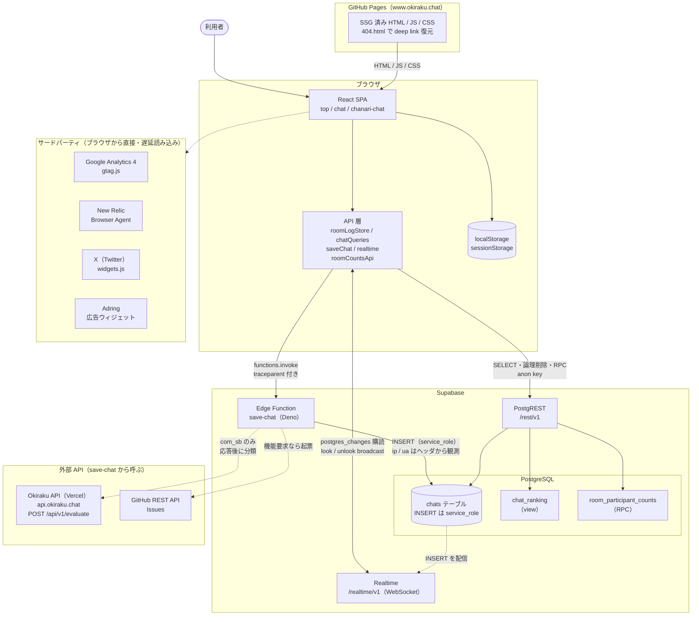
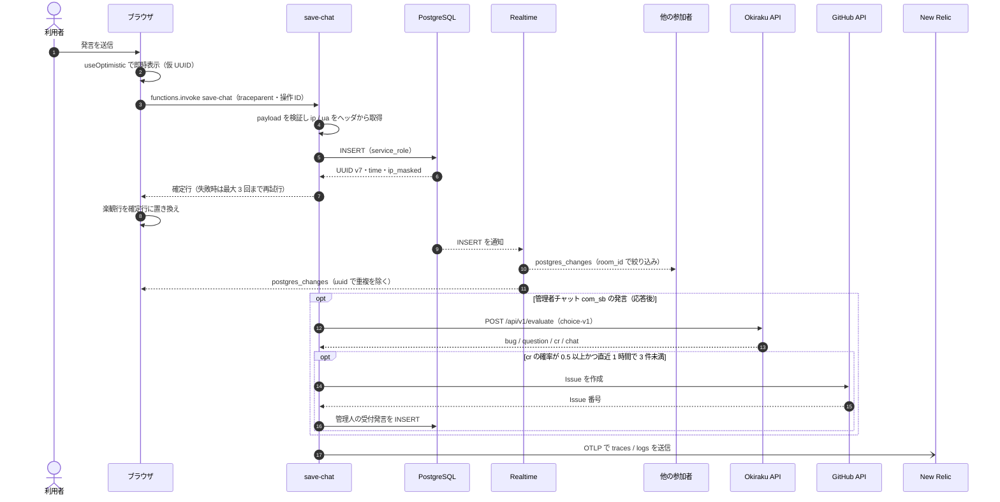
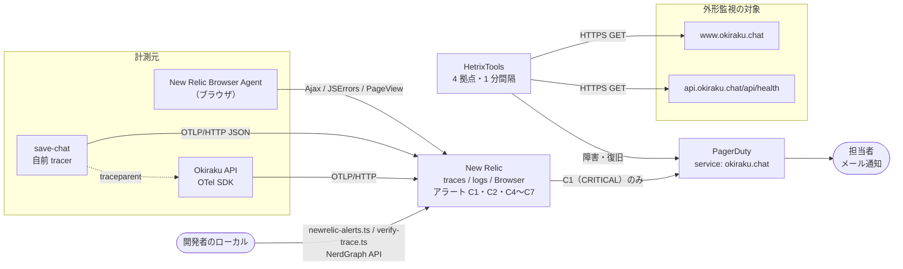
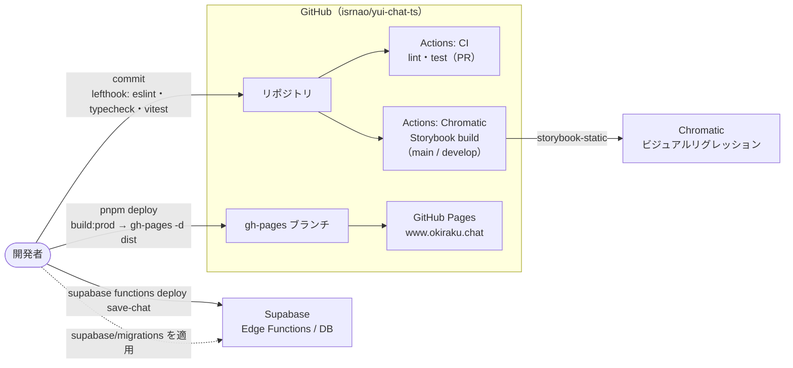

# システム構成図

お気楽チャットTS を構成するサービスと、外部 API・連携サービスとのつながりを図にまとめたものです。
図は [Mermaid](https://mermaid.js.org/) で書いており、GitHub 上ではそのまま描画されます。
アプリ内部のレイヤー構成やデータフローの詳細は [ARCHITECTURE.md](./ARCHITECTURE.md) を参照してください。

- 実線の矢印: 常に発生する通信・依存
- 点線の矢印: 条件付き・非同期・遅延読み込みの通信

HetrixTools・PagerDuty・Vercel の設定値はリポジトリから検証できません。これらは README の
「監視・障害通知」に記録された運用記録（2026-09-22 確認）に基づいています。

---

## 1. 全体構成（実行時）

利用者のブラウザが GitHub Pages から SPA を取得し、Supabase の PostgREST・Realtime・Edge Function と
直接通信します。外部 API（Okiraku API・GitHub API）を呼ぶのは Edge Function の `save-chat` だけで、
ブラウザには秘密値を渡しません。

| 構成要素               | 役割                                                                                                                                 | 主なコード                                                           |
| ---------------------- | ------------------------------------------------------------------------------------------------------------------------------------ | -------------------------------------------------------------------- |
| GitHub Pages           | 独自ドメイン `www.okiraku.chat` で SSG 済みの HTML を配信。未知のパスは `404.html` で SPA に戻す                                     | `scripts/prerender-rooms.ts`、`public/404.html`                      |
| PostgREST              | ログ取得・論理削除・ランキング（`chat_ranking` view）・トップの参加人数（`room_participant_counts` RPC）                             | `features/chat/api/chatQueries.ts`、`top/api/*`                      |
| Realtime               | `chats` の INSERT を room ごとに配信。look / unlook は broadcast channel                                                             | `features/chat/api/realtime.ts`、`roomLogStore.ts`                   |
| save-chat              | 発言の INSERT を担う唯一の経路。管理者チャット（`com_sb`）だけ応答後に triage を行う                                                 | `supabase/functions/save-chat/`                                      |
| PostgreSQL             | `chats` テーブル、RLS、`ip_masked` 生成列、view、RPC                                                                                 | `supabase/migrations/`                                               |
| Okiraku API（Vercel）  | 別プロジェクトの評価 API。JEV の `choice-v1` で発言を bug / question / cr / chat に分類                                              | `supabase/functions/save-chat/triage.ts`                             |
| GitHub REST API        | `cr`（機能要求）と判定した発言を `isrnao/yui-chat-ts` の Issue にする                                                                | 同上                                                                 |
| サードパーティ埋め込み | 初回描画を妨げないよう遅延読み込み。GA4 は load か 3 秒後、New Relic は初回操作か load 10 秒後、X・Adring はトップで画面に入ったとき | `index.html`、`shared/observability/newRelic.ts`、`top/components/*` |

---

## 2. 発言の送信から配信まで

楽観的更新で即時表示し、`save-chat` の確定行で置き換えます。他の参加者へは Realtime の
`postgres_changes` で届きます。管理者チャットの triage は `EdgeRuntime.waitUntil` で応答後に動くため、
送信者への応答を遅らせません。

---

## 3. 監視・障害通知

アプリ内の計測は New Relic に集約し、重大なアラート（C1: 保存の失敗）だけを PagerDuty に送ります。
外形監視は HetrixTools が Web と API の health を見て、PagerDuty に直接通知します。

アラート条件の定義は `scripts/newrelic-alerts.ts` にあります（C1: 保存失敗、C2: save-chat の 5xx、
C4: 評価 API の 502 / 504、C5 / C6: 遅延、C7: triage 失敗ログ）。

---

## 4. 開発・CI・デプロイ

フロントエンドの公開と Edge Function のデプロイは、どちらも開発者のローカルから手動で行います
（GitHub Actions からのデプロイはありません）。

---

## 5. 外部サービス一覧

| サービス               | 種別         | 呼び出し元             | 用途                                             | 認証・秘密値の置き場所                                              | 未設定・障害時の挙動                                  |
| ---------------------- | ------------ | ---------------------- | ------------------------------------------------ | ------------------------------------------------------------------- | ----------------------------------------------------- |
| GitHub Pages           | ホスティング | ブラウザ               | `www.okiraku.chat` の静的配信                    | —                                                                   | —                                                     |
| Supabase PostgREST     | BaaS         | ブラウザ               | ログ取得・論理削除・ランキング・参加人数         | anon key（公開、`VITE_SUPABASE_ANON_KEY`）                          | オフライン・401 は mock data。参加人数は「0人」で描画 |
| Supabase Realtime      | BaaS         | ブラウザ               | 新着 INSERT の配信、look / unlook の broadcast   | anon key                                                            | 再接続時に取り直す。ちゃなりは切断中だけ定期リロード  |
| Supabase Edge Function | BaaS         | ブラウザ               | `save-chat` による発言の INSERT                  | `verify_jwt = false`。DB へは自動提供の `SUPABASE_SERVICE_ROLE_KEY` | 指数バックオフで最大 3 回試行                         |
| Okiraku API（Vercel）  | 外部 API     | save-chat              | 管理者チャットの発言分類（JEV `choice-v1`）      | `JEV_API_TOKEN`（Supabase Secret）                                  | 未設定なら triage だけ skip。保存には影響しない       |
| GitHub REST API        | 外部 API     | save-chat              | 機能要求の Issue 作成                            | `GITHUB_TOKEN`（Supabase Secret、fine-grained PAT）                 | 同上                                                  |
| New Relic（OTLP）      | 監視         | save-chat、Okiraku API | traces / logs の収集                             | `NEW_RELIC_LICENSE_KEY`（Supabase Secret、Vercel 環境変数）         | 未設定なら送らない                                    |
| New Relic Browser      | 監視         | ブラウザ               | Ajax・JS エラー・PageView・SoftNav               | `VITE_NEW_RELIC_*`（公開設定 5 項目）                               | 5 項目がそろわなければ読み込まない                    |
| New Relic NerdGraph    | 監視（運用） | ローカルのスクリプト   | アラート条件・PagerDuty 経路の管理、trace の検証 | `NEW_RELIC_USER_API_KEY`（ローカル `.env`）                         | —                                                     |
| PagerDuty              | 障害通知     | New Relic、HetrixTools | インシデント管理と担当者へのメール通知           | Integration Key（管理画面で管理）                                   | —                                                     |
| HetrixTools            | 外形監視     | —                      | Web と API health の 1 分間隔監視                | 管理画面で管理                                                      | —                                                     |
| Google Analytics 4     | 分析         | ブラウザ               | 利用イベントの計測（`G-S3LCSTZBES`）             | 測定 ID（公開）                                                     | load か 3 秒後の早い方で遅延読み込み                  |
| X（Twitter）widgets    | 埋め込み     | ブラウザ（トップ）     | `@chat_a` のタイムライン表示                     | —                                                                   | 画面に入るまで読み込まない                            |
| Adring                 | 広告         | ブラウザ（トップ）     | 広告バナー                                       | site ID（公開）                                                     | 画面に入るまで読み込まない                            |
| Chromatic              | CI           | GitHub Actions         | Storybook のビジュアルリグレッション             | `CHROMATIC_PROJECT_TOKEN`（GitHub Actions Secret）                  | —                                                     |
| Google Search Console  | SEO          | —                      | サイトの所有確認（`public/google*.html`）        | —                                                                   | —                                                     |
