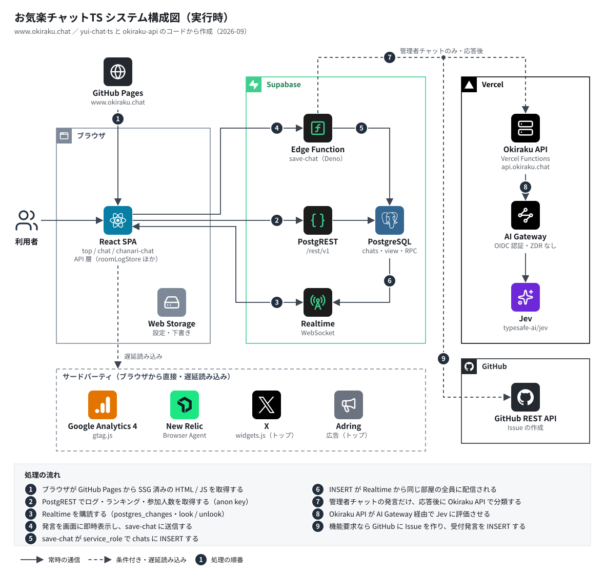
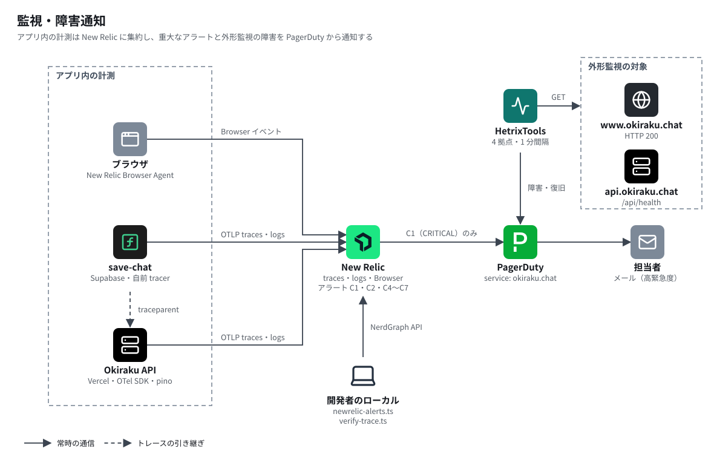
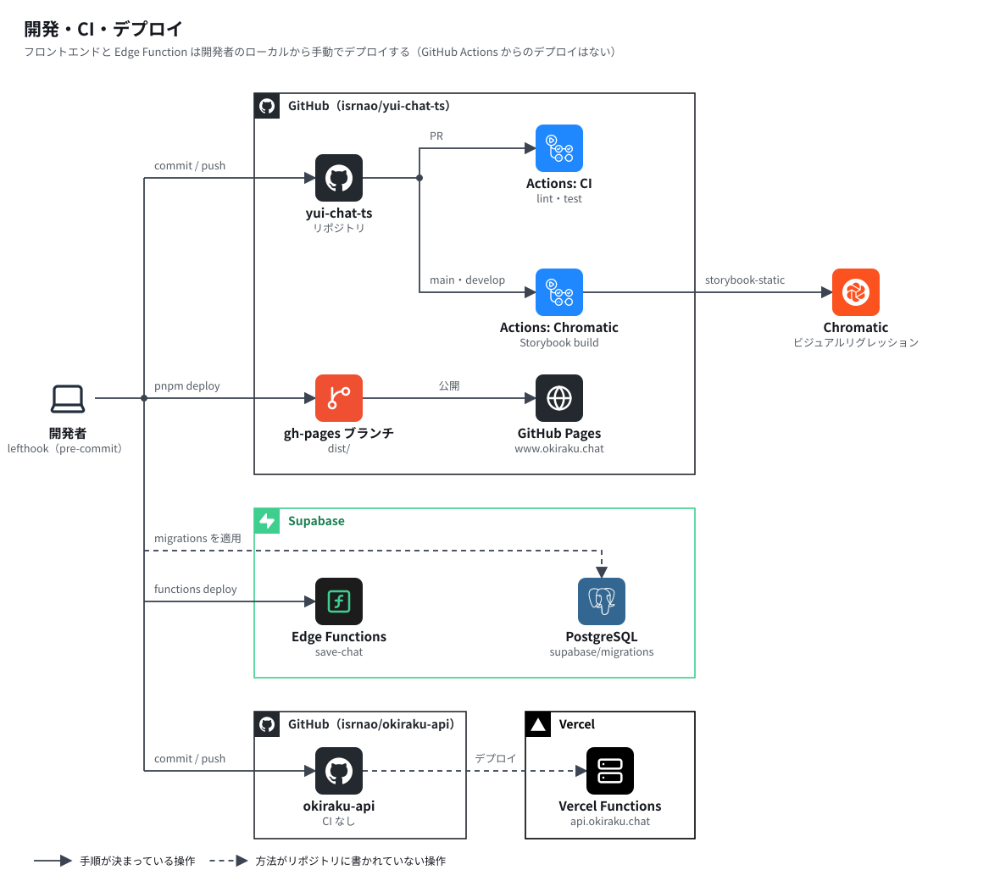

# システム構成図

お気楽チャットTS を構成するサービスと、外部 API・連携サービスとのつながりを図にまとめたものです。
図は AWS の構成図と同じように、サービスのアイコンとグループ枠で描いた SVG（[`docs/images/`](./images/)）です。
アプリ内部のレイヤー構成やデータフローの詳細は [ARCHITECTURE.md](./ARCHITECTURE.md) を参照してください。

Okiraku API は別リポジトリ [`isrnao/okiraku-api`](https://github.com/isrnao/okiraku-api)（コミット `f962a59`
時点）のコードで確認しています。HetrixTools・PagerDuty の設定と、Vercel のプラン・予算・環境変数は
リポジトリから検証できません。これらは両リポジトリの README とドキュメントに記録された運用記録
（2026-09-22 確認）に基づいています。

---

## 1. 全体構成（実行時）

利用者のブラウザが GitHub Pages から SPA を取得し、Supabase の PostgREST・Realtime・Edge Function と
直接通信します。外部 API（Okiraku API・GitHub API）を呼ぶのは Edge Function の `save-chat` だけで、
ブラウザには秘密値を渡しません。Okiraku API はその先で Vercel AI Gateway 経由の評価モデル Jev を呼びます。

楽観的更新・再試行・重複の除き方など、送信と受信の細かな流れは
[ARCHITECTURE.md の「5. データフロー」](./ARCHITECTURE.md#5-データフロー)を参照してください。

| 構成要素               | 役割                                                                                                                                 | 主なコード                                                           |
| ---------------------- | ------------------------------------------------------------------------------------------------------------------------------------ | -------------------------------------------------------------------- |
| GitHub Pages           | 独自ドメイン `www.okiraku.chat` で SSG 済みの HTML を配信。未知のパスは `404.html` で SPA に戻す                                     | `scripts/prerender-rooms.ts`、`public/404.html`                      |
| PostgREST              | ログ取得・論理削除・ランキング（`chat_ranking` view）・トップの参加人数（`room_participant_counts` RPC）                             | `features/chat/api/chatQueries.ts`、`top/api/*`                      |
| Realtime               | `chats` の INSERT を room ごとに配信。look / unlook は broadcast channel                                                             | `features/chat/api/realtime.ts`、`roomLogStore.ts`                   |
| save-chat              | 発言の INSERT を担う唯一の経路。管理者チャット（`com_sb`）だけ応答後に triage を行う                                                 | `supabase/functions/save-chat/`                                      |
| PostgreSQL             | `chats` テーブル、RLS、`ip_masked` 生成列、view、RPC                                                                                 | `supabase/migrations/`                                               |
| Okiraku API（Vercel）  | 別リポジトリの評価 API。`choice-v1` で発言を bug / question / cr / chat に分類する（§2）                                             | `supabase/functions/save-chat/triage.ts`、okiraku-api                |
| Vercel AI Gateway      | Okiraku API からのモデル呼び出しを中継し、Jev（`typesafe-ai/jev`）で評価する                                                         | okiraku-api の `src/providers/jev.ts`                                |
| GitHub REST API        | `cr`（機能要求）と判定した発言を `isrnao/yui-chat-ts` の Issue にする                                                                | 同上                                                                 |
| サードパーティ埋め込み | 初回描画を妨げないよう遅延読み込み。GA4 は load か 3 秒後、New Relic は初回操作か load 10 秒後、X・Adring はトップで画面に入ったとき | `index.html`、`shared/observability/newRelic.ts`、`top/components/*` |

---

## 2. Okiraku API（評価 API）

[`isrnao/okiraku-api`](https://github.com/isrnao/okiraku-api) は Vercel Functions（Node.js 24）で動く
API 専用のプロジェクトです。AI SDK（`ai` 7.0.105）の `experimental_evaluate` で、Vercel AI Gateway 上の
評価モデル Jev（`typesafe-ai/jev`）を呼びます。お気楽チャットからは `save-chat` の triage だけが使います。

全体構成図の Vercel グループ（Okiraku API → AI Gateway → Jev）にあたります。1 回の評価は次の順に進みます。

1. `api/v1/evaluate.ts` が `POST` を受け、`auth.ts` が Bearer キーを照合する
2. `schema.ts` が Zod で入力を検証する（未知のフィールドは拒否）
3. `providers/jev.ts` が `experimental_evaluate` で AI Gateway 経由の Jev に評価させる（自動リトライなし）
4. 出力を Zod で検証し、提示した選択肢以外の回答を拒否する
5. 応答を返したあと、span とログを New Relic へ送る（Vercel の `waitUntil`）

| 項目              | 内容                                                                                                                                  |
| ----------------- | ------------------------------------------------------------------------------------------------------------------------------------- |
| エンドポイント    | `GET /api/health`（外部サービスに触れない稼働確認）、`POST /api/v1/evaluate`                                                          |
| preset            | `choice-v1`（選択肢分類。triage が使う）、`answer-quality-v1`（質問と回答の関連性。お気楽チャットからは未使用）                       |
| 呼び出し元の認証  | Bearer キー。okiraku-api の `OKIRAKU_API_KEY`（Vercel Secret）と、yui-chat-ts の `JEV_API_TOKEN`（Supabase Secret）に同じ値を設定する |
| AI Gateway の認証 | 本番は Vercel OIDC（自動）。`AI_GATEWAY_API_KEY` を設定するとそちらが優先される                                                       |
| 期限              | アプリの処理期限 8 秒（超えると `504`）、Function の上限 10 秒。呼び出し側（save-chat）の fetch 期限は 15 秒                          |
| 主なエラー        | 未設定 `503`、キー不一致 `401`、入力不正 `400`、上流の失敗 `502`。上流のエラー文は応答に含めない                                      |
| 計測              | OpenTelemetry SDK で New Relic へ traces / logs。受け取った `traceparent` の先頭だけを使い、save-chat のトレースの子にする            |
| ログ              | pino で stdout（Vercel のログ）と New Relic へ 1 リクエスト 1 行。評価した本文・選択肢・`Authorization` は redact                     |
| CI                | 未導入。`pnpm typecheck` と `pnpm test` はローカルで実行する                                                                          |

### 注意点

- **呼び出し回数に上限がない**: save-chat の「直近 1 時間に 3 件」は Issue 作成だけにかかる制限です。分類
  （AI Gateway の呼び出し）は、管理者チャットの system 以外で 1000 文字以下の発言ごとに毎回行われ、
  okiraku-api 側にもレート制限はありません。費用の上限は AI Gateway のプロジェクト予算だけです。
- **発言本文が上流に残る可能性がある**: Hobby プランでは Zero Data Retention を使えないため
  （`AI_GATEWAY_ZERO_DATA_RETENTION` は無効）、管理者チャットの発言本文が Gateway の上流で保持される
  可能性があります。
- **外形監視では評価の失敗を検知できない**: `/api/health` は外部サービスに触れないため、HetrixTools は
  AI Gateway や Jev の障害を検知しません。評価の失敗と遅延は New Relic の C4 / C6 で検知します。

---

## 3. 監視・障害通知

アプリ内の計測は New Relic に集約し、重大なアラート（C1: 保存の失敗）だけを PagerDuty に送ります。
外形監視は HetrixTools が Web と API の health を見て、PagerDuty に直接通知します。

アラート条件の定義は `scripts/newrelic-alerts.ts` にあります（C1: 保存失敗、C2: save-chat の 5xx、
C4: 評価 API の 502 / 504、C5 / C6: 遅延、C7: triage 失敗ログ）。

---

## 4. 開発・CI・デプロイ

フロントエンドの公開と Edge Function のデプロイは、どちらも開発者のローカルから手動で行います
（GitHub Actions からのデプロイはありません）。okiraku-api は別リポジトリで、Vercel に配置します。

okiraku-api を Vercel へ反映する方法（Git 連携か Vercel CLI か）は、リポジトリからは確認できません。

---

## 5. 外部サービス一覧

| サービス               | 種別             | 呼び出し元             | 用途                                             | 認証・秘密値の置き場所                                                        | 未設定・障害時の挙動                                                                           |
| ---------------------- | ---------------- | ---------------------- | ------------------------------------------------ | ----------------------------------------------------------------------------- | ---------------------------------------------------------------------------------------------- |
| GitHub Pages           | ホスティング     | ブラウザ               | `www.okiraku.chat` の静的配信                    | —                                                                             | —                                                                                              |
| Supabase PostgREST     | BaaS             | ブラウザ               | ログ取得・論理削除・ランキング・参加人数         | anon key（公開、`VITE_SUPABASE_ANON_KEY`）                                    | オフライン・401 は mock data。参加人数は「0人」で描画                                          |
| Supabase Realtime      | BaaS             | ブラウザ               | 新着 INSERT の配信、look / unlook の broadcast   | anon key                                                                      | 再接続時に取り直す。ちゃなりは切断中だけ定期リロード                                           |
| Supabase Edge Function | BaaS             | ブラウザ               | `save-chat` による発言の INSERT                  | `verify_jwt = false`。DB へは自動提供の `SUPABASE_SERVICE_ROLE_KEY`           | 指数バックオフで最大 3 回試行                                                                  |
| Okiraku API（Vercel）  | 外部 API（自前） | save-chat              | 管理者チャットの発言分類（`choice-v1`）          | `JEV_API_TOKEN`（Supabase Secret）。okiraku-api の `OKIRAKU_API_KEY` と同じ値 | 未設定なら triage だけ skip。8 秒で `504`、上流の失敗は `502`。保存には影響しない              |
| Vercel AI Gateway      | AI（従量課金）   | Okiraku API            | Jev（`typesafe-ai/jev`）による評価               | 本番は Vercel OIDC（自動）。`AI_GATEWAY_API_KEY` があればそちらを優先         | 自動リトライなし。ZDR 無効のため本文が上流で保持される可能性あり。費用はプロジェクト予算で上限 |
| GitHub REST API        | 外部 API         | save-chat              | 機能要求の Issue 作成                            | `GITHUB_TOKEN`（Supabase Secret、fine-grained PAT）                           | 同上                                                                                           |
| New Relic（OTLP）      | 監視             | save-chat、Okiraku API | traces / logs の収集                             | `NEW_RELIC_LICENSE_KEY`（Supabase Secret、Vercel 環境変数）                   | 未設定なら送らない。送信の失敗は評価・保存に影響しない                                         |
| New Relic Browser      | 監視             | ブラウザ               | Ajax・JS エラー・PageView・SoftNav               | `VITE_NEW_RELIC_*`（公開設定 5 項目）                                         | 5 項目がそろわなければ読み込まない                                                             |
| New Relic NerdGraph    | 監視（運用）     | ローカルのスクリプト   | アラート条件・PagerDuty 経路の管理、trace の検証 | `NEW_RELIC_USER_API_KEY`（ローカル `.env`）                                   | —                                                                                              |
| PagerDuty              | 障害通知         | New Relic、HetrixTools | インシデント管理と担当者へのメール通知           | Integration Key（管理画面で管理）                                             | —                                                                                              |
| HetrixTools            | 外形監視         | —                      | Web と API health の 1 分間隔監視                | 管理画面で管理                                                                | —                                                                                              |
| Google Analytics 4     | 分析             | ブラウザ               | 利用イベントの計測（`G-S3LCSTZBES`）             | 測定 ID（公開）                                                               | load か 3 秒後の早い方で遅延読み込み                                                           |
| X（Twitter）widgets    | 埋め込み         | ブラウザ（トップ）     | `@chat_a` のタイムライン表示                     | —                                                                             | 画面に入るまで読み込まない                                                                     |
| Adring                 | 広告             | ブラウザ（トップ）     | 広告バナー                                       | site ID（公開）                                                               | 画面に入るまで読み込まない                                                                     |
| Chromatic              | CI               | GitHub Actions         | Storybook のビジュアルリグレッション             | `CHROMATIC_PROJECT_TOKEN`（GitHub Actions Secret）                            | —                                                                                              |
| Google Search Console  | SEO              | —                      | サイトの所有確認（`public/google*.html`）        | —                                                                             | —                                                                                              |

---

## 図の編集について

図は `docs/images/` の SVG です。テキストエディタや、SVG を読み込めるベクター編集ツールで直接編集できます。
アイコンは [Simple Icons](https://simpleicons.org/)（CC0 1.0）と [Lucide](https://lucide.dev/)（ISC License）の
ものを使っています。各サービスのロゴは、それぞれの権利者の商標です。構成を変えたときは、図と表の両方を
更新してください。
